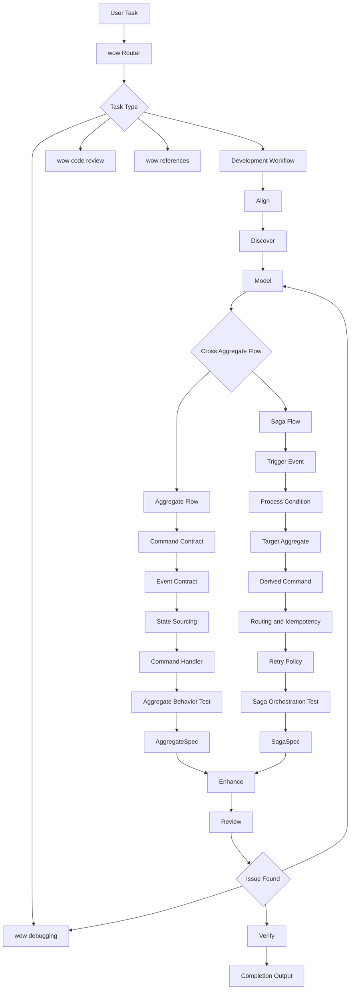

# Wow Development Workflow

Use this skill after `../wow/SKILL.md` routes an end-to-end Wow development task here. This workflow covers aggregate behavior and saga orchestration. Projection work is intentionally outside this workflow for now.

## Design Philosophy

These principles guide every phase:

- **Source first, docs second, memory last**: inspect the current checkout before deciding API names, module names, annotations, or test DSL methods. Use docs as supporting context, not as the final authority.
- **Domain truth before code shape**: model commands as intent, events as committed facts, and state as sourced memory.
- **API metadata is part of the contract**: commands and domain events should carry `@Summary` and `@Description` so generated REST/API schema has useful title and description metadata.
- **Shared fields deserve names**: important repeated domain fields should be modeled as `<FieldName>Capable` interfaces instead of being copied across commands, events, and state types.
- **Aggregate owns invariants**: a command aggregate decides whether a command is valid and emits events; it must not rely on sagas to protect its internal rules.
- **Saga coordinates, not owns**: a saga reacts to events, evaluates process conditions, and emits commands. It should not become a second aggregate or hidden state owner.
- **Make the flow explicit**: draw or list command, event, state, and saga paths before editing behavior.
- **Tests are contracts**: use `AggregateSpec` for aggregate behavior and `SagaSpec` for orchestration behavior. Do not substitute one for the other.
- **Enhancement is evidence**: comments, scenario documents, and design reports should explain decisions and coverage, not decorate code.
- **Verification closes the loop**: finish with exact commands, results, and remaining risk.

## Methodology

Use this sequence as the mental model for all non-trivial Wow work:

1. **Align**: clarify intent, scope, allowed behavior changes, and proof of success.
2. **Read**: inspect source, tests, module names, and nearby working examples.
3. **Model**: express the domain as command intent, event fact, sourced state, reusable field capability, and process policy.
4. **Split**: decide whether the behavior belongs to the aggregate, a saga, or both.
5. **Prove**: lock aggregate behavior with `AggregateSpec` and saga orchestration with `SagaSpec`.
6. **Preserve**: write comments, scenarios, and design notes only where they carry decision knowledge.
7. **Close**: review semantics, run verification, and report evidence plus residual risk.

If a later phase exposes unclear requirements, return to Align or Model instead of guessing in implementation.

## Workflow Map



## Phase 0: Align

Goal: confirm intent before implementation.

Use a full brainstorming flow when the task adds a new capability, changes architecture, or has unclear business semantics. If a Superpowers-style brainstorming skill is available, use it as the richer implementation of this phase. Otherwise do a lightweight alignment directly.

Answer these before editing:

- What business capability or aggregate behavior should change?
- Is behavior change allowed, or is the task limited to tests, comments, or documentation?
- Which bounded context, aggregate, saga, and module are in scope?
- What is the success criterion?
- What verification command should prove the change?

Exit with a short scope statement and any assumptions.

## Phase 1: Discover

Goal: learn the current code before designing changes.

Run focused source searches such as:

```bash
rg -n "@AggregateRoot|@OnCommand|@OnSourcing|@StatelessSaga|@OnEvent|@Retry" . -g "*.kt"
rg -n "AggregateSpec<|SagaSpec<|aggregateVerifier|sagaVerifier|expectCommand|expectNoCommand" . -g "*.kt"
rg -n "include\\(" settings.gradle.kts **/settings.gradle.kts
```

Load the smallest references needed:

- `../wow/references/modeling.md` for aggregate, state, lifecycle, and bounded context rules.
- `../wow/references/annotations.md` for command, sourcing, saga, retry, and handler annotations.
- `../wow/references/testing.md` for `AggregateSpec`, `SagaSpec`, verifier APIs, and FluentAssert.
- `../wow/references/command-gateway.md` when command routing, wait behavior, or idempotency affects the design.

Exit with a source inventory: modules, files, command handlers, sourcing handlers, saga handlers, existing tests, and missing coverage.

## Phase 2: Model

Goal: turn requirements into explicit domain flow.

Decide:

- Aggregate identity and owner or tenant routing.
- Commands as user or system intent.
- Events as durable facts with enough payload to rebuild state.
- `@Summary` and `@Description` metadata for each command and domain event.
- Important repeated fields that should become `<FieldName>Capable` interfaces.
- State fields and the sourcing event that owns each mutation.
- Invariants enforced inside aggregate command handlers.
- Whether any event must trigger another aggregate through a saga.

Exit with one of two paths:

- **Aggregate Flow** for single-aggregate behavior.
- **Saga Flow** for cross-aggregate orchestration.

## Aggregate Flow

Use this when behavior stays inside one aggregate.

| Node | What to Decide | Exit Evidence |
|------|----------------|---------------|
| Command Contract | command name, `@Summary`, `@Description`, aggregate id, owner or tenant, validation, idempotency input | command type, route, and API metadata are explicit |
| Event Contract | fact name, `@Summary`, `@Description`, payload, compatibility, event count | emitted event can rebuild state and has schema metadata |
| Field Capability | important repeated fields and validation contracts | reusable `<FieldName>Capable` interfaces exist where useful |
| State Sourcing | mutable fields, defaults, sourcing handler, lifecycle handling | state changes only in sourcing |
| Command Handler | invariant checks, returned events, error paths | handler emits events and does not mutate state |
| Aggregate Behavior Test | happy path, error path, edge state, lifecycle | `AggregateSpec` or verifier proves command behavior |

Use `AggregateSpec` for this path:

```text
Given events or state
When command
Expect event, state, or error
```

## Saga Flow

Use this when an event from one aggregate should coordinate another aggregate.

| Node | What to Decide | Exit Evidence |
|------|----------------|---------------|
| Trigger Event | event type, aggregate name filter, payload needed by the saga | saga has a precise trigger |
| Process Condition | branch conditions, no-command branch, external lookup if any | each branch has expected output |
| Target Aggregate | target aggregate id, owner, tenant, route source | command route is deterministic |
| Derived Command | command body, headers, correlation, request semantics | generated command is complete |
| Routing and Idempotency | duplicate event handling, command id or natural id, stale input handling | repeated delivery is intentional |
| Retry Policy | `@Retry`, recoverable errors, unrecoverable errors, timeout | Saga handler failure behavior is explicit |
| Saga Orchestration Test | trigger, no-command, branch, multi-command cases | `SagaSpec` proves orchestration |

Use `SagaSpec` for this path:

```text
Given event
When saga reacts
Expect command or no command
```

## Enhance

Goal: preserve design knowledge and coverage evidence.

Run only the artifacts the user requested, but always start from the Discover inventory.

- For comments, use `references/comment-standards.md`.
- For scenario documents, use `references/test-case-template.md`.
- For design reports, use `references/design-report-template.md`.
- For aggregate and saga test notes, use `references/test-patterns.md`.

Enhancement may add missing `AggregateSpec` or `SagaSpec` coverage when the scenario document exposes gaps. It must not silently change business behavior.

## Review

Before verification, review the work against the philosophy:

- Commands represent intent and events represent facts.
- Commands and domain events have `@Summary` and `@Description` metadata where they are part of the API/domain contract.
- Important repeated domain fields are extracted into `<FieldName>Capable` interfaces where reuse improves clarity.
- Aggregate invariants are enforced inside aggregate command handlers.
- State changes are deterministic and sourced from events.
- Saga logic only coordinates process flow and generated commands.
- Aggregate and saga tests use the correct DSL for their responsibility.
- Documentation explains why a decision exists and links to tests or scenarios.

If behavior is wrong or a test fails, switch to `../wow-debugging/SKILL.md`. If the task is a PR or diff review, switch to `../wow-code-review/SKILL.md`.

## Verify

Resolve module names from `settings.gradle.kts`, then run the narrowest commands that prove the change:

```bash
./gradlew <module>:test --tests "fully.qualified.SpecName"
./gradlew <module>:check
python3 scripts/skill_lint.py
```

Final output must include phases completed, files changed, verification commands and results, and remaining risks or uncovered scenarios.
