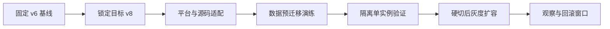

# Wow v6 到 v8 迁移

把升级视为平台、源码、数据与发布流程的联合迁移。先固定证据和目标版本，再按门禁推进；不要把依赖解析成功、单个模块编译通过或启动成功当成迁移完成。

## 证据优先级

按以下顺序建立结论：

1. 目标应用当前 checkout 的依赖、源码、测试、生成物、配置与部署清单。
2. 精确目标 v8 tag/release 的 Wow 源码、测试、BOM 与 Release Notes。
3. 当前 Wow 仓库中的 `documentation/docs/zh/guide/migration/v6-to-v8.md` 和相关专题页。
4. 本 skill 的 [迁移契约](references/migration-contracts.md)，仅作为发现风险的起点。

若当前 checkout 不是 Wow 框架仓库，不要假定能读取第 3 项；使用精确 tag 的官方源码和本 skill reference。版本、属性名或 API 有冲突时，以目标 tag 为准，并记录差异。

## 开始前锁定契约

先确认并记录：

- 当前 Wow、Spring Boot、Kotlin/KSP、Java 与相关 BOM 的**解析后版本**；
- 精确目标 v8 版本，不接受只有“v8”而没有最终 pin 的实施或上线；
- 任务模式是只读评估、迁移计划、代码实施、数据演练还是生产切换；
- 涉及的 module、bounded context、aggregate、store、message bus 和部署环境；
- Redis/Mongo/Elasticsearch/自定义 store 的真实 topology、database/namespace、数据量与所有者；
- 可接受停机窗口、RPO/RTO、回滚窗口和完成证据；
- 当前 worktree 的本地改动与可修改范围。

若缺少生产数据权限或切换授权，继续完成代码审计、迁移矩阵和可执行命令，但把数据与上线门禁标为 `MISSING EVIDENCE`；不要伪造通过。

## 工作流



### 1. 固化 v6 基线

1. 检查 `git status --short --branch`，保护用户已有改动。
2. 定位 Gradle/Maven 入口、version catalog、BOM、KSP、生成代码和 CI 命令。
3. 解析实际依赖，不只读取声明值。Gradle 项目优先使用 `dependencyInsight` 或对应 configuration 的 `dependencies`。
4. 在 skill 目录可用时运行只读扫描：

   ```bash
   bash <skill-dir>/scripts/audit-v6-usage.sh <target-repository>
   ```

   默认输出标题、审计根目录、分节与完成提示，其中每条命中采用 `path:line:matched-token` 格式；同时排除可能包含凭据的 `.env*` 与 `*.env`。仅在用户明确要求、确认输出渠道安全且必须审计仅由环境变量声明的存储配置时，把 `--include-dotenv` 放在目标仓库参数前；敏感关键词仍会脱敏，但不能把该过滤器当作完整的 secret scanner。把命中项当作待审查线索，不把“未命中”解释为兼容性证明。
5. 运行现有 v6 的窄测试、模块 `check` 与必要集成测试，保存失败基线。
6. 记录 event、snapshot、request ID、PrepareKey、aggregate ID、消息 backlog 与关键查询结果的可复核基线。
7. 若项目未在最新维护版 v6，先评估升级到维护线末版并清除弃用 API；不要直接跨越已知的 v6 基线失败。

### 2. 建立迁移矩阵

至少按以下 track 分栏，逐项标注 `NOT_APPLICABLE`、`TODO`、`PROVED` 或 `BLOCKED`：

| Track | 必查内容 | 最低完成证据 |
|---|---|---|
| Platform | Boot 4、Jackson 3、Kotlin/KSP、第三方 starter/BOM | 解析后依赖 + compile/test |
| Source/API | removed/changed Wow API、配置、测试 DSL、生成元数据 | producer/consumer 重新编译 |
| Runtime | 自定义 Dispatcher、MessageBus、Spring lifecycle owner | 启停、fatal、drain、deadline 测试 |
| Storage | EventStore、SnapshotStore、已移除的 wow-r2dbc、Redis、Mongo、自定义实现 | inventory + 契约测试 + 回放 |
| Contracts | OpenAPI/JSON Schema/KSP/序列化输出 | 重新生成后的 golden diff |
| Release | 停流、排空、单实例、灰度、监控、回滚 | 演练记录与 go/no-go 门禁 |

再把每个发现分类为 `AUTO_REWRITE`、`SOURCE_ADAPT`、`DESIGN_REQUIRED/BLOCKED`、`DATA_CUTOVER` 或 `VERIFY_ONLY`。只有确定、局部且有目标 API 证据的改写才属于 `AUTO_REWRITE`；store、sharding、runtime owner 和自定义 transport/route 扩展默认要求设计判断。

读取 [迁移契约](references/migration-contracts.md)，只加载适用于目标版本和实际 store 的章节。若应用自定义运行时，再读取 Wow 仓库的 `documentation/docs/zh/guide/migration/runtime-orchestration.md` 或对应目标 tag 的官方页面。

### 3. 适配平台与源码

按可独立验证的批次实施：

1. 对齐 Wow v8 的平台 BOM；不要把 Spring Boot 3 或 Jackson 2 强压回 v8 依赖图。
2. 处理 Boot 4 模块化、`tools.jackson` 迁移与第三方 starter 兼容性。应用的 Spring 边界可能仍出现 `com.fasterxml` 类型，必须依据目标依赖和调用边界判断，不要机械全局替换包名。
3. 用编译器驱动 Wow API 迁移；逐个定位定义、实现、调用者和测试，禁止仅根据同名猜测替换。
4. 若命中 `wow-r2dbc`、`r2dbc-support` 或 `me.ahoo.wow.sharding.*`，把它列为迁移 blocker；v8 没有机械替代，先让用户选择新 store、数据迁移和回滚方案。
5. 对行为变化优先写失败测试再修复。纯签名迁移可用编译失败作 RED 证据，但仍需补运行时或契约验证。
6. 重新运行 KSP/OpenAPI/JSON Schema/client 生成链路，并审查 golden diff；不要手改生成物掩盖 producer 问题。
7. 若命中自定义 Dispatcher、MessageBus 或 Spring 生命周期扩展，单独执行 runtime track，确保只有一个 owner。
8. 每个批次运行最窄的 `test/check/lint/typecheck`，通过后再扩大验证面。

不要顺手重写领域边界。v6→v8 是平台和兼容性迁移；领域重构应单独立项，避免让数据与行为差异无法归因。

### 4. 准备数据切换

仅在用户明确授权对应环境后执行写操作。修改数据前必须验证备份可恢复、目标 scope、inventory 和停止条件。

1. 根据精确目标版本判断 [迁移契约](references/migration-contracts.md) 中的 Snapshot、Redis 和 Mongo 条目是否生效。
2. 对每个 store 输出 source→target 映射、数据类型、cardinality、版本范围、checksum、owner 和处置方式。
3. 对自定义 `SnapshotStore` 验证原子 compare-and-write；禁止客户端 `load()` 后无条件保存。
4. 目标为 v8.9.0+ 且使用 Redis EventStore、Redis SnapshotStore 或 Redis PrepareKey 时，分别设计并单独评审 canonical v2 离线迁移或受控重建方案；运行时没有内置迁移器、双读或双写兜底。
5. 使用 Mongo 时，验证 database 与 bounded context 一对一、存量 collection、PrepareKey 归属、服务端版本和索引兼容性。
6. 用 manifest、checksum、cursor 和幂等批次保存迁移证据。任何差集、重复 aggregate ID、孤立 Key 或所有权冲突都必须先处置。

禁止新旧 writer 混跑，禁止用 `FLUSHDB` 或宽泛删除代替精确 inventory，禁止修改 ownership marker 绕过真实冲突。

### 5. 验证、切流与回滚

按顺序执行：

1. 停入口并排空全部 v6 writer；确认 in-flight 与 backlog 达到约定门禁。
2. 创建并验证一致备份，执行离线迁移与全量 reconciliation。
3. 只启动一个 v8 实例，使用隔离 ID 验证写入、幂等、读取、事件回放、查询、snapshot regeneration、监控与优雅停机。
4. 通过后硬切流量，再仅扩容 v8 实例。不要做混合版本滚动升级。
5. 观察错误率、延迟、积压、版本连续性、重复请求和数据对账。
6. 演练两条回滚路径：尚无 v8 生产写入时切回只读保留的 v6 数据；已有 v8 写入时先停流，再反向迁移或重放新增写入。

仅有代码测试时，不得声称数据迁移或生产切换完成。仅有 smoke test 时，不得声称回放、并发、停机或回滚已验证。

## 变更边界

- 只读评估或 review 请求只输出证据与建议，不修改代码、数据、CI、PR 或部署状态。
- 代码实施不自动授权数据迁移、生产发布、依赖新增、module 调整或公开 API 破坏。
- 数据脚本必须先在副本/隔离 namespace 演练，并具备 dry-run、resume、checksum 和失败关闭行为。
- 发现目标版本与 current `main` 不同时，始终使用目标 tag 的 API 和存储契约。
- 不信任仅凭本地 tag 名得出的版本结论；同时核对 tag 内容中的 `gradle.properties`、BOM 与发布记录。

## 完成审计

结束前逐项列出：

- 基线与目标版本证据；
- 迁移矩阵每一项的状态及文件、命令、日志或数据报告；
- 实际修改文件和行为边界；
- 重新生成的契约差异及消费者验证；
- 数据 inventory、manifest、checksum、回放和 reconciliation 结果；
- 单实例、灰度、停机与回滚演练结果；
- 尚未覆盖的 store、环境、流量或第三方集成。

最终输出依次给出：目标对齐、基线与风险、变更摘要、验证结果、切流与回滚状态、未决事项。把未验证项明确标为 `MISSING EVIDENCE`，不要用“应当可行”替代证据。

## 资源

- [迁移契约](references/migration-contracts.md)：按目标版本选择平台、API、runtime 与 storage 硬约束。
- `scripts/audit-v6-usage.sh`：只读扫描目标仓库中的依赖、旧 API、生命周期、存储与配置线索。
