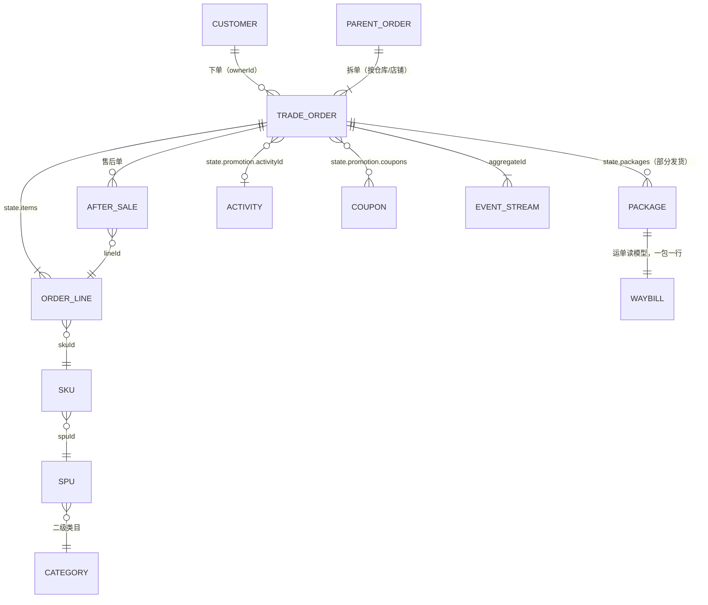

# 方案：Storybook 场景化——真实交易订单数据与 View Engine 能力展示

**状态**：已定稿（2026-09-24），只有设计，还没有实现。第 7 节的四个问题用户已按推荐拍板，按第 6 节分批做。
**范围**：`typescript/storybook/stories/view-engine/` 的夹具、数据源、故事与目录。View Engine 包本身不改；方案里提到的引擎缺口只记下来，不在这里做。
**读法**：第 1 节是现状审计；第 2 节是数据的领域模型、分布与生成方式；第 3 节把每项能力对到一个业务场景；第 4 节列分析师的问题与回答它们的分析、仪表盘；第 5 节是目录结构；第 6 节是迁移批次；第 7 节是已定的产品问题。

## 0 结论先行

- **数据分两套，各管一件事。** 现有的小夹具（七条订单、五十条运单等）行是手挑的，专门用来断言边界，所以冻结成回归夹具，一个数字都不动。另起一套「零售交易」数据集，只服务展示故事：一家虚构的家居生活品牌，全渠道 B2C 零售，时间从 2024-09-01 到 2026-09-22，约 2 万张子订单。季节、促销、长尾、帕累托、漏斗、地域偏斜和六处有意埋下的异常都在里面。
- **领域按成熟电商的交易订单来建模，不照 `example/`。** `example/` 只是演示，没有取消、售后、支付方式、渠道、商品与客户。数据形状沿用 Wow 的快照与事件流约定（`state.*`、`firstEventTime`、`version`、事件流 `body[]`），所以快照控制台、事件流分析台和补偿控制台照样说得通。
- **生成确定、有种子、在浏览器里当场算。** 文本类的值（姓名、区县、备注）用 `@faker-js/faker` 的 `zh_CN` 生成，随机分布用 `d3-random`，两者都经 catalog 引入（Q1，已定）。数据源仍然把引擎发出的 Wow 查询翻译成 mingo 来作答，只在它前面加索引和缓存，不做预聚合。
- **目录按「业务场景 → 能力 → 组件状态 → 真实后端」组织**，首页有一页导览，告诉第一次来的人引擎能做什么。回归孪生故事照旧藏在导航之外。
- **分七批做，另有一批可选。** 前四批只新增文件，不碰在途的批 B、C、E 和 #3335（图标版的表格/图表切换）。改目录那一批排在 #3335 合并之后。需要批 B、C、E 能力的展示，等那一批合并后再补。主线约 8.5 人日；加上跟进 B、C、E 的补充和可选批，约 11 人日。

## 1 现状审计

### 1.1 夹具清单

| 数据集                                      | 文件                                               | 规模                         | 时间跨度                   | 问题                                                                                                                                                                                                  |
| ------------------------------------------- | -------------------------------------------------- | ---------------------------- | -------------------------- | ----------------------------------------------------------------------------------------------------------------------------------------------------------------------------------------------------- |
| `ORDERS`                                    | `fixtures.ts`                                      | 6 条（外加 1 条软删除）      | 2026-09-15～09-17，共 3 天 | 说的是仓储出库（状态只有待出库／已发运／已取消），不是交易订单；金额是整数（640～3120），成本是随手填的；「我盯的大额单」要求金额大于 5000，所以永远是空的；`SO-1006` 带的标记 `vip` 不在字段的选项里 |
| `WAYBILLS`                                  | `fixtures.ts`                                      | 50 条                        | 2026-09-01～09-20          | 按行号取模生成，周期一眼看得出（状态 10 行一轮，仓库 4 行一轮）；订单号 `SO-2001…` 与 `ORDERS` 不相交；8 个客户名与 `CUSTOMERS` 的 24 家不相交；运输方式有「海运」，国内电商包裹不走海运              |
| `YEAR_OF_SHIPMENTS`                         | `dailyShipments.ts`                                | 365 天 × 2 仓，每天每仓 1 条 | 一年                       | 金额是正弦乘周权重，没有噪声、没有促销，也没有增长；每天恰好一条，所以最常用的「单数」恒为常数，图画出来太干净，不像真的分析                                                                          |
| `CUSTOMERS`                                 | `fixtures.ts`                                      | 24 家                        | —                          | 都是 B2B 公司名（宏远贸易、晨光食品），和订单、运单彼此对不上                                                                                                                                         |
| `FAILED_EVENTS`、首页的 52 条执行、补偿录制 | `fixtures.ts`、`home.ts`、`compensationService.ts` | 几条到几十条                 | 2026-09-18～09-22 前后     | 补偿域自成一套，和订单没有因果关系                                                                                                                                                                    |
| 客户、交易订单、商品定价的录制              | `*Service.ts`                                      | 每个几条                     | 2026-09-14～09-18          | 录的是真实服务（B2B 交易，有评审、改单），用于回归，这是对的；只是没法拿来展示                                                                                                                        |

### 1.2 结论

1. **数据是玩具规模，时间也太短。** 订单最长只有 3 天，所以按月、较上期、季节性、大促和长尾统统展示不了。分析视图的大部分能力（时间轴缩放、较上一期、矩形树图、瀑布、漏斗、散点）只在回归故事里用过，而且用的是凑出来的数。
2. **数据集彼此不认识。** 订单、运单、发货、客户、补偿各有一套键，同一个客户在两个故事里是两个人，不能从一张图追问到另一份数据。
3. **故事是按状态和回归组织的，不是按业务问题组织的。** 展示文件里混着 `FillTheScreenInScaledHost`、`PopupsOverRaisedHostLayer` 这类只为回归而存在的场景。第一次来的人看不出引擎能回答哪些问题。
4. **小夹具有它的用处。** 行是手挑的，专门撞边界：一个 `javascript:` 链接、一条软删除、一段要截断的四行备注、十个城市对八种颜色。约 20 个回归文件、数百个 `play` 断言靠这些值。它们该留着，只是不该再承担展示。

### 1.3 为什么不照 `example/` 建模

`example/`（`example-domain` 的 `order`/`cart`）是 Wow 的演示。订单只有已创建→已支付→已发货→已收货四个状态，没有取消、支付超时、售后、退款、渠道、支付方式、商品与客户实体，退款只在注释里提过。照它建模，教给读者的是一个不存在的业务，分析师也认不出来。

所以只借 Wow 的**形状**：快照的 `aggregateId`、`tenantId`、`ownerId`、`version`、`firstEventTime`、`eventTime`（纪元毫秒）、`deleted`、`state.*`，事件流的 `id`、`aggregateId`、`version`、`createTime`、`body[]{name, bodyType, revision}`，以及 snake_case 的事件名。业务本身按成熟电商（天猫、京东、Shopify 这一档）的交易订单来建。真实后端那组交易订单故事连的是另一个 B2B 服务（评审、改单），保持原样；两者不混。

## 2 领域模型

### 2.1 业务设定

**「栖木生活」**（虚构品牌）是一家中型家居生活品牌，做全渠道 DTC 零售：

- **店铺**：官方旗舰店、直播专营店、企业团购店。
- **渠道**：自有 App、微信小程序、PC 商城、直播间、分销（社群团长与企业集采）。
- **仓库**：华东（嘉兴）、华北（天津）、华南（东莞）、西南（成都）。小家电只从华南仓发。
- **品类**：6 个一级类目、18 个二级类目；60 个 SPU、约 240 个 SKU。自有品牌占七成，另有 3 个联营品牌。

选这个业务，是因为它的品类有深有浅、价格从几十元到上千元都有、退货理由丰富，大促节奏也和中国电商的日历一致。分析师一看就认得。

### 2.2 实体与关系



Wow 里有四个聚合，都按 Wow 快照的形状生成：

| 聚合（`aggregateName`） | 一行是什么                               | 规模      | 说明                                                                                                                                                                                                  |
| ----------------------- | ---------------------------------------- | --------- | ----------------------------------------------------------------------------------------------------------------------------------------------------------------------------------------------------- |
| `trade_order`           | 一张**子订单**，即履约与售后的单位       | 约 2.1 万 | 一次结账是一张主单（`state.parentOrderNo`），按仓库或店铺拆成 1～3 张子单，约 12% 的主单会拆。GMV、订单数按子单算；「买家下了几次单」用对主单号的去重计数（`DISTINCT_COUNT`），这个能力也就顺带展示了 |
| `after_sale`            | 一张售后单：仅退款、退货退款、换货或拒收 | 约 1600   | 指向子单号与行号；带理由、申请金额、实退金额，以及申请、审核、退款三个时刻                                                                                                                            |
| `member`                | 一个买家                                 | 约 7000   | 会员等级、注册渠道、城市与城市等级、首单时间、累计单数、累计实付；这些累计值是读模型上的字段                                                                                                          |
| `waybill`               | 一个包裹（运单读模型）                   | 约 2.2 万 | 由子单的 `state.packages` 展开，一包一行，和订单同源，不会对不上；现有 20 列宽表的运单故事改用它                                                                                                      |

SKU 目录、类目、活动日历、券模板、省市与城市等级、承运商，都是**手写的静态业务参考数据**（`retail/catalog.ts`）。它们是业务事实，不是随机量；手写才能保证类目名、价格带与品牌读起来是真的。

### 2.3 子订单的字段

路径都在 `state.` 之下，表里略去这个前缀。所有时间都是纪元毫秒，和 Wow 快照一致。金额以元计，保留两位：先按分取整数，最后除以 100，不留浮点尾巴。

| 分组       | 字段                                                                                                                                                                                                                                    | 说明                                                                                                                                                                |
| ---------- | --------------------------------------------------------------------------------------------------------------------------------------------------------------------------------------------------------------------------------------- | ------------------------------------------------------------------------------------------------------------------------------------------------------------------- |
| 标识       | `orderNo`（`TO` + 日期 + 序号）、`parentOrderNo`、`shopId`、`channel`、`warehouse`                                                                                                                                                      | 快照信封里的 `aggregateId` 就是 `orderNo`，`ownerId` 是买家 ID                                                                                                      |
| 买家       | `buyer.id`、`buyer.nick`（掩码，如「林*」）、`buyer.level`、`buyer.isNewBuyer`                                                                                                                                                          | `isNewBuyer` 只在这个买家的第一张**已付款**子单上为真                                                                                                               |
| 状态       | `status`，取值：`PENDING_PAYMENT` 待付款、`PAID` 待发货、`PARTIALLY_SHIPPED` 部分发货、`SHIPPED` 已发货、`SIGNED` 已签收、`COMPLETED` 交易完成、`CANCELLED` 已取消、`CLOSED` 已关闭（全额退款）；另有 `afterSaleStatus`、`cancelReason` | `cancelReason` 取：`PAYMENT_TIMEOUT` 超时未付、`BUYER_CANCELLED` 买家取消、`OUT_OF_STOCK` 缺货、`RISK_CONTROL` 风控                                                 |
| 商品行     | `items[]`：`lineId`、`skuId`、`spuId`、`title`、`category1`、`category2`、`brand`、`priceBand`、`qty`、`listPrice`、`salePrice`、`discountShare`、`payAmount`、`refundedQty`、`refundedAmount`                                          | 类目、品牌、价格带是从 SKU 目录反范式复制过来的，与目录一致；`elementTitle: 'title'`                                                                                |
| 金额       | `amounts`：`listAmount` 原价合计、`itemDiscount` 单品直降、`fullReduction` 满减、`shopCoupon` 店铺券、`platformCoupon` 平台券、`pointsDeduct` 积分抵扣、`freight` 运费、`payableAmount` 应付、`paidAmount` 实付、`refundedAmount` 已退  | 净销售额是 `paidAmount − refundedAmount`，用每条记录上的公式算出来，不另存一个字段                                                                                  |
| 支付       | `payment`：`method`（微信支付、支付宝、云闪付、信用卡分期、礼品卡）、`installments`（0/3/6/12）、`paidAt`                                                                                                                               | 分期只出现在 ¥500 以上的单                                                                                                                                          |
| 促销       | `promotion`：`activityId`（年货节、女王节、618、99 划算节、双 11、双 12 或无）、`coupons[]`                                                                                                                                             |                                                                                                                                                                     |
| 收货       | `address`：`province`、`city`、`cityTier`（一线、新一线、二线、三线及以下）、`district`                                                                                                                                                 | 不含详细地址与电话；收件人只留掩码                                                                                                                                  |
| 履约       | `packages[]`：`packageNo`、`carrier`、`waybillNo`、`shippedAt`、`signedAt`、`lineIds`                                                                                                                                                   | 部分发货 = 多个包裹、到得有先有后                                                                                                                                   |
| 时刻       | `timing`：`paidAt`、`shippedAt`（第一个包裹发出）、`signedAt`、`completedAt`、`cancelledAt`                                                                                                                                             |                                                                                                                                                                     |
| 读模型派生 | `placedWeekday`、`placedHour`、`payToShipHours`、`shipToSignHours`、`shipSlaBreached`（付款后 48 小时仍未发）                                                                                                                           | Wow 聚合不能按「星期几」「几点」分组，也不能对两个时刻相减。真实系统里这类字段由投影在写读模型时算好（`wow-bi` 的宽表也是这样），这里照做，并在定义的注释里写明原因 |
| 其他       | `invoice.type`（不开、电子普票、增值税专票）、`tags`（预售、加急、礼品、风控复核）、`remark`（买家留言）                                                                                                                                |                                                                                                                                                                     |

**事件流**（每张子单一条，`aggregateName: trade_order`）按生命周期写出，版本号从 1 起连续，事件时刻就是状态里的时刻：
`order_created` → `order_paid` 或 `order_payment_timed_out` → `order_cancelled`，以及 `address_changed`、`package_shipped`（每包一条）、`package_signed`、`package_rejected`、`order_completed`、`after_sale_requested`、`refund_succeeded`、`order_closed`、`invoice_issued`。快照的 `version` 等于事件流长度。

### 2.4 一致性规则

每条规则都是生成器单元测试里的一条断言（「一条规则是一个测试」）：

1. 各行 `payAmount` 之和加 `freight` 等于 `payableAmount`；各项优惠之和等于 `listAmount + freight − payableAmount`。
2. 已付款的单 `paidAmount = payableAmount`，否则为 0；`refundedAmount ≤ paidAmount`；`CLOSED` 当且仅当全额退款。
3. 时刻单调：下单 ≤ 付款 ≤ 发货 ≤ 签收 ≤ 完成。取消只发生在发货前；发货后只能拒收或走售后。
4. 每个 `skuId` 都在目录里，反范式的类目、品牌、价格带与目录相等；每个 `ownerId` 都在 `member` 里，会员的首单时间、累计单数、累计实付由订单算出，与订单一致。
5. `waybill` 恰好是所有 `packages` 的展开；每张 `after_sale` 指向一个存在的子单与行，退款金额不超过这一行的实付。
6. 事件流的版本连续，事件时刻与状态时刻相等；快照的 `version` 等于事件条数。
7. **分布护栏**：买家 GMV 的前 20% 占总 GMV 的 60%～72%；每个双 11 当天的 GMV 不低于其前 30 天日 GMV 中位数的 5 倍；整体按金额算的退款率在 5%～8%。护栏写成区间，让种子或参数调整时仍可调，但分布不会走样。

### 2.5 分布

**时钟**：「现在」钉在 `2026-09-22 10:00 Asia/Shanghai`，与首页现有的 `HOME_FIXTURE_NOW` 相同；数据从 `2024-09-01` 开始，共 25 个月。于是任何一个月都有上月可比；2025-09 到 2026-09 有去年同月；双 11 与 618 各有两次；春节有两次（2025-01-29、2026-02-17）。

| 维度         | 分布                                                                                                                                                                                                                                                                                                                                                        |
| ------------ | ----------------------------------------------------------------------------------------------------------------------------------------------------------------------------------------------------------------------------------------------------------------------------------------------------------------------------------------------------------- |
| 日单量       | 泊松分布，均值 = 基线 × 趋势 × 月季节 × 星期 × 活动。基线为 2024-09 每天 18 张子单，趋势每年增长 35%；月季节系数：1 月 1.10（年货节）、春节那一周 0.5、3 月 1.0（3 月 8 日 ×2）、6 月 1.35（5/31～6/18，6/18 当天 ×3.5）、7～8 月 0.85、9 月 0.95（9/9 ×1.6）、11 月 1.6（10/31～11/11，11/11 当天 ×6）、12 月 1.15（12/12 ×2）。25 个月合计约 2.1 万张子单 |
| 星期与时段   | 周日 1.12、周六 1.08、工作日 0.95～1.0。时段是双峰：10～12 点一个小峰，20～23 点是主峰，3～6 点是谷底；双 11 当天 0 点到 1 点占全天 12%                                                                                                                                                                                                                     |
| 客单价与件数 | 子单实付服从对数正态，中位数 ¥168，σ = 0.6（均值约 ¥200）；行数 1/2/3/4+ 的占比为 58%/25%/10%/7%；大促期间优惠占原价的比例约 22%，平日约 8%；满 ¥99 包邮，否则运费 ¥8～12                                                                                                                                                                                   |
| 商品长尾     | SKU 销量按排名服从齐夫分布，s ≈ 1.1：前 10 个 SKU 约占件数的 35%，后 150 个 SKU 合计不到 10%；价格带分为 <50、50–100、100–200、200–500、500–1000、≥1000（小家电）                                                                                                                                                                                           |
| 买家         | 约 7000 人。买家的回购强度服从帕累托分布：约 60% 只买一次，12 个月复购率约 32%。会员等级普通/银卡/金卡/黑卡为 55%/25%/14%/6%，黑卡贡献约 25% 的 GMV。大促月新客约占 45%，平时约 30%                                                                                                                                                                         |
| 地域         | 按省份加权：广东 14%、浙江 11%、江苏 10%、上海 7%、北京 6%、山东 6%、四川 5%、福建 5%，其余省份依次递减，新疆、西藏在尾部，签收也更慢。城市等级：一线 25%、新一线 25%、二线 20%、三线及以下 30%。按省份就近分配仓库                                                                                                                                         |
| 渠道         | 2024-09：App 40、小程序 30、PC 12、直播 8、分销 10；到 2026-09 逐月变为 App 35、小程序 28、PC 7、直播 20、分销 10。增长主要来自直播。直播的退款率约 14%，冲动消费退得多；PC 约 4%                                                                                                                                                                           |
| 支付         | 微信支付 48%、支付宝 38%、信用卡分期 7%（只在 ¥500 以上）、云闪付 4%、礼品卡 3%                                                                                                                                                                                                                                                                             |
| 漏斗         | 下单后 8% 在 30 分钟内未付款、超时取消（双 11 零点那一小时是 15%）；付款后买家取消 2%，风控与缺货取消 0.3%；发货后拒收 1%，丢件或退回 0.5%；签收 7 天后无售后即交易完成                                                                                                                                                                                     |
| 售后         | 仅退款 3.5%、退货退款 4%、换货 1%。理由有：七天无理由、尺寸或颜色不符、质量问题、少件错件、物流破损。床品布艺的退货率偏高，因为尺寸和颜色不合适                                                                                                                                                                                                             |
| 履约         | 付款到发货的小时数服从对数正态，中位数 14 小时，95 分位 40 小时，SLA 是 48 小时；双 11 积压时中位数 60 小时、超时率约 35%。发货到签收的中位数：顺丰 26 小时、京东物流 30、中通 52、圆通 55、EMS 70，偏远省份再加 48 小时                                                                                                                                    |
| 发票         | 电子普票 18%，增值税专票 3%（几乎都来自分销与企业团购店）                                                                                                                                                                                                                                                                                                   |

### 2.6 埋下的异常

每处异常都要有一个分析能把它找出来（第 4 节标了是哪个），并且都写成生成参数，不是事后改数据：

| 编号 | 时间                    | 异常                                                                                 | 由哪个分析暴露                   |
| ---- | ----------------------- | ------------------------------------------------------------------------------------ | -------------------------------- |
| A1   | 2026-05-10 起           | 一个浴巾 SKU（竹纤维 70×140）的退款率从 4% 升到 28%，理由集中在「质量问题」          | 退款率离群（A-07）               |
| A2   | 2026-07-18～07-28       | 中通在广东、广西的签收时长中位数涨到 120 小时（台风）                                | 承运商 × 周热力图（A-13）        |
| A3   | 2026-03-08              | 直播渠道的券可以叠加：那一天优惠占比 45%、新客 ×4，之后 7 天取消加退款达 30%         | 优惠占比对退款率散点（A-14）     |
| A4   | 2025-11-11 00:20～01:10 | 云闪付支付失败，这一时段超时取消猛增                                                 | 漏斗与时段热力（A-09、A-10）     |
| A5   | 全程 0.4%               | 旧版小程序没有上报城市，`address.city` 为空                                          | 地域分布里的「（空）」组（A-06） |
| A6   | 2026-02-10～02-24       | 春节停运：发货及时率掉到约 60%，节后积压要一周才消化                                 | 发货及时率趋势（A-12）           |
| A7   | 2026-09-20～09-21       | 华东（嘉兴）仓分拣线故障：09-21 发货及时率约 82%，付款超过 48 小时仍未发货的有几十张 | 首页运营日报（6.3）              |

### 2.7 生成方式

- **库**，依据是「优先用第三方库」：
  - `@faker-js/faker`：用 `fakerZH_CN`，固定 `seed`，生成昵称、姓氏掩码、区县、买家留言与备注，也用它的 `helpers.weightedArrayElement` 做按权重的类别抽样；
  - `d3-random`：提供带种子的 `randomLogNormal`、`randomPoisson`、`randomPareto`、`randomBernoulli`，以及 `randomLcg(seed)` 作随机源。它约 4 KB，免得手写 Box–Muller 或逆变换；
  - 日期仍用 catalog 里已有的 `dayjs`。
  - 两个新依赖只进 `wow-storybook` 的 devDependencies，经 catalog 引用，不进任何发布包。用户已同意引入（Q1）。
- **结构**：新目录 `stories/view-engine/retail/`：
  - `catalog.ts`：手写的业务参考数据；
  - `generate.ts`：纯函数 `generateRetail({ seed, from, to, now, scale })`，返回 `{ orders, afterSales, members, waybills, events }`；
  - `definitions.ts`、`views.ts`、`boards.ts`：定义、已存视图和仪表盘；
  - `source.ts`：带索引的数据源；
  - `generate.test.ts`：第 2.4 节的规则。
  - 数据在模块级只生成一次（第一次读取时），同一页里的所有故事共享。数据不可变，引擎与存储仍在每次挂载时新建（沿用 README 的规则）。
- **速度预算**：在 Chromium 里生成 2 万张子单不超过 150ms。faker 只用在买家这一层（约 7000 次）；订单层的每一次抽样都走 `d3-random`，它只是算术。预算由一个故事的 `play` 量出来，写法同批 A「1 万行 400ms」那条判据。
- **不预先生成成 JSON**：2 万张子单序列化后约 15 MB，会让静态站变大；在浏览器里当场算反而更快。事件流只生成最近 90 天的子单（约 3500 张，约 1.8 万条事件流），因为事件流分析台看的本来就是近期。
- **规模档**：`scale: 'showcase'` 是默认的约 2 万张。`scale: 'large'` 同一个生成器出约 10 万张，只给「大数据」那条能力故事用。

### 2.8 数据源怎样作答

**不预聚合。** 引擎的价值在于把配置编译成真实的查询，故事的数据源必须按查询作答（README「假数据源按引擎实际发出的查询作答」）。预先聚合好的立方体会绕过筛选、只保留、公式，画出来的是「看起来对」的数。所以仍然是 `rowSource`：把 Wow 查询翻译成 mingo，只在它前面加四样东西。

1. **时间列存成纪元毫秒**，和 Wow 快照一样，省掉每行解析 ISO 文本的开销。
2. **日期分桶按天缓存**：同一个 (字段, 单位, 时区) 的桶起点，每个日历日只用 dayjs 算一次（25 个月约 760 天），每一行查表取值，免得 2 万行 × 每次查询都做一遍时区换算。今天的 `bucketed` 是逐行调用 `dayjs.tz`，数据一大这里就是瓶颈。
3. **时间范围先切片**：行按 `firstEventTime` 排好序；筛选树顶层的 AND 里如果有这一列的范围条件，先二分切出那一段，再交给 mingo。仪表盘「本月」「昨日」一类查询因此只扫一小段。
4. **同一个数据源实例里，相同的聚合查询只算一次**（以查询的 JSON 为键）。仪表盘上几个面板经常发出相同的合计查询，指标卡的对比也是如此。

同时补上 `rowSource` 今天拒绝作答的 Wow 语义，好让相应的能力也能展示：`WEEK` 与 `QUARTER` 分桶（周的起始日先查实 `wow-mongo` 的写法再照做）、`dense` 补空桶、`PERCENTILE`（精确分位；服务端是近似值，界面上照样写「≈」）、`STDDEV`/`VARIANCE`、`ANY`。每一样都配 `rowSource` 的单元测试。翻译不了的仍然报错，不给一个看似合理的答案。

估算：mingo 对 2 万行做一次筛选加 `$group` 约 30～80ms，一块板 8 个面板在 1 秒内画完。第 3 批合并前用浏览器实测一次，把数字写进 README。

## 3 能力 → 场景

状态一列：✅ 表示今天有展示故事，但用的是玩具数据；⚠ 表示只在回归故事里有；❌ 表示今天没有任何展示；⏳ 表示等批 B、C、E；⛔ 表示首发后或引擎不支持。**新场景**一列写的是第 5 节目录里那个故事（`业务场景/…`、`能力/…`）。

### 3.1 记录视图

| 能力                                             | 订单业务里的场景                                       | 新场景                                         | 今天 |
| ------------------------------------------------ | ------------------------------------------------------ | ---------------------------------------------- | ---- |
| 简单与高级筛选（AND/OR/NOR、取反）               | 「华东仓、待发货、付款超过 48 小时，且不是预售」       | 业务场景/订单工作台「发货超时」                | ✅   |
| 相对日期与预设（今天、本月、过去 7 天）          | 「昨日新下的单」「本月售后」                           | 订单工作台「昨日订单」                         | ✅   |
| 引用字段（远程搜索）                             | 按买家筛选：从 7000 个会员里搜「林」                   | 订单工作台                                     | ✅   |
| 数组 `IN` 与全都包含                             | 标记同时有「礼品」和「加急」                           | 订单工作台「礼品加急」                         | ✅   |
| 元素匹配（`elementMatch`）                       | 「含有浴巾 SKU，而且这一行退过款」的订单               | 能力/按元素筛选                                | ⚠    |
| 全文搜索框（`SEARCH`）                           | 客服按留言里的关键词找单（「改地址」）                 | 订单工作台                                     | ❌   |
| 元数据字段（`ownerId` 等）                       | 按买家 ID（`ownerId`）精确找                           | 订单工作台                                     | ❌   |
| 软删除三态                                       | 测试单被删了，审计时要连删除的一起看                   | 能力/软删除                                    | ⚠    |
| 列设置、冻结、宽度、多重排序                     | 客服的列：单号、买家、状态、实付、留言                 | 订单工作台                                     | ✅   |
| 本页与全部两行汇总                               | 本页实付合计与全部实付合计；最早与最晚的下单时间       | 订单工作台                                     | ✅   |
| 单元格读法（状态徽章、标签、链接、复制、长文本） | 状态语气（已取消为危险色），运单号可复制，留言截到三行 | 订单工作台                                     | ✅   |
| 数组按元素读（`elementTitle`）                   | 一格里读出每个商品的标题徽章                           | 订单工作台                                     | ✅   |
| 卡片布局与详情抽屉                               | 手机上客服按卡片翻；抽屉里看分组后的全部字段           | 订单工作台（卡片视图）                         | ✅   |
| 行动作与批量命令                                 | 批量「标记加急」「催发货」，逐条的结果条               | 订单工作台（宿主动作槽）                       | ✅   |
| 分页与游标                                       | 快照分页；事件流用游标                                 | 订单工作台、订单事件流                         | ✅   |
| 自动刷新                                         | 值班大屏：待发货队列每 30 秒刷新一次                   | 订单工作台「发货超时」                         | ✅   |
| 导出 CSV                                         | 把本月售后导出给财务对账                               | 售后工作台                                     | ✅   |
| 宽表                                             | 运单 20 列：承运商、重量、时效、签收                   | 业务场景/运单宽表（数据换成 `waybill` 读模型） | ✅   |

### 3.2 分析视图

| 能力                                                              | 场景                                                   | 新场景                   | 今天                        |
| ----------------------------------------------------------------- | ------------------------------------------------------ | ------------------------ | --------------------------- |
| TERMS／HISTOGRAM／DATE_HISTOGRAM                                  | 按渠道；按价格带；按日、周、月                         | A-01、A-06、A-16         | ✅                          |
| `WEEK`、`QUARTER`、`dense` 补空桶                                 | 周报；季度复盘；春节停运那几天是 0，而不是断线         | A-02、A-12               | ❌（数据源拒答）            |
| COUNT、SUM、AVG、MIN、MAX                                         | 订单数、GMV、客单价                                    | A-01                     | ✅                          |
| DISTINCT_COUNT                                                    | 买家数；主单数                                         | A-01、A-18               | ⚠（只在真实后端的录制里）   |
| PERCENTILE（≈）、STDDEV                                           | 付款到发货的 P90；日 GMV 的波动                        | A-12                     | ❌                          |
| 每条记录上的公式（BINARY）                                        | 净额 = 实付 − 已退；优惠 = 原价 − 应付 + 运费          | A-03、A-14               | ✅                          |
| 指标之间的派生（DERIVED）                                         | 客单价 = GMV / 订单数；退款率 = 已退 / 实付；转化率    | A-01、A-07               | ⚠                           |
| 指标自带条件（「只算…」）                                         | 本月与上月两个 GMV；只算已付款的单                     | A-01、A-05               | ⚠                           |
| 只保留（having）与前 N 组                                         | 订单数 ≥ 30 的 SKU 里，退款率最高的 10 个              | A-07                     | ⚠                           |
| 数组展开（展开链，计数单位跟随展开层）                            | 展开商品行，按类目、SKU 分析；计数单位是订单行         | A-04、A-08               | ⚠（托盘里走得到，数据很少） |
| 空值分组                                                          | 城市为空的 0.4%                                        | A-06                     | ❌                          |
| 柱（分组、堆叠、百分比、横向）                                    | 渠道 × 月的百分比堆叠：直播的占比在变大                | A-05                     | ✅                          |
| 折线、面积                                                        | 日 GMV；新老客面积                                     | A-02、A-15               | ✅                          |
| 组合（柱＋线、双轴）                                              | 月 GMV（柱）与客单价（线）                             | A-02                     | ⚠                           |
| 饼、环（8 片之后并入「其他」）                                    | 支付方式；售后理由                                     | A-17                     | ✅                          |
| 瀑布                                                              | 本月 GMV 较上月的变化，按渠道拆成几段贡献              | A-03                     | ⚠                           |
| 矩形树图（两层）                                                  | 一级类目 → 二级类目的实付                              | A-04                     | ⚠                           |
| 热力图（线性或对数）                                              | 星期 × 时段；承运商 × 周                               | A-10、A-13               | ✅                          |
| 散点、气泡                                                        | 每天一个点：优惠占比对退款率，点的大小是单量           | A-14                     | ⚠                           |
| 漏斗（按指标、按维度）                                            | 下单 → 付款 → 发货 → 签收 → 完成                       | A-09                     | ⚠                           |
| 指标卡（对比、目标、趋势、越低越好）                              | GMV 较昨日；退款率越低越好；发货及时率目标 95%         | 运营日报                 | ✅                          |
| 常数参考线                                                        | 发货及时率 95% 的红线                                  | A-12                     | ✅                          |
| 追问（查看这些记录、按另一个维度拆、只看这一组）                  | 点退款率最高的 SKU → 查看这些记录 → 看到浴巾的质量投诉 | A-07                     | ✅                          |
| 表格布局与合计行、表格/图表切换                                   | Top 20 买家表，带合计                                  | A-08                     | ✅                          |
| 批 A：时间轴缩放、图例开关、较上一期、大数据、花纹                | 25 个月的日 GMV，缩放到双 11 那一周；10 万张单         | A-02、能力/长时间轴      | ✅（数据是正弦）            |
| 批 B：平均线、中位线、目标区间、峰谷、趋势、移动平均、累计        | 7 日移动平均；大促的目标区间；本月累计对月目标         | A-02、A-11、A-12         | ⏳ B                        |
| 批 C：框选追问、设为时间筛选、漏斗分段可按                        | 框出双 11 那一周 → 查看这些记录；在板上框选后设为筛选  | A-02、运营日报           | ⏳ C                        |
| 批 E：对数轴、散点轴规格、超过 8 条的「其他」、读屏摘要、导出图片 | SKU 销量用对数轴看长尾；导出图片贴进周报               | A-08、A-14               | ⏳ E                        |
| 与上一期整段、去年同期对比（Q59）                                 | 「今年 9 月比去年 9 月」                               | A-02 说明为什么还做不到  | ⛔ 首发后                   |
| 按星期、时段这类日期部件分组                                      | 星期 × 时段                                            | A-10 用读模型字段替代    | ⛔ Wow 聚合不支持           |
| 透视表（Q8）、帕累托（累计占比）                                  | 买家帕累托                                             | A-08 用前 N 组加合计替代 | ⛔                          |

### 3.3 仪表盘、嵌入、管理与外观

| 能力                                         | 场景                                                             | 新场景                                  | 今天              |
| -------------------------------------------- | ---------------------------------------------------------------- | --------------------------------------- | ----------------- |
| 视图面板、板内自有分析、改写呈现             | 日报里的「渠道分布」由这块板自建                                 | 运营日报                                | ✅                |
| 内容面板（标题、Markdown、图片、链接）       | 值班手册、大促作战室公告                                         | 运营日报、大促作战室                    | ✅（图片 ❌）     |
| 标签页（只跑当前页）                         | 销售复盘：概览／品类／渠道／客户                                 | 销售复盘                                | ✅                |
| 筛选五类、默认值、必填、整板按日/周/月       | 日期（默认昨日）、渠道、店铺、会员等级                           | 三块板                                  | ✅                |
| 自动连线、「不受…影响」、固定范围            | 店铺筛选接不到仓库面板，就标出来；企业团购店的板固定只看自己的店 | 履约与售后                              | ✅                |
| 点击：交叉筛选、打开视图、打开另一块板、链接 | 点渠道柱 → 整板筛到直播；点 SKU → 打开商品分析板，带上日期       | 运营日报 → 销售复盘                     | ✅                |
| 就地搭板、撤销、复制为共享视图               | 运营把个人视图挂到共享板上                                       | 运营日报（可编辑）                      | ✅                |
| 固定宽度与全宽、手机上筛选放进抽屉           | 大屏全宽；手机看日报                                             | 运营日报                                | ✅                |
| 整板定时刷新、单面板重试                     | 大促作战室每分钟刷新                                             | 大促作战室                              | ⚠                 |
| 筛选值进宿主 URL                             | 把「昨日·直播」的日报链接发到群里                                | 运营日报                                | ⚠                 |
| `EmbeddedView`（只读、可交互）               | 订单详情页嵌入这张单的事件流；商品详情页嵌入 SKU 的售后          | 业务场景/订单详情页                     | ✅                |
| `EmbeddedDashboard`（锁定、隐藏、可编辑）    | 会员详情页：锁定这个买家，日期可调                               | 业务场景/会员详情页                     | ✅                |
| 保存、另存、改名、删除、默认、排序、三种范围 | 系统视图「发货超时」、共享的「本月售后」、个人的「我跟的大客户」 | 订单工作台                              | ✅                |
| 冲突、未知结果、拒绝                         | 两个客服同时改一个共享视图                                       | 组件状态（沿用现有故事）                | ✅                |
| 空、加载、失败、待修复、面板不可用           | 新店第一天，没有数据                                             | 组件状态                                | ✅                |
| 主题预设、明暗、跟随系统                     | 同一块日报换三套预设                                             | 能力/主题与预设（数据换成零售）         | ✅                |
| 英文目录                                     | 海外团队                                                         | 组件状态/English（不动）                | ✅                |
| 事件流分析台                                 | 这张单的历史；每日支付超时事件；变动最多的单                     | 业务场景/订单事件流                     | ⚠（只有真实后端） |
| 补偿控制台                                   | A2、A4 当天，下游处理器（库存扣减、运单推送）的失败              | 可选：首页补偿数据与异常同源（第 6 批） | ✅（数据不相干）  |

## 4 分析场景

下面每一条都是分析师真会问的问题。字段略去 `state.` 前缀；「本月」「上月」相对于钉住的「现在」。

| 编号 | 问题                                                 | 配置                                                                                                                                                                                                           | 数据里埋了什么                                                                                             | 能力状态                                    |
| ---- | ---------------------------------------------------- | -------------------------------------------------------------------------------------------------------------------------------------------------------------------------------------------------------------- | ---------------------------------------------------------------------------------------------------------- | ------------------------------------------- |
| A-01 | 本月 GMV、实付、订单数、买家数、客单价，较上月怎样？ | 指标卡 ×5：`SUM(amounts.payableAmount)`，其中一个指标带「只算本月」、另一个带「只算上月」，卡片的 `compare` 设为 `percent`；买家数 = `DISTINCT_COUNT(ownerId)`；客单价 = DERIVED（GMV ÷ 订单数）；卡片趋势按日 | 9 月处在大促之间的淡季，较 8 月小涨；客单价因为 9/9 活动略降                                               | ✅                                          |
| A-02 | 近 25 个月的 GMV 怎么走？                            | 折线：`DATE_HISTOGRAM(firstEventTime, DAY)` × GMV；缩放到双 11 那一周；另存一个月粒度的组合图（柱是 GMV，线是客单价，右轴）；批 B 之后加 7 日移动平均与平均线                                                  | 增长趋势、两次双 11 和两次 618 的尖峰、春节的谷底；逐年同比约 +35%（去年同月靠缩放目测，整段同比要等 Q59） | ✅／⏳ B                                    |
| A-03 | 本月 GMV 比上月变了多少，是哪些渠道带来的？          | 瀑布：维度是 `channel`；指标 Δ = DERIVED（本月 GMV − 上月 GMV），两个 GMV 各带自己的时间条件；`total: true`                                                                                                    | 直播 +，PC −，分销持平                                                                                     | ✅                                          |
| A-04 | 实付由哪些品类构成？                                 | 矩形树图：展开 `items`，维度 `category1` → `category2`，指标 `SUM(items.payAmount)`                                                                                                                            | 厨房餐具与床品布艺最大；小家电件数少但单价高，所以面积大                                                   | ✅                                          |
| A-05 | 渠道结构在怎样变化？                                 | 百分比堆叠柱：月 × `channel`，指标 GMV                                                                                                                                                                         | 直播从 8% 涨到 20%，PC 从 12% 降到 7%                                                                      | ✅                                          |
| A-06 | 哪些省份、哪一级城市买得多？                         | 横向柱：`address.province` 前 15；另存一个 `cityTier` × `channel` 的热力图；开启空值分组                                                                                                                       | 广东、浙江、江苏领先；三线及以下在分销渠道的占比高；有 0.4% 城市为空（A5）                                 | ✅                                          |
| A-07 | 哪些商品的退款率异常？                               | 表格或横向柱：展开 `items`，维度 `title`；指标：件数、实付、已退、退款率 = DERIVED（已退 ÷ 实付）；只保留「件数 ≥ 30」；按退款率倒序取前 10；追问「查看这些记录」                                              | 浴巾 SKU 5 月起的退款率是 28%（A1）                                                                        | ✅                                          |
| A-08 | 谁是大客户？长尾有多长？                             | 表格：`ownerId`（显示为昵称）× GMV、订单数，前 20 组，带合计行；另存一个会员视图：`HISTOGRAM(orderCount, 1)` × 人数；批 E 之后：SKU 件数用对数轴                                                               | 前 20% 的买家占 GMV 约 65%；约 60% 的买家只买过一次                                                        | ✅／⏳ E                                    |
| A-09 | 下单到完成，漏在哪一步？                             | 漏斗（按指标）：下单数、付款数、发货数、签收数、完成数，每个指标带自己的条件；`conversion: 'previous'`；拆一份按渠道的                                                                                         | 付款这一步漏得最多（约 8%）；直播在「完成」这一步掉得多，因为退款多                                        | ✅                                          |
| A-10 | 买家什么时候下单？                                   | 热力图：`placedWeekday` × `placedHour`，指标订单数（这两个字段由读模型派生，原因见 2.3）                                                                                                                       | 晚间 20～23 点是主峰，周日最高；双 11 的 0 点那一格最亮；A4 那一小时付款塌陷                               | ✅（用读模型字段）                          |
| A-11 | 大促到底拉动了多少？                                 | 柱：`activityId` × 日均 GMV 与客单价；另存一个日 GMV 图，限定在 10/15～11/20；批 B 之后加上活动前 30 天的平均线与目标区间                                                                                      | 双 11 当天 ×6；618 当天 ×3.5；大促的客单价更高，但优惠占比达 22%                                           | ✅／⏳ B                                    |
| A-12 | 发货及时吗？                                         | 折线：`WEEK` × 超时率 = DERIVED（`shipSlaBreached` 的计数 ÷ 已付款的计数），参考线 5%；另存一个 `payToShipHours` 的 P50、P90（≈）按仓库对比；按周且补空桶                                                      | 春节停运（A6）；双 11 积压；华南仓在 618 前后吃紧                                                          | ⚠（数据源先要支持 WEEK、PERCENTILE、dense） |
| A-13 | 哪个承运商在哪几周慢？                               | 热力图：`packages.carrier`（展开 `packages`）× `WEEK`，指标 `AVG(shipToSignHours)`                                                                                                                             | 中通 7 月下旬在两广变慢（A2）                                                                              | ⚠（同上）                                   |
| A-14 | 优惠给多了，是不是退得也多？                         | 散点：每天一个点，x = 优惠占比 = DERIVED（优惠 ÷ 原价），y = 退款率，气泡大小 = 订单数                                                                                                                         | 3 月 8 日那一点远离其他点（A3）；大促的点在右上方聚成一团                                                  | ✅                                          |
| A-15 | 新客和老客各贡献多少？                               | 面积：月 × GMV，按 `buyer.isNewBuyer` 拆开、堆叠                                                                                                                                                               | 大促月新客的份额冲高，次月老客的复购托底                                                                   | ✅                                          |
| A-16 | 价格带怎么分布？                                     | 柱：展开 `items`，`HISTOGRAM(salePrice, 100)` × 件数与实付两个指标                                                                                                                                             | 件数集中在 ¥100 以下；实付集中在 ¥100～500                                                                 | ✅                                          |
| A-17 | 买家用什么付款？为什么退？                           | 环图：`payment.method`；环图：`after_sale.reason`                                                                                                                                                              | 分期集中在小家电；退货理由里床品以尺寸不符为主                                                             | ✅                                          |
| A-18 | 复购率如何？                                         | 会员视图，柱：首单月 × 复购率 = DERIVED（「`orderCount ≥ 2`」的人数 ÷ 人数）                                                                                                                                   | 大促拉来的新客复购率低于平时拉来的新客                                                                     | ✅                                          |

### 4.1 三块仪表盘（外加一块大促作战室）

**运营日报**（这块板替换首页上现在的补偿概览，见 Q2）：

- **筛选**：日期（默认「昨日」，必填）、渠道、店铺；整板按时段或按日。
- **第一行**：8 张指标卡：GMV、实付、订单数、买家数、客单价、支付转化率、退款率（越低越好）、发货及时率（目标 95%）。每张都与前一日对比，并带 30 天的迷你趋势。
- **第二行**：今日与昨日的逐时 GMV（折线，两个指标各带自己的条件）；渠道分布（板内自有的分析，点击设为交叉筛选）。
- **第三行**：「付款超过 48 小时仍未发货」明细（记录面板，按付款时间正序，宿主给出「催发货」动作）；退款率最高的前 5 个 SKU（点击打开「销售复盘·品类」，带上日期）。
- **第四行**：值班手册（链接面板）。
- 手机上筛选放进抽屉；筛选值写进 URL，可以直接发到群里。

**销售复盘（月度）**，四个标签页：

- 概览：A-01、A-02 月粒度、A-03；
- 品类：A-04、A-16、A-07；
- 渠道与地域：A-05、A-06、A-11；
- 客户：A-08、A-15、A-18。

点击行为：点一个类目，这块板交叉筛选；点一个 SKU，打开「订单工作台」，带上这个 SKU 与本月作为条件。

**履约与售后**，两个标签页：

- 履约：A-12、A-13、付款到发货小时数的直方图（按仓库拆）、超时明细；
- 售后：理由环图、A-07、售后单明细（仅退款、退货退款）、按日的退款金额。

这块板固定范围为「已付款」；点一个售后理由，打开售后工作台，条件就是这个理由。

**大促作战室（可选）**：固定范围是 2025 年双 11 的活动期；整板每分钟刷新；全宽，适合大屏。指标卡的目标是活动目标；批 C 之后可以框选一段时间设为筛选。

**嵌入页**：

- **会员详情页**：`EmbeddedDashboard`，锁定买家，日期可以调；内容是他的订单、月消费和售后。
- **订单详情页**：宿主画订单头；`EmbeddedView` 嵌入这张单的事件流（模板视图按 `aggregateId` 填写，按版本排序）；另嵌入一个只读的商品行表。

## 5 Storybook 信息架构

### 5.1 目录

```text
View Engine/
  导览                  ← 新：一页文档，讲清引擎能做什么（见 5.2）
  业务场景/             ← 新：零售数据集，只放展示
    运营日报            （仪表盘，宿主外壳里的落地页）
    销售复盘            （仪表盘，四个标签页）
    履约与售后          （仪表盘）
    大促作战室          （可选）
    订单工作台          （记录工作台：系统、共享、个人视图共约 8 个）
    售后工作台
    分析工作台          （A-01～A-18 作为视图列表里的已存视图）
    运单宽表
    订单事件流          （事件流分析台，数据是生成的事件）
    会员详情页          （嵌入仪表盘）
    订单详情页          （嵌入视图）
  能力/                 ← 一项能力一页，场景最小，数据尽量用零售集
    筛选 · 按元素筛选 · 软删除 · 列与汇总 · 导出 · 自动刷新
    图型一览（11 种各一张） · 长时间轴 · 追问与点击 · 仪表盘筛选 · 搭板 · 嵌入 · 主题与预设
  组件状态/             ← 现有展示文件改个标题搬到这里，小夹具不动
    记录工作台 · 分析工作台 · 仪表盘 · EmbeddedView · EmbeddedDashboard · 筛选编辑器
  真实后端/             ← 不动
```

- **业务场景**回答「引擎能替我的业务做什么」，**能力**回答「某一项功能长什么样」，**组件状态**回答「空、加载、失败、冲突、窄屏时它是什么样」，**真实后端**回答「连上真服务是什么样」。一个故事只进一处。
- 回归孪生保持 `['!dev', '!autodocs', 'test']`，不进导航；它们的标题跟着展示文件改（`…/回归`）。
- `.storybook/preview.tsx` 的 `storySort` 改成 `['导览', '业务场景', '能力', '组件状态', '真实后端']`；`shared/AppShell.tsx` 的左侧导航按同样的分组重写（链接用故事 ID，标题一改 ID 就变，所以同批改）。
- Storybook 只用中文（已定）；`组件状态/记录工作台/English` 是唯一保留英文目录的故事。

### 5.2 导览页

导览页是一页 docs-only 的文档（`Intro.mdx`；`main.ts` 的 `stories` 通配要加上 `.mdx`）。它就是第一次来的人读的一页：

1. 一句话定位：研发声明「能怎样观察」，用户决定「这次怎样观察」，引擎负责编译、执行、渲染和保存。
2. 一张图：定义（代码）+ 配置（数据）→ Wow 查询 → 结果 → 呈现；保存与打开形成回路（取自设计 README 的价值链）。
3. 四张卡片：记录、分析、仪表盘、嵌入。每张一句话，外加链接到最能代表它的业务场景。
4. 数据集说明：栖木生活是谁、时间范围、「现在」钉在哪一刻、埋了哪六处异常（邀请读者自己去找，每处附一个「答案」链接）。
5. 能力清单：第 3 节表格的压缩版，每行链接到它的故事。

### 5.3 现有故事怎么处置

| 现有                                                                                            | 处置                                                                                                                 |
| ----------------------------------------------------------------------------------------------- | -------------------------------------------------------------------------------------------------------------------- |
| `首页`（补偿概览）                                                                              | 换成「业务场景/运营日报」；补偿概览并入「真实后端/补偿控制台」，作为那一组的示例数据场景（Q2）；`Home.test` 跟着改   |
| `数据视图/Record 工作台`、`分析视图/分析工作台`、`仪表盘视图/Dashboard`、两个嵌入、`筛选编辑器` | 只改标题，搬到「组件状态/…」；小夹具与断言都不动                                                                     |
| `分析视图/长时间轴`                                                                             | 展示故事改用零售的日 GMV，搬到「能力/长时间轴」；它的孪生改为自带 `YEAR_OF_SHIPMENTS` 的参数，不再引用展示故事的参数 |
| `主题/主题一览`、`主题预设`                                                                     | 搬到「能力/主题与预设」，数据换成零售的日报，孪生里的对比度断言不依赖数值                                            |
| `AnalysisCharts`、`AnalysisNewCharts` 等只有回归的图型                                          | 回归不动；「能力/图型一览」用零售数据给每种图型一张展示                                                              |
| 删除                                                                                            | 不删。`EmbeddedDashboard/CustomerDetail` 的展示被「会员详情页」取代，但孪生靠它，所以留在「组件状态」                |

## 6 迁移计划

### 6.1 推荐：双轨，不迁移回归

- **回归夹具冻结**：`fixtures.ts`、`dailyShipments.ts`、`home.ts` 的补偿数据、录制服务，一律不改。
- **零售数据集只给展示用**。每个业务场景配一个**轻量孪生**：断言画出来了、关键数字对（例如运营日报的 8 个数字）。数字是由种子决定的黄金值；生成器一改，就在同一个 PR 里更新这些值。生成器自己的正确性由 2.4 节的单元测试守着，不靠这些故事。
- **反过来迁移全部测试的代价**：约 20 个回归文件、数百个 `play`、约 2 万行，要逐条改成从大数据集里挑出有边界的行。估计 5～8 人日，而且会丢掉手挑行的精确性（「这一行正好是 `javascript:` 链接」在 2 万行里是找不到的，除非特意造，那又回到了手挑）。**不推荐。**
- 双轨的代价是：展示与回归用两套数据，维护者要知道孪生不一定用和展示一样的数据。README 的「示例与回归」一节写明这一点就够了。

### 6.2 批次

在途的工作有：批 B（参考线、趋势，要开工）、批 C（框选）、批 E（显示收口、导出图片）、#3335（表格/图表切换改为图标）。它们改的是 `wow-view-engine/src` 以及 `Analysis*.test.stories.tsx` 这一类文件。

| 批                                     | 内容                                                                                                                                                       | 改到的文件                                                                          | 与在途工作冲突吗                                                                                                                               | 估计        |
| -------------------------------------- | ---------------------------------------------------------------------------------------------------------------------------------------------------------- | ----------------------------------------------------------------------------------- | ---------------------------------------------------------------------------------------------------------------------------------------------- | ----------- |
| 0（本 PR）                             | 方案                                                                                                                                                       | `storybook/docs/scenarios.md`、README 一行链接                                      | 无                                                                                                                                             | —           |
| 1 数据集                               | 把依赖加进 catalog（Q1）；`retail/catalog.ts`、`generate.ts`，以及 2.4 节的单元测试（给 storybook 的 vitest 加一个 node 工程 `unit`，`test` 脚本把它带上） | 新文件、`pnpm-workspace.yaml`、`package.json`、`vitest.config.ts`                   | 无（只新增）                                                                                                                                   | 2 人日      |
| 2 数据源                               | `rowSource` 的四项加速；补 `WEEK`、`QUARTER`、`dense`、`PERCENTILE`、`STDDEV`/`VARIANCE`、`ANY`，都配单测；性能实测写进 README                             | `rowSource.ts`（及其测试）                                                          | `rowSource` 被所有夹具共用，但语义只增不改，现有回归应当全绿；跑一次全量 `test:storybook` 验证                                                 | 1.5 人日    |
| 3 定义与业务场景（记录、分析、事件流） | 四个定义；约 25 个已存视图（第 4 节）；订单工作台、售后工作台、分析工作台、运单宽表、订单事件流，外加各自的轻量孪生                                        | 新文件，新标题放在「业务场景/…」                                                    | 无。孪生不断言切换按钮上的文字（#3335 正在把它改成图标），按角色和目录里的名字找                                                               | 2 人日      |
| 4 仪表盘与嵌入页                       | 运营日报、销售复盘、履约与售后；会员详情页、订单详情页；轻量孪生                                                                                           | 新文件                                                                              | 无                                                                                                                                             | 2 人日      |
| 5 目录与导览                           | `Intro.mdx`；把现有展示文件的 `title` 搬到「组件状态」「能力」；`storySort`；`AppShell` 导航；长时间轴与主题改用零售数据（及各自孪生的参数）；更新 README  | 约 15 个故事文件的 `title` 那一行、`preview.tsx`、`main.ts`、`AppShell.tsx`、README | **排在 #3335 合并之后。** 与批 B、C、E 的冲突只在 `title` 那一行，重新 rebase 就能解决；挑一个没有别的故事 PR 在飞的时间点，一次改完、尽快合并 | 1 人日      |
| 6 跟着 B、C、E 补展示                  | B 合并后：A-02、A-11、A-12 加上移动平均、平均线、目标区间；C 合并后：运营日报与 A-02 的框选；E 合并后：A-08 的对数轴、导出图片                             | `retail/views.ts`、`boards.ts`                                                      | 各跟在对应批之后，不抢它的文件                                                                                                                 | 各 0.5 人日 |
| 7 首页与补偿同源（必做）               | 首页换成运营日报，改 `Home.test`；补偿示例数据由 A2、A4 两次事故生成（库存扣减、运单推送处理器的失败），与订单同源；验收见 6.3                             | `Home.stories.tsx`、`Home.test.stories.tsx`、`home.ts`                              | 无                                                                                                                                             | 1 人日      |

主线（第 1～5 批）8.5 人日；第 6 批分三次，共 1.5 人日；第 7 批 1 人日（用户 2026-09-24 定为必做）；全部约 11 人日。第 1 与第 2 批可以并行；第 3 与第 4 批依赖第 1、2 批，彼此可以并行。每批合并前按惯例在真浏览器里逐控件走查，并跑齐 README「本地门禁」。

### 6.3 首页的验收（用户 2026-09-24：「storybook 首页仪表盘也要按真实场景标准完成优化」）

首页是第一次打开 Storybook 的人看到的第一屏，它回答的是「这个引擎放进一个真实的运营后台是什么样子」。所以首页就是 4.1 节的运营日报，放在宿主外壳里，按真实的运营后台来验收，不按演示页的标准：

- **第一眼**：不滚动就能看到 8 张指标卡和逐时 GMV；每个数都有单位、对比基准（较前一日）和方向（退款率越低越好）；标题说明这是哪一天、哪个范围。
- **数字经得起核对**：8 个数由种子决定，是黄金值；它们与销售复盘、订单工作台里同一口径算出的数相等（孪生里断言）。
- **故事能讲下去**：日报默认看「昨日」（时钟钉在 2026-09-22，即 09-21），A1～A6 都不在这一天，打开的第一屏会是一张没有事的日报。所以在生成参数里加一处 A7：09-21 华东（嘉兴）仓分拣线故障，发货及时率掉到约 82%，低于 95% 的目标线，「付款超过 48 小时仍未发货」明细里有几十张单；指标卡、逐时曲线与明细都能看到它，点下去一路走到订单与事件流。A7 与 A1～A6 一样写成参数，并在 2.6 节补一行、在生成器单测里断言。
- **宿主外壳真实**：导航、租户或空间、当前用户、宿主自己的动作（例如「催发货」）都在，文字是运营的话，不是引擎的术语。
- **状态齐全**：加载、某个面板出错（其余照常）、没有权限、没有数据，这四种状态各有一个首页的变体故事。
- **看得舒服**：1280px 与全宽大屏、375px 手机（筛选放进抽屉），浅色和深色都走查；没有横向滚动，没有被截断的数。
- **性能**：整块板在 1 秒内画完（第 2 批的数据源实测），首页不因为数据大而卡住。

## 7 已定

只列真正的产品决定。用户 2026-09-24 全部按推荐拍板；下面保留提出时的推荐与理由。实现细节（字段名、分布参数、文件布局）按上文自行决定。

- **Q1 引入 `@faker-js/faker` 与 `d3-random`？**（仅作 storybook 的 devDependencies，经 catalog）
  **已定（2026-09-24，按推荐）：同意。**姓名、区县、留言要像真的，这是 faker 的本行；带种子的对数正态、泊松、帕累托，正是 d3-random 的本行。两者都不进发布包。不引入的话，就得手写一个约 150 行的伪随机与分布模块，和「优先用库」的原则相悖。
- **Q2 首页换成零售「运营日报」？**
  **已定（2026-09-24，按推荐）：换。**首页是第一次来的人看到的第一屏，应当展示引擎最完整的形态（筛选、指标卡、趋势、明细、点击），并说一个人人认得的业务。补偿概览是 Wow 自己的运维场景，挪到「真实后端/补偿控制台」组里作为示例数据场景，那里的读者本来就在找它。
- **Q3 回归夹具冻结、不迁移（双轨），并且把现有展示文件放进「组件状态」，仍然在导航里可见？**
  **已定（2026-09-24，按推荐）：是。** 理由见 6.1：迁移要 5～8 人日，还会丢掉手挑行的精确；而「组件状态」对研发是一份有用的状态目录（空、加载、失败、冲突、窄屏），留在导航里比藏起来有价值。
- **Q4 「星期 × 时段」一类问题，用读模型的派生字段回答，还是等 Wow 聚合支持日期部件分组？**
  **已定（2026-09-24，按推荐）：现在用派生字段**（`placedWeekday`、`placedHour`，还有两个时刻之差 `payToShipHours`），在定义的注释里写明原因。「日期部件分组与时刻差」作为后续线索记在 [view-engine 的 todo](../../wow-view-engine/docs/design/todo.md#阶段-2-留下的线索不做或待产品口径)，它首先是 Wow 聚合查询（`wow-query`、`wow-client`）的事，不在这个方案的范围里。真实的读模型本来就常这样做，展示它不算造假。
