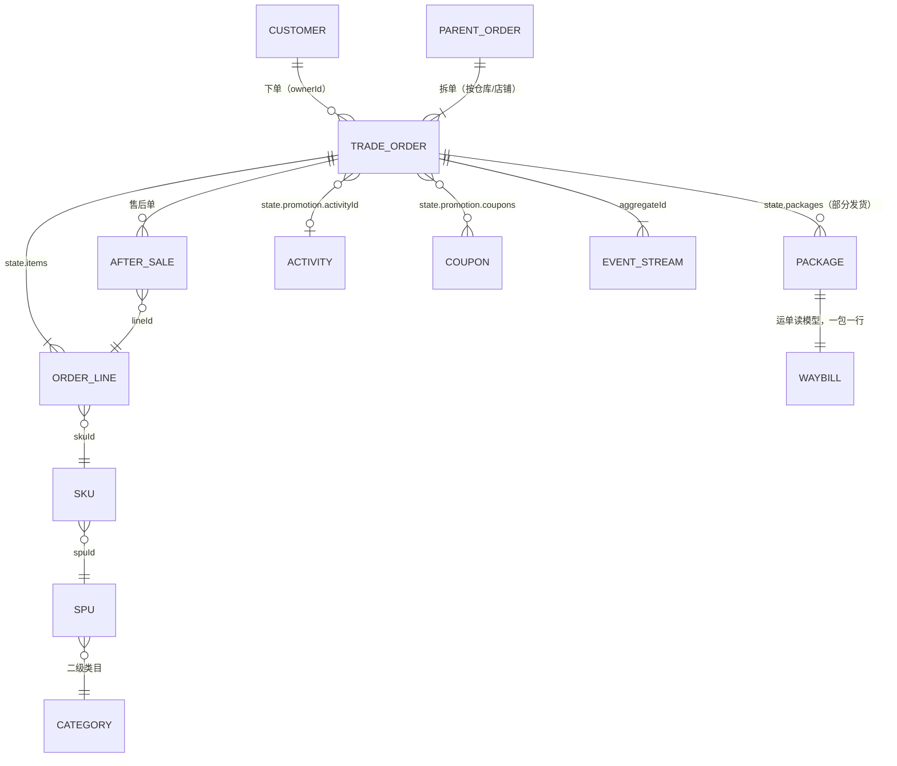

# 方案：Storybook 场景化——真实交易订单数据与 View Engine 能力展示

**状态**：已定稿（2026-09-24），按第 6 节分批做。第 1 批（数据集）、第 2 批（数据源，#3352）、第 3 批（定义与记录、分析、事件流的业务场景）已落地，做法、偏离与引擎缺口见 6.4；第 4 批（仪表盘与嵌入页，外加第 7 批里的「首页换成运营日报」）的决定与偏差见 4.2；第 5 批（目录与导览）见 5.4。第 7 节的四个问题用户已按推荐拍板。
**范围**：`typescript/storybook/stories/view-engine/` 的夹具、数据源、故事与目录。View Engine 包本身不改；方案里提到的引擎缺口只记下来，不在这里做。
**读法**：第 1 节是现状审计；第 2 节是数据的领域模型、分布与生成方式；第 3 节把每项能力对到一个业务场景；第 4 节列分析师的问题与回答它们的分析、仪表盘；第 5 节是目录结构；第 6 节是迁移批次；第 7 节是已定的产品问题。

## 0 结论先行

- **数据分两套，各管一件事。** 现有的小夹具（七条订单、五十条运单等）行是手挑的，专门用来断言边界，所以冻结成回归夹具，一个数字都不动。另起一套「零售交易」数据集，只服务展示故事：一家虚构的家居生活品牌，全渠道 B2C 零售，时间从 2024-09-01 到 2026-09-22，约 2 万张子订单。季节、促销、长尾、帕累托、漏斗、地域偏斜和六处有意埋下的异常都在里面。
- **领域按成熟电商的交易订单来建模，不照 `example/`。** `example/` 只是演示，没有取消、售后、支付方式、渠道、商品与客户。数据形状沿用 Wow 的快照与事件流约定（`state.*`、`firstEventTime`、`version`、事件流 `body[]`），所以快照控制台、事件流分析台和补偿控制台照样说得通。
- **生成确定、有种子、在浏览器里当场算。** 文本类的值（姓名、区县、备注）用 `@faker-js/faker` 的 `zh_CN` 生成，随机分布用 `d3-random`，两者都经 catalog 引入（Q1，已定）。数据源仍然把引擎发出的 Wow 查询翻译成 mingo 来作答，只在它前面加索引和缓存，不做预聚合。
- **目录按「业务场景 → 能力 → 组件状态 → 真实后端」组织**，首页有一页导览，告诉第一次来的人引擎能做什么。回归孪生故事照旧藏在导航之外。
- **分七批做，另有一批可选。** 前四批只新增文件，不碰在途的批 B、C、E 和 #3335（图标版的表格/图表切换）。改目录那一批排在 #3335 合并之后。需要批 B、C、E 能力的展示，等那一批合并后再补。主线约 8.5 人日；加上跟进 B、C、E 的补充和可选批，约 11 人日。

## 1 现状审计

### 1.1 夹具清单

| 数据集                                      | 文件                                                                            | 规模                         | 时间跨度                   | 问题                                                                                                                                                                                                  |
| ------------------------------------------- | ------------------------------------------------------------------------------- | ---------------------------- | -------------------------- | ----------------------------------------------------------------------------------------------------------------------------------------------------------------------------------------------------- |
| `ORDERS`                                    | `fixtures.ts`                                                                   | 6 条（外加 1 条软删除）      | 2026-09-15～09-17，共 3 天 | 说的是仓储出库（状态只有待出库／已发运／已取消），不是交易订单；金额是整数（640～3120），成本是随手填的；「我盯的大额单」要求金额大于 5000，所以永远是空的；`SO-1006` 带的标记 `vip` 不在字段的选项里 |
| `WAYBILLS`                                  | `fixtures.ts`                                                                   | 50 条                        | 2026-09-01～09-20          | 按行号取模生成，周期一眼看得出（状态 10 行一轮，仓库 4 行一轮）；订单号 `SO-2001…` 与 `ORDERS` 不相交；8 个客户名与 `CUSTOMERS` 的 24 家不相交；运输方式有「海运」，国内电商包裹不走海运              |
| `YEAR_OF_SHIPMENTS`                         | `dailyShipments.ts`                                                             | 365 天 × 2 仓，每天每仓 1 条 | 一年                       | 金额是正弦乘周权重，没有噪声、没有促销，也没有增长；每天恰好一条，所以最常用的「单数」恒为常数，图画出来太干净，不像真的分析                                                                          |
| `CUSTOMERS`                                 | `fixtures.ts`                                                                   | 24 家                        | —                          | 都是 B2B 公司名（宏远贸易、晨光食品），和订单、运单彼此对不上                                                                                                                                         |
| `FAILED_EVENTS`、首页的 52 条执行、补偿录制 | `fixtures.ts`、`compensationBoard.ts`（原 `home.ts`）、`compensationService.ts` | 几条到几十条                 | 2026-09-18～09-22 前后     | 补偿域自成一套，和订单没有因果关系                                                                                                                                                                    |
| 客户、交易订单、商品定价的录制              | `*Service.ts`                                                                   | 每个几条                     | 2026-09-14～09-18          | 录的是真实服务（B2B 交易，有评审、改单），用于回归，这是对的；只是没法拿来展示                                                                                                                        |

### 1.2 结论

1. **数据是玩具规模，时间也太短。** 订单最长只有 3 天，所以按月、较上期、季节性、大促和长尾统统展示不了。分析视图的大部分能力（时间轴缩放、较上一期、矩形树图、瀑布、漏斗、散点）只在回归故事里用过，而且用的是凑出来的数。
2. **数据集彼此不认识。** 订单、运单、发货、客户、补偿各有一套键，同一个客户在两个故事里是两个人，不能从一张图追问到另一份数据。
3. **故事是按状态和回归组织的，不是按业务问题组织的。** 展示文件里混着 `FillTheScreenInScaledHost`、`PopupsOverRaisedHostLayer` 这类只为回归而存在的场景。第一次来的人看不出引擎能回答哪些问题。
4. **小夹具有它的用处。** 行是手挑的，专门撞边界：一个 `javascript:` 链接、一条软删除、一段要截断的四行备注、十个城市对八种颜色。约 20 个回归文件、数百个 `play` 断言靠这些值。它们该留着，只是不该再承担展示。

### 1.3 为什么不照 `example/` 建模

`example/`（`example-domain` 的 `order`/`cart`）是 Wow 的演示。订单只有已创建→已支付→已发货→已收货四个状态，没有取消、支付超时、售后、退款、渠道、支付方式、商品与客户实体，退款只在注释里提过。照它建模，教给读者的是一个不存在的业务，分析师也认不出来。

所以只借 Wow 的**形状**：快照的 `aggregateId`、`tenantId`、`ownerId`、`version`、`firstEventTime`、`eventTime`（纪元毫秒）、`deleted`、`state.*`，事件流的 `id`、`aggregateId`、`version`、`createTime`、`body[]{name, bodyType, revision}`，以及 snake_case 的事件名。业务本身按成熟电商（天猫、京东、Shopify 这一档）的交易订单来建。真实后端那组交易订单故事连的是另一个 B2B 服务（评审、改单），保持原样；两者不混。

## 2 领域模型

### 2.1 业务设定

**「栖木生活」**（虚构品牌）是一家中型家居生活品牌，做全渠道 DTC 零售：

- **店铺**：官方旗舰店、直播专营店、企业团购店。
- **渠道**：自有 App、微信小程序、PC 商城、直播间、分销（社群团长与企业集采）。
- **仓库**：华东（嘉兴）、华北（天津）、华南（东莞）、西南（成都）。小家电只从华南仓发。
- **品类**：6 个一级类目、18 个二级类目；60 个 SPU、约 240 个 SKU。自有品牌占七成，另有 3 个联营品牌。

选这个业务，是因为它的品类有深有浅、价格从几十元到上千元都有、退货理由丰富，大促节奏也和中国电商的日历一致。分析师一看就认得。

### 2.2 实体与关系



Wow 里有四个聚合，都按 Wow 快照的形状生成：

| 聚合（`aggregateName`） | 一行是什么                               | 规模      | 说明                                                                                                                                                                                                  |
| ----------------------- | ---------------------------------------- | --------- | ----------------------------------------------------------------------------------------------------------------------------------------------------------------------------------------------------- |
| `trade_order`           | 一张**子订单**，即履约与售后的单位       | 约 2.1 万 | 一次结账是一张主单（`state.parentOrderNo`），按仓库或店铺拆成 1～3 张子单，约 12% 的主单会拆。GMV、订单数按子单算；「买家下了几次单」用对主单号的去重计数（`DISTINCT_COUNT`），这个能力也就顺带展示了 |
| `after_sale`            | 一张售后单：仅退款、退货退款、换货或拒收 | 约 1600   | 指向子单号与行号；带理由、申请金额、实退金额，以及申请、审核、退款三个时刻                                                                                                                            |
| `member`                | 一个买家                                 | 约 7000   | 会员等级、注册渠道、城市与城市等级、首单时间、累计单数、累计实付；这些累计值是读模型上的字段                                                                                                          |
| `waybill`               | 一个包裹（运单读模型）                   | 约 2.2 万 | 由子单的 `state.packages` 展开，一包一行，和订单同源，不会对不上；现有 20 列宽表的运单故事改用它                                                                                                      |

SKU 目录、类目、活动日历、券模板、省市与城市等级、承运商，都是**手写的静态业务参考数据**（`retail/catalog.ts`）。它们是业务事实，不是随机量；手写才能保证类目名、价格带与品牌读起来是真的。

### 2.3 子订单的字段

路径都在 `state.` 之下，表里略去这个前缀。所有时间都是纪元毫秒，和 Wow 快照一致。金额以元计，保留两位：先按分取整数，最后除以 100，不留浮点尾巴。

| 分组       | 字段                                                                                                                                                                                                                                    | 说明                                                                                                                                       |
| ---------- | --------------------------------------------------------------------------------------------------------------------------------------------------------------------------------------------------------------------------------------- | ------------------------------------------------------------------------------------------------------------------------------------------ |
| 标识       | `orderNo`（`TO` + 日期 + 序号）、`parentOrderNo`、`shopId`、`channel`、`warehouse`                                                                                                                                                      | 快照信封里的 `aggregateId` 就是 `orderNo`，`ownerId` 是买家 ID                                                                             |
| 买家       | `buyer.id`、`buyer.nick`（掩码，如「林*」）、`buyer.level`、`buyer.isNewBuyer`                                                                                                                                                          | `isNewBuyer` 只在这个买家的第一张**已付款**子单上为真                                                                                      |
| 状态       | `status`，取值：`PENDING_PAYMENT` 待付款、`PAID` 待发货、`PARTIALLY_SHIPPED` 部分发货、`SHIPPED` 已发货、`SIGNED` 已签收、`COMPLETED` 交易完成、`CANCELLED` 已取消、`CLOSED` 已关闭（全额退款）；另有 `afterSaleStatus`、`cancelReason` | `cancelReason` 取：`PAYMENT_TIMEOUT` 超时未付、`BUYER_CANCELLED` 买家取消、`OUT_OF_STOCK` 缺货、`RISK_CONTROL` 风控                        |
| 商品行     | `items[]`：`lineId`、`skuId`、`spuId`、`title`、`category1`、`category2`、`brand`、`priceBand`、`qty`、`listPrice`、`salePrice`、`discountShare`、`payAmount`、`refundedQty`、`refundedAmount`                                          | 类目、品牌、价格带是从 SKU 目录反范式复制过来的，与目录一致；`elementTitle: 'title'`                                                       |
| 金额       | `amounts`：`listAmount` 原价合计、`itemDiscount` 单品直降、`fullReduction` 满减、`shopCoupon` 店铺券、`platformCoupon` 平台券、`pointsDeduct` 积分抵扣、`freight` 运费、`payableAmount` 应付、`paidAmount` 实付、`refundedAmount` 已退  | 净销售额是 `paidAmount − refundedAmount`，用每条记录上的公式算出来，不另存一个字段                                                         |
| 支付       | `payment`：`method`（微信支付、支付宝、云闪付、信用卡分期、礼品卡；没付成的单记的是尝试的方式）、`installments`（0/3/6/12）、`paidAt`                                                                                                   | 分期只出现在 ¥500 以上的单                                                                                                                 |
| 促销       | `promotion`：`activityId`（年货节、女王节、618、99 划算节、双 11、双 12 或无）、`coupons[]`                                                                                                                                             |                                                                                                                                            |
| 收货       | `address`：`province`、`city`、`cityTier`（一线、新一线、二线、三线及以下）、`district`                                                                                                                                                 | 不含详细地址与电话；收件人只留掩码                                                                                                         |
| 履约       | `packages[]`：`packageNo`、`carrier`、`waybillNo`、`shippedAt`、`signedAt`、`lineIds`                                                                                                                                                   | 部分发货 = 多个包裹、到得有先有后                                                                                                          |
| 时刻       | `timing`：`paidAt`、`shippedAt`（第一个包裹发出）、`signedAt`、`completedAt`、`cancelledAt`、`closedAt`、`shipDueAt`（付款 + 48 小时的发货期限，读模型派生）                                                                            |                                                                                                                                            |
| 读模型派生 | `payToShipHours`、`shipToSignHours`、`shipSlaBreached`（付款后 48 小时仍未发）                                                                                                                                                          | 两个时刻之差由投影在写读模型时算好（`wow-bi` 的宽表也是这样）。「星期几」「几点」不再派生：分析按下单时间的日期部件分组（`DATE_PART`，Q4） |
| 其他       | `invoice.type`（不开、电子普票、增值税专票）、`tags`（预售、加急、礼品、风控复核）、`remark`（买家留言）                                                                                                                                |                                                                                                                                            |

**事件流**（每张子单一条，`aggregateName: trade_order`）按生命周期写出，版本号从 1 起连续，事件时刻就是状态里的时刻：
`order_created` → `order_paid` 或 `order_payment_timed_out` → `order_cancelled`，以及 `address_changed`、`package_shipped`（每包一条）、`package_signed`、`package_rejected`、`order_completed`、`after_sale_requested`、`refund_succeeded`、`order_closed`、`invoice_issued`。快照的 `version` 等于事件流长度。

### 2.4 一致性规则

每条规则都是生成器单元测试里的一条断言（「一条规则是一个测试」）：

1. 各行 `payAmount` 之和加 `freight` 等于 `payableAmount`；各项优惠之和等于 `listAmount + freight − payableAmount`。
2. 已付款的单 `paidAmount = payableAmount`，否则为 0；`refundedAmount ≤ paidAmount`；**未取消的单** `CLOSED` 当且仅当全额退款。付款后、发货前取消的单原路全额退回，但状态仍是 `CANCELLED`。
3. 时刻单调：下单 ≤ 付款 ≤ 发货 ≤ 签收 ≤ 完成。取消只发生在发货前；发货后只能拒收或走售后。
4. 每个 `skuId` 都在目录里，反范式的类目、品牌、价格带与目录相等；每个 `ownerId` 都在 `member` 里，会员的首单时间、累计单数、累计实付由订单算出，与订单一致。
5. `waybill` 恰好是所有 `packages` 的展开；每张 `after_sale` 指向一个存在的子单与行，退款金额不超过这一行的实付。
6. 事件流的版本连续，事件时刻与状态时刻相等；快照的 `version` 等于事件条数。
7. **分布护栏**：买家 GMV 的前 20% 占总 GMV 的 60%～72%；每个双 11 当天的 GMV 不低于其前 30 天日 GMV 中位数的 5 倍；整体按金额算的退款率在 5%～8%。护栏写成区间，让种子或参数调整时仍可调，但分布不会走样。
8. **近期护栏**：钉住的「现在」之前的 14 个整天里，没有埋下改变单量的异常（A3、A4）的日子，主单数偏离当天的期望（泊松的均值）不超过 30%。越界的那一天用它自己的种子（数据集种子加日序）重抽，直到落进带里：确定，只动那一天及其后，全局种子与更早的数据不变。运营日报读的正是这几天：默认种子下 09-21 原来只抽到 19 张主单（期望 27，子单少 37%），GMV 较前一日 −62%，会把真正的事故 A7 埋掉（协调人 2026-09-25 的决定）。按主单卡 30%，拆单再加一层随机，子单大致落在 ±35% 以内；A7 只推后发货、不改单量，不在豁免之列。重抽后 09-21 是一个平常的周一（33 张子单，GMV 较前一日 −18.6%），A7 的数一张没变（到期 38 张、及时率 81.6%、超时 11 张）

### 2.5 分布

**时钟**：「现在」钉在 `2026-09-22 10:00 Asia/Shanghai`，与首页现有的 `HOME_FIXTURE_NOW` 相同；数据从 `2024-09-01` 开始，共 25 个月。于是任何一个月都有上月可比；2025-09 到 2026-09 有去年同月；双 11 与 618 各有两次；春节有两次（2025-01-29、2026-02-17）。

| 维度         | 分布                                                                                                                                                                                                                                                                                                                                                                                                                                                                                                                                                              |
| ------------ | ----------------------------------------------------------------------------------------------------------------------------------------------------------------------------------------------------------------------------------------------------------------------------------------------------------------------------------------------------------------------------------------------------------------------------------------------------------------------------------------------------------------------------------------------------------------- |
| 日单量       | 泊松分布，均值 = 基线 × 趋势 × 月季节 × 星期 × 活动。基线为 2024-09 每天 18 张子单，趋势每年增长 35%；月季节系数：1 月 1.10（年货节）、春节那一周 0.5、3 月 1.0（3 月 8 日 ×2）、6 月 1.35（5/31～6/18，6/18 当天 ×3.5）、7～8 月 0.85、9 月 0.95（9/9 ×1.6）、11 月 1.6（10/31～11/11，11/11 当天 ×6）、12 月 1.15（12/12 ×2）。主会场那一天的倍率乘在活动期倍率之上（双 11 当天 = 1.6 × 6，618 当天 = 1.35 × 3.5）：只按基线乘 6 时，大促约 21% 的优惠会把双 11 护栏压到 5 倍以下。默认种子下 25 个月合计 20,375 张子单（17,937 张主单；近期护栏见 2.4 规则 8） |
| 星期与时段   | 周日 1.12、周六 1.08、工作日 0.95～1.0。时段是双峰：10～12 点一个小峰，20～23 点是主峰，3～6 点是谷底；双 11 当天 0 点到 1 点占全天 12%                                                                                                                                                                                                                                                                                                                                                                                                                           |
| 客单价与件数 | 子单实付不另套分布，由目录价格、销量排名与行数算出：中位数约 ¥140，均值约 ¥207；行数 1/2/3/4/5 的占比为 58%/25%/10%/5%/2%，活动期囤货为 45%/28%/14%/8%/5%；大促期间优惠占原价的比例约 22%，平日约 8%；满 ¥99 包邮，否则运费 ¥8～12                                                                                                                                                                                                                                                                                                                                |
| 商品长尾     | SKU 销量按排名服从齐夫–曼德尔布罗分布 `(rank + 30)^-2.5`（纯齐夫 s ≈ 1.1 在 240 个 SKU 上前 10 个约占 56%，做不到下面两条同时成立）：前 10 个 SKU 实际占件数的 40.7%，后 150 个合计 7.3%；价格带分为 <50、50–100、100–200、200–500、500–1000、≥1000（小家电）                                                                                                                                                                                                                                                                                                     |
| 买家         | 约 7000 人。买家的回购强度服从帕累托分布：约 60% 只买一次，12 个月复购率约 32%。会员等级普通/银卡/金卡/黑卡为 55%/25%/14%/6%，黑卡贡献约 25% 的 GMV。大促月新客约占 45%，平时约 30%                                                                                                                                                                                                                                                                                                                                                                               |
| 地域         | 按省份加权：广东 14%、浙江 11%、江苏 10%、上海 7%、北京 6%、山东 6%、四川 5%、福建 5%，其余省份依次递减，新疆、西藏在尾部，签收也更慢。城市等级：一线 25%、新一线 25%、二线 20%、三线及以下 30%。按省份就近分配仓库                                                                                                                                                                                                                                                                                                                                               |
| 渠道         | 2024-09：App 40、小程序 30、PC 12、直播 8、分销 10；到 2026-09 逐月变为 App 35、小程序 28、PC 7、直播 20、分销 10。增长主要来自直播。直播的退款率约 14%，冲动消费退得多；PC 约 4%                                                                                                                                                                                                                                                                                                                                                                                 |
| 支付         | 微信支付 48%、支付宝 38%、信用卡分期 7%（只在 ¥500 以上）、云闪付 4%、礼品卡 3%（实际 46.5/38.5/6.4/4.3/4.3）                                                                                                                                                                                                                                                                                                                                                                                                                                                     |
| 漏斗         | 下单后 8% 在 30 分钟内未付款、超时取消（双 11 零点那一小时是 15%）；付款后买家取消 2%，风控与缺货取消 0.3%；发货后拒收 1%，丢件或退回 0.5%；签收 7 天后无售后即交易完成                                                                                                                                                                                                                                                                                                                                                                                           |
| 售后         | 仅退款 3.5%、退货退款 4%、换货 1%。理由有：七天无理由、尺寸或颜色不符、质量问题、少件错件、物流破损。床品布艺的退货率偏高，因为尺寸和颜色不合适                                                                                                                                                                                                                                                                                                                                                                                                                   |
| 履约         | 付款到发货的小时数服从对数正态，中位数 14 小时，95 分位 40 小时，SLA 是 48 小时；双 11 积压时中位数 60 小时、超时率约 35%。发货到签收的中位数：顺丰 26 小时、京东物流 30、中通 52、圆通 55、EMS 70，偏远省份再加 48 小时                                                                                                                                                                                                                                                                                                                                          |
| 发票         | 电子普票 18%，增值税专票 3%（几乎都来自分销与企业团购店）                                                                                                                                                                                                                                                                                                                                                                                                                                                                                                         |

### 2.6 埋下的异常

每处异常都要有一个分析能把它找出来（第 4 节标了是哪个），并且都写成生成参数，不是事后改数据：

| 编号 | 时间                    | 异常                                                                                                                                                                                                                                                                                                 | 由哪个分析暴露                   |
| ---- | ----------------------- | ---------------------------------------------------------------------------------------------------------------------------------------------------------------------------------------------------------------------------------------------------------------------------------------------------- | -------------------------------- |
| A1   | 2026-05-10 起           | 一个浴巾 SKU（竹纤维 70×140）的退款率从 4% 升到 28%，理由集中在「质量问题」                                                                                                                                                                                                                          | 退款率离群（A-07）               |
| A2   | 2026-07-18～07-28       | 中通在广东、广西的签收时长中位数涨到 120 小时（台风）                                                                                                                                                                                                                                                | 承运商 × 周热力图（A-13）        |
| A3   | 2026-03-08              | 直播渠道的券可以叠加：那一天优惠占比 45%、新客 ×4，之后 7 天取消加退款达 30%。会不会退在生命周期开头就抽定（取消 15%，其余 25% 在发货后、下单 7 天内申请仅退款），不跟在发货的抽样后面                                                                                                               | 优惠占比对退款率散点（A-14）     |
| A4   | 2025-11-11 00:20～01:10 | 云闪付支付失败，这一时段超时取消猛增。云闪付平时只占 4%，这 50 分钟里本来几乎没有，所以设定双 11 零点云闪付有立减：这一段 35% 的人选它，失败率 85%                                                                                                                                                   | 漏斗与时段热力（A-09、A-10）     |
| A5   | 全程 0.4%               | 旧版小程序没有上报城市，`address.city` 为空                                                                                                                                                                                                                                                          | 地域分布里的「（空）」组（A-06） |
| A6   | 2026-02-10～02-24       | 春节停运：发货及时率掉到约 60%，节后积压要一周才消化                                                                                                                                                                                                                                                 | 发货及时率趋势（A-12）           |
| A7   | 2026-09-20～09-21       | 华东（嘉兴）仓分拣线故障：09-21 发货及时率约 82%，付款超过 48 小时仍未发货的有十来张（默认种子 11 张）。发货及时率按发货期限算：`timing.shipDueAt`（付款 + 48 小时）落在 09-21 的单里按时发出的比例（默认种子 38 张里 82%）；卡在线上的包裹要人工重新分拣，排在「现在」之后，分拣线 09-21 18:00 修好 | 首页运营日报（6.3）              |

### 2.7 生成方式

- **库**，依据是「优先用第三方库」：
  - `@faker-js/faker`：用 `zh_CN` 新建自己的 `Faker` 实例（不碰全局的那个），固定 `seed`，生成姓氏掩码与买家留言池，也用它的 `helpers.weightedArrayElement` 抽会员等级、省份与城市。faker 的 `zh_CN` 省市是虚构的（如「武京市」），所以省、市、区县在 `catalog.ts` 里手写；
  - `d3-random`：提供带种子的 `randomLogNormal`、`randomPoisson`、`randomPareto`，以及 `randomLcg(seed)` 作随机源（概率随行变化的伯努利直接比较这个源的均匀数）。它约 4 KB，免得手写 Box–Muller 或逆变换；
  - 日期仍用 catalog 里已有的 `dayjs`。
  - 两个新依赖只进 `wow-storybook` 的 devDependencies，经 catalog 引用，不进任何发布包。用户已同意引入（Q1）。
- **结构**：新目录 `stories/view-engine/retail/`：
  - `catalog.ts`：手写的业务参考数据；
  - `generate.ts`：纯函数 `generateRetail({ seed, from, to, now, scale })`，返回 `{ orders, afterSales, members, waybills, events }`；
  - `definitions.ts`、`views.ts`、`boards.ts`：定义、已存视图和仪表盘（`boards.ts` 在第 4 批）；
  - `source.ts`：数据集只生成一次，每个聚合一个带时间索引的 `rowSource`，会员的远程搜索，钉住时钟与时区的引擎工厂；
  - `scene.tsx`：业务场景共用的宿主外壳与文档页开头；
  - `views.test.ts`：每个定义都被引擎接纳、每张视图打得开且没有待修复的问题、查询由零售数据源答得出（node 里跑，不等浏览器）；
  - `generate.test.ts`：第 2.4 节的规则（一条一个测试，护栏三条各一个）、A1～A7 各一个、同种子逐字节相同、规模与速度；由 storybook vitest 的 node 工程 `unit` 运行，`test` 脚本把它带上。
  - 数据在模块级只生成一次（第一次读取时），同一页里的所有故事共享。数据不可变，引擎与存储仍在每次挂载时新建（沿用 README 的规则）。
- **速度预算**：在 Chromium 里生成 2 万张子单不超过 150ms。faker 只用在买家这一层（约 7000 次）；订单层的每一次抽样都走 `d3-random`，它只是算术。预算由一个故事的 `play` 量出来，写法同批 A「1 万行 400ms」那条判据。第 1 批先在 node 里量代理数：五次里最快的一次，本机判 150ms（实测约 71ms，新进程的第一次 110～155ms）；CI 的机器与故事的 Chromium 同时跑（实测 195～244ms），只判 600ms 的回退护栏，拦数量级的变慢。
- **不预先生成成 JSON**：2 万张子单序列化后约 15 MB，会让静态站变大；在浏览器里当场算反而更快。事件流只生成最近 90 天的子单（默认种子 2,643 张、13,275 条事件流），因为事件流分析台看的本来就是近期。
- **规模档**：`scale: 'showcase'` 是默认的约 2 万张（20,375 张子单、1,727 张售后单、6,705 个会员、18,976 个包裹）。`scale: 'large'` 同一个生成器出约 10 万张，只给「大数据」那条能力故事用。

### 2.8 数据源怎样作答

**不预聚合。** 引擎的价值在于把配置编译成真实的查询，故事的数据源必须按查询作答（README「假数据源按引擎实际发出的查询作答」）。预先聚合好的立方体会绕过筛选、只保留、公式，画出来的是「看起来对」的数。所以仍然是 `rowSource`：把 Wow 查询翻译成 mingo，只在它前面加四样东西，都不改变答案（第 2 批，#3352，已实现）：

1. **时间列存成纪元毫秒**，和 Wow 快照一样。分桶与切片直接读数字，不逐行解析文本。
2. **日期分桶按天缓存**：一天以上的桶都从本地零点开始，所以桶是那一天的属性。每个 (单位, 时区) 每个日历日只换算一次（25 个月约 760 天），之后每一行查表；一天以内的桶从当天零点按宽度数，时钟调整（夏令时切换）的那天逐行读墙上时钟。缓存键是 (单位, 时区)，不含字段：桶只由日历决定，跨字段共享一样正确，也更省。时区换算用平台的 `Intl.DateTimeFormat`，不用 dayjs 的 timezone 插件：插件的 `.tz(zone).startOf(...)` 受宿主机自己时区的影响，宿主机有夏令时时会把 UTC 的小时桶算差一小时，把纽约 23 小时那天的零点算成前一天 22:00。
3. **时间范围先切片（可选开启）**：`rowSource(rows, { timeField: 'firstEventTime' })` 让行按这一列排好序（这一列必须是纪元毫秒，否则建源时报错）；筛选顶层 AND（嵌套的 AND 会展平）里对这一列的 `GT`/`GTE`/`LT`/`LTE`/`EQ`/`BETWEEN` 数字条件先二分切出那一段，完整的筛选仍在这一段上跑一遍。不传 `timeField` 时行的顺序与答案都和以前一样，回归夹具都不传；零售数据源传。
4. **同一个数据源实例里，相同的聚合查询只算一次**（以查询的 JSON 为键，每次返回一份副本，报错不记）。仪表盘上几个面板经常发出相同的合计查询，指标卡的对比也是如此。

同时补上 `rowSource` 原先拒绝作答的 Wow 语义，都照 `wow-mongo`／`wow-query` 的写法，每一样都有 `rowSource.test.ts` 单测：

- `WEEK` 从周一开始（`$dateTrunc` 的 `startOfWeek: "Monday"`）；`QUARTER` 从 1、4、7、10 月开始。
- `dense` 只在日期分桶是唯一分组时作答（与 `AggregationQuery` 的校验一致，否则报错）；只补有数据的首末桶之间（`$densify` 的 `full`），没有时间的记录不进桶；空桶的计数与去重计数为 0，其余为 null，派生指标随之为 null；补完之后再做 having、排序、截断。
- `PERCENTILE` 是精确值：排序后在秩 `(n − 1) · p / 100` 处线性插值。服务是近似值，落在同样两个相邻值之间（Wow 测试套件对各后端的要求），界面上照样写「≈」。
- `STDDEV`/`VARIANCE` 是总体标准差与方差（`$stdDevPop`，方差为其平方）。
- `ANY` 取最大的非空值，与 `wow-mongo` 的 `$max` 相同。
- 这四样在没有值参与时答 null（`EmptyAggregationValues`）。翻译不了的仍然报错，不给一个看似合理的答案。

实测（2026-09-24，`generateRetail()` 默认 showcase 规模的 20,360 张子订单，中位数；表格见 README「假数据源的速度」）：筛选加 `$group` 不限时间，Chromium 27 ms、node 43 ms，与改前（25 ms）相同，瓶颈在 mingo 本身；按天分桶跨 25 个月从 1039 ms 降到 23 ms；运营日报 8 个面板第一次作答 48 ms（改前去掉 dense 等之后要 3285 ms，改后同样的查询 40 ms），同一数据源再答一遍不到 0.1 ms。只量了数据源，不含绘制；「一块板 1 秒内画完」由第 4 批的首页孪生量：本机约 560～870 ms，见 4.2。

## 3 能力 → 场景

状态一列：✅ 表示今天有展示故事，但用的是玩具数据；⚠ 表示只在回归故事里有；❌ 表示今天没有任何展示；⏳ 表示等批 B、C、E；⛔ 表示首发后或引擎不支持。**新场景**一列写的是第 5 节目录里那个故事（`业务场景/…`、`能力/…`）。「今天」一列是方案定稿时的状态；第 3 批之后，订单工作台、售后工作台、分析工作台、运单宽表与订单事件流已用零售数据展示了 3.1、3.2 里落在它们身上的能力，落地的配置与缺口见 6.4。

### 3.1 记录视图

| 能力                                             | 订单业务里的场景                                       | 新场景                                         | 今天 |
| ------------------------------------------------ | ------------------------------------------------------ | ---------------------------------------------- | ---- |
| 简单与高级筛选（AND/OR/NOR、取反）               | 「华东仓、待发货、付款超过 48 小时，且不是预售」       | 业务场景/订单工作台「发货超时」                | ✅   |
| 相对日期与预设（今天、本月、过去 7 天）          | 「昨日新下的单」「本月售后」                           | 订单工作台「昨日订单」                         | ✅   |
| 引用字段（远程搜索）                             | 按买家筛选：从 7000 个会员里搜「林」                   | 订单工作台                                     | ✅   |
| 数组 `IN` 与全都包含                             | 标记同时有「礼品」和「加急」                           | 订单工作台「礼品加急」                         | ✅   |
| 元素匹配（`elementMatch`）                       | 「含有浴巾 SKU，而且这一行退过款」的订单               | 能力/按元素筛选                                | ⚠    |
| 全文搜索框（`SEARCH`）                           | 客服按留言里的关键词找单（「改地址」）                 | 订单工作台                                     | ❌   |
| 元数据字段（`ownerId` 等）                       | 按买家 ID（`ownerId`）精确找                           | 订单工作台                                     | ❌   |
| 软删除三态                                       | 测试单被删了，审计时要连删除的一起看                   | 能力/软删除                                    | ⚠    |
| 列设置、冻结、宽度、多重排序                     | 客服的列：单号、买家、状态、实付、留言                 | 订单工作台                                     | ✅   |
| 本页与全部两行汇总                               | 本页实付合计与全部实付合计；最早与最晚的下单时间       | 订单工作台                                     | ✅   |
| 单元格读法（状态徽章、标签、链接、复制、长文本） | 状态语气（已取消为危险色），运单号可复制，留言截到三行 | 订单工作台                                     | ✅   |
| 数组按元素读（`elementTitle`）                   | 一格里读出每个商品的标题徽章                           | 订单工作台                                     | ✅   |
| 卡片布局与详情抽屉                               | 手机上客服按卡片翻；抽屉里看分组后的全部字段           | 订单工作台（卡片视图）                         | ✅   |
| 行动作与批量命令                                 | 批量「标记加急」「催发货」，逐条的结果条               | 订单工作台（宿主动作槽）                       | ✅   |
| 分页与游标                                       | 快照分页；事件流用游标                                 | 订单工作台、订单事件流                         | ✅   |
| 自动刷新                                         | 值班大屏：待发货队列每 30 秒刷新一次                   | 订单工作台「发货超时」                         | ✅   |
| 导出 CSV                                         | 把本月售后导出给财务对账                               | 售后工作台                                     | ✅   |
| 宽表                                             | 运单 20 列：承运商、重量、时效、签收                   | 业务场景/运单宽表（数据换成 `waybill` 读模型） | ✅   |

### 3.2 分析视图

| 能力                                                              | 场景                                                   | 新场景                   | 今天                        |
| ----------------------------------------------------------------- | ------------------------------------------------------ | ------------------------ | --------------------------- |
| TERMS／HISTOGRAM／DATE_HISTOGRAM                                  | 按渠道；按价格带；按日、周、月                         | A-01、A-06、A-16         | ✅                          |
| `WEEK`、`QUARTER`、`dense` 补空桶                                 | 周报；季度复盘；春节停运那几天是 0，而不是断线         | A-02、A-12               | ❌（数据源拒答）            |
| COUNT、SUM、AVG、MIN、MAX                                         | 订单数、GMV、客单价                                    | A-01                     | ✅                          |
| DISTINCT_COUNT                                                    | 买家数；主单数                                         | A-01、A-18               | ⚠（只在真实后端的录制里）   |
| PERCENTILE（≈）、STDDEV                                           | 付款到发货的 P90；日 GMV 的波动                        | A-12                     | ❌                          |
| 每条记录上的公式（BINARY）                                        | 净额 = 实付 − 已退；优惠 = 原价 − 应付 + 运费          | A-03、A-14               | ✅                          |
| 指标之间的派生（DERIVED）                                         | 客单价 = GMV / 订单数；退款率 = 已退 / 实付；转化率    | A-01、A-07               | ⚠                           |
| 指标自带条件（「只算…」）                                         | 本月与上月两个 GMV；只算已付款的单                     | A-01、A-05               | ⚠                           |
| 只保留（having）与前 N 组                                         | 订单数 ≥ 30 的 SKU 里，退款率最高的 10 个              | A-07                     | ⚠                           |
| 数组展开（展开链，计数单位跟随展开层）                            | 展开商品行，按类目、SKU 分析；计数单位是订单行         | A-04、A-08               | ⚠（托盘里走得到，数据很少） |
| 空值分组                                                          | 城市为空的 0.4%                                        | A-06                     | ❌                          |
| 柱（分组、堆叠、百分比、横向）                                    | 渠道 × 月的百分比堆叠：直播的占比在变大                | A-05                     | ✅                          |
| 折线、面积                                                        | 日 GMV；新老客面积                                     | A-02、A-15               | ✅                          |
| 组合（柱＋线、双轴）                                              | 月 GMV（柱）与客单价（线）                             | A-02                     | ⚠                           |
| 饼、环（8 片之后并入「其他」）                                    | 支付方式；售后理由                                     | A-17                     | ✅                          |
| 瀑布                                                              | 本月 GMV 较上月的变化，按渠道拆成几段贡献              | A-03                     | ⚠                           |
| 矩形树图（两层）                                                  | 一级类目 → 二级类目的实付                              | A-04                     | ⚠                           |
| 热力图（线性或对数）                                              | 星期 × 时段；承运商 × 周                               | A-10、A-13               | ✅                          |
| 散点、气泡                                                        | 每天一个点：优惠占比对退款率，点的大小是单量           | A-14                     | ⚠                           |
| 漏斗（按指标、按维度）                                            | 下单 → 付款 → 发货 → 签收 → 完成                       | A-09                     | ⚠                           |
| 指标卡（对比、目标、趋势、越低越好）                              | GMV 较昨日；退款率越低越好；发货及时率目标 95%         | 运营日报                 | ✅                          |
| 常数参考线                                                        | 发货及时率 95% 的红线                                  | A-12                     | ✅                          |
| 追问（查看这些记录、按另一个维度拆、只看这一组）                  | 点退款率最高的 SKU → 查看这些记录 → 看到浴巾的质量投诉 | A-07                     | ✅                          |
| 表格布局与合计行、表格/图表切换                                   | Top 20 买家表，带合计                                  | A-08                     | ✅                          |
| 批 A：时间轴缩放、图例开关、较上一期、大数据、花纹                | 25 个月的日 GMV，缩放到双 11 那一周；10 万张单         | A-02、能力/长时间轴      | ✅（数据是正弦）            |
| 批 B：平均线、中位线、目标区间、峰谷、趋势、移动平均、累计        | 7 日移动平均；大促的目标区间；本月累计对月目标         | A-02、A-11、A-12         | ⏳ B                        |
| 批 C：框选追问、设为时间筛选、漏斗分段可按                        | 框出双 11 那一周 → 查看这些记录；在板上框选后设为筛选  | A-02、运营日报           | ⏳ C                        |
| 批 E：对数轴、散点轴规格、超过 8 条的「其他」、读屏摘要、导出图片 | SKU 销量用对数轴看长尾；导出图片贴进周报               | A-08、A-14               | ⏳ E                        |
| 与上一期整段、去年同期对比（Q59）                                 | 「今年 9 月比去年 9 月」                               | A-02 说明为什么还做不到  | ⛔ 首发后                   |
| 按星期、时段这类日期部件分组                                      | 星期 × 时段                                            | A-10 用读模型字段替代    | ⛔ Wow 聚合不支持           |
| 透视表（Q8）、帕累托（累计占比）                                  | 买家帕累托                                             | A-08 用前 N 组加合计替代 | ⛔                          |

### 3.3 仪表盘、嵌入、管理与外观

| 能力                                         | 场景                                                             | 新场景                                  | 今天              |
| -------------------------------------------- | ---------------------------------------------------------------- | --------------------------------------- | ----------------- |
| 视图面板、板内自有分析、改写呈现             | 日报里的「渠道分布」由这块板自建                                 | 运营日报                                | ✅                |
| 内容面板（标题、Markdown、图片、链接）       | 值班手册、大促作战室公告                                         | 运营日报、大促作战室                    | ✅（图片 ❌）     |
| 标签页（只跑当前页）                         | 销售复盘：概览／品类／渠道／客户                                 | 销售复盘                                | ✅                |
| 筛选五类、默认值、必填、整板按日/周/月       | 日期（默认昨日）、渠道、店铺、会员等级                           | 三块板                                  | ✅                |
| 自动连线、「不受…影响」、固定范围            | 店铺筛选接不到仓库面板，就标出来；企业团购店的板固定只看自己的店 | 履约与售后                              | ✅                |
| 点击：交叉筛选、打开视图、打开另一块板、链接 | 点渠道柱 → 整板筛到直播；点 SKU → 打开商品分析板，带上日期       | 运营日报 → 销售复盘                     | ✅                |
| 就地搭板、撤销、复制为共享视图               | 运营把个人视图挂到共享板上                                       | 销售复盘（可编辑；首页日报只读）        | ✅                |
| 固定宽度与全宽、手机上筛选放进抽屉           | 大屏全宽；手机看日报                                             | 运营日报                                | ✅                |
| 整板定时刷新、单面板重试                     | 大促作战室每分钟刷新                                             | 大促作战室                              | ⚠                 |
| 筛选值进宿主 URL                             | 把「昨日·直播」的日报链接发到群里                                | 运营日报                                | ⚠                 |
| `EmbeddedView`（只读、可交互）               | 订单详情页嵌入这张单的事件流；商品详情页嵌入 SKU 的售后          | 业务场景/订单详情页                     | ✅                |
| `EmbeddedDashboard`（锁定、隐藏、两档）      | 会员详情页：锁定这个买家，日期可调                               | 业务场景/会员详情页                     | ✅                |
| 保存、另存、改名、删除、默认、排序、三种范围 | 系统视图「发货超时」、共享的「本月售后」、个人的「我跟的大客户」 | 订单工作台                              | ✅                |
| 冲突、未知结果、拒绝                         | 两个客服同时改一个共享视图                                       | 组件状态（沿用现有故事）                | ✅                |
| 空、加载、失败、待修复、面板不可用           | 新店第一天，没有数据                                             | 组件状态                                | ✅                |
| 主题预设、明暗、跟随系统                     | 同一块日报换三套预设                                             | 能力/主题与预设（数据换成零售）         | ✅                |
| 英文目录                                     | 海外团队                                                         | 组件状态/English（不动）                | ✅                |
| 事件流分析台                                 | 这张单的历史；每日支付超时事件；变动最多的单                     | 业务场景/订单事件流                     | ⚠（只有真实后端） |
| 补偿控制台                                   | A2、A4 当天，下游处理器（库存扣减、运单推送）的失败              | 可选：首页补偿数据与异常同源（第 6 批） | ✅（数据不相干）  |

## 4 分析场景

下面每一条都是分析师真会问的问题。字段略去 `state.` 前缀；「本月」「上月」相对于钉住的「现在」。

| 编号 | 问题                                                 | 配置                                                                                                                                                                                                                                                                                                                                          | 数据里埋了什么                                                                                                                                                                                         | 能力状态                           |
| ---- | ---------------------------------------------------- | --------------------------------------------------------------------------------------------------------------------------------------------------------------------------------------------------------------------------------------------------------------------------------------------------------------------------------------------- | ------------------------------------------------------------------------------------------------------------------------------------------------------------------------------------------------------ | ---------------------------------- |
| A-01 | 本月 GMV、实付、订单数、买家数、客单价，较上月怎样？ | 指标卡：`SUM(amounts.payableAmount)` 两个，一个带「本月至今」、一个带「上月同期（至今）」（两个命名时段，D38），`compare` 设为 `percent`；另存「本月经营概况」表：GMV、实付、订单数、买家数 = `DISTINCT_COUNT(buyer.id)`、客单价 = DERIVED（GMV ÷ 订单数，读作金额）；另存「客单价（按日，较前一日）」：带 30 天走势的卡（比值的和之比，D38） | 实测：本月至今（9/1～9/22 10 点）GMV ¥142,145，较上月同期（8/1～8/22 10 点）+21.6%，客单价 ¥202；9 月 21 日客单价 ¥183.42，较前一日 −18.6%                                                             | ✅                                 |
| A-02 | 近 25 个月的 GMV 怎么走？                            | 折线：`DATE_HISTOGRAM(firstEventTime, DAY)`（补空桶、截至昨日）× GMV，7 日移动平均、日均线、峰谷；在工作台里用滚轮或底部滑条缩放到双 11 那一周；另存一个月粒度的组合图（柱是 GMV，线是客单价，右轴）                                                                                                                                          | 增长趋势、两次双 11 和两次 618 的尖峰、春节的谷底；逐年同比约 +35%（去年同月靠缩放目测，整段同比要等 Q59）                                                                                             | ✅                                 |
| A-03 | 本月 GMV 比上月变了多少，是哪些渠道带来的？          | 柱：维度是 `channel`，两个 GMV 各带自己的时间条件（本月至今、上月同期（至今），命名时段），另有 Δ = DERIVED（两者之差）一列；瀑布（`total: true`）画「本月净销售额的渠道构成」，指标是每张单上的 实付 − 已退 再求和                                                                                                                           | 实测（本月至今较上月同期）：自有 App +¥10,964、直播 +¥10,133、PC +¥3,601、分销 +¥771、小程序 −¥217。瀑布画不了差值（派生指标不可加），改成两根柱加「GMV 变化」一列；瀑布用在「本月净销售额的渠道构成」 | ⚠（瀑布画不了差值，6.4）           |
| A-04 | 实付由哪些品类构成？                                 | 矩形树图：展开 `items`，近 12 个月，维度 `category1` → `category2`，指标 `SUM(items.payAmount)`                                                                                                                                                                                                                                               | 厨房餐具·餐具（¥30 万）、床品布艺·毛巾浴巾（¥26 万）、床品四件套（¥25 万）最大；小家电件数少但单价高                                                                                                   | ✅                                 |
| A-05 | 渠道结构在怎样变化？                                 | 百分比堆叠柱：月 × `channel`，指标 GMV                                                                                                                                                                                                                                                                                                        | 直播从 2024-09 的约 6% 涨到 2026-09 的 24%；PC 在 4%～14% 之间起伏、总体走低                                                                                                                           | ✅                                 |
| A-06 | 哪些省份、哪一级城市买得多？                         | 横向柱：`address.province` 前 15；另存一个 `cityTier` × `channel` 的热力图，空值单独一组（读作「（空）」）                                                                                                                                                                                                                                    | 江苏、广东、浙江领先；A5：「（空）」一行 88 单，只落在微信小程序那一列；按下那一格「查看这些记录」就是这 88 单                                                                                         | ✅                                 |
| A-07 | 哪些商品的退款率异常？                               | 横向柱：展开 `items`，维度 `title`；指标：件数、实付、已退、退款率 = DERIVED（已退 ÷ 实付，读作百分比）；范围近 3 个月；只保留「件数 ≥ 30」；按退款率倒序取前 10。点一根柱「查看这些记录」追到有这一行商品的单（元素匹配，D38）；只看退过款的走订单工作台的「浴巾退款单（近 3 个月）」                                                        | 竹纤维浴巾 70×140 · 米白近 3 个月退款率 26.0%，第二名 12.8%（A1）；点它追到 208 单                                                                                                                     | ✅                                 |
| A-08 | 谁是大客户？长尾有多长？                             | 表格：`buyer.id` 一个维度 × 昵称、会员等级（「任一值」，合计行上空着）、实付、下单次数 = `DISTINCT_COUNT(parentOrderNo)`，近 12 个月前 20 组，带合计行；另存一个会员视图：按 `orderCount` 分组（一次一组，全部组，按人数倒序）× 人数，带累计占比（帕累托，D38）；批 E 之后：SKU 件数用对数轴                                                  | 近 12 个月第一名一人实付 ¥7.6 万；3,779 人只买过一次（占全部会员的 56%），买过一两次的人占 79.1%，尾巴长到几百次                                                                                       | ✅／⏳ E                           |
| A-09 | 下单到完成，漏在哪一步？                             | 漏斗（按指标）：下单数、付款数、发货数、签收数、完成数，每个指标带自己的条件；`conversion: 'previous'`；拆一份按渠道的                                                                                                                                                                                                                        | 20,360 → 18,737（付款 92%，漏得最多）→ 18,308 → 17,992 → 17,401                                                                                                                                        | ✅（没拆按渠道的一份）             |
| A-10 | 买家什么时候下单？                                   | 热力图：下单时间（`firstEventTime`）按星期 × 按时段（`DATE_PART` 的 `DAY_OF_WEEK` × `HOUR_OF_DAY`，上海时间），指标订单数；A4 另存「双 11 零点：各支付方式的超时率」：2025-11-11 0～2 点，按支付方式，超时率 = DERIVED（超时取消 ÷ 订单数，读作百分比），只保留订单数 ≥ 3                                                                     | 晚间 20～23 点是主峰、10～11 点一个小峰；A4：云闪付 5 单全部超时，支付宝 20%，微信支付 0（全量热力里一个小时看不出 A4）                                                                                | ✅                                 |
| A-11 | 大促到底拉动了多少？                                 | 表格：`activityId`（不在活动期的单是空值那一组「（空）」）× GMV、订单数、客单价、优惠占比；另存一个日 GMV 柱图，限定在 2025-10-15～11-20，中位线与峰谷                                                                                                                                                                                        | 2025-11-11 当天 GMV ¥4.5 万，约是那段日子中位数（¥6,087）的 7.4 倍；各活动优惠占原价约 21%，平时约 6%；活动的客单价并不更高（¥189～216 对平时 ¥210）                                                   | ✅（没设目标区间：没有目标值可放） |
| A-12 | 发货及时吗？                                         | 折线：`WEEK`（按付款时间，补空桶）× 超时率 = DERIVED（超时的计数 ÷ 已付款的计数，读作百分比），常数参考线 5%、峰谷；另存各仓 `payToShipHours` 的 P50、P90（≈），近 3 个月，48 小时参考线                                                                                                                                                      | 春节停运那一周（2026-02-16）62.1%（A6）；两次双 11 那一周约 22%；近 3 个月各仓 P90 都在 31～32 小时                                                                                                    | ✅                                 |
| A-13 | 哪个承运商在哪几周慢？                               | 热力图（运单读模型，一包一行）：发货周（`WEEK`）× 承运商，指标 `AVG(shipToSignHours)`，限定广东、广西与 6/1～9/20。订单上的展开链只有一层（商品行），包裹也不带时效，所以不展开 `packages`                                                                                                                                                    | 中通 7 月 20 日那一周平均 119 小时，平时 50 多（A2）                                                                                                                                                   | ✅                                 |
| A-14 | 优惠给多了，是不是退得也多？                         | 散点：直播渠道、近 12 个月，每天一个点（只保留单数 ≥ 8 的日子），x = 优惠占比 = DERIVED（优惠 ÷ 原价，读作百分比），y = 退款率，气泡大小 = 订单数；优惠 = 每张单上的 原价 + 运费 − 应付 再求和                                                                                                                                                | 3 月 8 日那一点优惠占比 43%，其余都在 27% 以下（A3），远在最右；按金额的退款率那天是 13%，不突出                                                                                                       | ✅                                 |
| A-15 | 新客和老客各贡献多少？                               | 面积：月 × GMV，按 `isNewBuyer` 拆开、堆叠，图例写「新客：是」「新客：否」                                                                                                                                                                                                                                                                    | 大促月新客的 GMV 冲高（2025-11 新客 ¥7.4 万），老客每月托底                                                                                                                                            | ✅                                 |
| A-16 | 价格带怎么分布？                                     | 组合：展开 `items`，`HISTOGRAM(salePrice, 100)` × 件数（柱）与实付（线，右轴）                                                                                                                                                                                                                                                                | 实测：¥100 以下占件数的 82%、实付的 49%——实付的尾巴比件数长得多（小家电在 ¥1000 以上），但并不集中在 ¥100～500                                                                                         | ✅                                 |
| A-17 | 买家用什么付款？为什么退？                           | 环图：`payment.method` × 实付（分析工作台）；售后工作台：环图 `after_sale.reason`，另有各类目 × 理由的百分比堆叠横条                                                                                                                                                                                                                          | 分期集中在 ¥500 以上的单；近 12 个月床品布艺的售后理由以质量问题为首（A1 的浴巾），尺寸或颜色不符第二                                                                                                  | ✅                                 |
| A-18 | 复购率如何？                                         | 会员视图，组合：首单月（2024-09～2026-03）× 新客数（柱）与复购率 = DERIVED（「`orderCount ≥ 2`」的人数 ÷ 人数，读作百分比，线，右轴）                                                                                                                                                                                                         | 越早的首单月观察期越长，复购率自然越高；大促月只在与相邻月份比时略低（2024-11 为 74%，前一月 89%；2025-06 为 51%，前一月 55%）                                                                         | ⚠（6.4）                           |

### 4.1 三块仪表盘（外加一块大促作战室）

**运营日报**（这块板替换首页上现在的补偿概览，见 Q2）：

- **筛选**：日期（默认「昨日」，必填）、渠道、店铺；整板按时段或按日。
- **第一行**：8 张指标卡：GMV、实付、订单数、买家数、客单价、支付转化率、退款率（越低越好）、发货及时率（目标 95%）。每张都与前一日对比，并带 30 天的迷你趋势。
- **第二行**：今日与昨日的逐时 GMV（折线，两个指标各带自己的条件）；渠道分布（板内自有的分析，点击设为交叉筛选）。
- **第三行**：「付款超过 48 小时仍未发货」明细（记录面板，按付款时间正序，宿主给出「催发货」动作）；退款率最高的前 5 个 SKU（点击打开「销售复盘·品类」，带上日期）。
- **第四行**：值班手册（链接面板）。
- 手机上筛选放进抽屉；筛选值写进 URL，可以直接发到群里。

**销售复盘（月度）**，四个标签页：

- 概览：A-01、A-02 月粒度、A-03；
- 品类：A-04、A-16、A-07；
- 渠道与地域：A-05、A-06、A-11；
- 客户：A-08、A-15、A-18。

点击行为：点一个类目，这块板交叉筛选；点一个 SKU，打开「订单工作台」，带上这个 SKU 与本月作为条件。

**履约与售后**，两个标签页：

- 履约：A-12、A-13、付款到发货小时数的直方图（按仓库拆）、超时明细；
- 售后：理由环图、A-07、售后单明细（仅退款、退货退款）、按日的退款金额。

这块板固定范围为「已付款」；点一个售后理由，打开售后工作台，条件就是这个理由。

**大促作战室（可选）**：固定范围是 2025 年双 11 的活动期；整板每分钟刷新；全宽，适合大屏。指标卡的目标是活动目标；批 C 之后可以框选一段时间设为筛选。

**嵌入页**：

- **会员详情页**：`EmbeddedDashboard`，锁定买家，日期可以调；内容是他的订单、月消费和售后。
- **订单详情页**：宿主画订单头；`EmbeddedView` 嵌入这张单的事件流（模板视图按 `aggregateId` 填写，按版本排序）；另嵌入一个只读的商品行表。

### 4.2 第 4 批的落地：决定、偏差与引擎缺口

第 4 批做了三块板（`DashboardWorkbench`）、两张嵌入页和新首页。文件：`retail/boardDefinitions.ts`（定义、数据源、引擎）、`retail/boards.ts`（已存视图与四块板）、`retail/RetailHost.tsx`（宿主的路由与「催发货」）、`retail/goldens.ts`（黄金值，`goldens.test.ts` 在 node 里按同一口径从数据集再算一遍）；故事是 `Home`、`OpsDaily`、`SalesReview`、`Fulfilment`、`MemberDetail`、`OrderDetail` 各一对（展示＋孪生）。

**建在第 3 批上**：第 3 批（#3370）先合并了，所以板子用它的定义与视图（`retail/definitions.ts`、`retail/views.ts`、`retail/source.ts`），不再另有一套：订单的明细是订单工作台的系统视图「发货超时」「全部订单」，售后是售后工作台的「全部售后」「售后理由构成」「每日退款金额（近 30 天）」，订单历史是事件流的「订单历史」模板；销售复盘与履约板上的 A-02～A-18 直接引用分析师在分析工作台里存下的分析，与那边读同一个口径。板子自己才有的——指标卡、逐时对比、月度指标表、承运商 × 周——是板内自有的分析。仪表盘定义（`retail-boards`）与订单商品行那一个视图在 `retail/boards.ts`，引擎在 `retail/RetailHost.tsx` 的 `createBoardEngine`。订单定义为首页的搜索多了一个根字段 `state.items.title`（商品名），`keyword` 搜索随之也搜商品名。

**板子与埋下的异常**：

| 板                   | 看到什么                                                                                                                                                                      | 异常   |
| -------------------- | ----------------------------------------------------------------------------------------------------------------------------------------------------------------------------- | ------ |
| 运营日报（首页嵌入） | 8 张卡：9 月 21 日发货及时率 81.6%，目标 95% 的进度条没满；「付款超过 48 小时仍未发货」11 张，全在华东（嘉兴）仓；「售后退款最多的 5 个商品（近 30 天）」里竹纤维浴巾遥遥领先 | A7；A1 |
| 销售复盘             | 品类页「退款率最高的商品（近 3 个月）」（A-07）第一是竹纤维浴巾 70×140 · 米白（26.0%）；渠道与地域页「城市等级 × 渠道」里「（未上报）」一行；客户页的新老客面积与复购率       | A1；A5 |
| 履约与售后           | 「发货超时率（按付款周）」最高点在 2026 年 2 月（春节停运）；设「省份 = 广东省」，「承运商 × 周」里中通最慢的一周在 7 月下旬（>100 小时）                                     | A6；A2 |

A3（直播叠券）、A4（双 11 零点云闪付）属于第 3 批的分析工作台（A-14、A-09/A-10），不在这三块板上。

**决定与偏差**（都写在 `retail/boards.ts` 用到的地方）：

1. **日报的「日期」默认「昨日」（D39）**：4.1 要「默认昨日」又要「每张卡与前一日对比、带 30 天走势」。第 4 批时引擎只能二选一（板上的日期只能收窄，筛成一天的卡只剩一个桶），日报先默认「近 30 天」作过渡。现在板上的日期**锚定**带走势的卡：日期是一天（「昨日」「前天」或日历上的任一天）时，卡读那一天、与前一日比，走势是以它为终点的近 30 天（卡自己的条件「近 30 天」按那一天读）；其余面板收窄到那一天。相对窗口也按整天读了（「近 30 天」是今天与之前的 29 天，与 Wow 的 `RECENT_DAYS` 同一读法），第一天不再只有半天。不跟日期走的面板不接「日期」：「付款超过 48 小时仍未发货」是此刻的队列，「今日与昨日的逐时 GMV」的两天写在指标自己的条件里，「售后退款最多的 5 个商品（近 30 天）」一天排不出谁最多——面板头上照常说「不受『日期』影响」。
2. **八张卡都带走势（D38、D39）**：客单价 = GMV ÷ 订单数、支付转化率 = 付款单 ÷ 下单、发货及时率 = 按时发出 ÷ 到期，三张都是两个和之比，每一天按那一天的两个和相除，画得出走势、读得出较前一日（9 月 21 日：客单价 −18.6%、转化率 +6.9%、及时率 −15%）。发货及时率的 95% 目标是每一天的目标，按指标的读法写作「95.0%」。第 4 批时它们读「昨日」、与近 30 天整体比，是过渡。
3. **「买家数」换成「新客数」**：买家数是去重计数，同样画不了走势；新客数（`isNewBuyer` 的计数）能相加。买家数、主单数、客单价逐月在销售复盘的「月度指标」表里。
4. **「退款率（越低越好）」换成「售后退款」金额（按退款日，越低越好）**：退款率按下单日算，最近几天的单还没来得及退，会一路「变好」，日报上读成好消息是误导。成熟口径的退款率在销售复盘与履约与售后（近 3 个月）。
5. **日报「点商品去销售复盘」挂在「售后退款最多的 5 个商品」上，不挂在「退款率最高」上**：按退款率排要展开商品行，而展开了的分析没有可点的组（面板会说「点击时的设置不生效」）。售后单的商品是根字段，点得动；点过去落在销售复盘的「品类」页，那里的退款率榜第一仍是浴巾（近 3 个月 26.0%）；带过去的是渠道（`{ channel: { filter: 'channel' } }`），不带日期——日报的「昨日」对三个月的退款率没有意义（D39 之前带的是「近 30 天」）。点击自己说落在「品类」页（`tab: 'category'`，D39；第 4 批时由宿主的路由补上）。同理，销售复盘 A-07 点商品去订单明细、履约板售后页点商品都做不了；销售复盘改由「省份前 15」点一个省份打开订单明细。
6. **品类不做交叉筛选**：类目在商品行里，板上的筛选收窄的是订单、不是行，按类目筛会把同一张单里别的类目的行也算进来。交叉筛选放在「渠道」（日报的渠道分布、销售复盘的渠道份额），它是订单上的根字段。
7. **A-03 用分析工作台的「本月 GMV 较上月同期（分渠道）」，是并排的柱，不是瀑布**：瀑布只收能相加的指标，「本月 − 上月」是派生指标。销售复盘的卡片读「最近一个过完的月」（8 月较 7 月），整板切到「按日」就读昨日较前一日，与日报同一口径（孪生「销售复盘与日报同一口径」：把销售复盘收窄到 9 月 21 日，GMV、订单数、实付与日报的卡相等）。
8. **不用「固定范围」**：它是批 C 之前存下的板子迁移出来的，新板子不该用；履约与售后的「已付款」写在各订单面板自己的条件里。
9. **明细面板用「发货超时」自己的一页 20 行**：第 4 批时板上的记录面板只画第一页、不画分页也不说总数，一页 10 行时第 11 张超时单看不到。现在（D39）面板正文下面写「共 11 条记录」、能翻页，每行带宿主的「催发货」「订单详情」，勾几行能成批「催发货」（`orderPanels`，与订单工作台同一组动作）；一页 20 行照旧，一眼看全。
10. **首页的搜索**在配置里声明（`kind: 'search'`，只接「付款超过 48 小时仍未发货」），接到订单定义的 `keyword`（第 3 批的留言、订单号、昵称，第 4 批加上 `state.items.title`）。搜索字段只能点名根字段，所以商品名另外声明成根字段 `state.items.title`——Wow 按 MongoDB 的路径读它，任一行的标题匹配，这张单就匹配。D39 核对过 Wow 的 `SEARCH`：点名数组元素里的字段做不到可移植（查询模式要求元素字段在 `ELEMENT_MATCH` 里；Elasticsearch 能在嵌套作用域里搜，MongoDB 的 `$text` 只认集合的文本索引、不看 `fields`、也进不了 `$elemMatch`），所以引擎不做，这个根字段的写法留着；接真实的 MongoDB 时更直接的是不写 `searchFields`、让文本索引覆盖 `items.title`。
11. **补偿概览**搬到「真实后端/补偿控制台/运营概览」（Q2），文件改名为 `CompensationOverview.stories.tsx`，孪生原样跟过去。
12. **首页的四种状态**：加载中（数据源不作答）、一个面板出错（售后服务 503，两个售后面板各自说「查询失败」带「重试」，其余照常）、没有权限（存储对这块板说 `FORBIDDEN`，嵌入说「你不能打开这个仪表盘。」）、没有数据（新店第一天）。

**首页验收（6.3）的证据**，都在 `Home.test.stories.tsx`：

- 第一眼：1280×800 下 8 张卡与逐时 GMV 的开头不滚动就看得到；每个数带单位（¥、%、「（单）」「（人）」写在卡名里）；八张卡都带走势，写「2026年9月21日」与较前一日的变化；筛选条上的「日期」是「昨天」；没有被截断的数，页面不横向滚动。
- 数字：八个黄金值与八个变化在 `retail/goldens.ts`，`goldens.test.ts` 从数据集直接再算一遍；销售复盘收窄到 9 月 21 日读出同样的 GMV、订单数与实付；订单工作台的「昨日订单」共 33 条、实付合计 ¥5,671.54，与日报的卡相等（`RetailOrders.test.stories.tsx`）。
- 追下去：超时明细「⋯ → 在工作台中打开」进宿主的订单工作台（11 条，每行「催发货」「订单详情」），「订单详情」带着订单号去订单详情页，事件流只有「下单」「付款」两条。
- 宿主外壳：顶栏、导航、页头「运营日报」与宿主自己的「催发货（超时 11 单）」；板上的超时明细写「共 11 条记录」，每行也有「催发货」，勾两行成批催（孪生「在板上催发货」，D39）；只读：没有「编辑」、保存与另存为，面板菜单只有「看」的那一半；「铺满屏幕」能铺开、Esc 收起。
- 状态：四个变体各一个孪生。
- 看得舒服：375 宽（筛选收进「筛选（已设 1 个）」抽屉，不横向滚动）有孪生；1280、全宽与明暗两套在真浏览器里走查过。
- 性能：整块板从页面第一次渲染到 8 张卡、4 张图、明细都画完——本机 Chromium 冷启动（含生成 2 万张子订单）约 560 ms，孪生里约 870 ms；孪生只守 6 秒的回退护栏。

**引擎缺口**（本批不改引擎，只记下来，建议进 view-engine 的 todo）：

- ~~板上的日期筛选只能收窄，不能把「较前一日」「近 N 天走势」锚到读者选的那一天；「前天」不是命名时段，相对窗口也不按日对齐（「近 30 天」的第一天只有半天）。~~ **已修（D39，PR 3）**：日期是一期时带走势的卡锚到它；「前天」是命名时段；以天及更长的单位计的相对窗口按整天读。首页改回默认「昨日」。按整天读让几个近 N 天的读数挪了一点：A-07 浴巾近 3 个月的退款率 25.9% → 26.0%，追到的单 212 → 208。「上周同日」仍不是命名时段（用日历选那一天）。
- ~~指标卡的走势只收能相加的指标，比值、平均、去重计数都画不了，哪怕读法是「最后一期」。~~ **比值已修（D38，PR 2）**：只由可加指标算出的派生指标（客单价 = GMV ÷ 订单数）按比值的和之比画得出走势，分析工作台的「客单价（按日，较前一日）」用上了；平均与去重计数仍画不了（那是对的：它们没有按桶可加的读法）。日报三张比值卡也改成了带走势的卡（D39，PR 3）。
- ~~派生指标没有单位与格式：客单价写成派生会是一个裸数，比值写不成百分比（这里用平均、`format: 'percent'` 或「×100」加「（%）」绕开）；图表的值标签也不跟轴的 `percent` 格式。~~ **已修（D38，PR 2）**：派生指标有自己的读法（数字／百分比／金额），分析工作台的比率不再乘 100，客单价读作 ¥；图的轴、值标签、提示框与读屏表都按它读。日报的卡也换成了派生指标（D39，PR 3）。
- ~~指标卡的 `compare` 只写一个带符号的百分比，不说比的是什么、不按好坏着色；带走势的卡写的是「较上一期」而不是「较前一日」。~~ **已修（#3381）**：`compare` 写成带色徽标加「较「〈对比指标〉」」，按 `lowerIsBetter`（挪到了卡上）与宿主的涨跌色约定着色；走势卡按单位写「较前一日／较上周／较上月…」。
- 展开了数组的分析没有可点的组，所以按商品、类目这类行上的维度做不了点击与交叉筛选；板上的筛选也收窄不到行（元素）上。**一半已修（D38，PR 2）**：展开一层的分析按一组能「查看这些记录」（元素匹配），板上按下这种面板也打开追问菜单；交叉筛选、自定义目的地与筛选收窄到元素属 D39。
- ~~板对板的点击说不出目标板的标签页。~~ **已修（D39，PR 3）**：`PanelClick` 的 `dashboard` 形态多可选的 `tab`，「点击时…」里「打开到」；日报点商品落在销售复盘的「品类」页，宿主路由里的特例拿掉了。
- ~~板上的记录面板只画第一页，没有分页、也不说一共多少条；仪表盘面板上没有宿主的行动作（「催发货」只能放在宿主页头与工作台里）。~~ **已修（D39，PR 3）**：面板正文下面有总数与翻页（`static` 嵌入只写总数）；宿主经 `recordPanel(panel)` 按面板给行动作、成批动作与 `useBulkCommand`，与记录工作台同一套，嵌入仍什么也不写（D36，理由见 D39）。
- ~~同一页嵌两个视图时，两个「正在显示」地标同名（axe `landmark-unique`，订单详情页的故事关了这一条）。~~ **已修（#3381）**：嵌入的已应用条按视图命名「正在显示：〈视图〉」，订单详情页重新打开这条规则。
- 搜索字段（`searchFields`）只能点名根字段，搜不到数组元素里的字段。**不修（D39）**：Wow 的 `SEARCH` 做不到可移植，理由见 4.2 第 10 条；根字段的写法留着。
- ~~布尔维度在图例里读作「是／否」，没有地方给它起业务的名字（「新客／老客」）。~~ **已修（#3381）**：图例、提示框与读屏表写「新客：是」「新客：否」（6.4 第 7 条）。
- （已解决）默认种子下 9 月 21 日原来是个清淡的周一（19 张子订单），日报上 GMV 较前一日 −61.8%，把 A7 埋掉了。生成器加了近期护栏（2.4 规则 8），这一天重抽后读 −18.6%；受影响的黄金值（首页、订单工作台、分析工作台、运单宽表、订单事件流、会员详情页）都在同一个 PR 里更新了。

## 5 Storybook 信息架构

### 5.1 目录

```text
View Engine/
  导览                  ← 新：一页文档，讲清引擎能做什么（见 5.2）
  业务场景/             ← 新：零售数据集，只放展示
    运营日报            （仪表盘，宿主外壳里的落地页）
    销售复盘            （仪表盘，四个标签页）
    履约与售后          （仪表盘）
    大促作战室          （可选）
    订单工作台          （记录工作台：系统、共享、个人视图共约 8 个）
    售后工作台
    分析工作台          （A-01～A-18 作为视图列表里的已存视图）
    运单宽表
    订单事件流          （事件流分析台，数据是生成的事件）
    会员详情页          （嵌入仪表盘）
    订单详情页          （嵌入视图）
  能力/                 ← 一项能力一页，场景最小，数据尽量用零售集
    筛选 · 按元素筛选 · 软删除 · 列与汇总 · 导出 · 自动刷新
    图型一览（11 种各一张） · 长时间轴 · 追问与点击 · 仪表盘筛选 · 搭板 · 嵌入 · 主题与预设
  组件状态/             ← 现有展示文件改个标题搬到这里，小夹具不动
    记录工作台 · 分析工作台 · 仪表盘 · EmbeddedView · EmbeddedDashboard · 筛选编辑器
  真实后端/             ← 不动
```

- **业务场景**回答「引擎能替我的业务做什么」，**能力**回答「某一项功能长什么样」，**组件状态**回答「空、加载、失败、冲突、窄屏时它是什么样」，**真实后端**回答「连上真服务是什么样」。一个故事只进一处。
- 回归孪生保持 `['!dev', '!autodocs', 'test']`，不进导航；它们的标题跟着展示文件改（`…/回归`）。
- `.storybook/preview.tsx` 的 `storySort` 改成 `['导览', '业务场景', '能力', '组件状态', '真实后端']`；`shared/AppShell.tsx` 的左侧导航按同样的分组重写（链接用故事 ID，标题一改 ID 就变，所以同批改）。
- Storybook 只用中文（已定）；`组件状态/记录工作台/English` 是唯一保留英文目录的故事。

### 5.2 导览页

导览页是一页 docs-only 的文档（`Intro.mdx`；`main.ts` 的 `stories` 通配要加上 `.mdx`）。它就是第一次来的人读的一页：

1. 一句话定位：研发声明「能怎样观察」，用户决定「这次怎样观察」，引擎负责编译、执行、渲染和保存。
2. 一张图：定义（代码）+ 配置（数据）→ Wow 查询 → 结果 → 呈现；保存与打开形成回路（取自设计 README 的价值链）。
3. 四张卡片：记录、分析、仪表盘、嵌入。每张一句话，外加链接到最能代表它的业务场景。
4. 数据集说明：栖木生活是谁、时间范围、「现在」钉在哪一刻、埋了哪六处异常（邀请读者自己去找，每处附一个「答案」链接）。
5. 能力清单：第 3 节表格的压缩版，每行链接到它的故事。

### 5.3 现有故事怎么处置

| 现有                                                                                            | 处置                                                                                                                 |
| ----------------------------------------------------------------------------------------------- | -------------------------------------------------------------------------------------------------------------------- |
| `首页`（补偿概览）                                                                              | 换成「业务场景/运营日报」；补偿概览并入「真实后端/补偿控制台」，作为那一组的示例数据场景（Q2）；`Home.test` 跟着改   |
| `数据视图/Record 工作台`、`分析视图/分析工作台`、`仪表盘视图/Dashboard`、两个嵌入、`筛选编辑器` | 只改标题，搬到「组件状态/…」；小夹具与断言都不动                                                                     |
| `分析视图/长时间轴`                                                                             | 展示故事改用零售的日 GMV，搬到「能力/长时间轴」；它的孪生改为自带 `YEAR_OF_SHIPMENTS` 的参数，不再引用展示故事的参数 |
| `主题/主题一览`、`主题预设`                                                                     | 搬到「能力/主题与预设」，数据换成零售的日报，孪生里的对比度断言不依赖数值                                            |
| `AnalysisCharts`、`AnalysisNewCharts` 等只有回归的图型                                          | 回归不动；「能力/图型一览」用零售数据给每种图型一张展示                                                              |
| 删除                                                                                            | 不删。`EmbeddedDashboard/CustomerDetail` 的展示被「会员详情页」取代，但孪生靠它，所以留在「组件状态」                |

### 5.4 第 5 批的落地：决定与偏差

- **导览**是 `stories/view-engine/Intro.mdx`（`View Engine/导览`），Storybook 打开时就在这一页（`storySort` 让它排第一，`verify-storybook.mjs` 断言索引的第一项是它）。5.2 的五块都在：一句话定位、价值链的图（`IntroBlocks.tsx` 画，不用图片）、四张卡片、数据集说明，外加「从哪里看起」的五步。异常写成七处（A1～A7，A7 是第 4 批为首页加的），每处一个问题，答案收在可展开的「答案」里，附一个链接。能力清单按记录、分析、仪表盘与嵌入、外观与状态分组写成列表，不是表格：Storybook 的 MDX 没开 GFM，表格画不出来，为它加 `remark-gfm` 不值。
- **首页不并入业务场景**：第 4 批把首页做成宿主的落地页、运营日报的工作台版在「业务场景/运营日报」，两者都留；目录是 导览 → 首页 → 业务场景 → 能力 → 组件状态 → 真实后端，顶层 View Engine 排在 React Hooks 前面，`storySort` 里不再列没有故事的名字。
- **能力**收了这之后落地的五个展示（批 B、C、E 与 D36）：显示收口、参考与算出的系列、长时间轴、框选与追问、板上的搜索（原在 `仪表盘视图/Dashboard` 下），外加主题与预设。图型一览与 5.1 列的其余几页（筛选、按元素筛选、软删除、列与汇总、导出、自动刷新、搭板、嵌入）没有单独做：它们在业务场景里已有，导览的能力清单指过去。
- **组件状态**：`Record 工作台` 改名「记录工作台」（与 5.1 一致，`English` 故事留在它下面）。只有回归、没有展示的文件（图型、图表读法、指标与保留、可视化面板、仪表盘的宽度与搭建与点击与筛选、标题栏、主题令牌与密度、shadcn 桥接）也跟着搬，免得目录外还留着旧的「数据视图／分析视图／仪表盘视图／主题」前缀。
- **长时间轴**的展示改用零售：25 个月的日 GMV（按店铺三条线；按渠道堆叠的柱），近 400 天的逐时 GMV（约 9600 个点，替代一万天；零售集只有 25 个月，逐日到不了一万）。分析上限按运行时的一万组放宽，订单定义自己的 1000 不动。孪生自带一年与一万天的每日发货（`YEAR_OF_SHIPMENTS`），不再引用展示的参数。
- **主题与预设**：主题一览的每条带换成运营日报的节选（`retail/gallery.ts`：筛选条上「发货仓 = 华东」、「付款超过 48 小时仍未发货」、近 30 天渠道分布，外加华东仓待发货的卡片）。一页二十四条带，照搬日报的九列表格、对两万张单筛九十几遍，在 CI 上超过一个故事 15 秒的时限，所以表格收成四列五行、不自动刷新，订单数据源只装这几块面读得到的单（华东仓里待发货的与近 31 天的），答案与全量相同；逐套预设（原 `数据视图/主题/预设`）每个故事是整张运营日报嵌入、钉上一套预设，断言读 `--primary` 在嵌入面上解析成那套预设的主色，不读板上的数。T5（themes.md 4.5）又把主题一览拆成每套预设一个故事、亮暗各一条带、每条三种视图（记录、分析、仪表盘，都只读华东仓近 70 天的单），对比度矩阵移到 `ThemeContrast.stories.tsx`：一页二十四条带在 Linux WebKit 里要 9～12 秒，每次整页重算的代价随页面大小涨（themes.md 的 T5 落地记录）。
- **宿主导航**按目录重写：业务场景十项（补上第 3 批的五个工作台）、能力六项、组件状态六项、真实后端四组。能力的五个故事改为标自己的页（原来都标「分析工作台」或「仪表盘」）。
- **文档页跟着明暗走**：导览不挂载故事，没有装饰器替它挂 `.dark`，所以 `.storybook/ThemedDocsContainer.tsx` 读 `theme` 全局，给所有文档页用 Storybook 的暗色文档主题。
- **文档站**里指向故事的链接随标题改了 id，并在 TypeScript 指南的示例表里加了导览一行。
- **补偿场景**后来收成了回归夹具，见 5.5。

### 5.5 补偿场景收成引擎的回归夹具（补偿控制台重构批 7，2026-09-25）

补偿控制台用视图引擎重建之后（`compensation/dashboard/docs/design/view-engine-rebuild.md` 2.2、第 5 节批 7），产品的定义在 `compensation/dashboard/src/views/`，连真服务由控制台的 `e2e/real-server/` 走查。「真实后端/补偿控制台」的三个场景因此不再是产品的演示，处置如下：

| 原来                                                                 | 现在                                                                           | 理由与守护                                                                                                                                |
| -------------------------------------------------------------------- | ------------------------------------------------------------------------------ | ----------------------------------------------------------------------------------------------------------------------------------------- |
| 快照控制台（`DataConsole.stories.tsx`，连 `host`，`!test`）          | 删除                                                                           | 连真服务、重写产品的命令，是产品的重复演示；引擎的部分（行与成批命令的插口、`useBulkCommand`）一直由孪生对录制服务守着，组件搬进夹具文件  |
| 快照控制台/回归（`DataConsole.test.stories.tsx`，三个故事）          | `CompensationWorkbench.test.stories.tsx`，`回归夹具/补偿/记录工作台`，三个故事 | 断言原样保留：行命令按状态开放与结果条、键盘进出详情、分析视图、条件值取自数据、标题栏的错误搜索                                          |
| 事件流分析台（`EventStreamConsole.stories.tsx`，连 `host`，`!test`） | 删除                                                                           | 连真服务；产品没有事件流分析页，引擎的部分由孪生守着                                                                                      |
| 事件流分析台/回归                                                    | `CompensationEvents.test.stories.tsx`，`回归夹具/补偿/事件流`                  | 断言原样保留：数组里的事件按类型读、元素匹配、展开计数、逐元素的详情、聚合回来的日期                                                      |
| 运营概览（`CompensationOverview.stories.tsx`：示例数据、真实后端）   | 删除；页面组件搬进孪生                                                         | 「真实后端」是产品首页的重复演示（控制台的 `e2e/overview.spec.ts` 与 `e2e/real-server/` 守着）；「示例数据」没有 `play`，孪生挂的是同一页 |
| 运营概览/回归（两个故事）                                            | `CompensationOverview.test.stories.tsx`，`回归夹具/补偿/运营概览`              | 断言原样保留：七个面板的黄金值、指标卡一行高、处理器数值不出框、固定列不压别的列、横向不溢出、只读报告与铺满屏幕                          |

- 定义收小到这些故事断言到的部分（`compensation.ts`：去掉事件 ID、失败事件、重试规格、执行时间、堆栈等字段与服务上限），`home.ts`、`eventStream.ts`、`eventStreamService.ts` 改名为 `compensationBoard.ts`、`compensationEvents.ts`、`compensationEventsService.ts`，数据不动。
- 三个文件都是只有回归的故事（`['!dev', '!autodocs', 'test']`），不进目录，宿主导航撤掉「真实后端 · 补偿」一组；`AppShell` 的 `current` 可以不给（夹具不在导航里）。导览里指向补偿控制台的链接改指客户的快照控制台。
- 与产品的定义**有意漂移**：产品改视图不动引擎的回归，引擎的回归也不等产品；每个文件的注释写明。

## 6 迁移计划

### 6.1 推荐：双轨，不迁移回归

- **回归夹具冻结**：`fixtures.ts`、`dailyShipments.ts`、`home.ts`（现名 `compensationBoard.ts`，见 5.5）的补偿数据、录制服务，一律不改。
- **零售数据集只给展示用**。每个业务场景配一个**轻量孪生**：断言画出来了、关键数字对（例如运营日报的 8 个数字）。数字是由种子决定的黄金值；生成器一改，就在同一个 PR 里更新这些值。生成器自己的正确性由 2.4 节的单元测试守着，不靠这些故事。
- **反过来迁移全部测试的代价**：约 20 个回归文件、数百个 `play`、约 2 万行，要逐条改成从大数据集里挑出有边界的行。估计 5～8 人日，而且会丢掉手挑行的精确性（「这一行正好是 `javascript:` 链接」在 2 万行里是找不到的，除非特意造，那又回到了手挑）。**不推荐。**
- 双轨的代价是：展示与回归用两套数据，维护者要知道孪生不一定用和展示一样的数据。README 的「示例与回归」一节写明这一点就够了。

### 6.2 批次

在途的工作有：批 B（参考线、趋势，要开工）、批 C（框选）、批 E（显示收口、导出图片）、#3335（表格/图表切换改为图标）。它们改的是 `wow-view-engine/src` 以及 `Analysis*.test.stories.tsx` 这一类文件。

| 批                                                     | 内容                                                                                                                                                                                                                     | 改到的文件                                                                                                                                            | 与在途工作冲突吗                                                                                                                               | 估计        |
| ------------------------------------------------------ | ------------------------------------------------------------------------------------------------------------------------------------------------------------------------------------------------------------------------ | ----------------------------------------------------------------------------------------------------------------------------------------------------- | ---------------------------------------------------------------------------------------------------------------------------------------------- | ----------- |
| 0（本 PR）                                             | 方案                                                                                                                                                                                                                     | `storybook/docs/scenarios.md`、README 一行链接                                                                                                        | 无                                                                                                                                             | —           |
| 1 数据集                                               | 把依赖加进 catalog（Q1）；`retail/catalog.ts`、`generate.ts`，以及 2.4 节的单元测试（给 storybook 的 vitest 加一个 node 工程 `unit`，`test` 脚本把它带上）                                                               | 新文件、`pnpm-workspace.yaml`、`package.json`、`vitest.config.ts`                                                                                     | 无（只新增）                                                                                                                                   | 2 人日      |
| 2 数据源（#3352）                                      | `rowSource` 的四项加速（按日缓存桶，键为 (单位, 时区)，换算用 `Intl`；可选的 `timeField` 切片；查询记忆）；补 `WEEK`、`QUARTER`、`dense`、`PERCENTILE`、`STDDEV`/`VARIANCE`、`ANY`，都配单测；性能实测写进 README 与 2.8 | `rowSource.ts`、`rowSource.test.ts`、`rowSource.bench.ts`、README（`unit` 工程与第 1 批的合成一个，同时跑 `generate.test.ts` 与 `rowSource.test.ts`） | `rowSource` 被所有夹具共用，但语义只增不改，回归夹具不传 `timeField`；全量 `test:storybook` 已全绿。性能按第 1 批的 `generateRetail` 实测      | 1.5 人日    |
| 3 定义与业务场景（记录、分析、事件流）（已做，见 6.4） | 四个定义；约 25 个已存视图（第 4 节）；订单工作台、售后工作台、分析工作台、运单宽表、订单事件流，外加各自的轻量孪生                                                                                                      | 新文件，新标题放在「业务场景/…」                                                                                                                      | 无。孪生不断言切换按钮上的文字（#3335 正在把它改成图标），按角色和目录里的名字找                                                               | 2 人日      |
| 4 仪表盘与嵌入页（已做，见 4.2）                       | 运营日报、销售复盘、履约与售后；会员详情页、订单详情页；轻量孪生；首页换成运营日报（第 7 批的前一半）                                                                                                                    | 新文件                                                                                                                                                | 无                                                                                                                                             | 2 人日      |
| 5 目录与导览（已做，见 5.4）                           | `Intro.mdx`；把现有展示文件的 `title` 搬到「组件状态」「能力」；`storySort`；`AppShell` 导航；长时间轴与主题改用零售数据（及各自孪生的参数）；更新 README                                                                | 约 15 个故事文件的 `title` 那一行、`preview.tsx`、`main.ts`、`AppShell.tsx`、README                                                                   | **排在 #3335 合并之后。** 与批 B、C、E 的冲突只在 `title` 那一行，重新 rebase 就能解决；挑一个没有别的故事 PR 在飞的时间点，一次改完、尽快合并 | 1 人日      |
| 6 跟着 B、C、E 补展示                                  | B 合并后：A-02、A-11、A-12 加上移动平均、平均线、目标区间；C 合并后：运营日报与 A-02 的框选；E 合并后：A-08 的对数轴、导出图片                                                                                           | `retail/views.ts`、`boards.ts`                                                                                                                        | 各跟在对应批之后，不抢它的文件                                                                                                                 | 各 0.5 人日 |
| 7 首页与补偿同源（必做）                               | 首页换成运营日报，改 `Home.test`；补偿示例数据由 A2、A4 两次事故生成（库存扣减、运单推送处理器的失败），与订单同源；验收见 6.3                                                                                           | `Home.stories.tsx`、`Home.test.stories.tsx`、`home.ts`                                                                                                | 无                                                                                                                                             | 1 人日      |

主线（第 1～5 批）8.5 人日；第 6 批分三次，共 1.5 人日；第 7 批 1 人日（用户 2026-09-24 定为必做）；全部约 11 人日。第 1 与第 2 批可以并行；第 3 与第 4 批依赖第 1、2 批，彼此可以并行。每批合并前按惯例在真浏览器里逐控件走查，并跑齐 README「本地门禁」。

### 6.3 首页的验收（用户 2026-09-24：「storybook 首页仪表盘也要按真实场景标准完成优化」）

首页是第一次打开 Storybook 的人看到的第一屏，它回答的是「这个引擎放进一个真实的运营后台是什么样子」。所以首页就是 4.1 节的运营日报，放在宿主外壳里，按真实的运营后台来验收，不按演示页的标准：

- **第一眼**：不滚动就能看到 8 张指标卡和逐时 GMV；每个数都有单位、对比基准（较前一日）和方向（退款率越低越好）；标题说明这是哪一天、哪个范围。
- **数字经得起核对**：8 个数由种子决定，是黄金值；它们与销售复盘、订单工作台里同一口径算出的数相等（孪生里断言）。
- **故事能讲下去**：日报默认看「昨日」（时钟钉在 2026-09-22，即 09-21；第 4 批曾以「近 30 天」过渡，D39 起筛选条上就是「昨日」，指标卡锚到它，见 4.2 第 1 条），A1～A6 都不在这一天，打开的第一屏会是一张没有事的日报。所以在生成参数里加一处 A7：09-21 华东（嘉兴）仓分拣线故障，发货及时率掉到约 82%，低于 95% 的目标线，「付款超过 48 小时仍未发货」明细里有十来张单（华东仓一天只有约 10 张子单，故障从 09-20 起最多困住这么多；再往前推会把 09-21 的及时率压到约 60%）；及时率按 `timing.shipDueAt` 落在 09-21 的单算；指标卡、逐时曲线与明细都能看到它，点下去一路走到订单与事件流。A7 与 A1～A6 一样写成参数，并在 2.6 节补一行、在生成器单测里断言。
- **只读，但能搜、能铺满**（用户 2026-09-24）：首页是给人看的日报，不是搭板子的地方。首页用 `EmbeddedDashboard interaction="interactive"`，按构造就是只读的——嵌入一律不写（view-engine D36）：没有「编辑」、没有保存与另存为，面板菜单只有「看」的那一半，这些入口根本不在，而不是给了再灰掉；筛选照常能改，改了只影响这一次看，不留痕（不存视图、不存板子，也不写偏好）。搭板子的故事在销售复盘，用 `DashboardWorkbench`。
  - **搜索**：板上有一个搜索筛选（订单号、买家昵称、商品名），接到明细类面板（超时未发货明细等）；指标卡与图表不受它影响，面板上照常说明它接了哪些筛选。引擎已经支持（2026-09-24 核实，view-engine test/embeddedDashboard.test.tsx「searches the detail panel through a board filter of the search kind」）：板上声明一枚 `kind: 'search'` 的筛选，接到明细面板所在定义的搜索字段（`kind: 'search'`，`searchFields` 列订单号、买家昵称、商品名），可交互一档里打字就跑，编译成 Wow 的 `SEARCH`。第 4 批要做的是：零售定义声明搜索字段，板子在配置里声明这枚筛选并只接明细面板（定义里有搜索字段的分析面板会被自动连接一起接上，要在配置里写明绑定）；搭建界面的「添加筛选」目前只列五类，要不要让作者在界面上加搜索一类，由用户定。不在故事里拼一个假的。
  - **全屏**：嵌入首行右侧的「铺满屏幕」（`EmbeddedDashboard` 的 `expandable`，`interactive` 一档才有，与工作台同一个 `ViewExpandToggle`），适合值班大屏；不用浏览器的 `requestFullscreen`——portal 出去的弹层在 top layer 下会落到后面（见 ui/README.md「视图能铺满屏幕」），筛选与菜单就打不开了。
- **宿主外壳真实**：导航、租户或空间、当前用户、宿主自己的动作（例如「催发货」）都在，文字是运营的话，不是引擎的术语。
- **状态齐全**：加载、某个面板出错（其余照常）、没有权限、没有数据，这四种状态各有一个首页的变体故事。
- **看得舒服**：1280px 与全宽大屏、375px 手机（筛选放进抽屉），浅色和深色都走查；没有横向滚动，没有被截断的数。
- **性能**：整块板在 1 秒内画完（第 2 批的数据源实测），首页不因为数据大而卡住。

### 6.4 第 3 批落地（定义与记录、分析、事件流的业务场景）

**做了什么**（`stories/view-engine/retail/` 与 `stories/view-engine/Retail*.stories.tsx`）：

- **定义**（`retail/definitions.ts`）：交易订单（子订单）、售后单、会员、运单，外加订单事件流。词用运营与分析师的：GMV（应付合计，含没付成的单）、实付、已退、净销售额（实付 − 已退，每张单上的公式再求和）、客单价（GMV ÷ 订单数）、退款率（已退 ÷ 实付，按金额）、发货超时率。读模型派生的字段（下单星期、时段、付款到发货的小时数、是否超时）在字段注释里写明原因（Q4）。交易订单一份字段、两个定义：订单工作台的 `retail-orders` 带客服与运营的系统视图，分析工作台的 `retail-order-analysis` 只放分析师存下的分析；两者都声明了记录，所以分析里的「查看这些记录」开得出来。
- **视图**（`retail/views.ts`，共 53 张）：分析师的 26 张共享分析（订单 24 张、会员 2 张，回答 A-01～A-18，第 4 节的表已按落地的配置与实测改写）；订单工作台 5 张系统视图、2 张共享、1 张个人；售后工作台 5 张系统视图（其中 3 张分析）、1 张共享、2 张个人；运单宽表 4 张系统视图（其中 1 张分析）；订单事件流 7 张系统视图（其中 3 张分析）。
- **数据源**：`retail/source.ts` 给每个聚合一个带时间索引的 `rowSource`，数据只生成一次；时钟钉在 `RETAIL_NOW`、时区 Asia/Shanghai。`rowSource` 补了三样翻译（都照 `wow-mongo`，各有单测）：数组的 `CONTAINS_ALL`（`$all`，「礼品加急」要用），快照信封上的 `OWNER_ID`、`AGGREGATE_ID(S)`（「买家会员号」是 `ownerId` 元数据字段）。
- **宿主外壳**：`AppShell` 的 `ScenePage` 多了五个业务场景的页；左侧导航里的条目随第 5 批的目录一起加，在那之前这五个场景没有哪一项标为当前。
- **单测**：`retail/views.test.ts` 在 node 里打开每个定义的每张视图，断言引擎接纳、没有待修复的问题、零售数据源答得出。

**五个场景与各自看得见的异常**：

| 场景                    | 打开是什么                                                         | 埋下的异常在哪里看得见                                                                                                                                                             |
| ----------------------- | ------------------------------------------------------------------ | ---------------------------------------------------------------------------------------------------------------------------------------------------------------------------------- |
| 订单工作台              | 「发货超时」值班队列（每 30 秒刷新），宿主动作「催发货」逐条与成批 | A7：11 张单，发货仓一列全是华东（嘉兴）；A1：共享视图「浴巾退款单（近 3 个月）」（商品行上的元素匹配）                                                                             |
| 售后工作台              | 全部售后                                                           | A1：「竹纤维浴巾：每月售后理由」5 月起质量问题每月十几二十单（6 月 22 单），此前一年只有一两单；「各类目的售后理由」里床品布艺的质量问题压过尺寸不符                               |
| 分析工作台 · 订单与商品 | 「本月 GMV（较上月同期）」指标卡                                   | A1「退款率最高的商品」、A3「直播间：优惠占比 × 退款率」最右一点、A4「双 11 零点：各支付方式的超时率」、A5「城市等级 × 渠道」的「（空）」一行（按下即 88 单）、A6「每周发货超时率」 |
| 分析工作台 · 会员       | 购买次数分布                                                       | —（长尾：3,779 人只买过一次）                                                                                                                                                      |
| 运单宽表                | 20 列宽表，运单号冻结                                              | A2：「两广：承运商 × 周的签收时长」中通 7 月 20 日那一周 119 小时；「台风期间：两广中通」那 12 个包裹                                                                              |
| 订单事件流              | 最近的事件（游标分页）                                             | A7：「订单历史」填 `TO2026091900005`，付款之后再没有下文                                                                                                                           |

**孪生**（`Retail*.test.stories.tsx`）：按角色和目录里的名字找视图与控件，图上的数从图旁边的读屏表读，不认「表格／图表」切换上的字。断言的黄金值由种子决定：订单工作台 11／19／36／672／316 条与催发货 2 项完成；分析工作台 ¥145,394.65 与 +24.4%（较「上月同期 GMV」、按好坏着色）、浴巾 26.0%（按浴巾那根柱追到 208 单）、客单价 9 月 21 日 ¥183.42 较前一日 −18.6%、「（空）」那一行 88 单（并从那一格追问到这 88 单）、大客户合计行的昵称一格空着、新客面积的系列叫「新客：是／否」、云闪付 100.0%、春节那一周 62.1%、3 月 8 日优惠占比 43.1%、漏斗五个数；会员 3,779／1,252／506 人、帕累托 59.4%／79.1%／100.0%；售后 1727／2／70 条、浴巾 6 月 22 单、每日退款的累计线穿过没有退款的日子；运单 18,967／47／12 个、中通 119.29 小时；事件流「事件类型分布」前三。生成器一改，就在同一个 PR 里更新这些值。

**画得多快**（2026-09-24，Apple Silicon 笔记本，Storybook 开发服务器）：最重的一张是「日 GMV 走势」——751 天、7 日移动平均、日均线与峰谷，点下去到画完 314～450 ms（三次，第一次含查询；孪生里在无头 Chromium 实测 485 ms，回归护栏 3 s）。冷启动打开分析工作台（含生成 2 万张子单）到第一个数出来约 1.2 s（开发模式，含模块加载）。

**偏离与引擎缺口**（照实记下，没有伪造）：

1. **「上月同期」说不出来**：相对日期有「本月」「上月」，没有「上月同期」「去年同期」（Q59 同类）。A-01、A-03 的上月同期写成绝对时刻 8/1～8/22 10 点：故事的时钟钉住所以总对，真实产品里会过期。**已修（引擎，D38）**：命名时段多了「本周／本月／本季／今年至今」与各自的「上期同期（至今）」，到读的那一刻为止；A-01、A-03 改用「本月至今」「上月同期（至今）」，读出的数不变（¥145,394.65，+24.4%），明天打开也不过期。
2. **瀑布画不了差值**：瀑布只收可加的指标，两个 SUM 之差是派生指标，被拒（`chart.waterfall.not-additive`），虽然在数学上它可加。A-03 改成每个渠道两根柱加「GMV 变化」一列；瀑布改画「本月净销售额的渠道构成」。
3. **派生指标没有读法**：派生指标一律按两位小数的普通数字写，没有百分比、货币。比率乘了 100、名字里写「（%）」；客单价写成「202.20」不带「¥」。**已修（引擎，D38）**：派生指标带自己的读法（数字／百分比／金额，小数位；金额不写币种时随操作数）。比率存比值本身、读作百分比，名字里不再写「（%）」（浴巾 26.0%、云闪付 100.0%、春节那一周 62.1%、3 月 8 日优惠占比 43.1%）；客单价读作金额。另加「客单价（按日，较前一日）」：比值的和之比画得出走势，9 月 21 日 ¥183.42、较前一日 −18.6%，与日报那张卡同一个数（`retail/goldens.ts` 的 `ANALYSIS_GOLDEN`，`goldens.test.ts` 从数据集再算）。
4. **按展开的元素分组的分析不能追问**：`drillGroups` 对 `elements` 直接答「不能」，所以 A-07 点浴巾那一根柱只有提示框，没有「查看这些记录」。追到单子改走订单工作台的共享视图「浴巾退款单（近 3 个月）」。**已修（引擎，D38）**：展开一层时一组的记录是「有一个元素是这一组」的单（元素匹配，带这一层的闸门）；A-07 点浴巾「查看这些记录」开出近 3 个月卖过它的 208 单。展开两层及以上时菜单里的这一项置灰并写原因。「浴巾退款单」留着：它要的是「同一行既是浴巾又退过款」。
5. **空值组的默认名是英文哨兵**：「空值单独一组」默认的 `missingKey` 是 `(empty)`，中文页面上原样显示。A-06、A-11 的空值组用分析师起的名字（「未上报城市」「不在活动期」）。**已修（引擎）**：哨兵经目录读作「（空）」（`label.analysis.missing-group`），分析师自己写的键原样显示；A-06、A-11 改回托盘的默认空值组。
6. **「任一值」进了合计行**：合计行把「任一值」也算一遍，写出一个不属于任何人的昵称。A-08 改为按会员号、昵称、等级三个维度分组。**已修（引擎）**：合计行不写「任一值」，那一格空着（其余汇总方式在合计行上都是整个范围的正确值，逐类的理由见 view-engine 的 kernels.md「合计行」）；A-08 改回按会员号分组、昵称与等级用「任一值」。
7. **按布尔字段拆开，图例只写「是」「否」**：A-15 改为两个各带条件的 GMV。**已修（引擎）**：布尔维度的系列在图例、提示框与读屏表里带上字段名，「新客：是」「新客：否」（饼图的块同理）；A-15 改回按 `isNewBuyer` 拆开。
8. **累计只沿时间轴**：A-08 的「累计占比」（帕累托）画不了（引擎说「横轴不是时间」），会员的购买次数分布只画人数。**已修（引擎，D38）**：累计与累计占比也沿类别轴算，条件是结果先按这个指标排序（否则置灰说「先按这个指标排序」）；「购买次数分布」按人数倒序、取全部组，上面一条累计占比：买过一次 59.4%，一两次 79.1%，到最后一组 100.0%。
9. **补空桶反而挡住累计**：日粒度补空桶（`dense`）时，没有退款的那一天是 `SUM = null`（Wow 的答法），内核认它是不确知的洞，累计线不画；不补空桶、另加一个计数，内核反而能确知那天是 0。「每日退款金额」因此不补空桶。内核若把「同一行计数为 0」读作确知的 0，就不用绕。**已修（引擎）**：源补的空桶（`dense`）确知没有记录，可加的指标（`SUM`、`COUNT`）在那里读作补出的 0（不标数，提示框说「这一天没有记录」），不可加的仍为空；「每日退款金额」改回补空桶、只留实退金额。
10. **A-18 只答了一半**：首单月越早，观察期越长，复购率自然越高（2024-09 是 88%，2026-03 是 27%），大促的影响只在与相邻月份比时看得出。公平的比较要「首单后 90 天内复购」，需要会员读模型记第二单的时刻，数据里没有。
11. **数据与第 4 节原来的描述不同处**（照数据改了第 4 节）：A-03 的渠道增减（PC 也涨），A-16 的实付并不集中在 ¥100～500，A-17 床品的首要理由是质量问题（A1 所致），A-11 大促的客单价并不更高。A-14 的 3 月 8 日在横轴（优惠占比 43%）上远离其他点，按金额的退款率那天只有 13%，不突出。
12. **没做的**：A-09 没拆按渠道的一份；A-11 没画目标区间（没有目标值可放）；「双 11 零点」只保留订单数 ≥ 3 的支付方式（两小时里一两单的方式，一单超时就是 100%）。框选（批 C）不依赖。

## 7 已定

只列真正的产品决定。用户 2026-09-24 全部按推荐拍板；下面保留提出时的推荐与理由。实现细节（字段名、分布参数、文件布局）按上文自行决定。

- **Q1 引入 `@faker-js/faker` 与 `d3-random`？**（仅作 storybook 的 devDependencies，经 catalog）
  **已定（2026-09-24，按推荐）：同意。**姓名、区县、留言要像真的，这是 faker 的本行；带种子的对数正态、泊松、帕累托，正是 d3-random 的本行。两者都不进发布包。不引入的话，就得手写一个约 150 行的伪随机与分布模块，和「优先用库」的原则相悖。
- **Q2 首页换成零售「运营日报」？**
  **已定（2026-09-24，按推荐）：换。**首页是第一次来的人看到的第一屏，应当展示引擎最完整的形态（筛选、指标卡、趋势、明细、点击），并说一个人人认得的业务。补偿概览是 Wow 自己的运维场景，挪到「真实后端/补偿控制台」组里作为示例数据场景，那里的读者本来就在找它。
- **Q3 回归夹具冻结、不迁移（双轨），并且把现有展示文件放进「组件状态」，仍然在导航里可见？**
  **已定（2026-09-24，按推荐）：是。** 理由见 6.1：迁移要 5～8 人日，还会丢掉手挑行的精确；而「组件状态」对研发是一份有用的状态目录（空、加载、失败、冲突、窄屏），留在导航里比藏起来有价值。
- **Q4 「星期 × 时段」一类问题，用读模型的派生字段回答，还是等 Wow 聚合支持日期部件分组？**
  **已定（2026-09-24，按推荐）：当时用派生字段**（`placedWeekday`、`placedHour`，还有两个时刻之差 `payToShipHours`）。**2026-09-25 起按日期部件分组**：Wow 有了 `DATE_PART`（#3524），引擎采用后（N2）两个派生字段已删掉，A-10 的热力图与首页「今日与昨日的逐时 GMV」按下单时间的星期、时段分组；两个时刻之差：图型陈列的箱线图与「付款到发货的时长分布」按 `DATE_DIFF`（N3，付款时间 → 发货时间）现算；读模型字段 `payToShipHours` 留着给 A-12 与会员、订单明细里的列用——读模型本来就常存这类字段。
