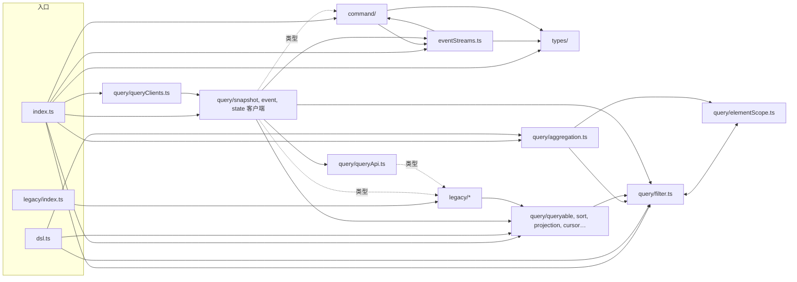

# wow-client 设计

**状态**：2026-09 首发前的架构审查与重构（B0～B7、A1、A3～A6，#3353～#3405；A2 按 Q1 取消）已全部完成。本页由当时的重构方案并入：第 1～6 节写现在的设计，附录保留方案原文（审查发现、目标架构、批次与每批的实施决定、拍板的问题），编号照旧，附录里的「§x」指附录内的节。
**范围**：`typescript/wow-client` 的职责、分层与依赖规则、关键抽象、错误与流、公开面与基线、测试与构建。命令与目录的速查在包的 `AGENTS.md`。

## 1. 它是做什么的，什么必须成立

| 使用者                           | 用什么                                                                                                                       | 必须成立                                                              |
| -------------------------------- | ---------------------------------------------------------------------------------------------------------------------------- | --------------------------------------------------------------------- |
| 生成代码（wow-generator 的产物） | `CommandRequest`、`CommandResultEventStream`、`COMMAND_STREAM_ENDPOINT`、`QueryClientFactory`、`WOW_TYPE_MAPPING` 里的类型名 | 名字和形状在 9.x 内不变；已生成的代码不重新生成也能编译               |
| wow-react                        | 查询客户端、`FilterExpression` 与查询工厂、`QUERY_STREAM_ENDPOINT`、`toWowError`、`/legacy` 的请求形状                       | 查询方法签名稳定；流给出行，服务端报错时以 `WowError` 结束            |
| wow-view-engine                  | 整套 DSL（`filter.*`、`aggregation.*` 含 `having`/`derived`、各枚举、`AGGREGATION_LIMITS`），`QueryApi`                      | DSL 产出的对象与 Wow 线协议逐字段一致；不必加载 HTTP 代码也能构建查询 |
| 应用开发者                       | `CommandClient`、`commandHeaders()`、`waitStrategy()`、`WowError`、各查询客户端及其接口                                      | 发命令、等阶段、读错误各有一条显然的路；面向接口编程可以换测试替身    |
| 连 8.10 服务端的应用             | `/legacy` 的 Condition API                                                                                                   | v10 前继续可用，且不污染根入口                                        |

四条不变量：

1. **线协议是唯一真相源。** 枚举值和校验规则照搬 Kotlin 的 `wow-api`：`test/query/wowConformance.test.ts` 登记每条规则（镜像、由构建器形状满足、或交给服务端，三选一），`typescript/integration-test/test/wow/wowOpenApi.test.ts` 核对 OpenAPI 文档里的枚举值。客户端只校验服务端也会拒绝的东西，报错文字与 Wow 逐字相同。
2. **DSL 与传输分离。** `/dsl` 不加载 fetcher、装饰器、`reflect-metadata`；lint 与构建后的检查各守一道。
3. **错误只有一种形状。** 服务端报的错，应用最终拿到的都是 `WowError`（见 §4）。
4. **9.x 内公开面只增不减。** 名字、签名、线协议三份基线把住（见 §5）。

## 2. 分层

### 2.1 模块

```
src/
  index.ts  dsl.ts  legacy/index.ts   入口：只做转出
  model/        线协议模型：wow-api 的混入（*Capable、TenantId、AggregateId…）与命令结果（CommandStage、CommandResult、WaitSignal）；只有类型和线协议枚举
  error/        ErrorInfo、ErrorCodes、WowError、toWowError、WowHeaders；不引 fetcher，按形状读 fetcher 的错误
  dsl/          查询 DSL，不含 HTTP 代码
    filter/       operator、types、validate、datePattern（由 JVM 语料把关）、scope、builders（按形状表驱动，公开方法各一行委托）
    aggregation/  types、admit（aggregation.query() 的跨部分准入）、sort、builders、having（HavingDsl）、derived（DerivedExpressionDsl）
    field、deletionState、sort、projection、pagination、cursorQuery、queryable、documents、descriptor（能力描述的类型）
  transport/    两个流结果提取器与两个端点预设；唯一引用 fetcher-eventstream 的地方
  client/
    routing.ts    ResourceAttributionPathSpec、UrlPathParams
    command/      CommandClient、CommandHeaders、commandHeaders()、waitStrategy()、命令体类型、CommandResultEventStream
    query/        QueryApi、requests.ts（唯一的 /legacy 兼容缝）、factory.ts（QueryClientFactory）、snapshot/ event/ state/ descriptor/（接口＋客户端＋内部端点路径）
    metadata/     WowMetadata、WowMetadataClient
  legacy/       已弃用的 Condition API，v10 删除
```

### 2.2 依赖规则

```mermaid
graph TD
  entries[入口 index / dsl / legacy] --> client & dsl & error & model & transport
  client --> transport
  client --> dsl
  client --> error
  client --> model
  transport --> error
  transport --> model
  dsl --> model
  model -. 只引类型 .-> error
  legacy --> dsl
  client -. 仅 requests.ts，只引类型 .-> legacy
  transport --> fetcher["fetcher / fetcher-eventstream"]
  client --> decorator["fetcher / fetcher-decorator"]
```

图里没有的边一律禁止。`eslint.config.js` 用 `@typescript-eslint/no-restricted-imports` 按目录各一段规则强制：

- `dsl/`、`model/`、`error/` 不引 `client/`、`transport/`、`legacy/` 或任何 `@ahoo-wang/fetcher*`；`model/` 只能以 `import type` 引 `error/`（命令结果本身就是一个 `ErrorInfo`），`error/` 不引 `model/`，没有环。
- `transport/` 不引 `client/`、`dsl/` 或 fetcher-decorator。
- `client/` 不引 fetcher-eventstream，类型也不引：流给出的是行，客户端层不再提到服务端事件；只有 `client/query/requests.ts` 能以类型引 `legacy/`。
- `legacy/` 只引 `dsl/`；入口只转出，不受限。

`test/layerBoundaries.test.ts` 为每条禁止的边造一个违规并断言规则报错，为允许的边断言不报，最后断言整个 `src/` 零违规。加一条边是设计变更：本节与规则、测试一起改。

## 3. 关键抽象

- **按形状表驱动的构建器。** `filter` 的类型仍由对象字面量推出；每种过滤器形状一个以运算符为参数的构建函数，公开方法各一行委托，JSDoc 留在公开方法上。加一个同形运算符：枚举一项、类型联合一项、一个带 JSDoc 的委托方法。
- **构建器与准入分开。** 每个构建器只查自己那一部分（非有限数值、上下界、空列表…），`aggregation.query()` 查跨部分的规则（别名冲突、引用、分组、深度），报错文字都与 Wow 相同；一致性登记表逐条指向其中之一。
- **`aggregation.having` 与 `aggregation.derived(d => …)`。** 照 Kotlin 的 `HavingDsl`、`DerivedExpressionDsl`；`and`/`or` 收列表。查询 DSL 只有 `filter` 和 `aggregation` 两个入口。
- **端点预设。** `COMMAND_STREAM_ENDPOINT`、`QUERY_STREAM_ENDPOINT` 把 `Accept: text/event-stream` 与结果提取器绑在一起；手写客户端、wow-react 与生成代码都引用它们，传输知识只有一份。
- **兼容缝。** `client/query/requests.ts` 是根入口通往 `/legacy` 的唯一一处；v10 时收窄这个文件、删掉三处 `count()` 的 `Condition` 参数即可，兼容债务台账写明。
- **每个客户端都有接口。** `QueryApi`、`SnapshotQueryApi`、`EventStreamQueryApi`、`LoadStateAggregateApi`、`LoadOwnerStateAggregateApi`、`QueryDescriptorApi` 声明客户端的全部公开方法；`test/client/query/apiInterfaces.test.ts` 用反射比对，客户端多一个接口上没有的方法就失败。
- **`QueryClientFactory`。** 由 `contextAlias`、`resourceAttribution`、`aggregateName` 拼出 `basePath`，只把 `ApiMetadata` 的键交给客户端。空间、租户、owner 在建客户端时给定（Q1 方案 B），查询方法签名是 `(query, attributes?, abort?)`。
- **常量的两种写法。** 线协议的取值集合用 `enum`（与 Kotlin、OpenAPI 检查、生成器产物一致）；名字表用 `as const` 冻结对象（`CommandHeaders`、`WowHeaders`、`ErrorCodes`、两个 `*MetadataFields`）。

## 4. 错误与流

- **非流请求**以 fetcher 的 `ExchangeError` 拒绝（fetcher 的状态校验先于结果提取器执行）；应用调用 `toWowError(error)`，它从响应的副本读 `ErrorInfo` 正文或 `Wow-Error-Code` 头，Wow 没有回答的失败（网络、超时、取消、代理错误页）得到 `undefined`。
- **流**：Wow 中途失败时仍是 HTTP 200，最后发一个以错误码命名、正文为 `ErrorInfo` 的事件。`transport/eventStreams.ts` 的两个提取器把每个事件解成它的 `data`，遇到错误事件以 `WowError` 结束流，`for await` 因此抛出。流的元素就是行（查询）或命令结果（`sendAndWaitStream`，每个阶段一个）；`event`、`id`、`retry` 对 Wow 没有意义，不再提供。
- 两条路在 `toWowError` 汇合：它两种都接，所以应用处理任何服务端错误只需要一次 `await toWowError(error)`。
- **例外**：为 OpenAPI 里任意 `text/event-stream` 端点生成的客户端（wow-generator 的 `emitApiClient`）仍返回 fetcher 的 `JsonServerSentEventStream`。这类端点不走 Wow 的响应约定，分不出哪个事件是行、哪个是错误。

## 5. 公开面与基线

入口只有三个：根（`src/index.ts`）、`/dsl`（`src/dsl.ts`）、`/legacy`（`src/legacy/index.ts`）。重构要证明行为不变，改 API 要让差异逐条可见，靠四份基线：

| 基线       | 文件                                 | 由谁维持                                                                                 |
| ---------- | ------------------------------------ | ---------------------------------------------------------------------------------------- |
| 名字       | `test/surface/{root,dsl,legacy}.txt` | `test/publicSurface.test.ts`；构建后 `scripts/verify-package.mjs` 对 ESM 与 CJS 再核一遍 |
| 签名       | `test/api/{root,dsl,legacy}.api.md`  | `pnpm test:api`（API Extractor，读构建出的声明；入口的顶层声明缺文档注释也失败）         |
| DSL 线协议 | `test/golden/dsl-wire.json`          | `test/dslWire.test.ts`：每个构建器（含嵌套命名空间）都要有用例                           |
| 客户端端点 | `test/golden/client-endpoints.json`  | `test/clients/endpointTable.test.ts`：反射列出每个客户端方法，记下请求、结果与流在哪里停 |

行为不变的批次四份逐字节不变；API 变化的批次在 PR 里列出差异并有意接受（`-u`）。

首发前（9.2.0）按二轮审查 P1-1 与用户决定（2026-09-25）从公开面删掉四个低价值的名字：`LogicalField`（`QueryField` 的弃用别名，根入口与 `/dsl`；兼容台账不再有这一条）、`ReadableDomainEventStream`（就是 `ReadableStream<DomainEventStream>`，`src/` 里无人使用），以及两个流提取器 `QueryEventStreamResultExtractor`、`CommandResultEventStreamResultExtractor`。后两者仍在 `transport/eventStreams.ts` 里实现，但 `transport/index.ts` 不再导出它们，唯一入口是端点预设 `QUERY_STREAM_ENDPOINT`、`COMMAND_STREAM_ENDPOINT`。`ApplyAbacTags`、`AbacTagsApplied` 保留：它们对应 wow-api `me.ahoo.wow.api.abac` 里现行的服务端契约。

## 6. 测试与构建

- **测试**：Vitest，覆盖率门槛 98/97/98/98。除上面的基线外：一致性登记表、JVM 日期模式语料（`test/fixtures/java-date-patterns.json`，由 wow-api 的 Kotlin 测试产出并把守）、JSDoc 示例的类型检查（`test/jsdocExamples.test.ts`）、层边界、`test:type`。
- **构建**：Vite 库模式，`preserveModules` 让每个源文件对应一个产物模块，`sideEffects: false` 因而真正生效。`verify-package.mjs` 用 Vite 的打包器真打一个只导入 `toWowError`、`waitStrategy`、`WowHeaders` 的探针，断言产物不含任何 fetcher 包；对照探针导入 `CommandClient`，必须带上 fetcher-decorator，否则检查本身失效。它还检查三个入口能被 `import`、`require` 解析，`/dsl` 不加载 HTTP 代码，不发布声明映射。
- **包检查**：`node .github/scripts/package-check.mjs`（publint、三种类型解析、在全新项目里 import 与 require）在改了 `package.json`、入口或构建时运行。

## 7. 首发前第二轮审查的决定（2026-09-25）

出自 `typescript/docs/review-2026-09-round2-packages.md`。

### 7.1 列表查询不带 `limit`：遵循 9.1.5（P0-1，用户拍板）

- **决定**：`listQuery()` 不给 `limit` 时就不发送 `limit`，由服务端决定，客户端不补默认值。这是 Wow 9.1.5 的契约：`HttpQueryGuard.applyListDefault`（#3267）把 `limit = 0` 改写成服务端的默认列表大小（`wow.webflux.query.default-list-size`，默认 100）。审查推荐过「客户端补 100」，用户选了遵循 9.1.5：默认值归服务端配置，客户端再补一份就有两个真相源，服务端改了默认值客户端也看不见。
- **代价，写进文档**：Wow 8.11.0～9.1.3（8.11 的 `HttpQueryGuardFilter`，后来的 `HttpQueryGuard.validateResultSize`；没有 9.1.4 这个 tag）拒绝不带 `limit` 的列表与列表流查询，`IllegalArgument: HTTP list query limit[0] must be between 1 and <max>.`：列表是 HTTP 400，列表流先应答 200，再以这个错误事件结束。审查报告以为 8.11 没有这条校验，对已发布的 8.11.5 镜像实测也拒绝（`v8.11.0` 起每个 tag 都有这条校验）。Wow 8.10 只能用 `/legacy`，它默认发送 `limit: 10`。对 8.11～9.1.3 的服务端，应用必须显式传 `limit`。README、`FilterListQuery.limit` 与 `listQuery` 的 JSDoc、兼容性矩阵、快速开始和参考页都这样写。
- **能便宜做的提示**：`WowError` 遇到这条拒绝（`errorCode` 为 `IllegalArgument`，`errorMsg` 匹配 `list query limit[0] must be between`）时，在 `message` 末尾加一句该怎么办；`errorMsg` 保持服务端原话，`errorCode` 不变，所以按错误码分支的代码不受影响。不做版本探测：客户端不知道也不该去问服务端的版本。
- **`/legacy`**：`/legacy` 的 `listQuery` 默认 `limit = 10`，根入口没有这个默认值；迁移指南写明。
- **CI**：`typescript-contract.yml` 的已发布服务端矩阵在 8.11.5、9.1.3 与 9.1.5 上各跑一次运行时冒烟（`typescript/integration-test/test/released/`），按版本断言上面的结果（拒绝并带提示、或成功）；同源作业按当前版本跑同一个文件。

### 7.2 客户端方法自绑定（P1-3）

- **问题**：`useListQuery({ execute: client.listState })` 类型检查通过，运行时报 `Cannot read properties of undefined (reading 'requestExecutors')`。fetcher-decorator 生成的方法经 `this` 读客户端的元数据，方法离开实例就读不到。
- **三条路**：让它能用；让它类型检查不过；给一条看得懂的错误。第二条做不到：类的方法不声明 `this` 参数，赋给 `QueryExecutor` 这样的函数类型总是合法的，给每个方法加 `this` 参数又会改动冻结的签名。第三条只能靠匹配运行时的错误文字，各引擎的措辞不同，也仍然让用户多改一次代码。
- **决定：让它能用。** 六个客户端（`CommandClient`、`SnapshotQueryClient`、`EventStreamQueryClient`、`LoadStateAggregateClient`、`LoadOwnerStateAggregateClient`、`WowMetadataClient`）在构造函数里调用内部的 `client/bindMethods.ts`，把原型链上的每个方法绑定到实例上，作为不可枚举的自有属性。原型不变（端点表、接口比对仍按原型反射），展开与序列化不变，子类的覆盖方法是被绑定的那个，getter 不执行。`QueryClientFactory` 创建的、生成代码用的都是这些类，所以都能直接把方法传出去。
- **把关**：`test/clients/endpointTable.test.ts` 对每个客户端的每个公开方法，把它脱离实例调用一次，请求与结果必须与正常调用相同。

### 7.3 查询能力描述的客户端（N5，2026-09-25）

- **为什么是单独的 `QueryDescriptorClient`，不是快照、事件客户端上的 `describe()`。** schema 路由只有 `{aggregate}/snapshot/schema` 与 `{aggregate}/event/schema`，没有租户、所有者段（`appendTenantPath = false`、`appendOwnerPath = false`）。查询客户端的 `basePath` 常带 `resourceAttribution`（生成代码的购物车是 `owner/{ownerId}/cart`），在它们上面加方法就会请求不存在的路由。所以描述有自己的客户端和接口（`QueryDescriptorApi`，F14 的规则照旧），`QueryClientFactory.createQueryDescriptorClient()` 拼路径时去掉资源归属；`QueryApi` 不变，实现它的测试替身与视图引擎的 `ViewSource` 不受影响。
- **条件请求。** 方法收一个已持有的版本（`sha256:…`）或 ETag（带引号、或弱标签），统一发成服务端逐字比较的强 ETag `"sha256:…"`；304 解析为 `{ notModified: true, version }`，200 解析为 `{ notModified: false, descriptor, version }`。版本来自正文而不是 `ETag` 响应头：跨域时浏览器不向脚本暴露 `ETag`，除非服务端声明 `Access-Control-Expose-Headers`。
- **实现。** 版本到 ETag 的换算要在请求前做，装饰器的参数无法变换，所以公开方法是普通方法，委托给内部的装饰类 `QueryDescriptorEndpoints`（每次调用新建，客户端上没有可枚举的状态）。端点带 `IGNORE_VALIDATE_STATUS` 属性并取回整个交换：304 不再是错误，其他非 2xx 由 `readDescriptor` 抛出 fetcher 本会抛的 `HttpStatusValidationError`，`toWowError` 照常读取。
- **类型的位置。** 描述是线协议类型，引用 `FilterOperator`、`SearchMode` 等 DSL 枚举，而 `model/` 不能引 `dsl/`，所以放在 `dsl/descriptor.ts`，根入口与 `/dsl` 都导出：视图引擎做准入时不必加载 HTTP 代码。
- **开放与封闭。** OpenAPI 里是枚举的（`FilterOperator`、`PagingMode`、`QueryValueKind`、`SearchMode`、`DeletionState`）用 enum；是普通字符串的（模型、值类型、系统字段角色、约束类型、分组、函数、指标）是「已知联合 + `string & {}`」，并给出已知值的冻结对象。Kotlin 的 `@JsonInclude(NON_NULL)` 类把 null 省掉，对应属性是可选的；`LimitsDescriptor` 没有这个注解，发 `null`，类型是 `number | null`。`integration-test` 的 `wowOpenApi.test.ts` 逐类型核对属性集合、开放或封闭、可空属性。
- **不缓存。** 客户端不持有描述；缓存与重新验证的时机归调用方（视图引擎的设计见 `typescript/wow-view-engine/docs/design/capabilities.md`）。

## 附录：2026-09 首发前的架构审查与重构方案

以下是方案原文，只把标题降了一级；「状态」一节换成了这一段。方案写于 `c48625e14`（2026-09-24），行号指当时的文件。第 5 节的表标着每批的 PR 号，§5.1 是每批实施中与方案不同的决定。

### 1. 这个包是做什么的

#### 1.1 谁在用、什么必须成立

| 使用者                           | 用什么                                                                                                                                                                                                                                              | 必须成立                                                              |
| -------------------------------- | --------------------------------------------------------------------------------------------------------------------------------------------------------------------------------------------------------------------------------------------------- | --------------------------------------------------------------------- |
| 生成代码（wow-generator 的产物） | `CommandRequest`、`CommandResult`、`CommandResultEventStream`、`CommandBody`、`QueryClientFactory`、`QueryClientOptions`、`ResourceAttributionPathSpec`，以及 `WOW_TYPE_MAPPING` 里约 30 个类型名（`wow-generator/src/model/wowTypeMapping.ts:37`） | 名字和形状在 9.x 内不变；已生成的代码不重新生成也能编译               |
| wow-react                        | 查询客户端、`FilterExpression` 与查询工厂、`QueryEventStreamResultExtractor`、`toWowError`、`/legacy` 的请求形状                                                                                                                                    | 查询方法签名稳定；流在服务端报错时以 `WowError` 结束                  |
| wow-view-engine                  | 整套 DSL（`filter.*`、`aggregation.*`、各枚举、`AGGREGATION_LIMITS`），`QueryApi`                                                                                                                                                                   | DSL 产出的对象与 Wow 线协议逐字段一致；不必加载 HTTP 代码也能构建查询 |
| 应用开发者                       | `CommandClient`、`commandHeaders()`、`waitStrategy()`、`WowError`                                                                                                                                                                                   | 发命令、等阶段、读错误各有一条显然的路                                |
| 连 8.10 服务端的应用             | `/legacy` 的 Condition API                                                                                                                                                                                                                          | v10 前继续可用，且不污染根入口                                        |

由此推出四条不变量，后文的发现都拿它们衡量：

1. **线协议是唯一真相源。** 枚举值和校验规则都照搬 Kotlin 的 `wow-api`，而且有测试把住：
   `test/query/wowConformance.test.ts` 登记规则，`typescript/integration-test/test/wow/wowOpenApi.test.ts`
   核对 OpenAPI 文档里的枚举值。客户端只校验服务端也会拒绝的东西。
2. **DSL 与传输分离。** `/dsl` 不加载 fetcher、装饰器、`reflect-metadata`。
3. **错误只有一种形状。** 服务端报的错，应用最终拿到的都是 `WowError`。
4. **9.x 内公开面只增不减。** 名字由 `test/surface/*.txt` 把住（D29）。

#### 1.2 现状模块图

约 8,960 行源码（`src/`），其中 `query/filter.ts` 1,895 行、`query/aggregation.ts` 1,107 行、
`legacy/condition.ts` 881 行、`query/snapshot/snapshotQueryClient.ts` 597 行，四个文件占 50%。

| 模块                                                                                                                      | 职责                                                                                                                                           | 行数     | 运行时依赖                 |
| ------------------------------------------------------------------------------------------------------------------------- | ---------------------------------------------------------------------------------------------------------------------------------------------- | -------- | -------------------------- |
| `index.ts` / `dsl.ts` / `legacy/index.ts`                                                                                 | 三个入口                                                                                                                                       | 81       | —                          |
| `types/`                                                                                                                  | 混入接口（`*Capable`、`TenantId`…）、`ErrorInfo`/`ErrorCodes`、`WowError`/`toWowError`、`WowHeaders`、`ResourceAttributionPathSpec`、ABAC 常量 | 约 700   | 无                         |
| `command/`                                                                                                                | `CommandClient`（装饰器类）、命令头常量、`commandHeaders()`/`waitStrategy()`、结果类型、`CommandStage`                                         | 约 800   | fetcher、fetcher-decorator |
| `eventStreams.ts`                                                                                                         | 两个 SSE 结果提取器：遇到错误事件时让流以 `WowError` 结束                                                                                      | 91       | fetcher-eventstream        |
| `query/filter.ts`                                                                                                         | `FilterOperator` 等枚举、15 种过滤器类型、字面量与时区校验、`java.time` 日期模式语法校验、约 50 个 `filter.*` 构建器                           | 1,895    | 无                         |
| `query/aggregation.ts`                                                                                                    | 聚合类型、`having`/`derived` 类型、约 300 行整条查询的准入校验、`aggregation.*` 构建器                                                         | 1,107    | 无                         |
| `query/{sort,projection,pagination,cursorQuery,queryable,deletionState,types,queryField,elementScope,aggregationSort}.ts` | DSL 的其余部分与内部工具                                                                                                                       | 约 600   | 无                         |
| `query/queryApi.ts`、`query/{snapshot,event,state}/`                                                                      | `QueryApi` 接口，四个装饰器客户端及各自的端点路径                                                                                              | 约 1,500 | fetcher-decorator          |
| `query/queryClients.ts`                                                                                                   | `QueryClientFactory`：拼 base path，造四种客户端                                                                                               | 219      | fetcher                    |
| `configuration/`                                                                                                          | `WowMetadata` 类型与 `WowMetadataClient`                                                                                                       | 105      | fetcher-decorator          |
| `legacy/`                                                                                                                 | 已弃用的 Condition API、`Operator`、两个 locale、Condition 版请求形状与请求联合                                                                | 约 1,460 | 无                         |

#### 1.3 现状依赖图



图里有三处不该有的边：`filter.ts ⇄ elementScope.ts` 是运行时循环；`command/ ⇄ eventStreams.ts`
互相引用（前者引用值，后者只引用类型）；根入口的查询层反向依赖已弃用的 `legacy/`。

#### 1.4 数据流

- **命令**：应用拼 `CommandRequest`（`path`、`headers` 由 `commandHeaders()`/`waitStrategy()`
  生成、`body`）→ `CommandClient.send` 的 `@endpoint()` 桩 → fetcher-decorator 按 `ApiMetadata`
  （`fetcher`、`basePath`）发请求 → 非 2xx 时由 fetcher 以 `ExchangeError` 拒绝，应用调用
  `toWowError()`；流式发送走 `CommandResultEventStreamResultExtractor`，遇到错误事件时流以 `WowError`
  结束（`src/eventStreams.ts:40`）。
- **查询**：`filter.*`/`aggregation.*` 生成线协议对象并在构建时校验 → `singleQuery()` 这类工厂补默认值 →
  客户端的 `@post(路径)` 桩用 `@body()` 发出 → JSON 或 SSE 提取器。
- **URL**：`QueryClientFactory` 把 `contextAlias`、`resourceAttribution`、`aggregateName` 拼成
  `basePath`（`src/query/queryClients.ts:52`），端点路径是各目录 `endpointPaths.ts` 里的相对路径。
  tenant、owner 这类路径参数只能在建客户端时由 `ApiMetadata.urlParams` 给出。

#### 1.5 做得好的、应当保留的

- 线协议一致性有两道测试把关：规则登记表，以及对照服务端 OpenAPI 的枚举检查。这是这个包最有价值的资产，重构以它为护栏。
- 公开面快照（D29）加上构建后的 `scripts/verify-package.mjs`，把住了名字和 `/dsl` 的纯净。
- `test/clients/*` 用打桩的 fetch 测每个客户端方法，传输层有刻画测试。
- `test/jsdocExamples.test.ts` 对 JSDoc 示例做类型检查，文档不会悄悄过时。
- 错误模型（`WowError` + `toWowError`）集中在一个文件，流与非流两条路径最终汇合。

### 2. 发现

严重度：**P0** 首发前必须处理（大多是「以后再改就是破坏性变更」的 API 决定，或重构本身的前置安全网）；
**P1** 首发前应做；**P2** 可排到 9.x 的小版本。

#### P0

**F1 · 可测性 · 公开面快照只记名字，不记签名。**
`test/publicSurface.test.ts` 只比较 `kind name`（`test/surface/root.txt`：208 个名字）。改一个参数类型、
一个泛型默认值、一个可选标记，快照都照样通过。本轮要大面积搬家、表驱动改写，而 9.x 冻结的是签名，
不只是名字。没有签名级的基线就开始重构，行为保持无从证明。
→ 批次 B0：先用 `@microsoft/api-extractor` 生成 API 报告（`*.api.md`），作为签名级快照提交。按
「优先用第三方库」，不要自己写 d.ts 比对。

**F2 · 公开 API 形状 · 查询方法第三个位置参数只能放 `abort`，单次调用带不了请求头和路径参数。**
48 个方法签名都是 `(query, attributes?, abort?)`（`grep -c 'attributes?: Record<string, unknown>'`：
snapshot 17、event 9、queryApi 8…）。于是：

- 空间聚合的查询要带 `Wow-Space-Id` 请求头（`wow-openapi/.../AggregateRouteContractSupport.kt:109`），
  tenant/owner 路由要带路径参数，而这些都只能在建客户端时写进 `ApiMetadata`，多租户应用得每个租户建一个客户端
  （见 `test/clients/snapshotQueryClient.test.ts:255`）；
- 不传 attributes 的调用方到处写 `undefined` 占位：`wow-view-engine/src/runtime/execute.ts:115-119`、
  `runtime/fetchRecord.ts:84`、`runtime/valueCandidates.ts:169`。

命令这边没有这个问题：`CommandRequest` 继承 `ParameterRequest`，headers、urlParams、signal 都能按次传。
这个签名一旦发布就冻结在 9.x。→ Q1。

**F3 · 公开 API 形状 · 流的元素是 SSE 信封 `JsonServerSentEvent<T>`，不是行。**
`listStream`、`aggregateStream`、`loadStream`、`sendAndWaitStream` 都返回
`ReadableStream<JsonServerSentEvent<T>>`。信封里的 `event`、`id`、`retry` 对 Wow 没有意义：查询流的
`event` 恒为 `message`（`src/eventStreams.ts:24`），命令流的阶段名 `data.stage` 里已经有了，Wow 也不支持断点续传。
每个使用方都得再拆一次：`wow-react/src/readStreamRows.ts:60` 里的 `rows.push(value.data)`，还有文档里的
`event.data.stage`（`src/command/commandClient.ts:96`）。这是传输细节泄漏进了公开类型，发布后就改不动了。→ Q3。

**F4 · 耦合 · 生成代码在重新编码 wow-client 的传输知识，而且已经走样。**
生成的流式命令客户端自己写 `Accept: text/event-stream`，用的却是
`JsonEventStreamResultExtractor`（`wow-generator/expected/compensation-spec/compensation/execution_failed/commandClient.ts:5`），
不是 `CommandResultEventStreamResultExtractor`，所以服务端在流中途报错时，生成代码把 `ErrorInfo` 当成一行结果读出来，
违反不变量 3。根因是 wow-client 没有给「命令流端点」「查询流端点」提供一个可以直接引用的端点预设，生成器只能照抄。
修法分在两个包：wow-client 导出预设（批次 A4，新增导出，不破坏），生成器改为引用（见 wow-generator 的方案）。
这项必须在首发前做完，否则 9.2.0 生成的代码会带着这个缺陷冻结下来。

#### P1

**F5 · 内聚 · `filter.ts` 一个文件管五件事。**
枚举（`:44-138`）、15 种线协议类型（`:373-656`）、字面量与时区校验（`:186-275`）、约 180 行
`java.time` 模式语法（`:140-183`、`:277-361`），外加一个 1,180 行的对象字面量，装着约 50 个构建器（`:710-1895`）。
构建器里大量同形代码，只有 `op` 不同：

- `eq`/`ne`/`gt`/`gte`/`lt`/`lte`（`:926-1070`）；
- `contains`/`startsWith`/`endsWith`（`:1072-1155`）；
- `isIn`/`notIn`/`containsAll`（`:1157-1234`）；
- 7 个存在性判断（`:1260-1370`）；
- 12 个日历窗口（`today` … `nextYear`，`:1473-1846`，每个约 30 行，其中实现 8 行）。

这就是暂缓的 R1-22「日历构建器改表驱动」，而且不止日历。每加一个运算符要改四处：枚举、类型联合、构建器、
JSDoc。
→ 批次 B1：拆成 `dsl/filter/` 目录；用一个带逐项 JSDoc 的 `FilterBuilders` 接口描述公开形状，实现由表驱动生成。
IDE 提示和 `jsdocExamples` 测试都读接口上的 JSDoc，不受影响。

**F6 · 架构 · `filter.ts ⇄ elementScope.ts` 运行时循环依赖。**
`filter.ts:15` 从 `elementScope.ts` 取 `requireElementScopedFilter`，`elementScope.ts:16` 又从 `filter.ts` 取
`FilterOperator` 的值。现在能跑，只是因为两边都在调用时才取值；换个打包器或者在模块顶层用到，就会读到 `undefined`。
→ B1 里把 `FilterOperator` 等枚举移到 `dsl/filter/operator.ts`，循环自然消失。

**F7 · 耦合 · 根入口的查询层反向依赖 `/legacy`，兼容标记散在 5 个文件、7 处。**
`query/queryApi.ts:14-23,130`、`query/snapshot/snapshotQueryApi.ts:16-21`、
`query/snapshot/snapshotQueryClient.ts:16-24,202`、`query/event/eventStreamQueryClient.ts:17-23,169`
各自从 `../legacy/*` 引入 `Condition` 和 `*QueryRequest`。结果有两个：当前的 API 在类型上依赖已弃用的 API；
到了 v10，删除 `/legacy` 要动 5 个文件，而不是删一个。
→ 批次 B4：新建唯一的兼容缝 `client/query/requests.ts`，在里面定义 `SingleQueryRequest`/`ListQueryRequest`/
`PagedQueryRequest`/`CountRequest` 这几个联合（`/legacy` 继续转出同名类型），客户端和 `QueryApi` 只从这里引。
v10 时只把这个文件收窄成 `Filter*`。

**F8 · 性能/摇树 · 根入口按单文件打包，装饰器调用把所有客户端钉在包里。**
`vite.config.ts` 的 lib 构建给每个入口产出一个扁平文件。今天一份本地构建的 `dist/index.es.js` 里有 5 处顶层的
`L([...], X.prototype, …)` 装饰调用（第 97、175、232、444、659 行），没有 `/*#__PURE__*/` 标记。
打包器没法删掉它们，所以只 `import { toWowError, waitStrategy }` 的应用也会带上全部客户端类、
fetcher-decorator 和 `reflect-metadata`。`sideEffects: false` 只在模块粒度起作用，文件合并之后就失效了。
`/dsl` 绕开了查询构建这一种场景，错误模型和命令头仍然躲不开。
→ 批次 B7：`rollupOptions.output.preserveModules: true`，每个源文件一个产物模块。在
`scripts/verify-package.mjs` 里加一条检查：「只导入 `toWowError` 的包不含 fetcher-decorator」，用 rollup 真打一次。

**F9 · 内聚 · `types/` 是个杂物筐。**
一个目录里有三类东西：纯类型混入（`modeling.ts`、`naming.ts`、`function.ts`、`messaging.ts`、`common.ts`、`abac.ts`），
错误模型的运行时部分（`wowError.ts` 里的 `WowError` 类和 `toWowError`，`error.ts` 里的 `ErrorCodes`），
还有路由（`endpoints.ts` 里的 `ResourceAttributionPathSpec`，只有 `QueryClientFactory` 和生成代码用）。
名字叫 `types` 却放着类和函数，读者找错误模型时想不到来这里。
→ 批次 B6：拆成 `model/`（混入）、`error/`（`ErrorInfo`、`ErrorCodes`、`WowError`、`toWowError`、`WowHeaders`），
`ResourceAttributionPathSpec` 移到 `client/`。只挪文件，公开名不变。

**F10 · 可扩展 · 没有 `having.*` 与 `derived.*` 构建器，使用方只能手搭线协议对象再强转。**
`aggregation.ts:171-235` 只定义了 `DerivedExpression`、`HavingExpression` 这两个类型；`derived()`（`:1005`）
要的是一棵已经搭好的树。view-engine 为此手写了一个 `compileDerived`（`wow-view-engine/src/analysis/compile.ts:315-337`），
`compileHaving` 干脆 `return having as HavingExpression`（`:409`），类型检查在这里断了。构建器能在构建时校验
（比如 `IN` 的值非空、`BETWEEN` 上下界有序），比等到 `aggregation.query()` 统一准入时才报错更早、定位也更准。
→ 批次 A1（只新增导出）；命名见 Q4。

**F11 · 可测性/正确性 · `datePattern` 校验手写了半个 `DateTimeFormatter`，却没有和 JVM 对照过（R1-19）。**
`filter.ts:145-183` 的字母计数表加上 `:277-361` 的扫描器，是 `java.time` 模式语法的近似实现。现有测试都是手挑的样例
（`test/query/filter.test.ts:455-515,807-844`）。近似实现会从两头出错：错杀合法模式，用户就没有绕路可走；
放过非法模式，也只是回到服务端报 400，这倒还好。前一种更糟，因为客户端的校验就是为了比服务端更早、更准地报错。
→ 批次 B3：在 Kotlin 侧加一个测试，用 `DateTimeFormatter.ofPattern` 对一组语料（每个字母取 1～N 个重复，
加上 `p`、引号、可选段、保留字符）判定能否接受，产出 `test/fixtures/java-date-patterns.json` 提交进仓库；
TS 测试逐条对照这份文件。以后 JVM 的语法有变化，只要重新生成一次语料。区域时区 ID 仍交给服务端校验，并登记进一致性登记表。

**F12 · 公开 API 形状 · 常量有四种写法。**
`enum`（`CommandStage`、`FilterOperator`、`ResourceAttributionPathSpec`），`Object.freeze({…} as const)`
（`CommandHeaders`、`WowHeaders`、`ErrorCodes`、`AGGREGATION_LIMITS`），带 `static readonly` 的类
（`SnapshotMetadataFields` `query/snapshot/snapshot.ts:93`、`DomainEventStreamMetadataFields`
`query/event/domainEventStream.ts:131`），还有 legacy 的 `ConditionOptionKey`。静态类不能摇树，能被 `new`，
`keyof typeof` 也拿不到字段名的联合。
→ 规则：**线协议的取值集合用 `enum`**（与 Kotlin、OpenAPI 检查、生成器产物一致，不动）；**名字表用
`as const` 冻结对象**。两个 `*MetadataFields` 类改成冻结对象（批次 B6）。`X.FIELD` 这种用法不受影响，
只是不能再 `new`、`instanceof`，列进公开面变化。

**F13 · 重复 · `QueryClientFactory` 的四个工厂方法一字不差，还把工厂专用的键漏进了 `ApiMetadata`。**
`query/queryClients.ts:104-219`，四个方法都是 `createQueryApiMetadata({...defaults, ...options, basePath: …})`。
`basePath: options?.basePath ?? this.defaultOptions.basePath` 与前面的展开重复。`createQueryApiMetadata`（`:52`）
原样返回 `{...options}`，于是 `contextAlias`、`aggregateName`、`resourceAttribution` 都进了客户端的 `apiMetadata`。
还有两处：给了 `basePath` 就悄悄忽略 `contextAlias`；泛型 `DomainEventBody = any`（`:66`）。
→ 批次 B5：一个私有方法 `metadata(options)` 拆出工厂专用键，只把 `ApiMetadata` 的键传给客户端；
`DomainEventBody` 的默认值改为 `unknown`，见第 4 节。

#### P2

**F14 · 可测性 · 接口与类不一致。** `SnapshotQueryApi` 没有 `getById`、`getStateById`、`getByIds`、`getStateByIds`
（它们只在类里，`snapshotQueryClient.ts:492-597`）；两个 load-state 客户端连接口都没有。依赖接口编程、
拿假对象替身的使用方用不到这几个方法。→ A5：补进接口，新增 `LoadStateAggregateApi`、`LoadOwnerStateAggregateApi`。

**F15 · 死代码/可读性。**

- `getById` 这类不是端点的方法，参数上也挂着 `@attribute()`（`snapshotQueryClient.ts:494,519,551,587`），没有作用，
  读者会误以为它们走装饰器。
- `SNAPSHOT_RESOURCE_NAME`、`EVENT_STREAM_RESOURCE_NAME`（`endpointPaths.ts:17`）没有人用。
- `DEFAULT_PROJECTION` 和 `defaultProjection()` 功能重复，也和 `projection()` 重复（`query/projection.ts`），
  仓内没有任何使用方。
- `types/modeling.ts:14` 写的是 `from './naming.ts'`，别处都是 `.js`。
- `WowError` 里的 `Object.setPrototypeOf`（`types/wowError.ts:63`）在 ES2020 目标下是多余的。

**F16 · 命名。** 混入接口的命名有两套：`TenantId`、`OwnerId`、`CommandId`、`RequestId` 是 `{ tenantId: string }`
这种形状，读起来却像值类型；`AggregateId` 是个复合结构，而装着它的叫 `AggregateIdCapable`。这些名字照搬 Kotlin
`wow-api`，生成器也按名字映射，所以**不改**，只在 `model/` 的模块注释里说明这条规则。`QueryApi` 的参数名
`singleQuery`、`listQuery` 遮蔽了同名工厂函数（`query/queryApi.ts`），改成 `query`，只是参数名，不算 API 变化。

**F17 · 类型精度。** 公开类型里有 `any`：`DynamicDocument = Record<string, any>`（`query/types.ts:14`），
`CommandResultCapable.result: Record<string, any>`（`command/types.ts:101`），`DomainEventStream<DomainEventBody = any>`、
`StateEvent<…= any, S = any>`、`EventStreamQueryApi`、`EventStreamQueryClient`，以及
`QueryEventStreamResultExtractor` 的 `JsonServerSentEvent<any>`（`eventStreams.ts:71`）。ESLint 对 `no-explicit-any`
只给警告。`aggregate<Row>` 的行类型由调用方自己断言，和查询里的别名没有关联；从 `aggregation.query()` 推出行类型是个增强，不阻塞首发。

**F18 · 错误模型的两种到达方式。** 非流请求以 fetcher 的 `ExchangeError` 拒绝，要 `await toWowError()` 才能拿到
`WowError`；流直接以 `WowError` 结束。`toWowError` 两种都接，所以不变量 3 在「经过 `toWowError` 之后」成立。
这是 fetcher 的状态校验先于结果提取器执行造成的，包的 `AGENTS.md`「Errors」一节已经说明，**保持不动**。只在 `error/`
的模块注释里写清这条汇合规则。

**F19 · 同名不同义。** `/legacy` 的 `singleQuery`、`listQuery`、`pagedQuery` 与根入口同名，产出的却是 Condition 查询；
legacy 的 `listQuery` 默认 `limit = 10`，根入口的默认不传。兼容债务台账已经记录，v10 随 `/legacy` 一起删除，这一轮不动。

#### 考虑过、决定不做的

- **用继承合并 `SnapshotQueryClient` 和 `EventStreamQueryClient`。** 两者有 8 个同形的端点桩，但路径前缀不同，
  事件的 `LOAD` 路径（`{id}/event/{h}/{t}`）也不在 `event/` 前缀下。每个桩 12 行，都是声明式代码，
  合并以后两种资源会耦合到一个基类上，得不偿失。重复由 `QueryApi` 接口约束。
- **把 fetcher-decorator 从公开类型里抽象掉。** 生成代码本身就是装饰器类，依赖方向 Wow → fetcher 是既定架构
  （`typescript/AGENTS.md`「Dependency Direction」）。
- **给 `pagedQuery`/`listQuery` 加分页校验。** Kotlin 的 `Pagination`、`ListQuery` 没有这类规则，不变量 1 说只校验服务端也会拒绝的东西。

### 3. 目标架构

#### 3.1 模块边界

```
src/
  index.ts  dsl.ts  legacy/index.ts        入口：只做转出
  model/          纯类型混入（原 types/ 的 modeling、naming、function、messaging、common、abac、bi）
  error/          ErrorInfo、ErrorCodes、WowError、toWowError、WowHeaders
  dsl/            不依赖任何 HTTP 代码
    field.ts              queryField（内部）
    filter/
      operator.ts         FilterOperator、StringComparison、SearchMode、TimeUnit
      types.ts            15 种过滤器类型、FilterExpression、ElementFilterExpression
      validate.ts         字面量、非空、时区、天数（内部）
      datePattern.ts      java.time 模式语法（内部，由 JVM 语料把关）
      scope.ts            requireElementScopedFilter（内部，原 elementScope.ts）
      builders.ts         FilterBuilders 接口（逐项 JSDoc）＋表驱动实现，导出 filter
      index.ts
    aggregation/
      types.ts            分组、指标、表达式、Derived/Having 类型、AGGREGATION_LIMITS
      admit.ts            aggregation.query() 的准入规则（内部）
      sort.ts             effectiveSort（内部）
      builders.ts         aggregation.*（含 A1 的 having/derived）
      index.ts
    sort.ts  projection.ts  pagination.ts  cursorQuery.ts  queryable.ts  deletionState.ts  documents.ts
  transport/      结果提取器、端点预设（A4），唯一引用 fetcher-eventstream 的地方
    eventStreams.ts
    endpoints.ts          COMMAND_STREAM_ENDPOINT、QUERY_STREAM_ENDPOINT
  client/
    routing.ts            ResourceAttributionPathSpec、UrlPathParams
    command/              CommandClient、CommandHeaders、commandHeaders()、waitStrategy()、结果与阶段类型
    query/
      queryApi.ts
      requests.ts         唯一的 /legacy 兼容缝（F7）
      snapshot/  event/  state/   客户端＋内部端点路径
      factory.ts          QueryClientFactory
    metadata/             WowMetadata、WowMetadataClient
  legacy/         不动，v10 删除
```

#### 3.2 依赖规则（用 ESLint 核心规则 `no-restricted-imports` 按目录强制，不新增依赖）

```mermaid
graph TD
  entries[入口 index / dsl / legacy] --> client & dsl & error & model & transport
  client --> transport
  client --> dsl
  client --> error
  client --> model
  transport --> error
  transport --> model
  dsl --> model
  model -. 只引类型 .-> error
  legacy --> dsl
  client -. 仅 requests.ts，只引类型 .-> legacy
  transport --> fetcher["fetcher / fetcher-eventstream"]
  client --> decorator["fetcher / fetcher-decorator"]
```

图中没有画出的边一律禁止，具体规则如下：

- `dsl/`、`model/`、`error/` 不得引用 `client/`、`transport/` 或任何 `@ahoo-wang/fetcher*`；`model/` 只能以 `import type` 引用 `error/`（B6）。这样 `/dsl` 的纯净在
  lint 阶段就挡住了，不必等构建后的 `verify-package.mjs`（后者保留，作为第二道）。
- 只有 `client/query/requests.ts` 可以引用 `legacy/`。
- 只有 `transport/` 可以在运行时引用 `@ahoo-wang/fetcher-eventstream`（其他目录只能 `import type`，Q3 通过后连类型也不需要）。

#### 3.3 关键抽象

- **`FilterBuilders` 接口**：`filter` 的公开形状和文档都在接口上，实现由一张 `op → 形状` 表生成。加一个运算符，
  只需改枚举、类型和表里的一行。
- **端点预设**（A4）：`COMMAND_STREAM_ENDPOINT = { headers: { Accept: TEXT_EVENT_STREAM }, resultExtractor: CommandResultEventStreamResultExtractor }`，
  `QUERY_STREAM_ENDPOINT` 同理。手写客户端和生成代码都引用它们，传输知识只留一份。
- **`client/query/requests.ts`**：Condition 兼容只留这一处缝。
- **准入（`dsl/aggregation/admit.ts`）**：与构建器分开。构建器只管自己那一部分，准入管跨部分的规则，一致性登记表逐条指向这里。

#### 3.4 删除什么

`SNAPSHOT_RESOURCE_NAME`、`EVENT_STREAM_RESOURCE_NAME`；非端点方法上的 `@attribute()`；`Object.setPrototypeOf`；
按 Q2 决定删 `DEFAULT_PROJECTION` 和 `defaultProjection`。

### 4. 公开 API 影响

| 变化                                                                             | 性质                                                           | 何时                             | 影响面                                                                |
| -------------------------------------------------------------------------------- | -------------------------------------------------------------- | -------------------------------- | --------------------------------------------------------------------- |
| 目录搬家（B1、B2、B4、B5、B6）                                                   | 名字不变；B0 的 API 报告证明签名也不变                         | 首发前                           | 无                                                                    |
| `preserveModules`（B7）                                                          | 产物文件布局变化，`exports` 不变                               | 首发前                           | 无；`package-check.mjs` 会验证                                        |
| `SnapshotMetadataFields`、`DomainEventStreamMetadataFields` 由类改为冻结对象     | 破坏：不能再 `new`、`instanceof`                               | 首发前                           | 仓内零处受影响；`X.FIELD` 照常可用                                    |
| `DomainEventBody`、`S` 等泛型默认值 `any` → `unknown`                            | 破坏：没写泛型参数的代码读 `body` 时要先收窄                   | 首发前                           | 生成代码总是显式给出泛型参数；仓内 `StateEvent` 有 1 处使用，需要核对 |
| A1：`having.*`/`derived.*` 构建器                                                | 新增                                                           | 首发前（view-engine 能删掉强转） | 无                                                                    |
| A4：`COMMAND_STREAM_ENDPOINT`、`QUERY_STREAM_ENDPOINT`                           | 新增                                                           | 首发前（生成器修复依赖它）       | 无                                                                    |
| A5：`SnapshotQueryApi` 补上 `getById` 等方法，新增两个 load-state 的 `*Api` 接口 | 新增；给接口加方法，对自行实现 `SnapshotQueryApi` 的代码是破坏 | 首发前                           | 仓内没有自行实现它的代码                                              |
| Q1：查询方法第三个参数由 `abort` 改成 `init`                                     | 破坏                                                           | 按 Q1 定                         | wow-react、view-engine、storybook、integration-test、文档             |
| Q3：流的元素由信封改成行                                                         | 破坏                                                           | 按 Q3 定                         | wow-react 的 `readStreamRows`、生成器、文档、集成测试                 |
| Q2：删除 `DEFAULT_PROJECTION`、`defaultProjection`                               | 破坏                                                           | 按 Q2 定                         | 仓内零处受影响                                                        |

**建议**：凡是破坏性的都在首发前做完。9.2.0 是这三个包在 npm 上的第一个版本，现在还没有任何外部使用者；
等 9.2.0 发出去，同样的改动就得等到 10.0。fetcher-wow 5.x 的老用户反正要换包名，迁移指南
（`documentation/docs/*/guide/typescript/migration.md`）顺带写上这几条即可。

### 5. 重构批次

原则：每批一个 PR，单独合并也能保持全部门禁通过；B 系列不改行为，A 系列是 API 变化，要等对应的问题拍板；
每批先补安全网，再动代码。行数以外的对照物：API 报告（B0）、线协议金样（B0）、一致性登记表、
客户端打桩测试、integration-test（同源契约与 8.x 矩阵）。

| 批           | 内容                                                                                                                                                                                                                                                        | 安全网（先补）                                                                                                                  | 人日      | 依赖                                                                       |
| ------------ | ----------------------------------------------------------------------------------------------------------------------------------------------------------------------------------------------------------------------------------------------------------- | ------------------------------------------------------------------------------------------------------------------------------- | --------- | -------------------------------------------------------------------------- |
| **B0** #3353 | 签名级 API 报告（api-extractor，三个入口，进 `pnpm test`）；线协议金样：`filter.*`、`aggregation.*` 的每个构建器用固定输入跑一遍，输出存成 `test/golden/dsl-wire.json`；客户端端点表：用反射枚举每个客户端原型上的方法，逐个断言方法、URL、头和体，防止漏测 | —（本批就是安全网）                                                                                                             | 1.5       | 无                                                                         |
| **B1** #3362 | `dsl/filter/` 拆分：operator、types、validate、datePattern、scope、builders；按运算符表驱动实现（R1-22；不引入 `FilterBuilders` 接口，见 5.1）；消除 F6 的循环依赖                                                                                          | B0 的 API 报告与金样；现有 `filter.test.ts`、`wowConformance.test.ts`、`jsdocExamples.test.ts`                                  | 2.5       | B0                                                                         |
| **B2** #3366 | `dsl/aggregation/` 拆分：types、admit、sort、builders                                                                                                                                                                                                       | 同上，加上 `aggregation.test.ts`                                                                                                | 1.5       | B0；可与 B1 并行（两者都会动 `elementScope` 的引用，后合的那个改一行即可） |
| **B3** #3386 | R1-19：Kotlin 测试产出 JVM 日期模式语料，TS 逐条对照；把 `datePattern.ts` 修到与语料一致（这是**有意的行为修正**，错杀的模式改为放行，PR 里逐条列出）                                                                                                       | 新增的 JVM 语料测试（先提交语料，并把当前 TS 与语料不一致的条目标成已知差异）                                                   | 1.5       | B1                                                                         |
| **B4** #3373 | `client/query/requests.ts` 兼容缝；5 个文件改为只从这里引用；更新 `docs/compat-debt.md` 里的标记路径                                                                                                                                                        | API 报告（`*QueryRequest` 的展开形状不变）；compat 台账检查                                                                     | 0.5       | B0                                                                         |
| **B5** #3380 | `transport/` 与 `client/` 搬家；`QueryClientFactory` 去重，不再把工厂专用键漏给客户端；删掉无效的 `@attribute()` 和未用的常量                                                                                                                               | `queryClients.test.ts`、`queryClientFactory.test.ts`；B0 的端点表；新增一条「客户端 `apiMetadata` 只含 ApiMetadata 的键」的测试 | 1         | B0                                                                         |
| **B6** #3393 | `model/`、`error/` 拆分；两个 `*MetadataFields` 改为冻结对象；泛型默认值 `any` → `unknown`；加上 3.2 节的 `no-restricted-imports` 规则                                                                                                                      | API 报告（这一批的破坏性变化在报告差异里逐条可见）；`publicSurface` 快照                                                        | 1         | B4、B5                                                                     |
| **B7** #3401 | `preserveModules`；`verify-package.mjs` 增加摇树检查（用 rollup 打一个只导入 `toWowError` 的入口，断言产物不含 fetcher-decorator）                                                                                                                          | `package-check.mjs`（publint、attw、在全新项目里 import 和 require）                                                            | 1         | B6                                                                         |
| **A1** #3395 | `having.*`/`derived.*` 构建器（命名按 Q4）；在一致性登记表里登记对应规则；view-engine 另开 PR 改用它们，删掉 `compile.ts:409` 的强转                                                                                                                        | 金样加上新构建器；view-engine 的 `analysis/compile` 测试                                                                        | 1.5 + 0.5 | B2                                                                         |
| **A4** #3357 | 端点预设；`CommandClient` 与各查询客户端改为引用预设；通知生成器方案改用它                                                                                                                                                                                  | 客户端打桩测试（流式错误事件用例已有，见 `test/eventStreams.test.ts`）                                                          | 0.5       | B5                                                                         |
| **A5** #3398 | 接口补齐（F14）                                                                                                                                                                                                                                             | 类型测试（`test:type`）                                                                                                         | 0.5       | B5                                                                         |
| ~~**A2**~~   | 取消（Q1 定为方案 B）：查询方法签名保持现状，空间、租户在客户端层确定                                                                                                                                                                                       | —                                                                                                                               | 0         | —                                                                          |
| **A3** #3405 | Q3：流的元素改为行（`ReadableStream<T>`），同步 wow-react、生成器和文档                                                                                                                                                                                     | `eventStreams.test.ts`；integration-test 的流用例                                                                               | 1 + 1     | A4；Q3；与生成器方案同步合并                                               |
| **A6** #3399 | Q2：删除重复的导出                                                                                                                                                                                                                                          | `publicSurface` 快照                                                                                                            | 0.25      | Q2                                                                         |

合计：B 系列约 10.5 人日；A 系列约 9.75 人日（含下游包的配合修改）。顺序：B0 → (B1 ∥ B2 ∥ B4 ∥ B5) → B3、B6 → B7；
A4 越早越好（生成器等它）；A3 排在 B5 之后（A2 已取消）。按 `cpu-load-pacing` 的约束，同一时间最多 2 路重活。

每个 PR 的门禁：`pnpm --filter @ahoo-wang/wow-client lint`、`test`（含 `test:type`）、`build`（含
`verify-package.mjs`），改了 `package.json`、入口或构建的，再加 `node .github/scripts/package-check.mjs`；
动到下游的，跑下游包各自的门禁；`typescript-gate` 与 `typescript-contract-gate` 全绿。

#### 5.1 实施中的决定

B 系列不改行为，判据是 B0 的三份基线（API 报告、DSL 线协议金样、客户端端点表）逐字节不变。实施中与上文方案不同的地方记在这里。

**B1**（#3362）

- **不引入 `FilterBuilders` 接口。** `filter` 的类型仍由对象字面量推出，报告里仍是 `export const filter: { … }`。
  无论接口导不导出，报告都会变成 `filter: FilterBuilders`；若由表生成对象，还要一次类型断言，而且方法签名
  `eq<FIELDS>(…)` 会变成属性签名 `eq: <FIELDS>(…) => …`。这两种都破坏「基线逐字节不变」。表驱动落在实现上：
  每种过滤器形状一个以运算符为参数的构建函数（`equality`、`comparison`、`stringMatch`、`collection`、`presence`、
  `calendar`、`dayWindow`、`metadataValue(s)`、`logical`），公开方法各自一行委托，JSDoc 仍在公开方法上。
  加一个同形运算符：枚举一项、类型联合一项、一个带 JSDoc 的委托方法。
- **API 报告不再写入 `ae-forgotten-export` 警告。** 那些注释带着声明所在的文件和行号，搬文件就变，而搬文件不是
  API 变化。未导出类型的形状仍由 `includeForgottenExports` 写出（不带 `export`），签名一个不少。这一改动是本 PR
  的第一个提交，单独更新报告（只删注释行）；之后的提交报告逐字节不变。
- **`queryField.ts`、`deletionState.ts` 提前搬进 `dsl/`**（`dsl/field.ts`、`dsl/deletionState.ts`）：它们是
  `dsl/filter/` 仅有的外部依赖，搬完后 `dsl/filter/` 只依赖 `dsl/`。其余 DSL 文件（sort、projection、pagination、
  cursorQuery、queryable、types）随 B2 一起搬。
- F6 的循环随拆分消失：`scope.ts` 从 `operator.ts` 取 `FilterOperator`，`builders.ts` 从 `scope.ts` 取检查函数，
  `dsl/filter/` 内部没有环。

**B2**（#3366）

- **`dsl/aggregation/` 四个文件**：`types.ts`（枚举、线协议类型、选项类型、`AGGREGATION_LIMITS`）、`admit.ts`（内部，
  `admitAggregationQuery`：跨部分的准入规则）、`sort.ts`（内部，`effectiveSort`，原 `query/aggregationSort.ts`）、
  `builders.ts`（`aggregation.*`）。`aggregation.query()` 仍是公开方法，JSDoc 留在它上面，方法体只剩一行委托给
  `admitAggregationQuery`，所以报告里 `aggregation` 的推断类型不变。依赖只朝一个方向：`builders → admit → sort → types`。
- **构建器不表驱动。** 聚合构建器里同形的只有 `add`/`subtract`/`multiply`/`divide` 与六个数值指标，已经各是一行委托
  （`binary`、`numeric`）；分组和其余指标的参数、校验各不相同，没有可以再收的表。
- **其余 DSL 文件随本批搬进 `dsl/`**：`sort`、`projection`、`pagination`、`cursorQuery`、`queryable`，以及
  `query/types.ts` 改名为 `dsl/documents.ts`（3.1 节的目标名）。`query/index.ts` 只剩客户端，外加一组给根入口的 DSL 转出。
  对应的测试搬到 `test/dsl/`；`wowConformance.test.ts` 留在 `test/query/`（它登记的是整个查询协议，文档和 `AGENTS.md` 都按这个路径引用）。
- 行为不变：三份 API 报告、DSL 线协议金样、客户端端点表逐字节不变，`test/surface/*.txt` 不变。

**B4**（#3373）

- **`src/client/query/requests.ts` 是根入口通往 `/legacy` 的唯一一处引用。** 三个 `*QueryRequest` 联合的定义（连同
  JSDoc 与 `@deprecated`）从 `legacy/queryable.ts` 原样搬进来；`legacy/index.ts` 从这里
  `export type` 转出同名类型，所以 `/legacy` 的公开面不变。`legacy/queryable.ts` 不引用 `client/`，
  3.2 节「只有 `requests.ts` 可以引用 `legacy/`」在 `src/` 里已经成立（入口转出不算）。
- **不引入 `CountRequest`。** 方案里设想 `count(filter: CountRequest<FIELDS>)`，但类型别名的名字会原样出现在 API 报告的签名里
  （还会多出一段未导出类型的声明），破坏「基线逐字节不变」。改为由 `requests.ts` 转出 `Condition` 类型，三处 `count()`
  从这里取，签名仍是 `FilterExpression<FIELDS> | Condition<FIELDS>`。代价是 v10 时除了收窄 `requests.ts`，还要改这三处
  `count()` 参数；它们各自保留 `compat(wow<9)` 标记，删掉转出后编译器会逐个指出，台账的「Removal in v10」已写明。
- `snapshotQueryApi.ts` 只用联合、不再有兼容标记，台账里它的位置换成 `requests.ts`；`queryApi.ts`、
  `snapshotQueryClient.ts`、`eventStreamQueryClient.ts` 因 `count()` 仍在台账里。方案写的「5 个文件」实际是 4 个
  （`eventStreamQueryApi.ts` 本来就不引用 `/legacy`）。
- 行为不变：三份 API 报告、DSL 线协议金样、客户端端点表逐字节不变，`test/surface/*.txt` 不变。

**B5**（#3380）

- **`transport/` 两个文件**：`eventStreams.ts` 放两个结果提取器，`endpoints.ts` 放两个端点预设（A4）。`client/` 下是
  `command/`、`metadata/`（原 `configuration/`）、`query/`（`queryApi.ts`、`requests.ts`、`factory.ts`（原
  `query/queryClients.ts`）和 `snapshot/`、`event/`、`state/`），以及 `routing.ts`。
- **`routing.ts` 提前在本批搬**（原 `types/endpoints.ts`：`ResourceAttributionPathSpec`、`UrlPathParams`）。F9 把它排在 B6，
  但它只有 `client/` 用（工厂和 `CommandRequest`），跟着客户端一起搬，B6 就只剩 `model/` 与 `error/`。
- **不设 `client/index.ts`。** 根入口直接列出 `client/*`、`transport/` 与 DSL 各模块；原来 `query/index.ts` 里那段给根入口的
  DSL 转出挪回 `index.ts`，`client/query/index.ts` 只剩客户端。
- **留给 B6 的一条反向边**：`transport/eventStreams.ts` 仍从 `client/command/` 取 `CommandStage`（值）和 `CommandResult`（类型），
  这是 3.2 节不允许的 `transport → client`。这两个是线协议模型，B6 建 `model/` 时把它们（连同 `command/types.ts`、
  `commandResult.ts` 里同类的定义）挪过去，`no-restricted-imports` 才能按 3.2 节原样落地。本批没有运行时环：
  `client/command/types.ts` 不引用 `transport/`。
- **F13**：四个工厂方法各一行，`new XxxClient(queryApiMetadata(this.defaultOptions, options))`。`queryApiMetadata` 是模块内函数
  而不是私有方法，声明文件里连 `private` 成员都不多一行。它用剩余解构去掉 `contextAlias`、`resourceAttribution`、
  `aggregateName`，其余键原样交给客户端；`basePath` 的优先级不变（调用时的 `basePath` → 工厂的 `basePath` → 由三个键拼出）。
  「给了 `basePath` 就不看 `contextAlias`」写进 `QueryClientOptions` 的 JSDoc；报告不含注释正文，所以不变。
  这是运行时可见的变化：客户端的 `apiMetadata` 不再带这三个键。仓内没有读它们的地方（`grep apiMetadata`），fetcher-decorator
  也不读未知键。新测试逐个工厂方法断言 `apiMetadata` 的键只有 `ApiMetadata` 的键。
- **`DomainEventBody = any` 留到 B6**，与其余 `any → unknown` 一起改，报告差异集中在那一批。
- **删除**：`getById`、`getStateById`、`getByIds`、`getStateByIds` 参数上的 `@attribute()`（fetcher-decorator 的 `@api` 只给带端点
  元数据的方法生成实现，参数装饰器在这几个方法上只写元数据、没人读）；未用的 `SNAPSHOT_RESOURCE_NAME`、
  `EVENT_STREAM_RESOURCE_NAME`（内部文件，不在公开面）。`Object.setPrototypeOf` 随 `error/` 在 B6 处理。
- 测试随源码搬：`test/client/command/`、`test/client/query/`（`factory.test.ts` 合并了原 `queryClients.test.ts` 与
  `queryClientFactory.test.ts`）、`test/transport/`。`test/clients/`（打桩 fetch 的逐客户端用例与端点表）不动。
- 行为不变：三份 API 报告、DSL 线协议金样、客户端端点表逐字节不变，`test/surface/*.txt` 不变。F13 没有改变报告
  （`QueryClientOptions` 的形状没动）。

**B3**（#3386）

- **语料由 wow-api 的 Kotlin 测试产出并把守。** `DatePatternCorpusTest` 把约 3,700 个模式逐个交给
  `TodayFilter(datePattern = …)`（服务端接收 `datePattern` 的入口：先查空白，再 `DateTimeFormatter.ofPattern`），
  结果写进 `test/fixtures/java-date-patterns.json`，每行一个 `[模式, 是否接受]`，非 ASCII 字符转义，看不见的字符在 diff 里也看得见。
  更新用已有的 `-Dwow.snapshot.update=true` 开关（与 OpenAPI 快照同一个）；不带开关时，文件与 JVM 的结论不一致就失败，
  所以这份语料始终是 JVM 的回答。JDK 版本取 Gradle 工具链（17），写进文件头。
- **语料的构成**：每个 ASCII 字母重复 1～20 次；`p`、`pp` 加每个字母；对 JVM 接受的每个字母串做相邻数值解析的探针
  （填充后接字段、字段后接填充、夹在两个字段中间）；引号、可选段、保留字符、全部可打印的非字母；以及 Kotlin `isBlank`
  或 JS `trim` 视为空白的每个字符。相邻数值解析的规则按 JDK 源码核对过：`padNext` 与 `[` 都会清掉活动的数值解析器，
  所以「填充的数值字段后面紧跟数值字段」就是全部规则，TS 的扫描器不必模拟构建器的状态机。
- **有意的行为修正只有一处：空白判定。** 十条不一致全出在这里：`String.trim()` 去掉 U+FEFF（Kotlin 当它是字面量），
  却保留 U+001C～U+001F（Kotlin 当它是空白）。改为照 Kotlin 的 `Char.isWhitespace()`：Unicode Zs/Zl/Zp 加
  U+0009～U+000D、U+001C～U+001F。字母、次数、引号、可选段、填充相邻这些语法原本就与 JVM 一致，扫描器只删了一个永远到不了的
  `letter === 'p'` 条件。`zoneId` 仍用 `trim()`：两边判定不同的输入，Kotlin 会在 `ZoneId.of` 拒绝，结果一样，只是报错文字不同。
- **先登记、后修正**：第一个提交把十条不一致列为已知差异，第二个提交修正并删掉这张表。语料测试单独就覆盖了
  `datePattern.ts` 的全部分支（原先没覆盖到的是 `c` 计数为 1 的数值分支）。
- 一致性登记表新增两条：`Unknown pattern letter: $cur`（镜像，代表整套 `parsePattern` 语法，由语料逐条把关）、
  `Unknown time-zone ID: $zoneId`（交给服务端：区域时区 ID 取决于服务端 JVM 的 tz 数据库）。
- 公开面与签名不变：三份 API 报告、DSL 线协议金样、客户端端点表逐字节不变，`test/surface/*.txt` 不变。

**B6**（#3393）

- **`model/` 是线协议模型**：原 `types/` 的七个混入文件（`abac`、`bi`、`common`、`function`、`messaging`、`modeling`、`naming`），
  加上新的 `model/command.ts`：`CommandStage`、`CommandResult`、`WaitSignal`、`CommandResultArray` 以及它们继承的混入
  （`CommandId`、`WaitCommandIdCapable`、`RequestId`、`CommandStageCapable`、`CommandResultCapable`、`SignalTimeCapable`、
  `NullableAggregateVersionCapable`）。B5 留下的反向边 `transport/eventStreams.ts → client/command/` 随之消失，
  `transport/` 只引 `error/` 与 `model/`。`model/index.ts` 的模块注释写明 F16 的命名规则。
- **留在 `client/command/` 的**：`CommandBody`、`DeleteAggregate(Command)`、`RecoverAggregate(Command)`、`ApplyResourceTags(Command)`、
  `CompensationTarget`（用到 fetcher 的 `RemoveReadonlyFields`、`PartialBy`，搬进 `model/` 就违反 3.2 节），`BatchResult`，
  以及 `CommandResultEventStream`（它是 `JsonServerSentEvent` 的流，Q3 之前属于传输形状）。
- **3.2 节加一条边：`model/` 可以 `import type` 引用 `error/`。** `CommandResult`、`WaitSignal` 继承 `ErrorInfo`，这是线协议本身的形状。
  另一种做法是把 `ErrorInfo` 放进 `model/`，但 `ErrorInfo` 与 `ErrorCodes`、`WowError` 是同一件事，F9 把它们一起归到 `error/`；
  只引类型不产生运行时依赖，`error/` 也不引 `model/`，没有环。
- **`error/` 的文件**：`errorInfo.ts`（原 `types/error.ts`，避免 `error/error.ts`）、`wowError.ts`、`headers.ts`。模块注释写明 F18 的汇合规则。
- **删除 `Object.setPrototypeOf`**：构建目标 ES2020，原生 `class … extends Error` 自己设好原型链；`instanceof WowError`
  由 `test/transport/eventStreams.test.ts` 与 `test/clients/fetchStub.ts` 的断言把住。
- **`any` → `unknown`**：`DynamicDocument`、`CommandResultCapable.result`、`DomainEventStream`/`StateEvent`（含 `S`）、
  `EventStreamQueryApi`、`EventStreamQueryClient`、`QueryClientFactory` 的 `DomainEventBody` 默认值、`QueryEventStreamResultExtractor`。
  `legacy/` 不动（3.1 节；`ConditionOptions` 的 `[key: string]: any` 改掉会破坏读取方，v10 随 `/legacy` 删除）。
- **`aggregate`/`aggregateStream` 的约束由 `Row extends DynamicDocument` 改为 `Row extends object`，默认值仍是 `DynamicDocument`。**
  `Record<string, any>` 在 TS 里有个特例：接口没有隐式索引签名，却能赋给值为 `any` 的索引签名；换成 `unknown` 后这条特例不再适用，
  `aggregate<TrendRow>` 这种用接口声明行类型的写法就编译不过（compensation/dashboard 的下游类型检查报了 6 处）。约束放宽为 `object`
  只会多接受、不会少接受；新测试 `test/client/query/rowTypes.test.ts` 把住「未写行类型时值为 `unknown`」与「接口可作行类型」两条。
  dashboard 自己的两个辅助函数同样改成 `Row extends object = DynamicDocument`。
- **两个 `*MetadataFields` 改为冻结对象**（F12）：`X.FIELD` 照常可用，每个值变成字面量类型（原来用模板字符串拼出的几个是 `string`，
  现在是 `'body.name'` 这样的字面量），不能再 `new`、`instanceof`。`test/surface/*.txt` 不变（类和常量都记为 `value`）。
- **层边界**：`eslint.config.js` 用 `@typescript-eslint/no-restricted-imports`（核心规则的 TS 版，多一个 `allowTypeImports`，
  不新增依赖）按目录各一段规则，用 `regex` 匹配相对路径里的目录名。`test/layerBoundaries.test.ts` 用 ESLint 的 API 对 29 条禁止的边
  各造一个违规、断言规则报错，对 12 条允许的边断言不报，最后整个 `src/` 零违规。规则写错（例如匹配不到任何路径）时这个测试失败，
  而不是悄悄放行。
- **有意的 API 报告差异**（`root.api.md`、`dsl.api.md`）：上面 `any` → `unknown` 的 8 处签名，`aggregate`/`aggregateStream` 的 6 处约束，
  两个 `*MetadataFields` 由类变为 `Readonly<{…}>` 常量。`legacy.api.md`、DSL 线协议金样、客户端端点表逐字节不变。
- **下游**：wow-react、wow-generator、wow-view-engine（含各自 `test:type`）、storybook、integration-test、compensation/dashboard 全部通过类型检查。
  改动三处：dashboard 两个辅助函数的约束；integration-test `cartFilterQuery.test.ts` 把 `cursor()` 的页标成
  `CursorPage<DomainEventStream>`，实际是 `CursorPage<Partial<DomainEventStream>>`，原来被 `any` 掩盖，改正标注；
  view-engine `runtime/source.ts` 一段引用 `Record<string, any>` 的注释。参考文档的源码链接与声明、迁移指南同步更新。

**A1**（#3395）

- **`aggregation.having`**：一个实现 `HavingDsl` 接口的对象，方法照 Kotlin `HavingDsl`：`eq`、`ne`、`gt`、`gte`、`lt`、`lte`、
  `between`、`isIn`、`isNull`、`isNotNull`、`and([…])`、`or([…])`。Kotlin 的 `and`/`or` 是中缀二元，TS 没有中缀，
  按 `filter.and([…])` 的写法收列表，产出一层 `AND`/`OR` 而不是二叉嵌套。返回类型统一是 `HavingExpression`。
- **`aggregation.derived` 多收一种参数**：`expression: DerivedExpression | ((d: DerivedExpressionDsl) => DerivedExpression)`。
  用联合类型而不是重载：对象字面量上的方法写不了重载签名，联合在报告里也只是一行。`d` 上有 `ref`、`constant`、`add`、
  `subtract`、`multiply`、`divide`，照 Kotlin `DerivedExpressionDsl`。`d` 只在回调里拿得到，不新增顶层值名，公开面只多两个
  类型名 `HavingDsl`、`DerivedExpressionDsl`（Q4「查询 DSL 仍然只有 `filter` 和 `aggregation` 两个入口」）。
- **接口放在 `dsl/aggregation/having.ts`、`derived.ts`**，JSDoc 写在接口上；B1 不用接口，是为了让 `filter` 的报告逐字节不变，
  这里是新 API，不受这条约束。
- **构建器只查自己那一部分，报错文字与 Wow 逐字相同**：非有限数值、`lower > upper`、空 `values`、空 `operands`、非有限的
  `d.constant`。这些规则在一致性登记表里已经登记（由 `aggregation.query()` 镜像），没有新增规则，所以登记表不动；
  `test/dsl/havingDerived.test.ts` 逐条断言构建器抛出的就是 Wow 的原文（与 `aggregation.query()` 对手搭树给出的文字一致）。引用是否存在、是否指向 ANY、
  是否有分组、深度与节点数仍由 `aggregation.query()` 检查，因为只有整条查询才答得出。
- **线协议金样只增不改**：新增 `aggregation.having.*` 的 12 个用例与 `aggregation.derived (callback)`，原有条目逐字节不变；
  完整性检查改为递归进命名空间，`aggregation.having.gt` 这类嵌套构建器没有用例也会失败。
- **view-engine 同一个 PR 改用它们**（方案原写「另开 PR」；这是 monorepo，两边在一个 PR 里类型检查与测试一起过，省一轮合并）。
  `analysis/compile.ts` 的 `compileHaving` 由 `having as HavingExpression` 改为逐节点调用 `aggregation.having.*`，
  `compileDerived` 改为 `aggregation.derived(d => …)`，两处 `operator as AggregationExpressionOperator` 里的派生那一处随之消失
  （`compileExpression` 里那一处是字段表达式，不在本批）。两处可见差异：保存的配置里 `IS_NULL` 带 `negated: false` 时，
  发出的请求不再带这个键（服务端默认就是 `false`）；保存的配置若带着 Wow 会拒绝的数值（校验不查数值，界面也写不出这种配置），
  以前是请求发出后服务端 400，现在是编译时抛出同文字的 `TypeError`，两者都从 `executeAnalysis` 的同一个 Promise 拒绝。
- **有意的 API 报告差异**：`aggregation` 的类型多出 `having: HavingDsl`，`derived` 的第一个参数变为联合；新增 `HavingDsl`、
  `DerivedExpressionDsl` 两个接口。`test/surface/` 的根与 `/dsl` 各多两个类型名。客户端端点表不变。

**A5**（#3398）

- **每个查询客户端的公开方法都在它的接口上**，`test/client/query/apiInterfaces.test.ts` 把住：用反射列出客户端原型上的方法，
  与接口的键（`Record<keyof Api, true>`，漏一个或多一个都编译不过）逐一比对；再用 `expectTypeOf(...).toExtend` 断言类实现接口，
  并演示面向接口写的代码可以拿测试替身。以后给客户端加方法而不加进接口，这个测试就失败。
- **`SnapshotQueryApi`** 补上 `getById`、`getStateById`、`getByIds`、`getStateByIds`，签名与类逐字相同（`ids: string[]`，不改成
  `readonly`：改了就是类的签名变化，不在本批）。
- **新增 `LoadStateAggregateApi<S>`、`LoadOwnerStateAggregateApi<S>`**（`client/query/state/` 下各一个文件，照
  `snapshotQueryApi.ts` 的布局），两个客户端 `implements` 它们。
- **方案外多补的一处：`EventStreamQueryApi` 缺 `load`、`loadStream`**（F14 写方案时 `load(id, head, tail)` 还不在客户端上，
  是后来加的）。同一类缺口，一起补上；接口因此不再是空接口，去掉了 `no-empty-object-type` 的豁免。
- 给接口加方法，对自己实现这几个接口的代码是破坏（§4 已列）。仓内没有：下游 wow-react、wow-generator、wow-view-engine、
  storybook、integration-test、compensation/dashboard 类型检查全过。
- **有意的 API 报告差异**（只有 `root.api.md`；这几个接口不在 `/dsl`）：`SnapshotQueryApi` 多 4 个方法，
  `EventStreamQueryApi` 多 2 个，新增两个接口，两个 load-state 客户端的 `implements` 多一项。`test/surface/root.txt` 多两个类型名。
  DSL 线协议金样与客户端端点表不变。

**A6**（#3399）

- **删除 `DEFAULT_PROJECTION` 与 `defaultProjection()`**（Q2）。`projection()` 的默认参数由 `defaultProjection()` 改为字面量 `{}`，
  行为不变：每次调用仍返回新对象，`include`、`exclude` 两个键仍在、值为 `undefined`。
- 仓内零使用（wow-react、wow-generator、wow-view-engine、storybook、integration-test、compensation/dashboard 都不引用），下游类型检查全过。
- **有意的基线变化**：`root.api.md`、`dsl.api.md` 各删两条声明；`test/surface/root.txt`、`dsl.txt` 各少两个名字；
  DSL 线协议金样删去 `defaultProjection` 一条（它就是被删的构建器，其余条目逐字节不变）；客户端端点表不变。
- 参考文档删去两节与符号索引里的四行，迁移指南的「API changes in the first release」表加一行。

**B7**（#3401）

- **`preserveModules: true`、`preserveModulesRoot: 'src'`**：每个源文件一个产物模块，`dist/` 的目录与 `src/` 相同；三个入口文件名不变
  （`index.es.js`、`dsl.es.js`、`legacy.es.js` 及 `.cjs`），`exports` 不动。纯类型模块不产出 JS。装饰器辅助函数落在
  `dist/_virtual/_@oxc-project_runtime@<版本>/helpers/esm/` 下（Vite 8 的打包器 Rolldown 用 oxc 转换装饰器）；目录名随工具链版本变，
  但它是内部路径，`exports` 不暴露，包检查（publint、attw、全新项目 import/require）通过。
- **摇树检查用 Vite 自带的打包器，不用 rollup**：方案写「用 rollup 真打一次」，但 Vite 8 的打包器已是 Rolldown，rollup 不是本包的依赖，
  按「先问再加依赖」不引入。`verify-package.mjs` 调 `vite` 的 `build()`（`write: false`），把一个
  `export { toWowError, waitStrategy, WowHeaders } from '<dist/index.es.js>'` 的探针打成 ES 模块，fetcher 各包设为 external，
  断言产物不再 import 任何 `@ahoo-wang/fetcher*`（也不含 `reflect-metadata`），且 `toWowError`、`waitStrategy` 仍在。
  另有一个对照探针只导入 `CommandClient`，必须 import fetcher-decorator；否则说明检查本身失效（例如打包器不认 `sideEffects`）。
- **证据**：同一个检查对 main 的扁平产物（去掉 `preserveModules` 重新构建）失败，报出 `@ahoo-wang/fetcher`、`fetcher-decorator`、
  `fetcher-eventstream` 三个包；加上 `preserveModules` 后通过。这正是 F8 描述的问题：扁平文件里顶层的装饰调用把所有客户端钉在包里。
- 行为不变：三份 API 报告（由声明文件生成，声明布局没动）、DSL 线协议金样、客户端端点表逐字节不变，`test/surface/*.txt` 不变。
  `node .github/scripts/package-check.mjs`、`pnpm build:typescript`、compensation/dashboard 的 `build` 与下游类型检查全过。

**A3**（#3405）

- **流的元素是行**：两个提取器在管道里把每个事件解成它的 `data`，遇到错误事件仍以 `WowError` 结束流。`listStream`、
  `listStateStream`、`aggregateStream`、`loadStream` 返回 `Promise<ReadableStream<T>>`，`sendAndWaitStream` 与
  `CommandResultEventStream` 是 `ReadableStream<CommandResult>`（名字不变，生成代码的签名不用动），`ReadableDomainEventStream`
  是 `ReadableStream<DomainEventStream>`，两个端点预设的 `resultExtractor` 类型随之变化。命令结果的阶段看它自己的 `stage`，
  信封里的 `event`、`id`、`retry` 不再提供。
- **`client/` 不再引用 fetcher-eventstream，连类型也不引**：3.2 节写的「Q3 通过后连类型也不需要」兑现，`eslint.config.js`
  去掉 `client/` 对它的 `allowTypeImports`，`test/layerBoundaries.test.ts` 加一条「类型导入也报错」。
- **wow-react**：`ListStreamExecutor<R, Q>` 是 `QueryExecutor<Q, ReadableStream<R>>`，`readStreamRows` 直接收行。
- **生成器：Wow 路由的产物不变，`expected/` 金样逐字节不变**。流式命令客户端在生成器 B1 已改用 `COMMAND_STREAM_ENDPOINT`，
  类型写的是 `CommandResultEventStream`，名字没变，所以生成的文本一个字符都不用改；查询客户端由 `QueryClientFactory` 造，
  也不涉及。唯一一处生成器测试改动是 `test/probes/wowClients.test.ts`：它运行生成代码，读流的写法从 `event.data.stage`
  改成 `result.stage`。
- **自定义 `text/event-stream` 端点仍返回 fetcher 的 `JsonServerSentEventStream`（有意不改）**：`emitApiClient` 为 OpenAPI 里
  任意的流式端点（例如 example 的 `CartController.addCartItem`，一个普通的 `Flux<CommandResult>`）生成方法，用 fetcher 的
  `JsonEventStreamResultExtractor`。这类端点不走 Wow 的 `WebFluxResponseStrategy`：事件名、错误事件都不是 Wow 的约定，
  生成器无从判断哪个事件是行、哪个是错误，套用 `QUERY_STREAM_ENDPOINT` 反而可能把合法事件当错误。所以这里保留信封，
  迁移指南里写明。
- **下游**：integration-test 的流用例（`wowErrors`、`cartFilterQuery`、`cartCommandClient`、`generatedCartCommandClient`、
  `cartSnapshotQueryClient`、`cartEventStreamQueryClient`）去掉 `.data`；已提交的生成客户端（integration-test、
  compensation/dashboard）不变，理由同上。view-engine 不读流；storybook 把 `listStateStream` 交给 wow-react 的 hook，类型自动对上。
- **有意的基线变化**：`root.api.md` 里所有流式方法的返回类型、两个端点预设、两个提取器、`CommandResultEventStream`、
  `ReadableDomainEventStream`；客户端端点表 `client-endpoints.json` 里 7 个流的 `elements` 由信封变为行（请求、`Accept` 头、
  在哪个事件停下、错误码都不变）。`dsl.api.md`、`legacy.api.md`、DSL 线协议金样、`test/surface/*.txt` 不变。

### 6. 待定问题

**已定（2026-09-24）**：Q2～Q4 按下面的建议执行；**Q1 选方案 B，保持现状**（用户：空间、租户在用户进入系统时就已确定，应由客户端处理）。所以 A2 取消，查询方法的签名保持 `(query, attributes?, abort?)`；空间、租户、owner 在建客户端时给定，按次变化的场景用 attributes 或拦截器。原则是首发前重构到生产就绪，不留兼容债。批次按第 5 节推进，每做完一批就在第 5 节标上 PR 号；全部做完后，本页并入包的设计文档。

**Q1 · 查询方法的第三个参数，要不要从 `abort` 换成 `init`？**（已定：方案 B，保持现状，见本节开头）
方案 A（推荐）：`(query, attributes?, init?: QueryRequestInit)`，其中
`QueryRequestInit = Pick<FetchRequestInit, 'headers' | 'urlParams' | 'signal' | 'abortController' | 'timeout'>`。
空间 ID、tenant、owner 就能按次传，和 `CommandRequest` 的能力对齐；原来传 `controller` 的改成传 `{ abortController }`，
传 signal 的改成传 `{ signal }`。
方案 B：保持现状，多租户应用继续每个租户建一个客户端，或者写个拦截器从 attributes 里取值。
推荐 A，理由：9.x 全程都要带着这个签名；Wow 的空间聚合是现行功能，不是边角。代价约 3 人日，还要先做一个 fetcher-decorator 的 spike。

**Q2 · 根入口 208 个名字要不要收窄？**
推荐只删真正重复的 `DEFAULT_PROJECTION` 和 `defaultProjection()`（功能等同于 `projection()`，仓内零使用）。
`*Capable` 这些混入都保留：它们镜像 Kotlin 的 `wow-api`，生成器按名字映射，用户也拿它们组合自己的类型。
`LogicalField` 按兼容台账保留到 v10。（2026-09-25 更正：首发前删除，见正文 §5。）

**Q3 · 流的元素，要不要从 SSE 信封改成行？**
推荐改：`ReadableStream<T>`，由提取器解包。`CommandResultEventStream` 这个名字不变，只把定义改成
`ReadableStream<CommandResult>`，所以生成代码的类型签名不用动；但生成器必须同时改用 A4 的预设，否则类型和运行时就对不上了。
代价是 wow-react 的一行代码、文档和集成测试，以及一次与生成器方案的协同合并。
如果首发时间更要紧，退一步：保留信封，但在文档里写明 `event`、`id`、`retry` 没有语义，9.x 不改。

**Q4 · `having`/`derived` 构建器放在哪里？**
推荐都挂在 `aggregation` 下面，名字照搬 Kotlin 的 `wow-query` DSL（`AggregationQueryDsl.kt:260-316`）：

- `having`：`aggregation.having.gt('revenue', 100)`、`between`、`isIn`、`isNull`、`isNotNull`、`and([...])`、`or([...])`，
  对应 Kotlin 的 `HavingDsl`。
- `derived`：给 `aggregation.derived` 加一个回调重载，
  `aggregation.derived(d => d.divide(d.ref('revenue'), d.ref('orders')), 'aov')`，`d` 上有 `ref`、`constant`、`add`、`subtract`、
  `multiply`、`divide`，对应 Kotlin 的 `DerivedExpressionDsl` 和 `derived(alias) { … }`。原来传整棵树的签名保留。

不复用 `aggregation.add` 这一组：它们产出的是 `AggregationExpression`，和 `DerivedExpression` 的枚举是两个名义类型，
重载会让 `constant` 的类型有歧义。这样不新增顶层名字，查询 DSL 仍然只有 `filter` 和 `aggregation` 两个入口。
另一种做法是新开顶层的 `having.*`，但它会和 `filter` 的比较运算符在自动补全里混在一起。
