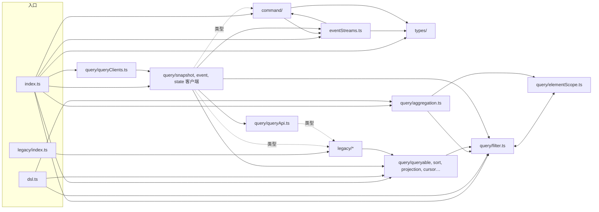

# wow-client 首发前架构审查与重构方案（2026-09）

## 状态

已定稿（2026-09-24，第 6 节的问题全部按建议定），按第 5 节分批实施。首发 9.2.0 等这一轮重构合并后再发（见
`typescript/RELEASING.md`）。第一轮审查 R1～R4（#3320～#3333）修的是正确性与开发体验，本文不重复；
本文从第一性原理看架构与代码质量：职责、内聚与耦合、可扩展、可维护、可测、可读，以及一个 9.x
全程愿意冻结的公开 API。

证据以 `c48625e14`（origin/main，2026-09-24）为准，行号指 `typescript/wow-client/` 下的文件；
跨包证据写全路径。

## 1. 这个包是做什么的

### 1.1 谁在用、什么必须成立

| 使用者                           | 用什么                                                                                                                                                                                                                                              | 必须成立                                                              |
| -------------------------------- | --------------------------------------------------------------------------------------------------------------------------------------------------------------------------------------------------------------------------------------------------- | --------------------------------------------------------------------- |
| 生成代码（wow-generator 的产物） | `CommandRequest`、`CommandResult`、`CommandResultEventStream`、`CommandBody`、`QueryClientFactory`、`QueryClientOptions`、`ResourceAttributionPathSpec`，以及 `WOW_TYPE_MAPPING` 里约 30 个类型名（`wow-generator/src/model/wowTypeMapping.ts:37`） | 名字和形状在 9.x 内不变；已生成的代码不重新生成也能编译               |
| wow-react                        | 查询客户端、`FilterExpression` 与查询工厂、`QueryEventStreamResultExtractor`、`toWowError`、`/legacy` 的请求形状                                                                                                                                    | 查询方法签名稳定；流在服务端报错时以 `WowError` 结束                  |
| wow-view-engine                  | 整套 DSL（`filter.*`、`aggregation.*`、各枚举、`AGGREGATION_LIMITS`），`QueryApi`                                                                                                                                                                   | DSL 产出的对象与 Wow 线协议逐字段一致；不必加载 HTTP 代码也能构建查询 |
| 应用开发者                       | `CommandClient`、`commandHeaders()`、`waitStrategy()`、`WowError`                                                                                                                                                                                   | 发命令、等阶段、读错误各有一条显然的路                                |
| 连 8.10 服务端的应用             | `/legacy` 的 Condition API                                                                                                                                                                                                                          | v10 前继续可用，且不污染根入口                                        |

由此推出四条不变量，后文的发现都拿它们衡量：

1. **线协议是唯一真相源。** 枚举值和校验规则都照搬 Kotlin 的 `wow-api`，而且有测试把住：
   `test/query/wowConformance.test.ts` 登记规则，`typescript/integration-test/test/wow/wowOpenApi.test.ts`
   核对 OpenAPI 文档里的枚举值。客户端只校验服务端也会拒绝的东西。
2. **DSL 与传输分离。** `/dsl` 不加载 fetcher、装饰器、`reflect-metadata`。
3. **错误只有一种形状。** 服务端报的错，应用最终拿到的都是 `WowError`。
4. **9.x 内公开面只增不减。** 名字由 `test/surface/*.txt` 把住（D29）。

### 1.2 现状模块图

约 8,960 行源码（`src/`），其中 `query/filter.ts` 1,895 行、`query/aggregation.ts` 1,107 行、
`legacy/condition.ts` 881 行、`query/snapshot/snapshotQueryClient.ts` 597 行，四个文件占 50%。

| 模块                                                                                                                      | 职责                                                                                                                                           | 行数     | 运行时依赖                 |
| ------------------------------------------------------------------------------------------------------------------------- | ---------------------------------------------------------------------------------------------------------------------------------------------- | -------- | -------------------------- |
| `index.ts` / `dsl.ts` / `legacy/index.ts`                                                                                 | 三个入口                                                                                                                                       | 81       | —                          |
| `types/`                                                                                                                  | 混入接口（`*Capable`、`TenantId`…）、`ErrorInfo`/`ErrorCodes`、`WowError`/`toWowError`、`WowHeaders`、`ResourceAttributionPathSpec`、ABAC 常量 | 约 700   | 无                         |
| `command/`                                                                                                                | `CommandClient`（装饰器类）、命令头常量、`commandHeaders()`/`waitStrategy()`、结果类型、`CommandStage`                                         | 约 800   | fetcher、fetcher-decorator |
| `eventStreams.ts`                                                                                                         | 两个 SSE 结果提取器：遇到错误事件时让流以 `WowError` 结束                                                                                      | 91       | fetcher-eventstream        |
| `query/filter.ts`                                                                                                         | `FilterOperator` 等枚举、15 种过滤器类型、字面量与时区校验、`java.time` 日期模式语法校验、约 50 个 `filter.*` 构建器                           | 1,895    | 无                         |
| `query/aggregation.ts`                                                                                                    | 聚合类型、`having`/`derived` 类型、约 300 行整条查询的准入校验、`aggregation.*` 构建器                                                         | 1,107    | 无                         |
| `query/{sort,projection,pagination,cursorQuery,queryable,deletionState,types,queryField,elementScope,aggregationSort}.ts` | DSL 的其余部分与内部工具                                                                                                                       | 约 600   | 无                         |
| `query/queryApi.ts`、`query/{snapshot,event,state}/`                                                                      | `QueryApi` 接口，四个装饰器客户端及各自的端点路径                                                                                              | 约 1,500 | fetcher-decorator          |
| `query/queryClients.ts`                                                                                                   | `QueryClientFactory`：拼 base path，造四种客户端                                                                                               | 219      | fetcher                    |
| `configuration/`                                                                                                          | `WowMetadata` 类型与 `WowMetadataClient`                                                                                                       | 105      | fetcher-decorator          |
| `legacy/`                                                                                                                 | 已弃用的 Condition API、`Operator`、两个 locale、Condition 版请求形状与请求联合                                                                | 约 1,460 | 无                         |

### 1.3 现状依赖图



图里有三处不该有的边：`filter.ts ⇄ elementScope.ts` 是运行时循环；`command/ ⇄ eventStreams.ts`
互相引用（前者引用值，后者只引用类型）；根入口的查询层反向依赖已弃用的 `legacy/`。

### 1.4 数据流

- **命令**：应用拼 `CommandRequest`（`path`、`headers` 由 `commandHeaders()`/`waitStrategy()`
  生成、`body`）→ `CommandClient.send` 的 `@endpoint()` 桩 → fetcher-decorator 按 `ApiMetadata`
  （`fetcher`、`basePath`）发请求 → 非 2xx 时由 fetcher 以 `ExchangeError` 拒绝，应用调用
  `toWowError()`；流式发送走 `CommandResultEventStreamResultExtractor`，遇到错误事件时流以 `WowError`
  结束（`src/eventStreams.ts:40`）。
- **查询**：`filter.*`/`aggregation.*` 生成线协议对象并在构建时校验 → `singleQuery()` 这类工厂补默认值 →
  客户端的 `@post(路径)` 桩用 `@body()` 发出 → JSON 或 SSE 提取器。
- **URL**：`QueryClientFactory` 把 `contextAlias`、`resourceAttribution`、`aggregateName` 拼成
  `basePath`（`src/query/queryClients.ts:52`），端点路径是各目录 `endpointPaths.ts` 里的相对路径。
  tenant、owner 这类路径参数只能在建客户端时由 `ApiMetadata.urlParams` 给出。

### 1.5 做得好的、应当保留的

- 线协议一致性有两道测试把关：规则登记表，以及对照服务端 OpenAPI 的枚举检查。这是这个包最有价值的资产，重构以它为护栏。
- 公开面快照（D29）加上构建后的 `scripts/verify-package.mjs`，把住了名字和 `/dsl` 的纯净。
- `test/clients/*` 用打桩的 fetch 测每个客户端方法，传输层有刻画测试。
- `test/jsdocExamples.test.ts` 对 JSDoc 示例做类型检查，文档不会悄悄过时。
- 错误模型（`WowError` + `toWowError`）集中在一个文件，流与非流两条路径最终汇合。

## 2. 发现

严重度：**P0** 首发前必须处理（大多是「以后再改就是破坏性变更」的 API 决定，或重构本身的前置安全网）；
**P1** 首发前应做；**P2** 可排到 9.x 的小版本。

### P0

**F1 · 可测性 · 公开面快照只记名字，不记签名。**
`test/publicSurface.test.ts` 只比较 `kind name`（`test/surface/root.txt`：208 个名字）。改一个参数类型、
一个泛型默认值、一个可选标记，快照都照样通过。本轮要大面积搬家、表驱动改写，而 9.x 冻结的是签名，
不只是名字。没有签名级的基线就开始重构，行为保持无从证明。
→ 批次 B0：先用 `@microsoft/api-extractor` 生成 API 报告（`*.api.md`），作为签名级快照提交。按
「优先用第三方库」，不要自己写 d.ts 比对。

**F2 · 公开 API 形状 · 查询方法第三个位置参数只能放 `abort`，单次调用带不了请求头和路径参数。**
48 个方法签名都是 `(query, attributes?, abort?)`（`grep -c 'attributes?: Record<string, unknown>'`：
snapshot 17、event 9、queryApi 8…）。于是：

- 空间聚合的查询要带 `Wow-Space-Id` 请求头（`wow-openapi/.../AggregateRouteContractSupport.kt:109`），
  tenant/owner 路由要带路径参数，而这些都只能在建客户端时写进 `ApiMetadata`，多租户应用得每个租户建一个客户端
  （见 `test/clients/snapshotQueryClient.test.ts:255`）；
- 不传 attributes 的调用方到处写 `undefined` 占位：`wow-view-engine/src/runtime/execute.ts:115-119`、
  `runtime/fetchRecord.ts:84`、`runtime/valueCandidates.ts:169`。

命令这边没有这个问题：`CommandRequest` 继承 `ParameterRequest`，headers、urlParams、signal 都能按次传。
这个签名一旦发布就冻结在 9.x。→ Q1。

**F3 · 公开 API 形状 · 流的元素是 SSE 信封 `JsonServerSentEvent<T>`，不是行。**
`listStream`、`aggregateStream`、`loadStream`、`sendAndWaitStream` 都返回
`ReadableStream<JsonServerSentEvent<T>>`。信封里的 `event`、`id`、`retry` 对 Wow 没有意义：查询流的
`event` 恒为 `message`（`src/eventStreams.ts:24`），命令流的阶段名 `data.stage` 里已经有了，Wow 也不支持断点续传。
每个使用方都得再拆一次：`wow-react/src/readStreamRows.ts:60` 里的 `rows.push(value.data)`，还有文档里的
`event.data.stage`（`src/command/commandClient.ts:96`）。这是传输细节泄漏进了公开类型，发布后就改不动了。→ Q3。

**F4 · 耦合 · 生成代码在重新编码 wow-client 的传输知识，而且已经走样。**
生成的流式命令客户端自己写 `Accept: text/event-stream`，用的却是
`JsonEventStreamResultExtractor`（`wow-generator/expected/compensation-spec/compensation/execution_failed/commandClient.ts:5`），
不是 `CommandResultEventStreamResultExtractor`，所以服务端在流中途报错时，生成代码把 `ErrorInfo` 当成一行结果读出来，
违反不变量 3。根因是 wow-client 没有给「命令流端点」「查询流端点」提供一个可以直接引用的端点预设，生成器只能照抄。
修法分在两个包：wow-client 导出预设（批次 A4，新增导出，不破坏），生成器改为引用（见 wow-generator 的方案）。
这项必须在首发前做完，否则 9.2.0 生成的代码会带着这个缺陷冻结下来。

### P1

**F5 · 内聚 · `filter.ts` 一个文件管五件事。**
枚举（`:44-138`）、15 种线协议类型（`:373-656`）、字面量与时区校验（`:186-275`）、约 180 行
`java.time` 模式语法（`:140-183`、`:277-361`），外加一个 1,180 行的对象字面量，装着约 50 个构建器（`:710-1895`）。
构建器里大量同形代码，只有 `op` 不同：

- `eq`/`ne`/`gt`/`gte`/`lt`/`lte`（`:926-1070`）；
- `contains`/`startsWith`/`endsWith`（`:1072-1155`）；
- `isIn`/`notIn`/`containsAll`（`:1157-1234`）；
- 7 个存在性判断（`:1260-1370`）；
- 12 个日历窗口（`today` … `nextYear`，`:1473-1846`，每个约 30 行，其中实现 8 行）。

这就是暂缓的 R1-22「日历构建器改表驱动」，而且不止日历。每加一个运算符要改四处：枚举、类型联合、构建器、
JSDoc。
→ 批次 B1：拆成 `dsl/filter/` 目录；用一个带逐项 JSDoc 的 `FilterBuilders` 接口描述公开形状，实现由表驱动生成。
IDE 提示和 `jsdocExamples` 测试都读接口上的 JSDoc，不受影响。

**F6 · 架构 · `filter.ts ⇄ elementScope.ts` 运行时循环依赖。**
`filter.ts:15` 从 `elementScope.ts` 取 `requireElementScopedFilter`，`elementScope.ts:16` 又从 `filter.ts` 取
`FilterOperator` 的值。现在能跑，只是因为两边都在调用时才取值；换个打包器或者在模块顶层用到，就会读到 `undefined`。
→ B1 里把 `FilterOperator` 等枚举移到 `dsl/filter/operator.ts`，循环自然消失。

**F7 · 耦合 · 根入口的查询层反向依赖 `/legacy`，兼容标记散在 5 个文件、7 处。**
`query/queryApi.ts:14-23,130`、`query/snapshot/snapshotQueryApi.ts:16-21`、
`query/snapshot/snapshotQueryClient.ts:16-24,202`、`query/event/eventStreamQueryClient.ts:17-23,169`
各自从 `../legacy/*` 引入 `Condition` 和 `*QueryRequest`。结果有两个：当前的 API 在类型上依赖已弃用的 API；
到了 v10，删除 `/legacy` 要动 5 个文件，而不是删一个。
→ 批次 B4：新建唯一的兼容缝 `client/query/requests.ts`，在里面定义 `SingleQueryRequest`/`ListQueryRequest`/
`PagedQueryRequest`/`CountRequest` 这几个联合（`/legacy` 继续转出同名类型），客户端和 `QueryApi` 只从这里引。
v10 时只把这个文件收窄成 `Filter*`。

**F8 · 性能/摇树 · 根入口按单文件打包，装饰器调用把所有客户端钉在包里。**
`vite.config.ts` 的 lib 构建给每个入口产出一个扁平文件。今天一份本地构建的 `dist/index.es.js` 里有 5 处顶层的
`L([...], X.prototype, …)` 装饰调用（第 97、175、232、444、659 行），没有 `/*#__PURE__*/` 标记。
打包器没法删掉它们，所以只 `import { toWowError, waitStrategy }` 的应用也会带上全部客户端类、
fetcher-decorator 和 `reflect-metadata`。`sideEffects: false` 只在模块粒度起作用，文件合并之后就失效了。
`/dsl` 绕开了查询构建这一种场景，错误模型和命令头仍然躲不开。
→ 批次 B7：`rollupOptions.output.preserveModules: true`，每个源文件一个产物模块。在
`scripts/verify-package.mjs` 里加一条检查：「只导入 `toWowError` 的包不含 fetcher-decorator」，用 rollup 真打一次。

**F9 · 内聚 · `types/` 是个杂物筐。**
一个目录里有三类东西：纯类型混入（`modeling.ts`、`naming.ts`、`function.ts`、`messaging.ts`、`common.ts`、`abac.ts`），
错误模型的运行时部分（`wowError.ts` 里的 `WowError` 类和 `toWowError`，`error.ts` 里的 `ErrorCodes`），
还有路由（`endpoints.ts` 里的 `ResourceAttributionPathSpec`，只有 `QueryClientFactory` 和生成代码用）。
名字叫 `types` 却放着类和函数，读者找错误模型时想不到来这里。
→ 批次 B6：拆成 `model/`（混入）、`error/`（`ErrorInfo`、`ErrorCodes`、`WowError`、`toWowError`、`WowHeaders`），
`ResourceAttributionPathSpec` 移到 `client/`。只挪文件，公开名不变。

**F10 · 可扩展 · 没有 `having.*` 与 `derived.*` 构建器，使用方只能手搭线协议对象再强转。**
`aggregation.ts:171-235` 只定义了 `DerivedExpression`、`HavingExpression` 这两个类型；`derived()`（`:1005`）
要的是一棵已经搭好的树。view-engine 为此手写了一个 `compileDerived`（`wow-view-engine/src/analysis/compile.ts:315-337`），
`compileHaving` 干脆 `return having as HavingExpression`（`:409`），类型检查在这里断了。构建器能在构建时校验
（比如 `IN` 的值非空、`BETWEEN` 上下界有序），比等到 `aggregation.query()` 统一准入时才报错更早、定位也更准。
→ 批次 A1（只新增导出）；命名见 Q4。

**F11 · 可测性/正确性 · `datePattern` 校验手写了半个 `DateTimeFormatter`，却没有和 JVM 对照过（R1-19）。**
`filter.ts:145-183` 的字母计数表加上 `:277-361` 的扫描器，是 `java.time` 模式语法的近似实现。现有测试都是手挑的样例
（`test/query/filter.test.ts:455-515,807-844`）。近似实现会从两头出错：错杀合法模式，用户就没有绕路可走；
放过非法模式，也只是回到服务端报 400，这倒还好。前一种更糟，因为客户端的校验就是为了比服务端更早、更准地报错。
→ 批次 B3：在 Kotlin 侧加一个测试，用 `DateTimeFormatter.ofPattern` 对一组语料（每个字母取 1～N 个重复，
加上 `p`、引号、可选段、保留字符）判定能否接受，产出 `test/fixtures/java-date-patterns.json` 提交进仓库；
TS 测试逐条对照这份文件。以后 JVM 的语法有变化，只要重新生成一次语料。区域时区 ID 仍交给服务端校验，并登记进一致性登记表。

**F12 · 公开 API 形状 · 常量有四种写法。**
`enum`（`CommandStage`、`FilterOperator`、`ResourceAttributionPathSpec`），`Object.freeze({…} as const)`
（`CommandHeaders`、`WowHeaders`、`ErrorCodes`、`AGGREGATION_LIMITS`），带 `static readonly` 的类
（`SnapshotMetadataFields` `query/snapshot/snapshot.ts:93`、`DomainEventStreamMetadataFields`
`query/event/domainEventStream.ts:131`），还有 legacy 的 `ConditionOptionKey`。静态类不能摇树，能被 `new`，
`keyof typeof` 也拿不到字段名的联合。
→ 规则：**线协议的取值集合用 `enum`**（与 Kotlin、OpenAPI 检查、生成器产物一致，不动）；**名字表用
`as const` 冻结对象**。两个 `*MetadataFields` 类改成冻结对象（批次 B6）。`X.FIELD` 这种用法不受影响，
只是不能再 `new`、`instanceof`，列进公开面变化。

**F13 · 重复 · `QueryClientFactory` 的四个工厂方法一字不差，还把工厂专用的键漏进了 `ApiMetadata`。**
`query/queryClients.ts:104-219`，四个方法都是 `createQueryApiMetadata({...defaults, ...options, basePath: …})`。
`basePath: options?.basePath ?? this.defaultOptions.basePath` 与前面的展开重复。`createQueryApiMetadata`（`:52`）
原样返回 `{...options}`，于是 `contextAlias`、`aggregateName`、`resourceAttribution` 都进了客户端的 `apiMetadata`。
还有两处：给了 `basePath` 就悄悄忽略 `contextAlias`；泛型 `DomainEventBody = any`（`:66`）。
→ 批次 B5：一个私有方法 `metadata(options)` 拆出工厂专用键，只把 `ApiMetadata` 的键传给客户端；
`DomainEventBody` 的默认值改为 `unknown`，见第 4 节。

### P2

**F14 · 可测性 · 接口与类不一致。** `SnapshotQueryApi` 没有 `getById`、`getStateById`、`getByIds`、`getStateByIds`
（它们只在类里，`snapshotQueryClient.ts:492-597`）；两个 load-state 客户端连接口都没有。依赖接口编程、
拿假对象替身的使用方用不到这几个方法。→ A5：补进接口，新增 `LoadStateAggregateApi`、`LoadOwnerStateAggregateApi`。

**F15 · 死代码/可读性。**

- `getById` 这类不是端点的方法，参数上也挂着 `@attribute()`（`snapshotQueryClient.ts:494,519,551,587`），没有作用，
  读者会误以为它们走装饰器。
- `SNAPSHOT_RESOURCE_NAME`、`EVENT_STREAM_RESOURCE_NAME`（`endpointPaths.ts:17`）没有人用。
- `DEFAULT_PROJECTION` 和 `defaultProjection()` 功能重复，也和 `projection()` 重复（`query/projection.ts`），
  仓内没有任何使用方。
- `types/modeling.ts:14` 写的是 `from './naming.ts'`，别处都是 `.js`。
- `WowError` 里的 `Object.setPrototypeOf`（`types/wowError.ts:63`）在 ES2020 目标下是多余的。

**F16 · 命名。** 混入接口的命名有两套：`TenantId`、`OwnerId`、`CommandId`、`RequestId` 是 `{ tenantId: string }`
这种形状，读起来却像值类型；`AggregateId` 是个复合结构，而装着它的叫 `AggregateIdCapable`。这些名字照搬 Kotlin
`wow-api`，生成器也按名字映射，所以**不改**，只在 `model/` 的模块注释里说明这条规则。`QueryApi` 的参数名
`singleQuery`、`listQuery` 遮蔽了同名工厂函数（`query/queryApi.ts`），改成 `query`，只是参数名，不算 API 变化。

**F17 · 类型精度。** 公开类型里有 `any`：`DynamicDocument = Record<string, any>`（`query/types.ts:14`），
`CommandResultCapable.result: Record<string, any>`（`command/types.ts:101`），`DomainEventStream<DomainEventBody = any>`、
`StateEvent<…= any, S = any>`、`EventStreamQueryApi`、`EventStreamQueryClient`，以及
`QueryEventStreamResultExtractor` 的 `JsonServerSentEvent<any>`（`eventStreams.ts:71`）。ESLint 对 `no-explicit-any`
只给警告。`aggregate<Row>` 的行类型由调用方自己断言，和查询里的别名没有关联；从 `aggregation.query()` 推出行类型是个增强，不阻塞首发。

**F18 · 错误模型的两种到达方式。** 非流请求以 fetcher 的 `ExchangeError` 拒绝，要 `await toWowError()` 才能拿到
`WowError`；流直接以 `WowError` 结束。`toWowError` 两种都接，所以不变量 3 在「经过 `toWowError` 之后」成立。
这是 fetcher 的状态校验先于结果提取器执行造成的，包的 `AGENTS.md`「Errors」一节已经说明，**保持不动**。只在 `error/`
的模块注释里写清这条汇合规则。

**F19 · 同名不同义。** `/legacy` 的 `singleQuery`、`listQuery`、`pagedQuery` 与根入口同名，产出的却是 Condition 查询；
legacy 的 `listQuery` 默认 `limit = 10`，根入口的默认不传。兼容债务台账已经记录，v10 随 `/legacy` 一起删除，这一轮不动。

### 考虑过、决定不做的

- **用继承合并 `SnapshotQueryClient` 和 `EventStreamQueryClient`。** 两者有 8 个同形的端点桩，但路径前缀不同，
  事件的 `LOAD` 路径（`{id}/event/{h}/{t}`）也不在 `event/` 前缀下。每个桩 12 行，都是声明式代码，
  合并以后两种资源会耦合到一个基类上，得不偿失。重复由 `QueryApi` 接口约束。
- **把 fetcher-decorator 从公开类型里抽象掉。** 生成代码本身就是装饰器类，依赖方向 Wow → fetcher 是既定架构
  （`typescript/AGENTS.md`「Dependency Direction」）。
- **给 `pagedQuery`/`listQuery` 加分页校验。** Kotlin 的 `Pagination`、`ListQuery` 没有这类规则，不变量 1 说只校验服务端也会拒绝的东西。

## 3. 目标架构

### 3.1 模块边界

```
src/
  index.ts  dsl.ts  legacy/index.ts        入口：只做转出
  model/          纯类型混入（原 types/ 的 modeling、naming、function、messaging、common、abac、bi）
  error/          ErrorInfo、ErrorCodes、WowError、toWowError、WowHeaders
  dsl/            不依赖任何 HTTP 代码
    field.ts              queryField（内部）
    filter/
      operator.ts         FilterOperator、StringComparison、SearchMode、TimeUnit
      types.ts            15 种过滤器类型、FilterExpression、ElementFilterExpression
      validate.ts         字面量、非空、时区、天数（内部）
      datePattern.ts      java.time 模式语法（内部，由 JVM 语料把关）
      scope.ts            requireElementScopedFilter（内部，原 elementScope.ts）
      builders.ts         FilterBuilders 接口（逐项 JSDoc）＋表驱动实现，导出 filter
      index.ts
    aggregation/
      types.ts            分组、指标、表达式、Derived/Having 类型、AGGREGATION_LIMITS
      admit.ts            aggregation.query() 的准入规则（内部）
      sort.ts             effectiveSort（内部）
      builders.ts         aggregation.*（含 A1 的 having/derived）
      index.ts
    sort.ts  projection.ts  pagination.ts  cursorQuery.ts  queryable.ts  deletionState.ts  documents.ts
  transport/      结果提取器、端点预设（A4），唯一引用 fetcher-eventstream 的地方
    eventStreams.ts
    endpoints.ts          COMMAND_STREAM_ENDPOINT、QUERY_STREAM_ENDPOINT
  client/
    routing.ts            ResourceAttributionPathSpec、UrlPathParams
    command/              CommandClient、CommandHeaders、commandHeaders()、waitStrategy()、结果与阶段类型
    query/
      queryApi.ts
      requests.ts         唯一的 /legacy 兼容缝（F7）
      snapshot/  event/  state/   客户端＋内部端点路径
      factory.ts          QueryClientFactory
    metadata/             WowMetadata、WowMetadataClient
  legacy/         不动，v10 删除
```

### 3.2 依赖规则（用 ESLint 核心规则 `no-restricted-imports` 按目录强制，不新增依赖）

```mermaid
graph TD
  entries[入口 index / dsl / legacy] --> client & dsl & error & model & transport
  client --> transport
  client --> dsl
  client --> error
  client --> model
  transport --> error
  transport --> model
  dsl --> model
  legacy --> dsl
  client -. 仅 requests.ts，只引类型 .-> legacy
  transport --> fetcher["fetcher / fetcher-eventstream"]
  client --> decorator["fetcher / fetcher-decorator"]
```

图中没有画出的边一律禁止，具体规则如下：

- `dsl/`、`model/`、`error/` 不得引用 `client/`、`transport/` 或任何 `@ahoo-wang/fetcher*`。这样 `/dsl` 的纯净在
  lint 阶段就挡住了，不必等构建后的 `verify-package.mjs`（后者保留，作为第二道）。
- 只有 `client/query/requests.ts` 可以引用 `legacy/`。
- 只有 `transport/` 可以在运行时引用 `@ahoo-wang/fetcher-eventstream`（其他目录只能 `import type`，Q3 通过后连类型也不需要）。

### 3.3 关键抽象

- **`FilterBuilders` 接口**：`filter` 的公开形状和文档都在接口上，实现由一张 `op → 形状` 表生成。加一个运算符，
  只需改枚举、类型和表里的一行。
- **端点预设**（A4）：`COMMAND_STREAM_ENDPOINT = { headers: { Accept: TEXT_EVENT_STREAM }, resultExtractor: CommandResultEventStreamResultExtractor }`，
  `QUERY_STREAM_ENDPOINT` 同理。手写客户端和生成代码都引用它们，传输知识只留一份。
- **`client/query/requests.ts`**：Condition 兼容只留这一处缝。
- **准入（`dsl/aggregation/admit.ts`）**：与构建器分开。构建器只管自己那一部分，准入管跨部分的规则，一致性登记表逐条指向这里。

### 3.4 删除什么

`SNAPSHOT_RESOURCE_NAME`、`EVENT_STREAM_RESOURCE_NAME`；非端点方法上的 `@attribute()`；`Object.setPrototypeOf`；
按 Q2 决定删 `DEFAULT_PROJECTION` 和 `defaultProjection`。

## 4. 公开 API 影响

| 变化                                                                             | 性质                                                           | 何时                             | 影响面                                                                |
| -------------------------------------------------------------------------------- | -------------------------------------------------------------- | -------------------------------- | --------------------------------------------------------------------- |
| 目录搬家（B1、B2、B4、B5、B6）                                                   | 名字不变；B0 的 API 报告证明签名也不变                         | 首发前                           | 无                                                                    |
| `preserveModules`（B7）                                                          | 产物文件布局变化，`exports` 不变                               | 首发前                           | 无；`package-check.mjs` 会验证                                        |
| `SnapshotMetadataFields`、`DomainEventStreamMetadataFields` 由类改为冻结对象     | 破坏：不能再 `new`、`instanceof`                               | 首发前                           | 仓内零处受影响；`X.FIELD` 照常可用                                    |
| `DomainEventBody`、`S` 等泛型默认值 `any` → `unknown`                            | 破坏：没写泛型参数的代码读 `body` 时要先收窄                   | 首发前                           | 生成代码总是显式给出泛型参数；仓内 `StateEvent` 有 1 处使用，需要核对 |
| A1：`having.*`/`derived.*` 构建器                                                | 新增                                                           | 首发前（view-engine 能删掉强转） | 无                                                                    |
| A4：`COMMAND_STREAM_ENDPOINT`、`QUERY_STREAM_ENDPOINT`                           | 新增                                                           | 首发前（生成器修复依赖它）       | 无                                                                    |
| A5：`SnapshotQueryApi` 补上 `getById` 等方法，新增两个 load-state 的 `*Api` 接口 | 新增；给接口加方法，对自行实现 `SnapshotQueryApi` 的代码是破坏 | 首发前                           | 仓内没有自行实现它的代码                                              |
| Q1：查询方法第三个参数由 `abort` 改成 `init`                                     | 破坏                                                           | 按 Q1 定                         | wow-react、view-engine、storybook、integration-test、文档             |
| Q3：流的元素由信封改成行                                                         | 破坏                                                           | 按 Q3 定                         | wow-react 的 `readStreamRows`、生成器、文档、集成测试                 |
| Q2：删除 `DEFAULT_PROJECTION`、`defaultProjection`                               | 破坏                                                           | 按 Q2 定                         | 仓内零处受影响                                                        |

**建议**：凡是破坏性的都在首发前做完。9.2.0 是这三个包在 npm 上的第一个版本，现在还没有任何外部使用者；
等 9.2.0 发出去，同样的改动就得等到 10.0。fetcher-wow 5.x 的老用户反正要换包名，迁移指南
（`documentation/docs/*/guide/typescript/migration.md`）顺带写上这几条即可。

## 5. 重构批次

原则：每批一个 PR，单独合并也能保持全部门禁通过；B 系列不改行为，A 系列是 API 变化，要等对应的问题拍板；
每批先补安全网，再动代码。行数以外的对照物：API 报告（B0）、线协议金样（B0）、一致性登记表、
客户端打桩测试、integration-test（同源契约与 8.x 矩阵）。

| 批     | 内容                                                                                                                                                                                                                                                        | 安全网（先补）                                                                                                                  | 人日      | 依赖                                                                       |
| ------ | ----------------------------------------------------------------------------------------------------------------------------------------------------------------------------------------------------------------------------------------------------------- | ------------------------------------------------------------------------------------------------------------------------------- | --------- | -------------------------------------------------------------------------- |
| **B0** | 签名级 API 报告（api-extractor，三个入口，进 `pnpm test`）；线协议金样：`filter.*`、`aggregation.*` 的每个构建器用固定输入跑一遍，输出存成 `test/golden/dsl-wire.json`；客户端端点表：用反射枚举每个客户端原型上的方法，逐个断言方法、URL、头和体，防止漏测 | —（本批就是安全网）                                                                                                             | 1.5       | 无                                                                         |
| **B1** | `dsl/filter/` 拆分：operator、types、validate、datePattern、scope、builders；`FilterBuilders` 接口加表驱动实现（R1-22）；消除 F6 的循环依赖                                                                                                                 | B0 的 API 报告与金样；现有 `filter.test.ts`、`wowConformance.test.ts`、`jsdocExamples.test.ts`                                  | 2.5       | B0                                                                         |
| **B2** | `dsl/aggregation/` 拆分：types、admit、sort、builders                                                                                                                                                                                                       | 同上，加上 `aggregation.test.ts`                                                                                                | 1.5       | B0；可与 B1 并行（两者都会动 `elementScope` 的引用，后合的那个改一行即可） |
| **B3** | R1-19：Kotlin 测试产出 JVM 日期模式语料，TS 逐条对照；把 `datePattern.ts` 修到与语料一致（这是**有意的行为修正**，错杀的模式改为放行，PR 里逐条列出）                                                                                                       | 新增的 JVM 语料测试（先提交语料，并把当前 TS 与语料不一致的条目标成已知差异）                                                   | 1.5       | B1                                                                         |
| **B4** | `client/query/requests.ts` 兼容缝；5 个文件改为只从这里引用；更新 `docs/compat-debt.md` 里的标记路径                                                                                                                                                        | API 报告（`*QueryRequest` 的展开形状不变）；compat 台账检查                                                                     | 0.5       | B0                                                                         |
| **B5** | `transport/` 与 `client/` 搬家；`QueryClientFactory` 去重，不再把工厂专用键漏给客户端；删掉无效的 `@attribute()` 和未用的常量                                                                                                                               | `queryClients.test.ts`、`queryClientFactory.test.ts`；B0 的端点表；新增一条「客户端 `apiMetadata` 只含 ApiMetadata 的键」的测试 | 1         | B0                                                                         |
| **B6** | `model/`、`error/` 拆分；两个 `*MetadataFields` 改为冻结对象；泛型默认值 `any` → `unknown`；加上 3.2 节的 `no-restricted-imports` 规则                                                                                                                      | API 报告（这一批的破坏性变化在报告差异里逐条可见）；`publicSurface` 快照                                                        | 1         | B4、B5                                                                     |
| **B7** | `preserveModules`；`verify-package.mjs` 增加摇树检查（用 rollup 打一个只导入 `toWowError` 的入口，断言产物不含 fetcher-decorator）                                                                                                                          | `package-check.mjs`（publint、attw、在全新项目里 import 和 require）                                                            | 1         | B6                                                                         |
| **A1** | `having.*`/`derived.*` 构建器（命名按 Q4）；在一致性登记表里登记对应规则；view-engine 另开 PR 改用它们，删掉 `compile.ts:409` 的强转                                                                                                                        | 金样加上新构建器；view-engine 的 `analysis/compile` 测试                                                                        | 1.5 + 0.5 | B2                                                                         |
| **A4** | 端点预设；`CommandClient` 与各查询客户端改为引用预设；通知生成器方案改用它                                                                                                                                                                                  | 客户端打桩测试（流式错误事件用例已有，见 `test/eventStreams.test.ts`）                                                          | 0.5       | B5                                                                         |
| **A5** | 接口补齐（F14）                                                                                                                                                                                                                                             | 类型测试（`test:type`）                                                                                                         | 0.5       | B5                                                                         |
| **A2** | Q1：查询方法改为 `(query, attributes?, init?)`，`init` 可以带 headers、urlParams、signal、timeout；同步改 wow-react、view-engine、storybook、integration-test 和文档                                                                                        | 先做 spike，确认 fetcher-decorator 在 `@body()` 之外还能合并 `@request()`；打桩测试加上按次传的头和路径参数                     | 2 + 1     | B5；Q1                                                                     |
| **A3** | Q3：流的元素改为行（`ReadableStream<T>`），同步 wow-react、生成器和文档                                                                                                                                                                                     | `eventStreams.test.ts`；integration-test 的流用例                                                                               | 1 + 1     | A4；Q3；与生成器方案同步合并                                               |
| **A6** | Q2：删除重复的导出                                                                                                                                                                                                                                          | `publicSurface` 快照                                                                                                            | 0.25      | Q2                                                                         |

合计：B 系列约 10.5 人日；A 系列约 9.75 人日（含下游包的配合修改）。顺序：B0 → (B1 ∥ B2 ∥ B4 ∥ B5) → B3、B6 → B7；
A4 越早越好（生成器等它）；A2、A3 等问题拍板后排在 B5 之后。按 `cpu-load-pacing` 的约束，同一时间最多 2 路重活。

每个 PR 的门禁：`pnpm --filter @ahoo-wang/wow-client lint`、`test`（含 `test:type`）、`build`（含
`verify-package.mjs`），改了 `package.json`、入口或构建的，再加 `node .github/scripts/package-check.mjs`；
动到下游的，跑下游包各自的门禁；`typescript-gate` 与 `typescript-contract-gate` 全绿。

## 6. 待定问题

**已定（2026-09-24）**：用户「按你推荐」，Q1～Q4 全部按下面的建议执行。原则是首发前重构到生产就绪，不留兼容债。批次按第 5 节推进，每做完一批就在第 5 节标上 PR 号；全部做完后，本页并入包的设计文档。

**Q1 · 查询方法的第三个参数，要不要从 `abort` 换成 `init`？**
方案 A（推荐）：`(query, attributes?, init?: QueryRequestInit)`，其中
`QueryRequestInit = Pick<FetchRequestInit, 'headers' | 'urlParams' | 'signal' | 'abortController' | 'timeout'>`。
空间 ID、tenant、owner 就能按次传，和 `CommandRequest` 的能力对齐；原来传 `controller` 的改成传 `{ abortController }`，
传 signal 的改成传 `{ signal }`。
方案 B：保持现状，多租户应用继续每个租户建一个客户端，或者写个拦截器从 attributes 里取值。
推荐 A，理由：9.x 全程都要带着这个签名；Wow 的空间聚合是现行功能，不是边角。代价约 3 人日，还要先做一个 fetcher-decorator 的 spike。

**Q2 · 根入口 208 个名字要不要收窄？**
推荐只删真正重复的 `DEFAULT_PROJECTION` 和 `defaultProjection()`（功能等同于 `projection()`，仓内零使用）。
`*Capable` 这些混入都保留：它们镜像 Kotlin 的 `wow-api`，生成器按名字映射，用户也拿它们组合自己的类型。
`LogicalField` 按兼容台账保留到 v10。

**Q3 · 流的元素，要不要从 SSE 信封改成行？**
推荐改：`ReadableStream<T>`，由提取器解包。`CommandResultEventStream` 这个名字不变，只把定义改成
`ReadableStream<CommandResult>`，所以生成代码的类型签名不用动；但生成器必须同时改用 A4 的预设，否则类型和运行时就对不上了。
代价是 wow-react 的一行代码、文档和集成测试，以及一次与生成器方案的协同合并。
如果首发时间更要紧，退一步：保留信封，但在文档里写明 `event`、`id`、`retry` 没有语义，9.x 不改。

**Q4 · `having`/`derived` 构建器放在哪里？**
推荐都挂在 `aggregation` 下面，名字照搬 Kotlin 的 `wow-query` DSL（`AggregationQueryDsl.kt:260-316`）：

- `having`：`aggregation.having.gt('revenue', 100)`、`between`、`isIn`、`isNull`、`isNotNull`、`and([...])`、`or([...])`，
  对应 Kotlin 的 `HavingDsl`。
- `derived`：给 `aggregation.derived` 加一个回调重载，
  `aggregation.derived(d => d.divide(d.ref('revenue'), d.ref('orders')), 'aov')`，`d` 上有 `ref`、`constant`、`add`、`subtract`、
  `multiply`、`divide`，对应 Kotlin 的 `DerivedExpressionDsl` 和 `derived(alias) { … }`。原来传整棵树的签名保留。

不复用 `aggregation.add` 这一组：它们产出的是 `AggregationExpression`，和 `DerivedExpression` 的枚举是两个名义类型，
重载会让 `constant` 的类型有歧义。这样不新增顶层名字，查询 DSL 仍然只有 `filter` 和 `aggregation` 两个入口。
另一种做法是新开顶层的 `having.*`，但它会和 `filter` 的比较运算符在自动补全里混在一起。
