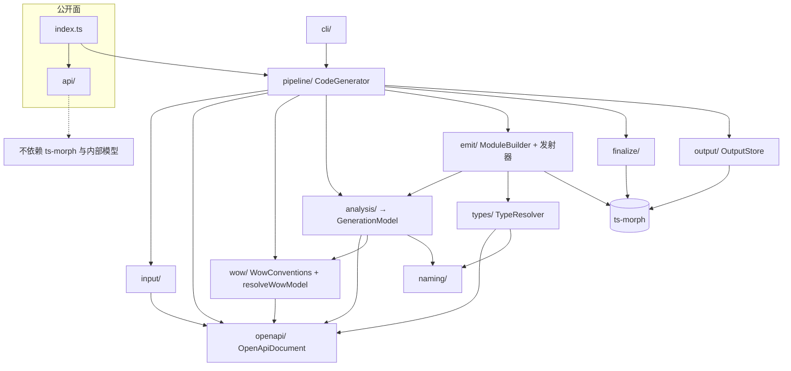
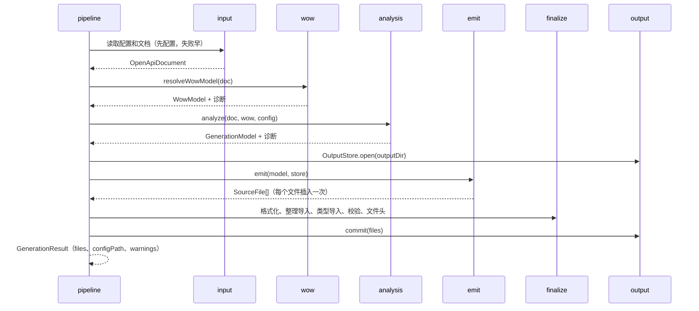

# wow-generator 首发前架构审查与重构方案（2026-09）

**状态**：已定稿（2026-09-24，第 6 节的问题全部按建议定），按第 5 节分批实施。
**基线**：`origin/main` `c48625e14`（R1～R4 已合并，含 #3328、#3329、#3330）。`src/` 共 7,799 行。
**范围**：`typescript/wow-generator` 的架构与代码质量。第一轮审查修的是正确性和开发体验，这一轮看职责、内聚、耦合、可扩展、可测、可读，以及要在 9.x 冻结的公开面。
**约束**：重构分批做，每批不改行为。生成物要和同源服务端逐字节一致，改动生成物的变更必须是有意的，而且单独列出。

## 1. 它是做什么的，现在长什么样

### 1.1 第一性原理：谁用、什么必须成立

用户有三类：

| 用户                         | 怎么用                                                                             | 他们需要什么成立                                                                        |
| ---------------------------- | ---------------------------------------------------------------------------------- | --------------------------------------------------------------------------------------- |
| Wow 服务的前端开发者         | CLI：`wow-generator generate -i http://…/v3/api-docs -o src/generated`，产物提交库 | 产物能编译（strict、`NodeNext`、`bundler`）；重新生成只在文档变了的地方变；大文档也要快 |
| 调用任意 OpenAPI 3 服务的人  | 同上，文档不是 Wow 的                                                              | 通用的模型和 API 客户端；Wow 的约定不能误伤非 Wow 文档                                  |
| 构建脚本、模板项目（程序化） | `new CodeGenerator(options).generate()`                                            | 一个小而稳的 API：选项、结果、日志器、错误类别；不泄漏 ts-morph、不泄漏内部模型         |

所以下面这些必须成立，也就是重构不能碰的不变量：

1. **产物确定**：同一份文档、同一份配置，不论在哪台机器、哪个目录、哪种 locale 生成，字节都相同。
2. **产物能编译**：写出的每个文件，名字都有声明或导入，没有重复声明（`verifyGeneratedCode` 这张安全网要留着）。
3. **只动自己写的文件**：清单 `.wow-generator.json` 记下写过的文件和哈希，旧文件只在没被手改过时才删。
4. **Wow 约定只作用于 Wow 文档**：聚合、命令、事件、状态、查询字段、`tenantId`/`ownerId` 这些规则，只从 Wow 的元数据推出来。
5. **失败说得清**：用户能处理的失败是 `GeneratorError`，按类别映射到退出码；生成器自己的缺陷才落到 `internal`。

### 1.2 现状模块图

| 模块                | 文件（行数）                                                                                                                                                                                               | 实际承担的职责                                                                                                                                              |
| ------------------- | ---------------------------------------------------------------------------------------------------------------------------------------------------------------------------------------------------------- | ----------------------------------------------------------------------------------------------------------------------------------------------------------- |
| 入口 / 编排         | `index.ts` (398)                                                                                                                                                                                           | 公开再导出；`CodeGenerator` 串起全流程；生成 index 桶文件；格式化、整理导入、类型导入、校验、加文件头                                                       |
| CLI                 | `cli.ts` (77)、`utils/clis.ts` (212)                                                                                                                                                                       | commander 定义；参数解析、退出码、SIGINT                                                                                                                    |
| 上下文              | `generateContext.ts` (103)、`types.ts` (149)                                                                                                                                                               | `GenerateContext` 汇集 project、文档、输出目录、聚合、配置、日志、忽略的路径参数；`types.ts` 里公开类型和内部类型混放                                       |
| Wow 聚合解析        | `aggregate/` (739)                                                                                                                                                                                         | 从 tag 和 operationId 认出聚合、命令、事件、状态、查询字段                                                                                                  |
| 模型生成            | `model/` (1,418)                                                                                                                                                                                           | 过滤 Wow 自带 schema、防重名、按 schema key 放文件、写 interface/enum/type alias；`TypeGenerator` 同时是 schema→类型的解析器                                |
| 客户端生成          | `client/` (1,832)                                                                                                                                                                                          | API 客户端（按 tag）、命令客户端、查询客户端；每个类既分析 OpenAPI 又直接写 ts-morph                                                                        |
| 工具杂物间 `utils/` | 14 个文件 (2,951)：`clis`、`components`、`configuration`、`logger`、`naming`、`operations`、`parsers`、`references`、`resources`、`responses`、`schemas`、`sourceFiles`、`typeOnlyImports`、`verification` | OpenAPI 读取、命名、配置、日志、加载、清单与输出、导入、JSDoc 渲染、类型导入、编译校验、CLI 执行，全挤在一个桶里，由 `utils/index.ts:14-27` 整体 `export *` |

### 1.3 现状依赖与数据流

```mermaid
flowchart TD
  cli[cli.ts] --> idx[index.ts CodeGenerator]
  cli --> utils
  idx --> utils
  utils -. "utils/clis.ts:17 值导入" .-> idx
  idx --> agg[aggregate/]
  idx --> ctx[GenerateContext]
  idx --> model[model/]
  idx --> client[client/]
  ctx --> utils
  agg --> utils
  model --> utils
  utils -. "sourceFiles.ts:18 类型" .-> model
  types[types.ts] --> agg
  agg -. 类型 .-> types
  client --> model
  client --> utils
  client --> agg
  client -. "client/utils.ts:14 运行时导入" .-> wowclient[(@ahoo-wang/wow-client)]
  utils -. 运行时导入 .-> fetcher[(@ahoo-wang/fetcher)]
  model --> tsm[(ts-morph SourceFile)]
  client --> tsm
  utils --> tsm
```

一次 `generate()`（`index.ts:140-222`）的数据流：

1. `parseOpenAPI` 读取并校验文档（`:153`），`findDanglingReferences` 查悬空引用（`:155-164`）。
2. `new AggregateResolver(openAPI, logger).resolve()`（`:167-168`）：**会改写传进来的文档**，见 F7。
3. `resolveConfiguration`（`:172-176`）：配置在文档之后才读，配置写错要等文档拉取、解析完才报。
4. `beginGeneration(project, outputDir)`（`:178`）：读清单，把状态存进模块级 `WeakMap<Project, …>`（`utils/sourceFiles.ts:33-41`）。
5. `ModelGenerator.generate()`：一边分析一边往 ts-morph `SourceFile` 里逐条 `addInterface`、`addProperty`、`addJsDoc`。
6. `ClientGenerator.generate()`：查询、命令、API 三种客户端，同样边分析边写。
7. 生成 index 桶文件、`formatText` + `organizeImports`、`applyTypeOnlyImports`、`verifyGeneratedCode`、插入文件头（`:347-368`）。
8. `saveGeneration`：写文件、删未改动的旧文件、写清单。

分析（OpenAPI → Wow 领域 → 要生成什么）和发射（ts-morph）之间**没有中间模型**。每个生成器都拿着 `GenerateContext`，直接读原始 `Operation`/`Schema`，自己解析引用，再直接改 `SourceFile`。

### 1.4 测试现状

| 层                         | 在哪                                                                                | 守住什么                                                                                                                            |
| -------------------------- | ----------------------------------------------------------------------------------- | ----------------------------------------------------------------------------------------------------------------------------------- |
| 单元测试                   | `test/utils/*`、`test/model/*`、`test/client/*`、`test/aggregate/*`                 | 贴着内部函数和类写（直接驱动 `CommandClientGenerator`、调私有的 `resolveType`），重构一动就要跟着改                                 |
| 类型约束测试               | `schemaConstraints`（1,264 行）、`compositionConstraints`、`enumConstConstraints`   | 用 `TypeGenerator` 的构造函数把 schema 写进内存项目，再看诊断；守的是类型语义，但绑在 `TypeGenerator` 的签名上                      |
| 行为探针                   | `test/probes.test.ts`（830 行）、`regeneration`、`cli`、`index`                     | 从 CLI 生成到冷目录，再 `tsc --strict`（`NodeNext`、`bundler`）或实际运行；和实现无关，是重构最可靠的网                             |
| 逐字节 golden              | `expected/demo-spec`、`expected/compensation-spec`（`test/e2e.test.ts:196`）        | 两份都是 Wow 文档（93、120 个 schema），没有非 Wow 的大文档                                                                         |
| 仓库里的另外两份逐字节产物 | `typescript/integration-test/src/generated`、`compensation/dashboard/src/generated` | `typescript-contract.yml` 对同源 example-server 重新生成并比对（`:128-139`）；8.10.8、8.11.5 两个镜像的产物做类型检查（`:204-218`） |
| 公开面                     | `test/packageEntries.test.ts` 只断言几个名字能加载                                  | **没有逐名清单**。view-engine 已按 D29 做了（`wow-view-engine/test/publicSurface.test.ts`），生成器还没有                           |

`test/openai.spec.yml`（69,574 行，873 个 schema）**没有任何测试引用**，正好拿来当大文档 golden 和性能基准。

## 2. 发现

严重度：**P0** 首发前必须处理（发出去就冻结或伤用户）；**P1** 结构性问题，用户已要求首发前完成，但发布后改也不破坏任何人；**P2** 顺手清掉。

### 2.1 总表

| #   | 严重度 | 类别              | 发现                                                                                            |
| --- | ------ | ----------------- | ----------------------------------------------------------------------------------------------- |
| F1  | P0     | 性能 / 架构       | 模型逐属性增量改 ts-morph 文件，大文档是平方复杂度：873 个 schema 要 214 秒                     |
| F2  | P0     | 生成物正确性      | 流式命令客户端用了 `JsonEventStreamResultExtractor`，错误事件不会变成 `WowError`                |
| F3  | P0     | 命名 / 生成物     | 类型名把缩写压小写：`MCPListTools` → `McplistTools`（R2-31）                                    |
| F4  | P0     | 公开面            | 公开声明泄漏 ts-morph 与内部模型；`Logger` 接口形状不适合冻结；没有公开面清单                   |
| F5  | P1     | 架构              | 没有中间模型：分析和发射搅在一起，`GenerateContext` 是万能上下文                                |
| F6  | P1     | 内聚 / 耦合       | Wow 约定散在 6 个文件里                                                                         |
| F7  | P1     | 架构 / 正确性     | `AggregateResolver` 改写输入文档，模型的注释取决于执行顺序                                      |
| F8  | P1     | 内聚              | `utils/` 是杂物间；`sourceFiles.ts` 一个文件四种职责；模块级可变状态                            |
| F9  | P1     | 耦合              | 运行时循环依赖 `index ⇄ utils/clis`；类型层循环 `utils ⇄ model`、`types ⇄ aggregate`            |
| F10 | P1     | 抽象泄漏          | `ApiClientGenerator` 伪造 `ModelInfo` 和空 schema 来借用 `TypeGenerator`                        |
| F11 | P1     | 错误处理          | 循环引用、外部引用、清单损坏、路径越界抛的是普通 `Error`/`TypeError`，退出码成了「内部缺陷」    |
| F12 | P1     | 确定性            | 排序用 `localeCompare()`，结果取决于运行机器的 locale                                           |
| F13 | P1     | 性能 / 确定性     | ts-morph `Project` 会把用户 tsconfig 里的全部源文件加载进来                                     |
| F14 | P1     | 可测性            | 测试按审查编号组织、贴着内部实现；缺大文档 golden、公开面清单和警告 golden                      |
| F15 | P2     | 重复              | 同一份 endpoint 列表算三遍；`TypeGenerator` 每解析一次引用就扫一遍全部 schema                   |
| F16 | P2     | 日志              | 日志噪声大、`any` 参数、只打日志的空循环                                                        |
| F17 | P2     | 死代码 / 文档漂移 | 未用的导出、未用的参数、AGENTS.md 结构表过时                                                    |
| F18 | P2     | 耦合              | 生成器运行时导入 `wow-client`、`fetcher`，只为几个字符串常量                                    |
| F19 | P2     | 命名              | 名字和行为对不上：`createClientFilePath` 返回 `SourceFile`、`stateAggregatedTypeNames` 有副作用 |
| F20 | P2     | 健壮性            | 配置晚于文档读取；Ctrl-C 可能只写了一半                                                         |

### 2.2 详述

**F1 — 大文档平方复杂度（P0，性能/架构）**

- 证据：`ModelGenerator.generateKeyedSchema` 为每个 schema `new TypeGenerator(...)`（`src/model/modelGenerator.ts:223-231`）。`processInterface` 先 `addInterface`，再对每个属性调 `addPropertyToInterface`（`src/model/typeGenerator.ts:853-866`），后者 `addProperty` 之后又 `addSchemaJSDoc`（`:832-851`）。模型最后还要 `addMainSchemaJSDoc`（`:263-273`）。ts-morph 的每次改动都会替换整个文件的文本、重新解析，再重新包装节点。没有包路径的 schema 全放进根目录一个 `types.ts`，OpenAI 文档里这个文件有 21,881 行，于是每加一个属性就要重新解析一遍越来越大的文件。
- 实测：见 §7。873 个 schema 墙钟 213.7 秒；CPU 剖析显示 `ModelGenerator.generate` 占 83%（193 秒），其中 `addPropertyToInterface` 152 秒。ts-morph `doManipulation` 133 秒，`addJsDoc` 92 秒。自耗时排前面的是 TypeScript 扫描器 `scan`（37 秒）、GC（33 秒）、`doJSDocScan`（17 秒），都是在反复解析。格式化、整理导入、类型导入、编译校验合计只有 0.7 秒。所以「重复解析」的说法对，但病根不在收尾阶段的 ts-morph，而在发射方式：逐条增量改。
- 为什么要紧：生成器的用户正是有大文档的团队，3～4 分钟一次会让人不愿意重新生成，产物就和服务端漂移了。而且这是发射层的形状问题，不重写发射方式修不好（见 §3、B4）。

**F2 — 流式命令客户端吞掉错误事件（P0，生成物正确性）**

- 证据：`CommandClientGenerator.processStreamCommandClient` 把 `STREAM_RESULT_EXTRACTOR_METADATA` 放进 `@api(...)`（`src/client/commandClientGenerator.ts:349-355`），这个常量写死了 `JsonEventStreamResultExtractor`（`src/client/decorators.ts:71-74`）。wow-client 自己的 `CommandClient` 用的是 `CommandResultEventStreamResultExtractor`（`wow-client/src/command/commandClient.ts:107`），它会在服务端发来错误事件时报 `WowError`（`wow-client/src/eventStreams.ts:76-90`）。
- 为什么要紧：同一个 `sendAndWaitStream` 场景，手写客户端报错，生成的客户端却把错误事件当成一条数据往下传。类型都是 `CommandResultEventStream`，调用方看不出区别。这属于有意改变生成物，放在 B1 单独做。

**F3 — 缩写被压成小写（P0，命名/生成物，R2-31）**

- 证据：`pascalCase` 对每个词执行 `rest.toLowerCase()`（`src/utils/naming.ts:203-205`），`splitCamelCase` 只在「小写后跟大写」处切分（`:151-180`），所以 `MCPListTools` 被当成一个词，变成 `McplistTools`。类型名都经过这里（`toTypeIdentifier`，`:119-121`；`resolveModelInfo`，`src/model/modelInfo.ts:96`）。
- 实测：OpenAI 文档 873 个 schema 里有 52 个改了名（`FineTuneDPOMethod` → `FineTuneDpomethod`、`MCPTool` → `Mcptool`）。demo、compensation 两份 Wow 文档里是 0 个。
- 为什么要紧：生成出来的类型名就是用户代码要引用的 API。首发后再改，所有非 Wow 用户都要跟着改代码；首发前改，Wow 用户零影响。见 Q1。

**F4 — 公开面没准备好冻结（P0，公开面）**

- 证据：
  - `CodeGenerator` 的构造函数带一个 `/** @internal */ project?: Project`（`src/index.ts:99-103`），但构建没开 `stripInternal`，于是 `dist/index.d.ts` 第 1 行就是 `import { Project } from 'ts-morph'`。
  - 公开类型和内部类型都放在 `types.ts`：`GenerateContextInit` 在 `:107-125`，它引用 `Project` 和 `BoundedContextAggregates`。结果 `dist/types.d.ts` 把 ts-morph、`@ahoo-wang/fetcher-openapi` 和整套聚合内部类型都带进了公开声明。
  - `Logger` 有 6 个方法：`progress`、`progressWithCount` 带缩进层级参数，`warn` 却是可选的，靠 `warn()` 辅助函数回退到 `info`（`src/types.ts:70-102`、`src/utils/logger.ts:146-156`）。参数是 `any[]`。这层兼容是给 fetcher-generator 时代的日志器留的，而 `@ahoo-wang/wow-generator` 在 npm 上还是新包。
  - 没有逐名的公开面清单（D29 那样的）。`packageEntries.test.ts` 只检查几个名字能加载。
- 为什么要紧：9.2.0 是这个包名的第一次发布，现在收窄不算破坏。发布以后，每个多出来的名字和每个参数都是兼容负担。见 §4、Q2、Q3。

**F5 — 没有中间模型，`GenerateContext` 什么都管（P1，架构）**

- 证据：
  - `GenerateContext`（`src/generateContext.ts:25-95`）同时持有 ts-morph `Project`、原始文档、输出目录、聚合、日志、配置、聚合 tag、文档注释档位，外加两条策略方法。生成器全都 `implements Generator { generate(): void }`（`:97-103`），没有返回值，只能靠检查 ts-morph 项目来测。
  - `ApiClientGenerator` 一个类（645 行）里既有 tag 过滤（`resolveApiTags`，`src/client/apiClientGenerator.ts:620-644`）、操作分组（`:558-605`）、方法命名与冲突检测（`:235-255`）、请求体和返回类型推断（`:273-323`、`:437-488`），也有 ts-morph 发射（`:183-211`、`:498-547`）。
  - `AggregateDefinition` 名义上是领域模型，却带着原始 `operation: Operation` 和 `KeySchema`（`src/aggregate/aggregate.ts:23-47`），客户端生成器还得回头读 OpenAPI。
- 为什么要紧：「这个文档会生成什么」没法不借助 ts-morph 单独测，也没法单独复用。加一种产物（比如 R2-21 的打包，或 React hooks）要改好几个地方。分析和发射混在一起，也正是 F1 修不干净的原因。

**F6 — Wow 约定散落（P1，内聚/耦合）**

- 证据：`operationId` 后缀 `.snapshot_state.single`、`.event.list_query`、`.snapshot.count`、`wow.command.send`，以及 `CommandOk` 引用、快照路由正则，在 `src/aggregate/aggregateResolver.ts:48-60, 189, 273, 319, 401`；`wow.` 前缀与 8 个后缀规则、聚合派生类型的后缀表在 `src/model/modelGenerator.ts:118-165`；schema 到 wow-client 类型的映射和 legacy 集合在 `src/model/wowTypeMapping.ts:26-70`；要跳过的 tag `wow`、`Actuator` 在 `src/client/apiClientGenerator.ts:607-613`；`tenantId`、`ownerId` 在 `src/generateContext.ts:41`；资源归属推断在 `src/client/utils.ts:53-72`。
- 为什么要紧：Wow 服务端的 OpenAPI 约定是这个包存在的理由，也最常随服务端版本变化（8.10、8.11 的兼容分支就是证据）。散在各处，改一个约定得搜遍全包，契约也没法对着一个模块测。

**F7 — 解析器改写输入文档（P1，架构/正确性）**

- 证据：`commands()` 把操作的 `summary`、`description` 写进 components 里的命令 schema（`src/aggregate/aggregateResolver.ts:248-251`）；`events()` 同样改事件 schema 的 `title`（`:375-376`）。模型生成器后来读的正是这些被改过的 schema，所以模型的 JSDoc 取决于解析器是否先跑过。类注释（`:70-74`）承认了这一点，把「给我一份你自己的文档」的责任推给了调用方。
- 为什么要紧：阶段之间通过改共享对象来通信，是隐式耦合：调换顺序或者复用解析器，产物就变了。目标模型里应当显式记下「文档覆写」。

**F8 — `utils/` 杂物间与模块级状态（P1，内聚）**

- 证据：
  - `utils/index.ts:14-27` 把 14 个文件整体再导出。里面有 OpenAPI 读取、命名、配置、日志、网络加载、CLI 执行，还有输出清单。
  - `utils/sourceFiles.ts`（590 行）一个文件做了四件事：清单与所有权（`:26-189`）、路径越界防护（`:214-232`）、导入辅助（`:270-390`）、JSDoc 渲染（`:396-590`）。
  - 运行状态放在模块级 `WeakMap<Project, …>` 里（`:33-41`）。`getOrCreateSourceFile` 看名字是查询，实际会清空文件并登记为本次所写（`:241-262`）。
- 为什么要紧：看不出哪些是 OpenAPI 层、哪些是输出层；全局状态让「同一个 Project 生成两次」的语义只能靠 `beginGeneration` 的调用顺序来保证。

**F9 — 循环依赖（P1，耦合）**

- 证据：`index.ts` 导入 `./utils`（`:22-36`），`utils/index.ts` 再导出 `clis`，而 `utils/clis.ts:17` 又值导入 `../index` 的 `CodeGenerator`，这是运行时循环。类型层还有两个循环：`utils/sourceFiles.ts:18` → `model`、`model/*` → `utils`；`types.ts:16` → `aggregate`，`aggregate/aggregateResolver.ts:31` → `types`。
- 为什么要紧：现在靠打包后的执行顺序侥幸能跑。分层也立不起来，最底层的 `utils` 同时依赖最顶层的 CLI。

**F10 — 借用 `TypeGenerator` 的伪造参数（P1，抽象泄漏）**

- 证据：`new TypeGenerator({ name: className, path: '\0client' }, apiClientFile, { key: '', schema: {} }, …)`（`src/client/apiClientGenerator.ts:199-205`）。API 客户端只想要「schema → 类型表达式并登记导入」，但这个能力只长在「生成一个模型声明」的类里。`TypeGenerator` 一个类 683 行（`src/model/typeGenerator.ts:252-934`），把类型解析、导入别名、声明发射都揉在一起。
- 为什么要紧：缺一个抽象，就会有 `'\0client'` 这种魔法值。类型解析本来可以是纯函数，可以穷举测试，现在测它必须带一个 ts-morph 文件。

**F11 — 用户能处理的失败被报成内部缺陷（P1，错误处理）**

- 证据：组件循环引用抛 `TypeError`（`src/utils/components.ts:73`、`src/aggregate/aggregateResolver.ts:205`），外部 `$ref` 也是 `TypeError`（`src/model/modelInfo.ts:106`）。清单损坏（`src/utils/sourceFiles.ts:64, 75`）和路径越界（`:228`）抛普通 `Error`。CLI 对这些一律报 `Code generation failed … report it at …/issues`，退出码 1（`src/utils/clis.ts:137-146`）。
- 为什么要紧：文档里的循环引用和外部引用是输入问题，清单损坏和输出目录问题是环境问题，都不是生成器的缺陷。报错却叫用户去提 issue。

**F12 — 排序依赖 locale（P1，确定性）**

- 证据：endpoint 按 `operationId.localeCompare(...)` 排序（`src/utils/operations.ts:48-58`，在 `:103` 使用），index 桶文件里的导出名也用 `localeCompare`（`src/index.ts:312`）。不传 locale 时，比较结果跟着进程的默认 locale 走，比如 ICU 取 `LANG`。
- 为什么要紧：违背不变量 1。CI 和开发机 locale 不同时，桶文件的导出顺序和方法顺序可能不同，产物就会无意义地抖动。修法是固定一个排序器（`Intl.Collator('en-US')`，和现在 CI 的结果一致），这样在 CI 上字节不变。

**F13 — 把用户整个项目装进 ts-morph（P1，性能/确定性）**

- 证据：`new Project({ tsConfigFilePath })`（`src/index.ts:105-106`）没有加 `skipAddingFilesFromTsConfig`，tsconfig `include` 到的全部源文件都会被读取、解析，还会进入 `organizeImports`、类型导入、`getPreEmitDiagnostics` 用的程序。
- 为什么要紧：大应用会平白多花几秒和几百 MB 内存。用户项目里的全局声明（`declare global`）还可能影响类型导入的判定。生成器只需要 tsconfig 的**编译选项**。

**F14 — 测试的形状妨碍重构（P1，可测性）**

- 证据：
  - 测试按审查编号组织：`describe('R2-08 …')`、`describe('R2-23 …')`（`test/probes.test.ts:65-821`），还有三个文件都叫 `describe('review regressions')`（`test/regeneration.test.ts:44`、`test/openapiContracts.test.ts:36`、`test/packageEntries.test.ts:17`）。
  - 单元测试直接构造内部类、拼一个 `GenerateContext` 去驱动（`test/client/commandClientGenerator.test.ts:36`），或者用 `(generator as any).resolveType(...)` 调私有方法（`test/model/typeGenerator.test.ts:45`）。生成器里不少方法是 public 的，只是为了让测试能调。
  - golden 只有两份 Wow 文档；警告文案没有 golden；公开面没有清单。
- 为什么要紧：重构时要区分「行为变了」和「内部挪了」。现在内部一挪，一大片单元测试就红，真正守行为的探针和 golden 反倒淹在里面。

**F15 — 重复计算（P2，重复/性能）**

- 证据：`extractOperationEndpoints` 在解析器构造函数里调一次（`src/aggregate/aggregateResolver.ts:94`），`build()` 里再调一次（`:110`），`ApiClientGenerator.groupOperations` 里第三次（`src/client/apiClientGenerator.ts:562`）。`resolveApiTags` 又用 `extractOperations` 自己遍历一遍（`:622-633`），没有合并路径级参数。`TypeGenerator.resolveReference` 每解析一个跨文件引用，都要对全部 components 重算 `resolveModelInfo`（`src/model/typeGenerator.ts:328-340`），复杂度 O(引用数 × schema 数)。
- 为什么要紧：浪费不大，但同一件事有几条路径，一致性全靠巧合。

**F16 — 日志（P2）**

- 证据：`CommandClientGenerator` 一个类里有 18 处 `logger.info`/`progress`，都是把代码复述一遍（如 `src/client/commandClientGenerator.ts:105-179`）。`ClientGenerator.generate` 有个循环只打进度日志，什么也不做（`src/client/clientGenerator.ts:46-55`）。`Logger` 和 `ConsoleLogger` 的参数是 `any[]`（`src/utils/logger.ts:64-101`）。全包共有 32 处 `any`。
- 为什么要紧：噪声会淹掉警告；#3328 把细节降到 `verbose` 才看到，治的是症状。

**F17 — 死代码与文档漂移（P2）**

- 证据：`EventStreamSchema`、`DomainEventSchema`（`src/aggregate/types.ts:19-46`）、`resolveEnumMemberName`（`src/utils/naming.ts:265`）、`isUnion`（`src/utils/schemas.ts:111`）、`COMPONENTS_HEADERS_REF`（`src/utils/components.ts:27`）在 src 里没有引用。`isIgnoreCommandClientPathParameters` 的 `tagName` 参数没用到（`src/generateContext.ts:89-94`）。`addImport` 里有拼写错误 `exited`（`src/utils/sourceFiles.ts:285`）。AGENTS.md 的结构表里还有不存在的 `src/stories/`，缺 `errors.ts`、`configuration.ts`、`typeOnlyImports.ts`、`verification.ts`。`vitest.config.ts` 还在排除 `**/**.stories.tsx`。

**F18 — 为几个常量拖进运行时依赖（P2，耦合）**

- 证据：`client/utils.ts:14` 在运行时导入 `ResourceAttributionPathSpec`，只是为了拿两个路径前缀字符串；`combineURLs`、`ContentTypeValues` 来自 `@ahoo-wang/fetcher`（`src/utils/sourceFiles.ts:14`、`src/utils/responses.ts:14`、`src/aggregate/aggregateResolver.ts:29`）。生成器进程因此要加载 wow-client、fetcher 以及它们的依赖链。
- 为什么要紧：生成器是 Node CLI，生成的代码才需要这些库。和生成代码的契约应当只落在「写出去的导入说明符和名字」上，由 golden 和类型检查守住。

**F19 — 名字和行为对不上（P2，命名）**

- 证据：`createClientFilePath` 返回的是 `SourceFile`（`src/client/utils.ts:96-104`）；`stateAggregatedTypeNames()` 名字像查询，实际会生成所有 `boundedContext.ts`（`src/model/modelGenerator.ts:167-176`）；`isAliasAggregate` 返回元组或 `null`（`src/aggregate/utils.ts:27`）；`process*`、`resolve*` 这两种前缀混用，看名字分不出谁有副作用。
- 不改的一处：生成出来的 `MockVariableCommandCommand`（schema 名本身以 Command 结尾，再加后缀）读着别扭，但这是产物的公开名字，改了会破坏已有调用，这次不动。

**F20 — 失败顺序与中断（P2，健壮性）**

- 证据：配置在文档拉取、聚合解析之后才读（`src/index.ts:153-176`）；tsconfig 在构造函数里同步读，读不到抛普通 `Error`（`:105-106`）；SIGINT 直接 `process.exit(130)`（`src/utils/clis.ts:207-210`），保存到一半时会留下半套文件和旧清单。

## 3. 目标架构

### 3.1 原则

1. **四段流水线，每段只做一件事**：加载（文本 → 校验过的文档）→ 分析（文档 → 纯数据的 `GenerationModel`）→ 发射（模型 → 每个文件一次写好的内容）→ 收尾并落盘（格式化、类型导入、校验、清单）。
2. **只有发射、收尾、落盘三段碰 ts-morph**。分析层是纯函数，测试不需要 ts-morph。
3. **Wow 约定集中在一个模块**，分析层通过它认出 Wow 文档。
4. **诊断是返回值**：分析和发射返回警告列表，只有流水线把它交给 `Logger`。`--strict`、计数和测试都读这张列表。
5. **依赖单向**：`cli → pipeline → {input, openapi, wow, analysis, emit, finalize, output}`，下层不认识上层；`naming`、`openapi` 是叶子。
6. **不加插件 API**。阶段边界先作为内部接缝，等真有需求再在 9.x 小版本里以新增方式开放，见 Q4。

### 3.2 模块边界

| 目录（目标） | 职责                                                                                                                                                                                    | 来自                                                                                                                    | 碰 ts-morph |
| ------------ | --------------------------------------------------------------------------------------------------------------------------------------------------------------------------------------- | ----------------------------------------------------------------------------------------------------------------------- | ----------- |
| `index.ts`   | 只做公开再导出                                                                                                                                                                          | `index.ts` 的导出部分                                                                                                   | 否          |
| `api/`       | 公开类型：`GeneratorOptions`、`GenerationResult`、配置类型、`Logger`、`ConsoleLogger`、`SilentLogger`、`GeneratorError`、`EXIT_CODES`                                                   | `types.ts` 的公开部分、`errors.ts`、`utils/logger.ts`                                                                   | 否          |
| `cli/`       | commander 程序、`runGenerate`、退出码、中断                                                                                                                                             | `cli.ts`、`utils/clis.ts`                                                                                               | 否          |
| `pipeline/`  | `CodeGenerator`：串起各段，处理诊断和计时                                                                                                                                               | `index.ts:140-222`                                                                                                      | 经各段      |
| `input/`     | 加载资源（文件、http）、JSON/YAML、文档校验、配置读取与校验                                                                                                                             | `utils/resources.ts`、`parsers.ts`、`configuration.ts`                                                                  | 否          |
| `openapi/`   | `OpenApiDocument`：endpoint 只算一次、合并路径级参数、按类型解析组件引用（循环、外部引用报 `specification`）、悬空引用、媒体类型、schema 判定                                           | `utils/components.ts`、`references.ts`、`operations.ts`、`responses.ts`、`schemas.ts`                                   | 否          |
| `wow/`       | `WowConventions`：operationId 后缀、schema key 规则、到 wow-client 的类型映射与 legacy 集合、忽略的 tag、归属路径参数、资源归属推断；`resolveWowModel(doc)`：纯函数，产出聚合，不改文档 | `aggregate/*`、`model/wowTypeMapping.ts`、`modelGenerator.ts:118-165`、`generateContext.ts:41`、`client/utils.ts:53-72` | 否          |
| `naming/`    | 标识符、大小写、属性名与字符串字面量、唯一化                                                                                                                                            | `utils/naming.ts`、`client/utils.ts` 的命名部分                                                                         | 否          |
| `analysis/`  | 文档 + 配置 + Wow 模型 → `GenerationModel`：模型声明及其文件、重名检测、API 客户端（tag、方法名、参数、请求体、返回）、命令与查询客户端、限界上下文                                     | 各 `*Generator` 里的分析部分                                                                                            | 否          |
| `types/`     | `TypeResolver`：schema → 类型表达式，外加它需要的导入请求（纯函数）                                                                                                                     | `TypeGenerator.resolveType` 及相关私有方法                                                                              | 否          |
| `emit/`      | `ModuleBuilder`（每个文件的导入登记表和语句结构）；各发射器：模型、API 客户端、命令客户端、查询客户端、限界上下文、桶文件、JSDoc                                                        | 各 `*Generator` 的写入部分、`sourceFiles.ts` 的导入与 JSDoc、`index.ts:231-334`                                         | 是          |
| `finalize/`  | 格式化、整理导入、类型导入、编译校验、文件头                                                                                                                                            | `index.ts:347-368`、`utils/typeOnlyImports.ts`、`verification.ts`                                                       | 是          |
| `output/`    | `OutputStore`：一次运行一个实例；读写清单、所有权、清理旧文件、防路径越界、落盘                                                                                                         | `utils/sourceFiles.ts:26-262` 的清单与路径部分                                                                          | 是          |

### 3.3 关键抽象

```ts
// analysis/model.ts —— 纯数据，不引用 ts-morph，也不引用原始 Operation
interface GenerationModel {
  readonly contexts: readonly BoundedContextModel[]; // alias、常量名、文件
  readonly models: readonly ModelDeclaration[]; // key、名字、文件、schema、文档覆写
  readonly aggregates: readonly AggregateModel[]; // 命令、事件、状态、字段、resourceName、归属
  readonly apiClients: readonly ApiClientModel[]; // 类名、文件、methods: ApiMethodModel[]
}
interface ApiMethodModel {
  readonly name: string;
  readonly httpMethod: HTTPMethod;
  readonly path: string;
  readonly parameters: readonly ParameterModel[]; // 位置、名字、schema、是否必需、说明
  readonly body?: BodyModel; // json(schema, optionalFields) | formData | urlEncoded | text | binary
  readonly returns: ReturnModel; // json(schema) | text | eventStream(schema?) | response
  readonly docs: readonly string[];
}
type Diagnostic = { readonly severity: 'warning'; readonly message: string };

// types/typeResolver.ts —— 纯函数
interface TypeResolver {
  resolve(schema: Schema | Reference, from: ModuleLocation): ResolvedType;
}
interface ResolvedType {
  readonly text: string; // 例如 'PartialBy<Item, 'id'>'
  readonly imports: readonly ImportRequest[]; // { module, name, typeOnly? }
}

// emit/moduleBuilder.ts —— 每个文件一个，最后一次写入
interface ModuleBuilder {
  readonly imports: ImportRegistry; // 登记、去重、同名时起别名，替代 typeGenerator.ts:313-348
  add(statement: StatementStructures): void;
  build(project: Project): SourceFile; // 整个文件只插入一次
}

// output/outputStore.ts —— 代替 WeakMap 全局状态
class OutputStore {
  static open(fs: FileSystemHost, outputDir: string): OutputStore; // 读清单，旧名兼容
  claim(relativePath: string): string; // 防越界，登记所有权
  staleFiles(): readonly string[];
  commit(files: readonly SourceFile[]): Promise<void>; // 写文件，删未改动的旧文件，写清单
}
```

F1 的修法就在 `ModuleBuilder`：发射器生成 ts-morph 的**结构**（`InterfaceDeclarationStructure` 里带上 `properties` 和 `docs`），每个文件最后只插入一次，打印器和现在是同一个。所以格式化之后的文本应当逐字节相同，由 golden 验证。别名判定改成查内存里的 `ImportRegistry`，不再问 `SourceFile`。

### 3.4 目标依赖图





### 3.5 移动与删除清单

- **删除**：`aggregate/types.ts` 的 `EventStreamSchema`、`DomainEventSchema`；`resolveEnumMemberName`、`isUnion`、`COMPONENTS_HEADERS_REF`；`ClientGenerator` 里只打日志的循环；`Generator` 接口；`GenerateContext` 和 `GenerateContextInit`；`utils/index.ts` 桶文件；`warn()` 回退辅助函数（Q2 通过后）；`'\0client'` 伪造参数；模块级 `generatedFiles` WeakMap。
- **拆分**：`TypeGenerator` 拆成 `types/TypeResolver`（纯）和 `emit/models`（声明）；`ApiClientGenerator` 拆成 `analysis/apiClients` 和 `emit/apiClient`；命令、查询客户端同理；`sourceFiles.ts` 拆成 `output/`、`emit/imports`、`emit/jsdoc`。
- **合并**：Wow 约定合并到 `wow/conventions.ts`。
- **改名**：`createClientFilePath` → `clientModulePath`（只返回路径）；`stateAggregatedTypeNames` 拆成「计算派生类型名」和「生成限界上下文」两步。

## 4. 公开面影响

公开面包括程序化 API、CLI、配置与清单格式，以及**生成代码本身**。

| 面                                 | 现在                                                                         | 建议                                                                                                                                                                                        | 破坏性                            | 何时       |
| ---------------------------------- | ---------------------------------------------------------------------------- | ------------------------------------------------------------------------------------------------------------------------------------------------------------------------------------------- | --------------------------------- | ---------- |
| 公开面清单                         | 没有                                                                         | 按 D29 加 `test/surface/root.txt` 和 `test/publicSurface.test.ts`，逐名记下，并注明是类型还是值                                                                                             | 否                                | B0         |
| `CodeGenerator` 构造函数           | `(options, /** @internal */ project?: Project)`，d.ts 里带着 ts-morph        | 只留 `(options)`。测试接缝改成不导出的内部工厂                                                                                                                                              | 形式上是，实际没人该用            | 现在（B2） |
| `types.d.ts` 的依赖                | 引用 ts-morph、fetcher-openapi、聚合内部类型                                 | 公开类型单独放 `api/`，声明文件不引用 ts-morph 和内部模型                                                                                                                                   | 否                                | 现在（B2） |
| `Logger`                           | 6 个方法，`warn` 可选，参数 `any[]`                                          | 4 个必需方法：`debug`、`info`、`warn`、`error`，`(message: string, ...params: unknown[])`。`ConsoleLogger` 级别映射：`verbose` 输出 debug；`normal` 输出 info；`quiet` 只输出 warn 和 error | 是：自定义日志器要改              | 现在（Q2） |
| `GeneratorErrorKind`、`EXIT_CODES` | `input`、`configuration`、`specification`                                    | 新增 `output`（退出码 5）：清单损坏、路径越界、写入失败。循环引用、外部引用归入 `specification`                                                                                             | 是：对联合类型做穷举的代码        | 现在（Q3） |
| `GenerationResult`                 | `files`、`configPath`、`warnings`                                            | 不变。以后可以加字段（如 `diagnostics`），属于新增                                                                                                                                          | 否                                | —          |
| `GeneratorOptions`                 | 8 个字段                                                                     | 不变                                                                                                                                                                                        | 否                                | —          |
| CLI                                | 命令、选项、退出码 0～4、130                                                 | 只随 Q3 多一个退出码 5                                                                                                                                                                      | 否（新增）                        | 现在       |
| 配置、清单格式                     | `wow-generator.config.json`、`.wow-generator.json` v1                        | 不变                                                                                                                                                                                        | 否                                | —          |
| 生成代码：流式命令客户端           | `JsonEventStreamResultExtractor`                                             | 改用 wow-client 的端点预设 `COMMAND_STREAM_ENDPOINT`（wow-client A4：`Accept` 头加 `CommandResultEventStreamResultExtractor`），从 `@ahoo-wang/wow-client` 导入。类型不变                   | 行为修正：错误事件变成 `WowError` | 现在（B1） |
| 生成代码：类型名大小写             | `MCPListTools` → `McplistTools`                                              | 本身已是合法标识符的名字段原样保留（见 Q1）。Wow 文档零变化；非 Wow 文档有改名（OpenAI 文档 52/873）                                                                                        | 是：非 Wow 文档的类型名           | 现在（Q1） |
| 生成代码：其余                     | —                                                                            | 逐字节不变。B3～B7 每批都要用 golden 证明这一点                                                                                                                                             | 否                                | —          |
| peer 依赖                          | fetcher、fetcher-decorator、fetcher-eventstream、fetcher-openapi、wow-client | 不变，生成的代码需要它们。F18 只去掉生成器进程自己在运行时的导入                                                                                                                            | 否                                | —          |

建议把破坏性的几项（Logger、错误类别、类型名大小写）**全部在 9.2.0 做掉**：这个包名还没发布过，现在改零成本；发布以后再改，就只能等 10.0。按仓库规则，这几个提交都标 `!`，只进 `x.Y.0`，9.2.0 正好是。

## 5. 重构批次

每批一个 PR，都能单独合并，合并后门禁全绿：`lint`、`typecheck`、`test`、`build`、`package-check`，以及 `typescript-gate`、`typescript-contract-gate`（同源重新生成 integration-test 必须逐字节一致）。原则是**改产物的变更和重构分开**：B1、B2 有意改变行为，每项都列在 PR 里；B3～B7 必须逐字节不变，`expected/`、OpenAI 大文档 golden、integration-test、dashboard 的生成物都不许动。

| 批  | 内容                                                                                                                                                                                                                                                                                                                                                                          | 产物                                                                                   | 安全网（先补的放在前面）                                                                                                                                                                        | 人日 | 依赖                                          |
| --- | ----------------------------------------------------------------------------------------------------------------------------------------------------------------------------------------------------------------------------------------------------------------------------------------------------------------------------------------------------------------------------- | -------------------------------------------------------------------------------------- | ----------------------------------------------------------------------------------------------------------------------------------------------------------------------------------------------- | ---- | --------------------------------------------- |
| B0  | **安全网**（#3355）：①公开面逐名清单（D29 形式）；②OpenAI 大文档 golden：提交 `expected/openai-spec/.wow-generator.json`（逐文件 SHA-256，格式同清单），失败时打印不一致的文件；因为现在要跑 3.5 分钟，先用 `WOW_GENERATOR_LARGE=1` 开关，B4 之后默认开启；③三份文档的警告文案 golden；④`scripts/bench.mjs` 输出各阶段耗时（不进 CI）；⑤单元测试按行为改名，去掉 `R2-xx` 前缀 | 不变                                                                                   | 新测试本身就是网：在当前 main 上生成一次，记下基线                                                                                                                                              | 2    | —                                             |
| B1  | **有意的产物修正**（`!`）：①流式命令客户端改用 wow-client 的 `COMMAND_STREAM_ENDPOINT`，即 `@api('', COMMAND_STREAM_ENDPOINT)`（F2，预设见 wow-client A4）；②类型名保留缩写（F3，Q1 通过后）                                                                                                                                                                                  | 改：`expected/*` 的 commandClient、integration-test、dashboard 的生成物；OpenAI golden | 探针：用桩服务端发错误事件，断言流报 `WowError`；探针：`MCPListTools` 类型名保持原样，`tsc --strict` 通过；PR 里列出全部 golden 差异                                                            | 1.5  | B0                                            |
| B2  | **冻结公开面**（`!`，#3360）：`api/` 目录；删掉构造函数的 `project` 参数；`Logger` 瘦身（Q2）；新增 `output` 错误类别（Q3），把 F11 里的失败都改成 `GeneratorError`；更新 README、文档站程序化 API 页、AGENTS.md                                                                                                                                                              | 不变；CLI 在这些失败上的退出码改变                                                     | 公开面清单（B0）有意更新；`dist/*.d.ts` 不再出现 `ts-morph`（package-check 加一条断言）；CLI 退出码测试补齐循环引用、外部引用、清单损坏、路径越界                                               | 1.5  | B0                                            |
| B3  | **清理与依赖方向**：删死代码（F17）；拆 `utils/` 为 `input/`、`openapi/`、`naming/`、`output/`、`emit/jsdoc`、`emit/imports`，纯搬移；拆开 `index ⇄ clis` 循环（F9）；固定排序器（F12）；加一条 lint 规则（`import/no-cycle` 或 dependency-cruiser，走 catalog）防止再出现循环                                                                                                | 逐字节不变                                                                             | golden 全部；新增确定性测试：在 `LANG=tr_TR.UTF-8` 和不同 cwd 下各生成一次，比较字节                                                                                                            | 1    | B0                                            |
| B4  | **一次写入的发射层（性能）**：`ModuleBuilder` + `ImportRegistry`；模型和客户端改为先收集结构、最后插入一次；`Project` 加上 `skipAddingFilesFromTsConfig`，只用 tsconfig 的编译选项（F13）；默认开启 OpenAI golden                                                                                                                                                             | 逐字节不变                                                                             | OpenAI golden（873 个 schema）+ 两份 Wow golden + integration-test；bench 验收：OpenAI 文档 ≤ 20 秒（现在 214 秒），demo 不慢于现在                                                             | 3    | B3                                            |
| B5  | **`TypeResolver` 独立**：从 `TypeGenerator` 抽出纯函数的类型解析，返回 `{ text, imports }`；删掉 `'\0client'` 伪造参数（F10）；别名判定查 `ImportRegistry`，去掉每个引用都扫全部 schema 的做法（F15）                                                                                                                                                                         | 逐字节不变                                                                             | 先把 `schemaConstraints`、`compositionConstraints`、`enumConstConstraints` 这些探针的期望类型整理成表驱动的 `TypeResolver` 用例（纯函数、不经 ts-morph），然后再动代码；golden 全部             | 2    | B4                                            |
| B6  | **`OpenApiDocument` 与 Wow 约定**：endpoint 只算一次，合并路径级参数；Wow 约定集中到 `wow/conventions.ts`（F6）；`resolveWowModel` 改成纯函数，不再改文档，文档覆写显式放在模型里（F7）                                                                                                                                                                                       | 逐字节不变                                                                             | 先补 `wow/` 的契约测试：拿 demo、compensation 两份文档断言解析出的聚合、命令、事件、状态、字段和 resourceName（表驱动）；R2-30 的格式错误元数据探针；golden 全部；8.x 矩阵（契约 CI）           | 2    | B3（可与 B4、B5 并行，受 CPU 节奏限制时串行） |
| B7  | **分析模型与流水线**：`analysis/` 产出 `GenerationModel`，各发射器只读模型（F5）；诊断改为返回值（F16）；删除 `GenerateContext`；`OutputStore` 取代 WeakMap 全局状态（F8）；先读配置后读文档，SIGINT 时不写清单（F20）；按行为重组单元测试（F14）                                                                                                                             | 逐字节不变                                                                             | 先补 `analysis` 的表驱动测试：给定文档断言 `GenerationModel`（方法名、参数顺序、请求体种类、返回种类、冲突报错）；regeneration 测试（清单、旧文件、手改文件）不变；警告文案 golden；golden 全部 | 3.5  | B5、B6                                        |

合计约 **16.5 人日**。

- **P0 路径**（首发的底线）：B0 → B1 → B2 → B3 → B4，约 9 人日。B3 排在 B4 前面，是因为搬移会让 B4 的差异小得多。
- **完整路径**（用户要求首发前完成）：再加 B5、B6、B7，约 7.5 人日。
- **顺序理由**：先有网（B0），再把有意的改变单独做完（B1、B2），这样后面每一批都能用「golden 一个字节都不许变」做判据。性能（B4）排在结构大改之前，因为它引入的发射层是 B5、B7 的落脚点，而且用户最先感受到的就是它。

### 5.1 实施记录

**B2**（公开面冻结，#3360）实施时定下的细节：

- `src/api/` 放公开类型和值（`options.ts`、`configuration.ts`、`logger.ts`、`errors.ts`），不导入包里的其他模块；`CodeGenerator` 搬到 `src/pipeline/codeGenerator.ts`，`src/index.ts` 只做再导出。`utils/clis.ts` 改为从 `pipeline/` 导入，`index ⇄ clis` 的运行时循环（F9 的一半）随之消失。
- 测试接缝：构造函数只收 `options`。测试用 `test/support/generation.ts` 的 `createCodeGenerator(options, project)`，它把 project 放在内部符号 `PROJECT_SEAM` 下传进去；这个符号不从包导出，声明里也只是 `unique symbol`，不引用 ts-morph。
- 「公开声明不引用 ts-morph」的断言放在包自己的 `scripts/verify-package.mjs`（构建时跑，CI 的 build 也跑），而不是仓库级的 `package-check.mjs`：它从 `dist/index.d.ts`、`index.d.cts` 沿相对导入走一遍可达的声明文件，断言没有一个导入 `ts-morph` 或 `@ahoo-wang/fetcher-openapi`。`dist/` 里内部模块的声明照旧生成，但从入口走不到。
- `Logger` 四个方法的 `ConsoleLogger` 映射：`debug` 沿用原 `info` 的符号，只在 `verbose` 输出；`info` 沿用原 `success` 的 `✅`，`normal` 起输出。`normal`、`quiet` 下的 CLI 输出逐字不变；`verbose` 下原 `progress` 行的 `🔄` 和按层级缩进没有了，计数行写成 `[i/n] …` 放进 `debug`。
- `output`（退出码 5）覆盖：清单不是 JSON 或形状不对、清单条目越出输出目录、写文件路径越界、写入或删除失败（消息为 `Cannot write <path>: <原因>`，原错误放在 `cause`）。组件循环引用、外部 `$ref` 归入 `specification`。tsconfig 读不到仍是构造函数里的普通 `Error`（退出码 1），按 F20 留给 B7。
- `SchemaDocs` 不加进公开面：`GeneratorOptions['schemaDocs']` 已能引用它，按「公开面最小」不多导出一个名字。
- 覆盖率：`vitest.config.ts` 排除 `test/**`、`scripts/**`，只量 `src`。重新测得语句 97.53、分支 93.14、函数 99.27、行 98.44，门槛定为 97 / 92.5 / 98.5 / 98。

每批的收尾：本地跑改到的包的 `lint:check`、`typecheck`、`test`（`vitest --maxWorkers=2`）、`build`，重活包进 `heavy.sh`；PR 描述写明「产物是否逐字节不变」，改了的列出差异；合并后更新 `typescript/MIGRATION.md` 的进度。

## 6. 待拍板的问题

**已定（2026-09-24）**：用户「按你推荐」，Q1～Q5 全部按下面的建议执行。原则是首发前重构到生产就绪，不留兼容债。批次按第 5 节推进，每做完一批就在第 5 节标上 PR 号；全部做完后，本页并入包的设计文档。

**Q1　类型名是否保留缩写（R2-31），9.2.0 就改？**
推荐：**改**。规则是：名字段本身已是合法标识符、且以大写开头的，原样保留（`MCPListTools` 保持不变）；只有含分隔符或非法字符的段，才切词后转成 PascalCase。只动类型名，方法名、枚举成员、端点常量的规则不变。Wow 文档零变化（demo、compensation 两份都是 0 个），非 Wow 文档会有改名（OpenAI 52/873）。首发前改零成本，发布后只能等 10.0。

**Q2　`Logger` 在 9.2.0 瘦成 `debug`/`info`/`warn`/`error` 四个必需方法？**
推荐：**瘦**。`progress`、`progressWithCount` 的缩进层级和可选的 `warn`，都是为 fetcher-generator 时代留的兼容，新包名没有要兼容的用户。现在的 `info` 调用改为 `debug`，`success` 改为 `info`，CLI 输出不变。

**Q3　新增错误类别 `output`（退出码 5）？**
推荐：**加**。清单损坏、路径越界、写入失败是用户能处理的环境问题，现在报成退出码 1 加「请提 issue」。文档里的循环引用、外部引用归入 `specification`（4）。

**Q4　9.2.0 提供插件或自定义发射器 API 吗？**
推荐：**不提供**。先把阶段边界做成内部接缝（`GenerationModel`、`ModuleBuilder`），等有具体需求（例如生成 React hooks）再在 9.x 小版本里新增。现在就公开，等于把还没用过的内部模型冻住。

**Q5　外部 `$ref` 打包（R2-21）放在哪？**
推荐：**首发后，9.3 以新增方式做**。在 `input/` 里接现成的打包库（按「优先用第三方库」，走 catalog），加载阶段就把外部引用并成本地组件，后面的阶段不用改。首发前只把现在的报错改成 `specification` 类别，报错仍然提示先打包（B2）。

## 7. 性能基线

环境：本机 macOS，Node 24.11，`/private/tmp/wow-heavy/heavy.sh` 串行执行，测量时 load average 约 5。命令：`node dist/cli.js generate -i <spec> -o <out> -t tsconfig.json --verbose`，tsconfig 的 `include` 只含输出目录。

| 文档                             | schema | 操作 | 输出                                          | 墙钟    | user CPU | 峰值 RSS |
| -------------------------------- | ------ | ---- | --------------------------------------------- | ------- | -------- | -------- |
| `test/demo.spec.json`（Wow）     | 93     | 108  | 14 个文件                                     | 0.64 s  | 1.17 s   | 417 MB   |
| `test/openai.spec.yml`（非 Wow） | 873    | 219  | 34 个文件，根 `types.ts` 21,881 行，20 条警告 | 213.7 s | 284.8 s  | 883 MB   |

OpenAI 文档的 `--cpu-prof` 剖析（这次运行共 231.9 秒）：

| 位置（含子调用）                                          | 秒    | 占比 |
| --------------------------------------------------------- | ----- | ---- |
| `ModelGenerator.generate`                                 | 193.2 | 83%  |
| └ `TypeGenerator.processInterface`                        | 165.9 | 72%  |
| 　└ `addPropertyToInterface`（逐属性插入 + JSDoc）        | 151.9 | 66%  |
| ts-morph `doManipulation`                                 | 133.2 | 57%  |
| ts-morph `addJsDoc`                                       | 91.9  | 40%  |
| `optimizeSourceFiles`（格式化、整理导入、类型导入、校验） | 0.7   | 0.3% |

自耗时排前面的：TypeScript `scan` 37.4 s、GC 32.5 s、`doJSDocScan` 16.9 s、`iterateCommentRanges` 6.9 s，都是在反复解析同一个不断变大的文件。结论：瓶颈是发射方式（逐条增量改），不在收尾。B4 改成每个文件插入一次以后，工作量应当和产物大小成线性，验收门槛定为 ≤ 20 秒，B0 的 bench 负责复测。

B0（#3355）用 `scripts/bench.mjs` 在当前 main 上复测（load average 约 6～7）：OpenAI 文档墙钟 203.1 秒，user CPU 281.6 秒，峰值 RSS 792 MB，模型阶段 201.3 秒（99.1%）；demo 0.45 秒。

各阶段时间点（`--verbose`）：解析文档和聚合都在同一秒内完成；模型生成从 16:25:57 到 16:29:29；客户端、index、收尾、保存合计约 1 秒。
