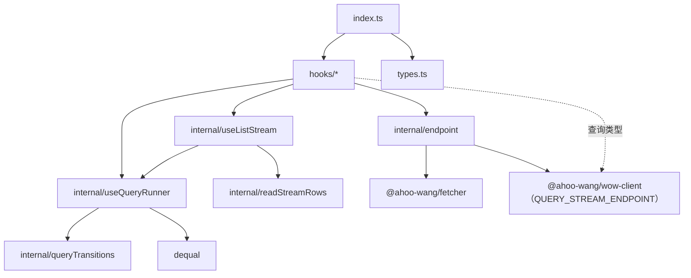

# wow-react 设计

**状态**：2026-09 首发前的重构（B0～B4，#3354～#3383）已全部完成，本页写现在的设计。重构时的审查与方案原文保留在 [refactor-2026-09.md](./refactor-2026-09.md)，那一页是历史记录，行为以本页为准。
**范围**：`typescript/wow-react` 的职责、模块与依赖、请求状态机的语义表、请求身份、关键决定和以后的计划。命令与目录的速查在包的 `AGENTS.md`。

## 1. 它是做什么的，什么必须成立

wow-react 把一次 Wow 查询变成 React 组件里的状态：`status`、`result`（流型是 `items`）、`error`，以及 `execute`、`abort`、`reset`、`getQuery`、`setQuery`。查询本身怎么构建、怎么发送，都是 wow-client 的事。

四条不变量：

1. **状态机归本包。** 请求状态机（`src/internal/useQueryRunner.ts`）是本包自己的，不依赖 `@ahoo-wang/fetcher-react`；它的语义就是第 3 节的表，9.x 内冻结。`verify-package.mjs` 在产物或声明里出现 fetcher-react 时失败。
2. **最新的查询说了算。** 每次执行取新序号并中止上一个；不再是最新的应答、`abort()` 或 `reset()` 之后到达的应答、卸载之后到达的应答，都不改变任何东西。
3. **两个家族一致。** `use*Query`（传 `execute`）与 `useFetcher*Query`（传 `url` 和 `fetcher`）是同一个状态机，只是执行器不同。
4. **公开面逐名冻结。** 35 个名字列在 `test/surface/root.txt`，每个选项与返回类型的成员由 `test/hookContract.types.test.ts` 钉住。

## 2. 模块与依赖

```
src/
  index.ts                     只转出 hooks/ 与 types.ts
  types.ts                     QueryStatus、QueryExecutor、ListStreamExecutor、QueryHookOptions、QueryHookReturn
  hooks/use{Single,List,Paged,Count}Query.ts    useQueryRunner 的类型特化（Condition 重载保留到 v10）
  hooks/useListStreamQuery.ts                   internal/useListStream
  hooks/useFetcher*Query.ts                     对应的核心 hook + internal/endpoint 的执行器；url 与 fetcher 进入请求身份
  internal/useQueryRunner.ts   唯一的请求状态机
  internal/queryTransitions.ts 第 3 节的表，纯函数，无 React
  internal/useListStream.ts    状态机 + readStreamRows，两个流型 hook 共用
  internal/readStreamRows.ts   读流成行，最多每 16 ms 发布一次
  internal/endpoint.ts         Wow 查询端点协议：postQuery、postQueryStream（用 wow-client 的 QUERY_STREAM_ENDPOINT）
```



查询类型只来自 wow-client，本包不重新定义。外部依赖：peer `react ^19.3.0`（构建经 React Compiler，产物导入 `react/compiler-runtime`）、`@ahoo-wang/fetcher`、`@ahoo-wang/fetcher-eventstream`、`@ahoo-wang/wow-client`（`~x.y.z`，同一个次版本）；依赖 `dequal`。

## 3. 状态机的语义

每个 hook 的行为都是这一张表；`internal/queryTransitions.ts` 是它的纯函数实现，`test/queryTransitions.test.ts` 逐格覆盖，`requestStateTable`、`streamStateTable`、`queryIdentity`、`callbacks`、`ssr`、`hydration` 六个测试文件在 React 里钉住。改一格要有意为之，并在 PR 里写明是哪一格。

| 事件                                              | `status`   | `result` / `items`                                         | `error`    | 在途请求 |
| ------------------------------------------------- | ---------- | ---------------------------------------------------------- | ---------- | -------- |
| 开始（新查询或 `execute()`）                      | `loading`  | 请求型保留上一次结果（属于旧查询）；流型清空（行是累积的） | 清空       | 中止旧的 |
| 成功                                              | `success`  | 新结果；流型 `done = true`                                 | —          | —        |
| 失败                                              | `error`    | **保留**上一次结果 / 已收到的行                            | 设置       | —        |
| `abort()`                                         | `idle`     | **保留**                                                   | 清空       | 中止     |
| `reset()`                                         | `idle`     | 清空                                                       | 清空       | 中止     |
| 卸载                                              | —          | —                                                          | —          | 中止     |
| 受控 `query`（按内容比较）、`url`、`fetcher` 变化 | 同「开始」 | 同「开始」                                                 | 同「开始」 | 中止旧的 |
| 受控 `query` 从有值变为 `undefined`               | `idle`     | **保留**                                                   | 清空       | 中止     |

最后一行来自第二轮审查的 P1-6（2026-09-25）：`id ? singleQuery(…) : undefined` 是条件查询的常见写法，原来清空时会拿上一个查询再请求一次。现在它与 `abort()` 相同：中止在途请求，回到 `idle`，保留结果，`getQuery()` 返回 `undefined`，`execute()` 什么也不做，直到再给出查询（受控的新值，或 `setQuery()`）。`autoExecute: false` 时同样如此。按第一原理定：用户 09-24 定的方向是「出错或中止后保留结果」，清空查询是「不再需要新的结果」，不是「清空已有的结果」；要清空的调用方用 `reset()`。`queryIdentity.test.tsx` 对四个家族各钉四格（应答后、在途时、再给查询、`autoExecute` 关闭）。

其余规则：

- **首帧**：挂载即执行的 hook 首帧就是 `loading`，服务端渲染也一样，所以服务端与客户端首帧一致；不执行的是 `idle`。SSR 不发请求。
- **StrictMode**：第二次挂载中止第一次执行、再发一次，只落定一个结果。
- **回调**：`onSuccess`、`onError` 在状态更新之后调用；回调抛错时以 `console.warn` 报告，状态照常。
- **中止类错误**：`execute` 自己抛出 `AbortError` 时按 `abort` 处理。
- **流**：`readStreamRows` 第一批行在下一个宏任务发布，之后最多每 16 ms 发布一次，结束或出错前总会发布最后的行；流型 hook 不把 `ReadableStream` 交给组件，自己读、自己取消。

## 4. 请求身份

一次执行由什么决定：受控 `query` 的内容（`dequal`）；`useFetcher*` 还有 `url` 与 Fetcher 的身份。`execute`、`attributes` 和回调在执行开始或落定时读取最新值，它们变化不触发执行。

Fetcher 的身份（`endpointIdentity`）：有名字的 Fetcher（字符串名、`NamedFetcher`）按名字比较；没传时视为默认 Fetcher 的名字；无名实例按 `baseURL` 比较。所以渲染里内联 `new Fetcher({ baseURL })` 只发一次请求。代价：两个 `baseURL` 相同、拦截器不同的无名 Fetcher 被视为同一个，要用名字区分（R-14，README 待补）。

## 5. 关键决定

出自重构批次（详见 [refactor-2026-09.md](./refactor-2026-09.md) 第 5 节）与第二轮审查：

- **自有公开类型**（B1）：`QueryStatus` 是字面量联合；`QueryExecutor<Q, R>` 的第 2、3 个参数必传；`attributes` 为 `Record<string, unknown>`；`E` 默认 `Error`。
- **URL 型合一**（B2）：Fetcher 在发请求时解析；未注册的名字让该次请求失败，不打挂组件。
- **自有状态机**（B3）：去掉 fetcher-react 的 peer，`dequal` 为依赖。
- **流**（B4）：按时间节流，流型 hook 只存一份 `items`。
- **`FIELDS` 不能从 `execute` 推断**：TypeScript 不支持部分类型参数推断，所以文档一律写 `usePagedQuery<State, Fields>`；生成客户端的字段类型写作 `` `${CartAggregatedFields}` ``（P1-4，参考页有提示框）。
- **类型参数顺序**：`ListStreamExecutor<R, Q>` 与 `QueryExecutor<Q, R>` 相反，为了与 fetcher-react 迁来的代码兼容而保留（R-13）。
- **客户端方法直接作 `execute`**（P1-3）：wow-client 的客户端在构造函数里绑定自己的方法（见 wow-client 设计文档 §7.2），所以 `execute: client.listState` 可以直接写；自己对象上的方法要 `.bind()` 或包箭头函数。

## 6. 以后

- **9.3：通用与聚合查询 Hook**（用户 2026-09-25 定，review 决定 4）。公开 `useQuery<Q, R, E>`（即现在的 `useQueryRunner`），新增 `useAggregateQuery`、`useAggregateStreamQuery`；都是新增，不破坏 9.2 的冻结面。9.2.0 的参考页写明「聚合暂时没有 Hook，在 effect 里直接调用 `client.aggregate` 并在清理时中止」，并给出示例。
- SSR 的 `initialResult`（R-8）、Suspense：都以新增 API 的方式加。
