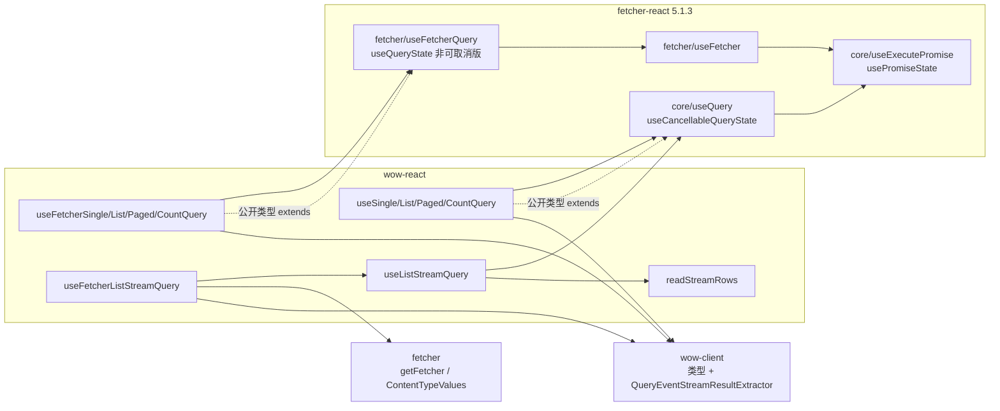
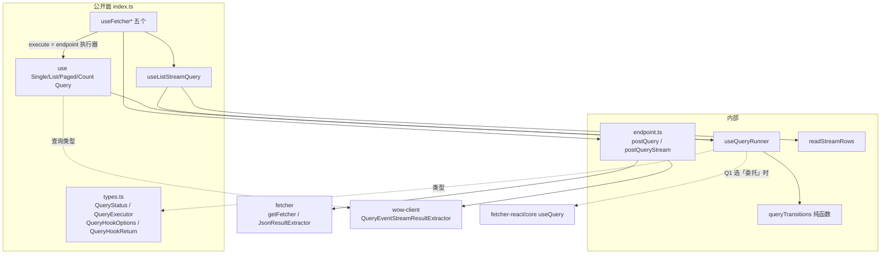

# wow-react 首发前架构审查与重构方案（2026-09）

**状态**：已定稿（2026-09-24，第 6 节的问题全部按建议定），按第 5 节分批实施。
**基线**：`origin/main` `c48625e14`；运行时依赖 `@ahoo-wang/fetcher-react` 5.1.3（下文 `fr` 指它构建产物 `dist/core-BfDqql2S.js`、`dist/fetcher.es.js` 的行号）。
**范围**：`typescript/wow-react` 的 `src`、`test`、`scripts`，以及直接消费它的 dashboard、integration-test、storybook 与文档站参考页。

## 1. 这个包是做什么的

### 1.1 第一原理

谁在用：写 Wow 前端的 React 开发者（dashboard、`wow-project-template/client` 等），以及从 `fetcher-react` 的 Wow hook 迁移过来的项目。他们手里已经有 `wow-client` 的查询 DSL（`singleQuery`、`listQuery`、`filter.*`）和查询客户端，缺的是「把一次查询变成组件状态」这一层。

必须为真的事（即本包的合同）：

1. **最新者胜**：组件只显示它最后一次要求的那个查询的结果；迟到的旧响应永远不覆盖新的。
2. **不要的请求就取消**：新查询、`abort()`、`reset()`、卸载都中止在途请求（和流）。
3. **StrictMode 与 React Compiler 安全**：双挂载只落定一个结果；产物由 React Compiler 编译。
4. **SSR 安全**：服务端渲染不发请求、不访问浏览器全局，服务端与首次客户端渲染一致。
5. **流只在 hook 内**：组件拿到的是 `items` / `done`，永远拿不到 `ReadableStream`。
6. **类型诚实**：查询类型来自 `wow-client`；`error` 的类型不对调用方撒谎。
7. **公开面归 Wow 所有**：9.x 冻结的是 Wow 自己写下的名字、选项与状态语义，不随 `fetcher-react` 的大版本漂移。

前 5 条今天基本成立（测试覆盖了竞态、卸载、StrictMode、流的锁与取消）；第 6、7 条不成立，是本轮的核心问题。

### 1.2 现状架构

`src` 约 1.4k 行，其中真正的逻辑不到 150 行：10 个 hook 里 8 个是一行委托，余下是 JSDoc 与为 `/legacy` 兼容保留的三重重载。

| 模块                                                  | 职责                                                                                                                                | 证据                                                        |
| ----------------------------------------------------- | ----------------------------------------------------------------------------------------------------------------------------------- | ----------------------------------------------------------- |
| `use{Single,List,Paged,Count}Query.ts`                | 自定义 `execute` 的请求型 hook；选项/返回类型 `extends` fr 的 `UseQueryOptions`/`UseQueryReturn`，实现是 `return useQuery(options)` | `useSingleQuery.ts:35-55,122`；`useCountQuery.ts:30-49,105` |
| `useListStreamQuery.ts`                               | 流型 hook：包一层 fr `useQuery`，把 `execute` 换成「打开流 → `readStreamRows`」，自己持有 `items`，重写 `reset`，派生 `done`        | `useListStreamQuery.ts:157-188`                             |
| `readStreamRows.ts`（内部）                           | 读 SSE 到底、每个宏任务最多发布一次、随 signal 取消、总是释放 reader                                                                | `readStreamRows.ts:33-73`                                   |
| `fetcher/useFetcher{Single,List,Paged,Count}Query.ts` | URL 型 hook：`extends` fr 的 `UseFetcherQueryOptions`，实现是 `return useFetcherQuery(options)`（fr 负责 POST + JSON 提取）         | `useFetcherSingleQuery.ts:34-55,129`                        |
| `fetcher/useFetcherListStreamQuery.ts`                | URL 型流 hook：**不走** fr 的 `useFetcherQuery`，而是在 `useListStreamQuery` 上自己拼 `getFetcher().post` + `Accept` + 提取器       | `useFetcherListStreamQuery.ts:132-145`                      |

依赖图（现状）：



数据流：`options.query`（受控，`dequal` 深比较）或 `initialQuery` + `setQuery()` → fr 的 query state 在 effect 里调 `execute` → `useExecutePromise` 生成请求号、中止上一个 `AbortController`、`setLoading` → 调用方的 `execute(query, attributes, abortController)` → 成功/失败/中止时只在「仍挂载且是最新请求」时写 `status`/`result`/`error`（`fr core:166-230`）。流型 hook 在此之上把行分批写进自己的 `items`。

请求的**身份只有 `query`**：`attributes`、`execute`、`url`、`fetcher` 都经 `useLatest` 读最新值，变化不会触发重跑（`fr core:564-577`、`fr fetcher:150-172`）。

## 2. 发现

严重度：**P0** 发布前必须处理（冻结后再改就是破坏性变更）；**P1** 应在首发前处理，拖后代价明显；**P2** 可排进 9.x 后续。

| #   | 严重度 | 类别                | 发现                                                                                                                                                                                                                                                                                                                                                                                                                                                                               | 证据                                                                                                                                                                                             | 为什么要紧                                                                                                                                                                                                                                                                            |
| --- | ------ | ------------------- | ---------------------------------------------------------------------------------------------------------------------------------------------------------------------------------------------------------------------------------------------------------------------------------------------------------------------------------------------------------------------------------------------------------------------------------------------------------------------------------- | ------------------------------------------------------------------------------------------------------------------------------------------------------------------------------------------------ | ------------------------------------------------------------------------------------------------------------------------------------------------------------------------------------------------------------------------------------------------------------------------------------- |
| F1  | P0     | 公开 API 形状、耦合 | **公开类型继承 fetcher-react 的类型**。20 个 `Use…Options`/`Use…Return` 都是空的 `interface … extends UseQueryOptions/UseQueryReturn/UseFetcherQueryOptions`，发出去的 `.d.ts` 直接 `import` `@ahoo-wang/fetcher-react/core`、`/fetcher`。wow-react 冻结的选项集合（`initialStatus`、`propagateError`、`onAbort`、`resultExtractor`…）实际由另一个仓库决定；peer 范围 `^5.1.3 \|\| ^6.0.0` 还把一个尚未发布、API 未知的 6.x 算了进来。参考文档也只能把选项链接到 fetcher.ahoo.me。 | `useSingleQuery.ts:35-55` 等 20 处；`useFetcherSingleQuery.ts:34-39`；`pnpm-workspace.yaml:19`；`documentation/docs/zh/reference/typescript/wow-react/index.md:18`                               | 9.x 冻结的是一个不归 Wow 管的面。fr 6 增删改一个选项，wow-react 的公开类型就跟着变，而 `publicSurface` 快照只记名字，拦不住。首发后再把 `extends` 改成自有接口，凡是删掉的成员都是破坏性变更。                                                                                        |
| F2  | P1     | 类型、耦合          | **`status` 的类型是 fr 的字符串枚举 `PromiseStatus`，本包不导出它**。读取与比较没问题（`status === 'success'` 合法，已用 TS 6.0 核对），但**写入**不行：`const s: PromiseStatus = 'success'` 报 TS2322。于是给组件 props 标类型、在测试或 story 里伪造一个 `Use…Return`、自己维护一份状态，都得直接从 `@ahoo-wang/fetcher-react/core` 导入枚举；本包自己也是这样取 `PromiseStatus.SUCCESS` 的。                                                                                    | `useListStreamQuery.ts:23,179`；`fr core:92-94`（`PromiseStatus`）                                                                                                                               | 让用到返回类型的应用对 fr 形成直接依赖，与 F1 是同一个耦合；冻结后把枚举换成字面量联合，对引用枚举成员的代码是破坏性变更。                                                                                                                                                            |
| F3  | P1     | 正确性、一致性      | **状态转换在两个家族间不一致**，且请求型 hook 的 `reset()` 不取消在途请求。请求型：`reset()` 只 `setIdle`，不中止也不作废请求号，迟到的成功会把结果写回来；`abort()` 与出错都会**清空 `result`**。流型：`reset()` 先 `abort()` 再清空；`abort()` 与出错**保留** `items`。                                                                                                                                                                                                          | `fr core:200-201`（reset = setIdle）、`fr core:109`（出错清 result）、`fr core:117`（idle 清 result）；`fr fetcher:26`（URL 型 reset 同样不中止）；`useListStreamQuery.ts:173-176`               | 同一个名字 `reset`/`abort` 在相邻两个 hook 里语义不同；「reset 后旧请求复活」违反合同第 2 条。dashboard 为了出错时不闪空白，自己维护了一份 `lastSuccessfulState`（`compensation/dashboard/src/features/Failed/details/FetchingFailedDetails.tsx:42,76-80`），这是语义缺口的直接证据。 |
| F4  | P1     | 架构、重复          | **URL 型 hook 走两条实现路径**。四个请求型走 fr 的 `useFetcherQuery → useFetcher`（exchange 状态、非可取消的 `useQueryState`、默认 `JsonResultExtractor`、允许调用方覆盖 `resultExtractor`）；流型走本包的 `useListStreamQuery` + 手写 `getFetcher().post`（禁止覆盖提取器）。「Wow 查询端点 = POST JSON 体、流要 `Accept: text/event-stream` 与 `QueryEventStreamResultExtractor`」这条协议知识一半在 fr、一半在本包。                                                            | `useFetcherSingleQuery.ts:129` vs `useFetcherListStreamQuery.ts:132-145`；`fr fetcher:150-172`（`method: "POST"`、`resultExtractor: h`）；`fr core:528-538` vs `fr core:577`（两种 query state） | 同一组选项在两条路径上行为有细微差别（卸载时 query state 是否作废、`exchange`、`resultExtractor`），测试只能各测各的；协议改一处要找两处。                                                                                                                                            |
| F5  | P1     | 依赖、耦合          | **为两个 hook 背上 fr 的整套 peer**。fr 5.1.3 的必需 peer 有 `fetcher-eventbus`、`fetcher-storage`、`fetcher-cosec`、`react-dom`，另带 `immer`、`dequal` 依赖；wow-react 只用到 `useQuery` 与 `useFetcherQuery`。                                                                                                                                                                                                                                                                  | fr `package.json` peerDependencies；`src` 中对 fr 的全部引用：`useQuery`、`useFetcherQuery`、`PromiseStatus`                                                                                     | 用户装 wow-react 会被 npm/pnpm 自动拉上 cosec、eventbus、storage；peer 冲突与安装体积都算在 wow-react 头上。行为（第 1～3 条合同）也由 fr 的版本决定，不在 Wow 的测试控制之内。                                                                                                       |
| F6  | P1     | 类型                | **`E` 的默认值是断言，不是事实**。请求型默认 `FetcherError`，但自定义 `execute` 可以抛任何东西（`TypeError`、`WowError`、业务异常）；fr 把 reject 值原样 `setError`。                                                                                                                                                                                                                                                                                                              | `useSingleQuery.ts:37,95`；`fr core:186`                                                                                                                                                         | 违反合同第 6 条；调用方按 `FetcherError` 访问 `exchange` 会在运行时拿到 `undefined`。改默认值是类型层面的破坏性变更，只能趁首发。                                                                                                                                                     |
| F7  | P2     | 语义、可预期性      | **请求身份只有 `query`**：URL 型 hook 改 `url` 或 `fetcher` 不重跑，只影响下一次执行。                                                                                                                                                                                                                                                                                                                                                                                             | `fr fetcher:159`（执行时才读 `s.current.url`）；`useFetcherListStreamQuery.ts:132-135`                                                                                                           | 切换聚合（`order/…` → `cart/…`）时界面停在旧数据上，直到别的原因触发执行；目前也没有测试钉住这一行为。                                                                                                                                                                                |
| F8  | P2     | 可测试性            | **测试缺口**：没有钉住 (a) 在途时 `reset()`；(b) `abort()`/出错后 `result` 是否保留；(c) 受控 `query` 的深比较（同内容新对象不重跑）；(d) `attributes`/`url` 变化不重跑；(e) `renderToString` 下不发请求、状态为 `idle`；(f) `onSuccess`/`onError` 的调用时机；(g) 对 fr 不同版本的行为。                                                                                                                                                                                          | `test/queryHooks.test.tsx:250-264` 只测了已落定后的 reset；无 SSR 用例                                                                                                                           | 这些正是要冻结的语义，也正是重构会碰到的地方；没有表征测试就不能宣称「行为不变」。                                                                                                                                                                                                    |
| F9  | P2     | 性能                | `readStreamRows` 每次发布 `rows.slice()`，长流是 O(n²) 复制；流型 hook 内部的 fr `result` 状态又存了一份完整行数组。                                                                                                                                                                                                                                                                                                                                                               | `readStreamRows.ts:47,61`；`useListStreamQuery.ts:166-171`                                                                                                                                       | 10 万行、1000 个网络块时约 5000 万次元素复制；多数场景无感，但它是可观察的上限。                                                                                                                                                                                                      |
| F10 | P2     | 死代码、可读性      | `abortController ?? new AbortController()` 永远走左边（fr 总是传入）；接口 JSDoc 还是 fr 时代的套话（「query key」「This interface extends …」），与 hook 本身的新文档风格不一致。                                                                                                                                                                                                                                                                                                 | `useListStreamQuery.ts:167`；`useSingleQuery.ts:27-34`；`useFetcherCountQuery.ts:25,41`                                                                                                          | 读者要去 fr 源码里确认兜底是否会发生；注释描述的是继承关系而不是用法。                                                                                                                                                                                                                |
| F11 | P2     | 重复                | 每个 hook 三重重载 + 实现签名，10 个文件几乎逐字相同（约 60 行/文件）。                                                                                                                                                                                                                                                                                                                                                                                                            | `useSingleQuery.ts:92-123` 等                                                                                                                                                                    | 是 `/legacy` 兼容债务的必要代价（`docs/compat-debt.md:35-38`），v10 删 Condition 重载时一起收掉；本轮只把它们集中到共享类型上，不硬消。                                                                                                                                               |
| F12 | P2     | SSR/首帧            | `autoExecute` 且有查询时，服务端与首帧状态是 `idle`，effect 之后才变 `loading`；以 `status` 渲染骨架的应用会闪一帧「空闲」。                                                                                                                                                                                                                                                                                                                                                       | `fr core:96`（`initialStatus ?? "idle"`）                                                                                                                                                        | 首帧用 `loading` 同样能与服务端一致（两边都算得出），体验更好；这是状态机归自己后顺手能做的事。                                                                                                                                                                                       |

审查后确认**没问题**、保持不动的：

- 竞态、卸载、StrictMode、流的锁与取消：`queryHooks`、`fetcherQueryHooks`、`listStreamQuery` 三套行为测试用真 `Fetcher` + `fakeServer`，覆盖扎实（`test/support/fakeServer.ts`）。
- 对 `wow-client` 只用公开出口（类型、`/legacy` 类型、`QueryEventStreamResultExtractor`），没有碰内部实现。
- 公开面快照 + 构建产物校验（`test/publicSurface.test.ts`、`scripts/verify-package.mjs`）是对的机制，本轮只补「成员级」的类型合同。
- 流型 hook 返回 `items`/`done` 而不是 `result`，名字不同有理由（行是累积的、新查询从空开始），保留。
- `useFetcher*` 的命名描述的是传输而非意图，但它是从 fetcher-react 迁来的名字（`AGENTS.md` Boundaries），保留。
- Suspense/`use()`：本包是「状态机式」hook，不参与 Suspense；这在 9.x 是明确的非目标，将来以新增 API 的方式加，不影响冻结。

## 3. 目标架构

原则：**Wow 拥有合同，实现可以换**。先把公开类型与状态语义收归本包（这一步决定冻结面），再把两条实现路径合成一条，最后（取决于 Q1）把请求状态机收进本包、去掉对 fetcher-react 的依赖。

### 3.1 模块边界

```
src/
  index.ts                         只 re-export hooks/ 与 types.ts
  types.ts                         公开：QueryStatus、QueryExecutor、QueryHookOptions、QueryHookReturn、ListStreamExecutor
  internal/
    useQueryRunner.ts              唯一的请求状态机：最新者胜、取消、StrictMode；返回 QueryHookReturn
    queryTransitions.ts            纯函数状态转换（idle/loading/success/error × start/succeed/fail/abort/reset），无 React，可单测
    endpoint.ts                    Wow 查询端点协议：postQuery(url, fetcher) / postQueryStream(url, fetcher) → QueryExecutor
    readStreamRows.ts              原样迁入（F9 的节流在这里改）
  hooks/
    useSingleQuery.ts … useCountQuery.ts          = useQueryRunner 的类型特化（重载保留到 v10）
    useListStreamQuery.ts                         = useQueryRunner + readStreamRows + items
    useFetcherSingleQuery.ts … useFetcherListStreamQuery.ts   = 对应核心 hook + endpoint 执行器
```



### 3.2 关键抽象

```ts
/** 与 fetcher-react 的 PromiseStatus 取值相同，但是字面量联合。 */
export type QueryStatus = 'idle' | 'loading' | 'success' | 'error';

export type QueryExecutor<Q, R> = (
  query: Q,
  attributes: Record<string, unknown> | undefined,
  abortController: AbortController,
) => Promise<R>;

export interface QueryHookOptions<Q, R, E> {
  query?: Q; // 受控，深比较
  initialQuery?: Q; // 非受控初值
  autoExecute?: boolean; // 默认 true
  attributes?: Record<string, unknown>;
  execute: QueryExecutor<Q, R>;
  onSuccess?: (result: R) => void | Promise<void>;
  onError?: (error: E) => void | Promise<void>;
}

export interface QueryHookReturn<Q, R, E> {
  status: QueryStatus;
  loading: boolean;
  result: R | undefined;
  error: E | undefined;
  execute(): Promise<void>; // 以当前查询再跑一次
  abort(): void;
  reset(): void;
  getQuery(): Q | undefined;
  setQuery(query: Q): void;
}
```

20 个 `Use…Options`/`Use…Return` 名字全部保留（迁移面），改为 `extends` 上面两个自有接口；URL 型选项是 `Omit<…, 'execute'> & { url: string; fetcher?: string | Fetcher }`。去掉的继承成员：`initialStatus`、`propagateError`、`onAbort`、`resultExtractor`（URL 型请求 hook），以及类型上本来就没暴露的 `exchange`。

### 3.3 目标语义（一张表，两个家族一致）

| 事件                                      | `status`         | `result` / `items`                                                 | `error`    | 在途请求 |
| ----------------------------------------- | ---------------- | ------------------------------------------------------------------ | ---------- | -------- |
| 开始（新查询或 execute）                  | `loading`        | 请求型保留上一次结果（旧查询的，文档写明）；流型清空（行是累积的） | 清空       | 中止旧的 |
| 成功                                      | `success`        | 新结果；流型 `done = true`                                         | —          | —        |
| 失败                                      | `error`          | **保留**上一次结果 / 已收到的行（Q2）                              | 设置       | —        |
| `abort()`                                 | `idle`           | **保留**（Q2）                                                     | 清空       | 中止     |
| `reset()`                                 | `idle`           | 清空                                                               | 清空       | **中止** |
| 卸载                                      | —                | —                                                                  | —          | 中止     |
| `query`（深比较）/ `url` / `fetcher` 变化 | 同「开始」（F7） | 同「开始」                                                         | 同「开始」 | 中止旧的 |

### 3.4 移动与删除

- `src/readStreamRows.ts` → `src/internal/readStreamRows.ts`（不改行为）。
- `src/fetcher/*` → `src/hooks/useFetcher*.ts`；删除对 `@ahoo-wang/fetcher-react/fetcher` 的引用。
- 删除 `useListStreamQuery.ts:167` 的兜底、流型 hook 内部多余的 `result` 状态。
- Q1 选「自有状态机」时：删除 `@ahoo-wang/fetcher-react` peer 与 devDependency，`dequal` 进 catalog 作为 dependency；`AGENTS.md` 的「只从 `/core`、`/fetcher` 导入」一条随之删除。

## 4. 公开面影响

`test/surface/root.txt` 现有 31 个名字（21 type + 10 value）。

| 变化                                                                                                     | 名字层面（快照） | 成员层面                                                   | 是否破坏             | 建议       |
| -------------------------------------------------------------------------------------------------------- | ---------------- | ---------------------------------------------------------- | -------------------- | ---------- |
| 新增 `QueryStatus`、`QueryExecutor`、`QueryHookOptions`、`QueryHookReturn`                               | +4 type（35 个） | —                                                          | 否                   | **现在**   |
| 20 个接口改为继承自有接口，去掉 `initialStatus`、`propagateError`、`onAbort`、URL 型的 `resultExtractor` | 不变             | 删除 4 个选项                                              | 是                   | **现在**   |
| `status` 由 `PromiseStatus` 枚举改为 `QueryStatus` 字面量联合                                            | 不变             | 枚举换成字面量联合；字面量可直接赋值（props、测试、story） | 是（枚举引用处）     | **现在**   |
| `E` 默认值（Q3）                                                                                         | 不变             | 默认类型变化                                               | 是（仅类型）         | **现在**   |
| `execute` 选项的第 2、3 个参数由可选变为必传（`QueryExecutor`）                                          | 不变             | 调用方收到的参数更确定；传入的函数不受影响                 | 否                   | 现在       |
| `reset()` 中止在途请求；出错/`abort()` 保留结果（Q2）；`url` 变化重跑（F7）；首帧 `loading`（F12）       | 不变             | 行为变化                                                   | 行为层面             | 随状态机   |
| 删除 `@ahoo-wang/fetcher-react` peer（Q1）                                                               | 不变             | —                                                          | 否（删 peer 不破坏） | 可在首发后 |

新增一条**成员级类型合同**：`test/hookContract.types.test.ts` 用 `expectTypeOf<keyof …>().toEqualTypeOf<…>()` 钉住每个 Options/Return 的成员集合，补上名字快照拦不住的那一半（F1）。

判断：凡是「删成员、改类型」的都趁 9.2.0 做；「去掉 fr 依赖」本身不破坏，可以晚，但它决定了第 3.3 节的语义能否由 Wow 控制，所以建议同在首发前完成。

## 5. 重构批次

每批一个 PR，独立可合并，本地门禁：`pnpm --filter @ahoo-wang/wow-react... build`、`pnpm --filter @ahoo-wang/wow-react test`（含 `test:type`）、`lint`、prettier；改到公开面时同步文档站参考页（中英）、README（中英）、`skills/wow-client/references/api.md`，并跑 integration-test 的 `test/wow/react/`（同源契约由 CI 的 `typescript-contract-gate` 兜底）。

| 批次 | 内容                                                                                                                                                                                                                                                                                   | 安全网（先加）                                                                                                                                                      | 人日 | 依赖   | 行为/公开面                                 |
| ---- | -------------------------------------------------------------------------------------------------------------------------------------------------------------------------------------------------------------------------------------------------------------------------------------- | ------------------------------------------------------------------------------------------------------------------------------------------------------------------- | ---- | ------ | ------------------------------------------- |
| B0   | **表征测试**（[#3354](https://github.com/Ahoo-Wang/Wow/pull/3354)）：两个家族各一张「事件 × 状态」表驱动测试，钉住 F8 的 (a)～(f) 的**现状**；即将改变的格子标 `// B3 changes this` 并断言现状；`renderToString` SSR 用例；受控 `query` 深比较用例                                     | 本批即安全网；不改 `src`                                                                                                                                            | 1    | —      | 不变                                        |
| B1   | **自有公开类型（P0 F1，连带 P1 F2、F6）**（[#3361](https://github.com/Ahoo-Wang/Wow/pull/3361)）：新增 `types.ts`，20 个接口改继承；`status` 映射为 `QueryStatus`（运行时仍委托 fr，边界处一次映射）；成员级类型合同测试；快照 +4；参考文档去掉 fetcher.ahoo.me 链接，改为本包的选项表 | B0；`publicSurface`；新 `hookContract.types.test.ts`；`filterQueryTypes`/`listStreamTypes`；integration-test 编译                                                   | 1.5  | B0     | 类型破坏（见第 4 节），行为不变             |
| B2   | **URL 型合一（F4）**（[#3364](https://github.com/Ahoo-Wang/Wow/pull/3364)）：`internal/endpoint.ts` 收拢 POST/Accept/提取器；五个 `useFetcher*` 改为「核心 hook + endpoint 执行器」；去掉 `fetcher-react/fetcher` 引用；目录迁到 `hooks/`、`internal/`                                 | B0 的 URL 型表格（卸载、竞态、错误、命名 Fetcher、默认 Fetcher）；`fetcherQueryHooks`；integration-test                                                             | 1    | B1     | 不变（B0 表中两路径的差异格先统一口径再合） |
| B3   | **自有状态机（F3/F5/F7/F12，取决于 Q1）**（[#3371](https://github.com/Ahoo-Wang/Wow/pull/3371)）：`internal/queryTransitions.ts`（纯函数，全覆盖单测）+ `useQueryRunner`；落实第 3.3 节语义；删除 fr peer；`dequal` 进 catalog；`AGENTS.md` 同步                                       | B0 表中非「B3 changes this」格全部保持；标记格改为新断言；StrictMode/竞态/卸载三套既有测试不动；`package-check.mjs`（peer 变化）；dashboard 的 `dashboard-test.yml` | 2    | B2、Q1 | 行为变化（有意、逐格列在 PR 描述）          |
| B4   | **流与清理（F9/F10/F11）**（[#3383](https://github.com/Ahoo-Wang/Wow/pull/3383)）：`readStreamRows` 按时间节流（如 ≤ 1 次/16 ms）并去掉内部重复 `result`；删兜底；重写接口 JSDoc；重载改用共享的 `…Options<…>` 泛型别名以缩短文件（名字不变）                                          | `listStreamQuery`（含「每个网络块渲染一次」用例，改为「渲染次数有上界」）；新增 10 万行性能冒烟（`--maxWorkers=2`，只断言上界）                                     | 1    | B3     | 不变                                        |
| 合计 |                                                                                                                                                                                                                                                                                        |                                                                                                                                                                     | 6.5  |        |                                             |

顺序：B0 → B1 → B2 → B3 → B4，串行（B1、B2 都改十个 hook 文件，并行只会冲突）。如果 Q1 选「继续委托 fr」，B3 缩为「在 fr 之上用包装修正 `reset` 与 Q2 语义」（约 1 人日），F5 转为向 fetcher 仓提需求并把 peer 收窄为 `^5.1.3`，待 fr 6 发布、行为用 B0 的表格复验后再放宽。

B0 的发现（#3354）：F7 只对了一半。`url` 变化在两条 URL 路径上都不重跑；`fetcher` 变化在四个请求型 URL hook 上**已经重跑**（fr 的 `useFetcher` 在渲染期解析 Fetcher，`execute` 以实例为依赖），流型 URL hook 不重跑，B2 要把这一格也统一口径。同一原因使得在渲染里内联 `new Fetcher(...)` 会让请求型 URL hook 无限重发请求；B3 让 `fetcher` 进入请求身份时，必须以稳定的身份比较，否则流型 hook 也会出现同样的死循环。

B1 的决定（[#3361](https://github.com/Ahoo-Wang/Wow/pull/3361)）：

- **边界只有一个文件**：`src/internal/fetcherReact.ts` 是唯一 import fr 的地方，不从 `index.ts` 导出；B3 用 `useQueryRunner` 整个替换它。hook 把 fr 返回的对象原样交出（不 spread、不改 identity），因为 `PromiseStatus` 的枚举成员本来就可赋给同值的字面量，不需要运行时映射；`execute` 在边界处做一次类型断言，fr 总会传 `AbortController`（F10），只是它的类型写成可选。
- **构建产物把关**：`scripts/verify-package.mjs` 新增一条：`dist` 下任何 `.d.ts` 出现 `@ahoo-wang/fetcher-react` 即失败，把 F1 从「约定」变成「构建失败」。
- **`attributes` 收窄为 `Record<string, unknown>`**：fr 的类型是 `Record<string, any> | Map<string, any>`，但 wow-client 所有查询方法只收 `Record<string, unknown>`，自定义 `execute` 拿到 `Map` 也传不下去；与 wow-client 对齐，列入迁移指南。
- **`ListStreamExecutor` 移入 `types.ts`**，改为 `QueryExecutor<Q, ReadableStream<JsonServerSentEvent<R>>>` 的别名：参数与请求型一致（第 2、3 个参数必传），名字与类型参数顺序 `<R, Q>` 不变。
- **流型 hook 的 `E` 同样默认 `Error`**（Q3 统一，原为 `FetcherError | WowError`，两者都是 `Error` 子类）。
- **URL 型选项各自声明 `url` 与 `fetcher?: string | Fetcher`**，不再 `extends FetcherCapable`，也不为此新增公开名字（快照只 +4）；五处 JSDoc 各写各的端点示例。
- **返回类型的函数成员用属性语法**（`execute: () => Promise<void>`），与原 fr 形状一致，也让函数成员保持严格的参数检查。
- `QueryHookOptions`/`QueryHookReturn` 的 `E` 也默认 `Error`，方便直接给 props 标类型。
- 顺带发现：`typescript/integration-test/test/wow/react/cartQueryHooks.test.tsx` 第 188、195、213 行有类型错误：生成客户端的 `FIELDS` 比 hook 默认的 `string` 窄，错在查询类型上，本批没有动查询类型。它一直没被发现，是因为 integration-test 的 `tsconfig` 只含 `src`，没有任何作业类型检查这些测试；不在本批范围，未改。

B2 的决定（[#3364](https://github.com/Ahoo-Wang/Wow/pull/3364)）：

- **差异格先统一口径**：动手前先把两条 URL 路径不一致的格子钉成测试（第一个提交），再合路径（第二个提交），翻转的格子逐个列在 PR 里。一共两格，根因相同：请求型 URL hook 经 fr 的 `useFetcher` 在**渲染时**解析 Fetcher，流型在**发请求时**解析。统一为「发请求时解析」：
  1. `fetcher` 变化：请求型原来会重跑，现在与流型一致，不重跑，下一次执行用新的 Fetcher。B3 让 `fetcher` 以稳定身份进入请求身份后，两者都重跑。渲染里内联 `new Fetcher(...)` 不再死循环；新增的「内联 Fetcher 只发一次请求」用例对两条路径都钉住，B3 必须保持。
  2. 未注册的 Fetcher 名字：请求型原来在渲染时抛出，把组件打挂；现在与流型一致，该次请求失败，进入 `error`。
- **`internal/endpoint.ts`**：`postQuery` 显式用 `JsonResultExtractor`（与 fr 的 `useFetcherQuery` 默认一致）。`postQueryStream` 直接用 wow-client 的 `QUERY_STREAM_ENDPOINT`（#3357），请求头传的是它的副本，因为常量是冻结的，而 Fetcher 可能往请求头里写东西。两个执行器的查询类型约束为 `object`，这是 `Fetcher.post` 的 body 类型要求；Wow 的查询都是对象。
- **运行时少了 `exchange`**：四个请求型 URL hook 返回的对象不再带 fr 的 `exchange` 字段。B1 起它就不在类型里，所以不算公开面变化。
- 目录按 3.1 迁到 `hooks/` 与 `internal/`；`docs/compat-debt.md` 里的标记路径随之更新；`internal/fetcherReact.ts` 只剩 `useDelegatedQuery`，只从 `/core` 导入。

B3 的决定（[#3371](https://github.com/Ahoo-Wang/Wow/pull/3371)）：

- **状态机**：`internal/queryTransitions.ts` 是第 3.3 节的纯函数（五个事件 × 各状态，`test/queryTransitions.test.ts` 逐格覆盖）；`internal/useQueryRunner.ts` 负责请求：每次执行取新序号并中止上一个；`abort()`、`reset()`、卸载都作废序号并中止；StrictMode 的第二次挂载中止第一次执行、再发一次，所以只落定一个结果。最新的 `execute`、`attributes` 和回调放在 ref 里，在 layout effect 中更新；`execute`、`abort`、`reset`、`getQuery`、`setQuery` 用 `useCallback` 保持稳定，dashboard 把 `execute` 放在 effect 依赖里，靠的就是这一点。受控 `query` 用 `dequal` 做内容比较，在渲染期得到一个内容稳定的引用。
- **翻转的格子**：只翻 B0 标了 `B3 changes this` 的格子，逐格列在 PR 里。另外有一格 B0 没标、但由 Q2 直接推出：「出错后再 `abort()`」原来是 idle 且没有结果，现在 idle 并保留出错前的结果 1（出错保留结果，`abort()` 也保留）。测试里写了 `unmarked in B0`。
- **`fetcher` 的稳定身份**（`endpointIdentity`）：有名字的 Fetcher（字符串名、`NamedFetcher`）按名字比较；没传时视为默认 Fetcher 的名字；无名实例按 `baseURL` 比较。所以渲染里内联的 `new Fetcher({ baseURL })` 只发一次请求。代价：两个 `baseURL` 相同、拦截器不同的无名 Fetcher 被视为同一个，文档要求用名字区分。`url` 与 Fetcher 身份一起作为请求身份。
- **回调抛错**：B0 钉住了用 `console.warn` 报告、状态照常。这一格保持不变，`src` 里只有这一处用 `eslint-disable` 豁免 `no-console`，消息前缀改为 `wow-react:`。
- **中止类错误**：`execute` 自己抛出 `AbortError`（例如它自己的超时）时，按 `abort` 处理：回到 idle，保留结果。与 fr 一致。
- **依赖**：删除 `@ahoo-wang/fetcher-react` 的 peer 与 devDependency，`catalog:peers` 里的这一项也一起删掉；`dequal` 走默认 catalog，作为 `dependencies`，并在 vite 中设为 external（否则会被打进包里）。`verify-package.mjs` 同时检查产物和声明里都没有 fetcher-react。
- **流型 hook**：两个流型 hook 共用 `internal/useListStream.ts`。B4 的一项（F10 的 `abortController ?? new AbortController()` 兜底）随状态机一并删除：执行器总会拿到 controller。其余 B4 项不动。
- **`FIELDS` 无法从 `execute` 推断**（协调方的易用性问题）：TypeScript 不支持部分类型参数推断，写了 `R` 之后，`FIELDS` 就取默认值 `string`；箭头函数的参数也不是推断来源。完全不写类型参数时，`FIELDS` 从第一个查询推断，之后 `setQuery` 就只接受那个查询里出现过的字段（已用类型测试验证）。这两种都不是可用的默认写法，所以不改签名，统一改为文档写法 `usePagedQuery<OrderState, OrderFields>`：README（中英）、参考页（中英）、hook 的 JSDoc 示例和 `@template FIELDS`、skill。

B4 的决定（[#3383](https://github.com/Ahoo-Wang/Wow/pull/3383)）：

- **按时间节流**：`readStreamRows` 第一批行在下一个宏任务发布，之后最多每 `PUBLISH_INTERVAL_MS`（16 ms，约一帧）发布一次；结束或出错前总会发布最后的行。渲染和整表复制的次数由读流的时长决定，与网络分块数无关。10 万行分 1000 块的冒烟用例（`listStreamQuery.test.tsx`，`--maxWorkers=2`）只断言上界：渲染次数 ≤ ⌈耗时 / 16⌉ + 10。上界随耗时伸缩，机器慢时一起放宽，所以不会在慢机器上误报。我把节流临时改回「每宏任务发布一次」验证过：985 次渲染对上界 122，用例会失败。本地约 1.6 秒。原来「每个网络块渲染一次」的用例改名为「渲染次数有上界」，断言不变。
- **去掉流型 hook 内部的重复 `result`**：`useQueryRunner` 新增内部参数 `retainResult`，流型 hook 传 `false`。一次执行的行照样交给 `onSuccess`，但状态里不再存第二份，只有 `items` 一份。`succeed` 事件的结果类型相应放宽为 `R | undefined`。
- **接口 JSDoc**：B1 已按用法重写了 20 个接口与 `types.ts`，B3 更新了语义。本批只补上 `items` 的更新频率，并把 README 与参考页里「每个网络块渲染一次」的说法改成「约每帧一次」。
- **重载不再缩短**：用共享的泛型别名缩短重载，就得新增名字。这些名字会出现在发布的 `.d.ts` 和参考页签名里（文档签名检查要求签名中的名字都已公开导出），也就扩大了已冻结的公开面。三重重载本身是 `/legacy` 的兼容债，v10 删掉 Condition 重载时一起收掉（`docs/compat-debt.md`）。所以本批不动重载，把它记为有意保留。
- F10 的 `?? new AbortController()` 兜底已在 B3 随状态机删除。

至此 B0～B4 全部完成。

dashboard 跟随：B3 合并后可删 `FetchingFailedDetails.tsx` 的 `lastSuccessfulState` 兜底（另起 PR，不在本包批次内）。

## 6. 待拍板

**已定（2026-09-24）**：用户「按你推荐」，Q1～Q3 全部按下面的建议执行。原则是首发前重构到生产就绪，不留兼容债。批次按第 5 节推进，每做完一批就在第 5 节标上 PR 号；全部做完后，本页并入包的设计文档。

**Q1 请求状态机归谁？**

- A（建议）：收进 wow-react（约 150 行 + 纯函数转换表），去掉 fetcher-react peer。理由：合同第 1～3 条是本包要冻结的东西，放在一个 peer 范围跨大版本、且 6.x 尚未发布的库里，Wow 的测试控制不了；顺带去掉 cosec/eventbus/storage 三个无关 peer（F5）。代价：自维护一份与 fr 相近的实现；与「优先用现成库」的取向相反，但这里被复用的不是通用工具，而是 Wow 的产品语义。
- B：继续委托 fr，语义修正提到 fetcher 仓的 6.0，wow-react 的 peer 收窄为 `^5.1.3` 直到 6.0 复验。代价：9.2.0 发布时 `reset`/出错语义仍不一致，或需要一层包装临时修正。

**Q2 出错与 `abort()` 后是否保留上一次结果？**建议**保留**（请求型与流型一致；dashboard 现有的兜底说明应用需要它；想清空的调用方用 `reset()`）。代价：请求型 hook 的行为变化，需在迁移指南写明。

**Q3 `E` 的默认值？**建议统一为 `Error`：`FetcherError` 与 `WowError` 都是它的子类，`error.message` 照常可用，`toWowError(error)` 本来就接收 `unknown`，要 `exchange` 的调用方用 `instanceof` 收窄或显式传 `E`。代价：从 fetcher-react 迁来、依赖默认 `FetcherError` 读 `exchange` 的代码要显式写泛型（dashboard 已显式传入，不受影响）。
